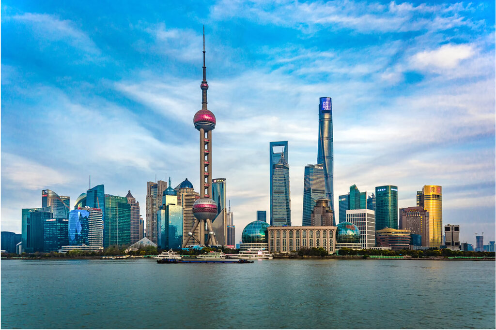
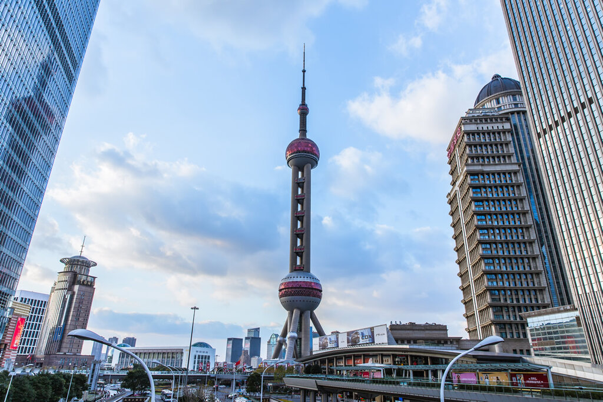
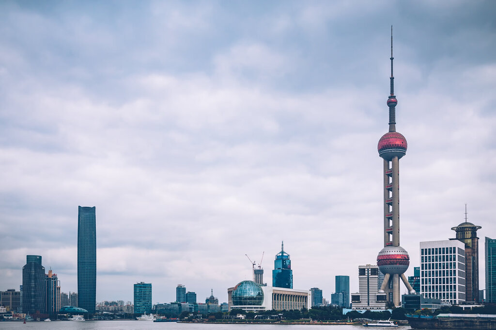

# 上海东方明珠广播电视塔 ✨

## 🌅 开篇：魔都的天际线之心

当黄浦江的晨雾缓缓散去，第一缕阳光洒向陆家嘴的时候，你一定会被那座矗立在天际线中央的巨塔所震撼。这就是上海东方明珠广播电视塔——一座不仅是上海地标，更是改革开放象征的传奇建筑。自1994年落成以来，它见证了浦东从一片农田到世界级金融中心的蜕变，也承载了几代上海人的城市记忆。

468米的高度，11颗大小不一的球体错落有致地"镶嵌"在三根擎天立柱之间，这一"大珠小珠落玉盘"的诗意设计，让冰冷的钢铁有了东方美学的灵魂。站在外滩眺望对岸，它就像一颗镶嵌在浦江之滨的璀璨明珠，日夜闪耀着这座城市的梦想与荣光。

## 🏛️ 历史与文化：一座塔，一个时代

**1990年**，浦东开发开放的号角吹响，陆家嘴成为了中国改革开放的桥头堡。正是在这样的时代背景下，东方明珠的设计方案在众多竞标中脱颖而出。设计师们创造性地将中国传统的宇宙观——"天宫楼阁"与现代建筑技术结合，让这座塔既具未来感，又不失东方韵味。

**1994年11月18日**，东方明珠正式对外开放，一举成为亚洲第一高塔（2007年前）。它不仅是一座广播电视发射塔，更是上海第一个真正意义上的"高空观光体验"目的地。对于90年代的上海人来说，登上东方明珠曾是一件值得全家盛装出行的大事。

如今，虽然被身旁的上海中心、环球金融中心等摩天大楼超越了高度，但东方明珠在上海人心中的地位从未被撼动。它是上海城市精神的象征——既仰望星空，又脚踏实地。

## 🌟 核心景点详解

### 📍 外滩视角：最经典的明信片角度

这是每一个来上海的游客必拍的角度——站在外滩观景平台，隔着黄浦江眺望对岸的陆家嘴天际线。在这张照片中，东方明珠以绝对的C位矗立在画面中央，左右两侧分别是上海环球金融中心（开瓶器）和上海中心（打蛋器），三座超高层组成了陆家嘴的"三件套"。

**光影时刻**：
- **清晨6-7点**：金色阳光洒向塔尖，江面泛起粼粼波光
- **傍晚5-7点**：夕阳西下，天空从橘红渐变为粉紫，是拍摄剪影的最佳时机
- **夜晚7-10点**：塔灯全部亮起，与外滩万国建筑群的灯光交相辉映

**拍照技巧**：使用广角镜头，将江面和天空都纳入画面，游船经过时按下快门，就能得到一张生动的魔都明信片。

---

### 📍 陆家嘴视角：仰望巨塔的震撼

当你真正走进陆家嘴，站在世纪大道上仰望这座468米的巨塔时，才能真切感受到什么叫"压迫感"。这张照片拍摄于陆家嘴环岛附近，两侧的摩天大楼像峡谷一般，将东方明珠框在了画面中央。

三根直径9米的擎天立柱从地面拔地而起，支撑着上方的球体。你可以清晰地看到塔身上那标志性的红色球体——下球体直径50米，上球体直径45米，顶部的太空舱直径更是只有14米。这种从下往上逐渐收窄的设计，让整座塔既有力量感，又不失优雅。

**游览体验**：
- **259米悬空观光廊**：全透明的玻璃地板，脚下就是车水马龙，恐高症患者慎入！
- **267米旋转餐厅**：每两小时旋转一周，边吃西餐边看城市变迁
- **351米太空舱**：最高的观光层，VIP专属体验

> 💡 **导游贴士**：建议下午4点登塔，这样可以同时看到白天、黄昏和夜景三种不同的景色，性价比最高！

---

### 📍 滨江视角：诗意的城市剪影

这是从浦东滨江大道拍摄的角度，云层低垂的天气里，东方明珠展现出另一种沉静的美。没有了阳光的渲染，巨塔的轮廓更加清晰，就像一幅水墨画，简约而有力。

这个角度的最佳观赏点在**浦东滨江大道**（泰同栈轮渡站附近）。相比外滩的人山人海，这里安静许多，适合慢悠悠地散步、拍照。旁边就是上海国际会议中心——那两个蓝色的穹顶建筑也是陆家嘴的标志性景观。

**最佳季节**：
- **3-4月**：江边樱花盛开，与摩天大楼形成奇妙的反差
- **11-12月**：秋高气爽，能见度高，适合拍摄清晰的城市天际线
- **夏季雨后**：空气通透，常有彩虹出现

## 🎯 游览实用指南

### 🚇 交通指南
- **地铁**：2号线陆家嘴站1号口出，步行5分钟
- **公交**：81、82、85、795、993路陆家嘴地铁站下
- **轮渡**：金陵东路渡口→东昌路渡口，2元钱的"水上巴士"，强烈推荐！

### 🎫 门票信息（2025年参考）
- **观光E票**：199元（含上球体+下球体+陈列馆）
- **观光+旋转餐厅**：自助午餐368元，晚餐418元（免门票）
- **Tips**：提前一天网上购票可享优惠，避开节假日排队高峰

### ⏰ 开放时间
- **9:00 - 21:30**（最晚入园21:00）
- **建议游览时长**：2-3小时

### 📸 拍照机位推荐
1. **外滩观景平台**（必打卡经典角度）
2. **浦东滨江大道**（人少景美）
3. **陆家嘴天桥**（仰拍巨塔）
4. **上海中心118层**（俯瞰明珠）
5. **北外滩滨江**（人少视野佳，新网红机位）

### 🍽️ 周边美食
- **正大广场**：各种连锁餐厅，性价比之选
- **国金中心IFC**：高端餐饮，适合约会
- **陆家嘴中心L+Mall**：网红餐厅聚集地

## 💫 结语：永不褪色的城市记忆

有人说，东方明珠已经"老了"——它不再是最高的楼，不再是最潮的景点，甚至在很多年轻人眼里，它有点"土"。但正是这份"老"，让它有了温度和故事。

每一个上海人的相册里，都有一张与东方明珠的合影：可能是90年代爸妈抱着你在塔下的全家福，可能是学生时代春游时在悬空走廊上吓得紧闭双眼的照片，也可能是你带着外地朋友第一次来上海时的打卡照。

它见证了上海的成长，也见证了我们每个人的成长。这就是东方明珠——一座塔，一座城，一段永不褪色的记忆。

下次来上海，别忘了再去看看它。白天感受它的气势，夜晚感受它的璀璨。

> 📌 **旅行感悟**：
> 真正的地标从来不是最高最炫的那一个，而是当你想起这座城市时，第一个浮现在脑海中的画面。对于上海来说，这个画面，就是东方明珠。

---

*本页内容基于实景图片分析与历史资料整理，由AI导游系统2025年6月生成*
