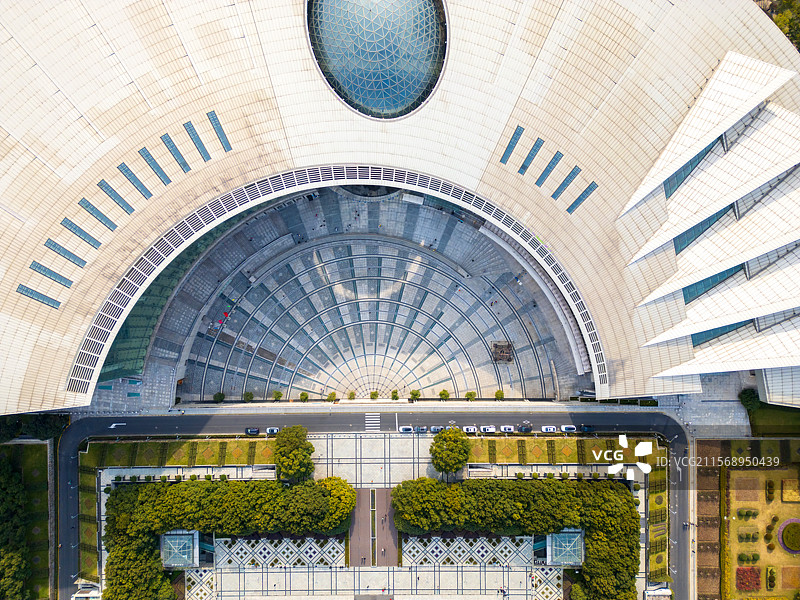
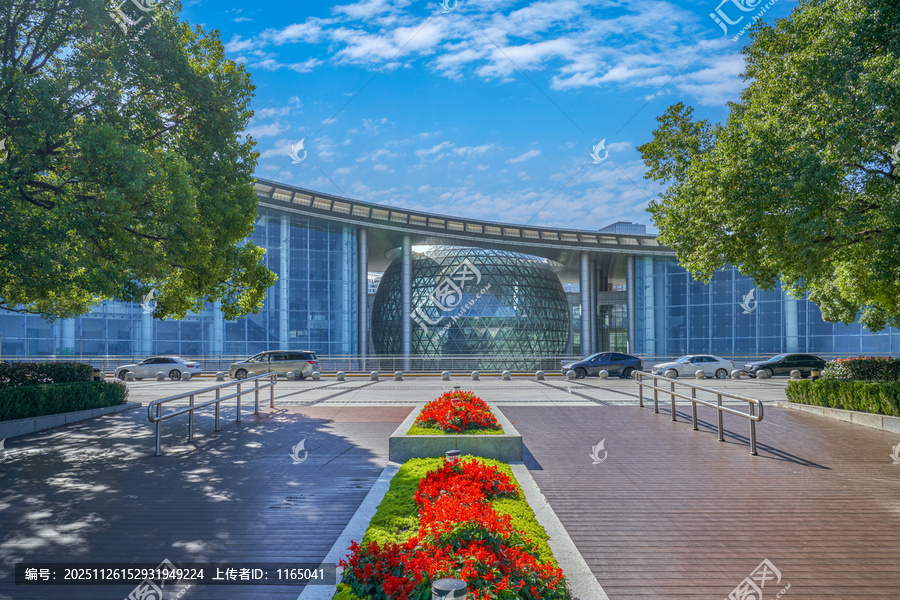
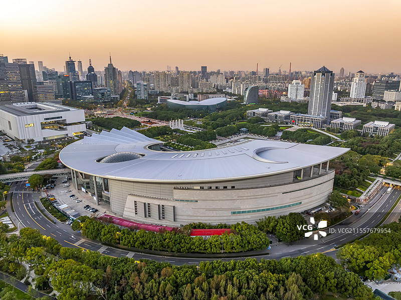

# 上海科技馆 🔬

## 🌟 开篇：知识的穹顶，未来的入口

在上海世纪大道的尽头，有一座建筑本身就是一件科技艺术品。从空中俯瞰，它就像一只睁开的眼睛——一只凝视着未来的"科技之眼"。这就是上海科技馆，一座建筑面积达9.8万平方米的科普圣殿，也是中国唯一同时拥有"国家一级博物馆"、"国家5A级旅游景区"、"全国科普教育基地"三项桂冠的科技馆。

自2001年开馆以来，这里已经接待了超过9000万观众，是全球最受欢迎的博物馆之一。对于上海的孩子们来说，这里就是他们的"第二课堂"——第一次观察蚂蚁搬家、第一次触摸静电球、第一次在IMAX球幕影院里仰望星空……无数人的科学梦想从这里起航。

## 🏛️ 建筑与历史：一扇通往未来的门

2001年12月18日，上海科技馆正式对外开放，成为当年APEC会议的主会场。当各国领导人在这座充满未来感的建筑中握手合影时，全世界都记住了这座"西学东渐"百年后，中国向世界展示科技实力的新地标。

这座建筑的设计本身就是一个关于"探索"的隐喻：
- 巨大的弧形屋面如同一道即将开启的时空之门
- 中央的玻璃穹顶象征着人类对未知的好奇
- 西南方的巨型玻璃球是亚洲最大的IMAX球幕影院

2015年，上海自然博物馆（静安新馆）开放；2021年，上海天文馆（临港）开放。"三馆合一"的格局形成，上海科技馆从一座单体建筑成长为覆盖"自然-人-科技"完整体系的超大型博物馆集群。

## 🔍 核心展区详解

### 📍 上帝视角：俯瞰科技圣殿的壮观

这张航拍照片完美展示了上海科技馆最震撼的建筑细节——从正上方俯瞰，整座建筑就像一只巨大的眼睛，中央的玻璃穹顶是瞳孔，放射状排列的广场地砖是虹膜，两侧的弧形屋面是眼睑。

**建筑设计的奥秘**：
- **巨型玻璃穹顶**：直径40米，由3000多块三角形玻璃拼接而成，白天透光率高达70%
- **屋面弧线**：长达210米的弧形屋面，象征着科学探索的道路永无止境
- **中央广场**：辐射状的地砖设计，从穹顶向四周发散，寓意科技之光普照大地

这个角度在地面是无法看到的，只有在航拍或对面的上海中心高层才能欣赏到。

> 💡 **导游贴士**：想要拍摄类似的全景照片，可以去对面的上海科技馆地铁站4号口旁的人行天桥，虽然没有这么高的角度，但也能拍到建筑的弧形轮廓。

---

### 📍 主入口：玻璃球里的宇宙

这是每一位游客走进科技馆前的第一印象。那个直径23米的巨型玻璃球，就是**IMAX球幕影院**——它不仅是上海科技馆的标志，更是整个亚洲最大的球幕影院之一。

站在世纪大道上望向科技馆，两侧的香樟树枝繁叶茂，中间的花坛常年鲜花盛开。穿过这道由三根立柱撑起的"未来之门"，就进入了一个奇妙的科学世界。

**球幕影院体验**：
- 直径23米的半球形银幕，倾角30度
- 4K激光放映系统，88个扬声器环绕立体声
- 观看时如同置身宇宙中心，星空在头顶流转
- 热门影片：《宇宙大爆炸》、《海底探秘》

**购票建议**：影院门票需要单独购买，建议提前一天在网上预订，热门场次经常售罄。

---

### 📍 全景航拍：黄昏中的科技地标

黄昏时分的上海科技馆别有一番韵味。从这个角度可以清楚地看到整座建筑的完整造型——它真的就像一只巨大的眼睛！左上方是浦东新区图书馆，远方的摩天大楼群是陆家嘴金融中心。

**最佳观赏时间**：
- **日落前1小时**：金色的阳光洒在银灰色的建筑上
- **蓝调时刻**（日落后20分钟）：建筑内部灯光亮起，与晚霞交相辉映
- **夜晚**：建筑轮廓灯全部点亮，是世纪大道夜景的重要组成部分

周边的世纪公园、上海东方艺术中心、上海图书馆东馆共同构成了浦东文化走廊，这是一条可以逛一整天的文化之旅路线。

## 🎯 游览实用指南

### 🚇 交通指南
- **地铁**：2号线上海科技馆站7号口出，直达地下一层入口
- **公交**：640、794、东周线、隧道三线
- **自驾**：地下停车场车位充足，10元/小时

### 🎫 门票信息（2025年参考）
- **成人票**：45元（1.3米以下儿童免费）
- **学生票**：22元（全日制本科及以下）
- **老人票**：37元（60-69岁），70岁以上免费
- **IMAX球幕影院**：40元/场
- **巨幕影院**：30元/场
- **四维影院**：30元/场

> ✅ **省钱攻略**：购买"门票+任意影院"套票可享优惠

### ⏰ 开放时间
- **9:00 - 17:00**（16:00停止入馆）
- **每周一闭馆**（法定节假日除外）
- **建议游览时长**：4-6小时

### 🗺️ 推荐游览路线
**精华半日游（4小时）**：
1. 动物世界 → 生物万象 → 地壳探秘（1小时）
2. 智慧之光 → 设计师摇篮（1小时）
3. 儿童科技园 / 机器人世界（1小时）
4. 宇航天地 → 地球家园（1小时）

**深度一日游（6小时）**：
在半日游基础上增加：
- 球幕/巨幕电影（45分钟）
- 临时特展（30分钟）
- 餐厅用餐休息（45分钟）

### 🌟 必体验TOP5
1. **智慧之光**：怒发冲冠静电球、空中自行车、龙卷风模拟
2. **机器人世界**：机器人做操、机器人弹钢琴、与机器人下棋
3. **生物万象**：热带雨林实景，有瀑布和真实的昆虫
4. **宇航天地**：神舟飞船模拟器，体验太空漫步
5. **球幕电影**：躺在座椅上仰望星空，一生必看一次

### 🍽️ 餐饮服务
- **馆内餐厅**：负一楼有大食代美食广场，人均30-50元
- **咖啡吧**：各楼层都有，提供咖啡、三明治、甜点
- **周边**：世纪广场地下商场有多家连锁餐厅

## 💫 结语：科学，让童心永不老去

有人说，上海科技馆是"给大人的童话世界，给孩子的科学乐园"。在这里，你可以看到白发苍苍的老人和四五岁的孩子一起兴致勃勃地观察蚂蚁搬家；可以看到西装革履的白领和穿着校服的学生一起为静电实验的"怒发冲冠"而惊叹。

这就是科学的魅力——它不分年龄，不分职业，能让每一个人心中的那颗好奇心重新跳动。

2025年，上海科技馆启动了开馆以来最大规模的更新改造，更多的互动体验、更新的前沿科技展品将陆续与观众见面。这座"科技之眼"，正以全新的姿态，凝望着下一个二十年。

> 📌 **游览感悟**：
> 最好的教育不是灌输，而是点燃。上海科技馆就是这样一个地方——它不教你记住多少公式，而是让你记住那种发现的快乐。而这份快乐，或许就是改变世界的开始。

---

*本页内容基于实景图片分析与历史资料整理，由AI导游系统2025年6月生成*
