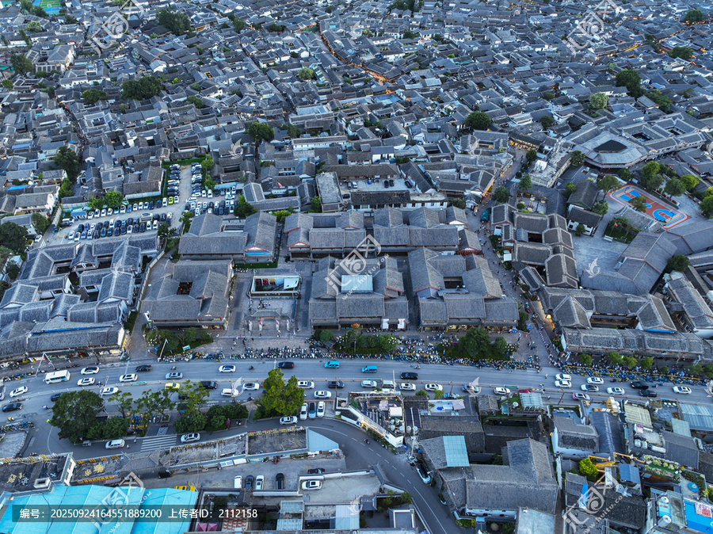

# 丽江古城 ✨

## 🏮 开篇：一座让人又爱又恨的城

在中国，没有哪一座城市像丽江这样，充满了争议。

有人说，它太商业化了，到处都是酒吧，到处都是艳遇的传说，早就没有了原来的味道。
也有人说，它是中国最好的古城，在这里，你可以什么都不做，只是发呆，就很美好。

1997年，丽江古城被列入《世界文化遗产名录》。那时候的丽江，安静、淳朴，几乎没有游客。
20多年过去了，丽江变成了全中国最有名的古城。
每年有几千万人来到这里。
有的人来了，骂着走了，说再也不来了。
有的人来了，就留下来了，再也没走。

这就是丽江。
你爱它，或者恨它。
但你不能否认，它是独一无二的。

## 📜 一座古城的前世今生

**宋末元初 建城**
纳西族的祖先从青藏高原迁徙下来，在这片玉龙雪山脚下的坝子上，建起了一座城。
没有城墙，没有城门，依山傍水，自然而成。

**明清 茶马古道重镇**
丽江成为了茶马古道上最重要的驿站。
西藏的马帮，云南的茶商，都在这里汇聚。
古城里的石板路，被几百年的马蹄踩得发亮。
那每一道车辙，都是时光的印记。

**1996年 大地震**
丽江发生了7级大地震。
很多老房子倒了。
但也正是因为这次地震，让全世界看到了这座隐藏在深山里的古城。
重建之后，丽江开始了它的传奇。

**2000年后 文旅爆发**
一批又一批的年轻人来到丽江。
有人开客栈，有人开酒吧，有人开书店。
他们逃离了北上广，在这座小城里，过起了另一种生活。
丽江，从此成为了"诗和远方"的代名词。

---

## 🌟 丽江的正确打开方式

### 📍 俯瞰古城：三千瓦顶的震撼

这是从狮子山上往下拍的丽江古城。
你看这三千多座青灰色的瓦顶，密密麻麻，鳞次栉比，像一片灰色的海洋。
没有一栋高楼，没有一根烟囱，整个城市的天际线是平的。
只有远处的玉龙雪山，在蓝天白云下静静伫立。

这就是丽江最珍贵的地方——
整个城市，完完整整地保留了几百年前的样子。

**你不知道的古城秘密**：
- **没有城墙**：丽江是中国唯一一个没有城墙的古城。因为纳西族的土司姓"木"，围上墙就是"困"了，不吉利
- **八卦布局**：整个古城是按照八卦来建的，条条道路通四方街，很容易迷路，但也很容易走出来
- **三眼井**：一口井分三个池子，第一个喝，第二个洗菜，第三个洗衣，智慧的纳西人
- **流水绕城**：玉河的水被分成三支，流进古城的每一条巷子，真正的"家家流水，户户垂柳"

**最佳拍摄时间**：
- **清晨6-8点**：几乎没有游客，阳光斜斜地照在瓦顶上，是丽江最美的时候
- **傍晚6-8点**：夕阳把古城染成金色，然后灯笼一盏盏亮起来
- **夜晚**：整个古城红灯笼都亮了，是另一种味道

> 💡 **导游贴士**：
> 一定要爬一次狮子山的万古楼。
> 不是为了拍什么"大片"。
> 是为了站在高处，看着脚下这一大片青灰色的瓦顶，看着远处的玉龙雪山。
> 那一刻你会明白，为什么那么多人来了丽江，就不想走了。

---

### 📍 古城的日与夜

丽江的白天和夜晚，是两个完全不同的世界。

**白天的丽江**
是安静的。
游客还在睡懒觉，古城里只有早起的纳西老人在买菜，只有洒水车在石板路上开过。
阳光透过树叶，在地上投下斑驳的影子。
这个时候的丽江，是属于本地人的。
你可以找一家没有人的咖啡馆，坐在门口，晒一上午的太阳。

**夜晚的丽江**
是热闹的。
酒吧街的音乐响起来了，人潮开始涌动。
民谣歌手开始唱歌，卖手鼓的姑娘开始打鼓。
有人在酒吧里喝酒，有人在河边放河灯，有人在巷子里迷路。
这个时候的丽江，是属于游客的。

**丽江最棒的体验，不是去什么景点。是：**
- 早上起来，去本地人吃的早餐店，喝一碗酥油茶
- 中午找一个没有人的巷子，坐在门槛上发发呆
- 下午去书店看一下午的书，或者找个咖啡馆写点东西
- 傍晚去狮子山看日落，看古城的灯一盏盏亮起来
- 晚上找个安静的小酒吧，听一首民谣，喝一杯小酒

这才是丽江。
不是赶景点，不是拍打卡照。
是慢下来。

---

### 📍 那些必去的地方

**四方街**：古城的中心，以前是茶马古道的集市，现在是人们跳舞的地方。每天傍晚，都会有纳西阿姨在这里打跳，你可以加入她们。

**木府**：纳西土司的宫殿，"北有故宫，南有木府"。虽然是重建的，但还是值得一看。尤其是站在木府的三清殿，看出去的古城景色，特别棒。

**大水车**：丽江的标志，打卡必去。但不要停留太久，拍张照就走，人太多了。

**七一街、五一街**：古城里最主要的两条街，慢慢逛，会发现很多有意思的小店。

**黑龙潭**：古城北边的公园，拍玉龙雪山倒影的最佳位置，人少景美，免费。

> 💡 **避雷指南**：
> 酒吧街的酒很贵，也很吵。如果想安安静静听歌，去五一街或者七一街的小清吧。
> 不要买"银饰"，十有八九是假的。
> 不要报"拉市海骑马"的低价团，坑很多。

---

## 🍃 在丽江，慢下来

很多人来丽江，都在问："丽江有什么好玩的？"

其实丽江什么都没有。
没有过山车，没有迪士尼，没有什么必须要打卡的景点。

丽江最好玩的，就是"什么都不玩"。

你可以在客栈的院子里躺一天，晒晒太阳，逗逗猫。
你可以在咖啡馆坐一下午，看一本书，写几行字。
你可以在古城里漫无目的地走，迷路了也没关系，反正总能走出来。
你可以认识一些有意思的人，听他们讲自己的故事。

这就是丽江最棒的地方——
它允许你浪费时间。
它允许你什么都不做。

在这个人人都在喊"内卷"的时代，
只有在丽江，你可以心安理得地虚度光阴。

---

## 🎯 游览实用指南

### 🚗 交通指南
丽江的交通很方便。

**飞机**：
丽江三义机场，距离古城约30公里。
- 机场大巴：20元/人，到蓝天宾馆，然后打车10元到古城
- 打车：约80-100元
- 接机：很多客栈提供免费接机，提前问一下

**高铁**：
丽江站，距离古城约10公里。
- 公交：18路、4路，1元，约40分钟
- 打车：约20-30元

**古城内**：
只能走路！古城里没有车，全程靠走。
穿舒服的鞋！石板路很磨脚。

### 🎫 门票信息
- **古城维护费**：50元（现在查得不严，一般不买也能进，但去黑龙潭、玉龙雪山需要）
- **木府**：40元
- **狮子山万古楼**：35元
- **黑龙潭**：免费（需要古维费）
- **束河古镇**：免费
- **白沙古镇**：免费

> 注意：古城本身是免费的，不需要门票。

### ⏰ 最佳游览时间
- **4-5月、9-10月**：天气最好，不冷不热，人相对少
- **6-8月**：暑假，人最多，但也是丽江最舒服的季节，20多度
- **11-3月**：冬天，人最少，很安静，适合晒太阳，运气好能看到雪
- **建议游览时长**：3天起步，一周不多，住一个月更好

### 🗺️ 推荐行程
**经典三日游**：
- **第一天**：古城慢逛 → 木府 → 狮子山看日落 → 晚上酒吧听歌
- **第二天**：玉龙雪山一日游（建议报正规团）
- **第三天**：束河古镇 → 白沙古镇 → 黑龙潭 → 晚上逛古城夜景

**懒人七日游**：
哪里都不去，就在古城里待着。
每天睡到自然醒，吃个午饭，下午咖啡馆发呆，晚上找朋友喝酒聊天。
这才是丽江的正确打开方式。

### 🏨 住宿建议
一定要住在古城里！不要住新城！

**选择建议**：
- **狮子山附近**：可以看古城全景，风景好，但要爬台阶，行李多的慎重
- **五一街、七一街附近**：生活方便，安静，离热闹的地方不远不近
- **酒吧街附近**：热闹，但晚上会吵，慎重选择
- **束河古镇**：比大研古城安静，人少，适合喜欢清净的人

> 小贴士：不要在网上订太贵的"网红客栈"，很多都是照骗。到了再找，多看几家，还能砍价。

### 🍜 丽江美食
- **腊排骨火锅**：丽江第一名菜，排骨腊得很香，一定要试
- **土鸡火锅**：纳西特色，汤很鲜
- **三文鱼**：丽江的三文鱼是淡水养殖的，一鱼三吃，很有名
- **鸡豆凉粉**：纳西特色小吃，酸酸辣辣的
- **酥油茶**：咸的，喝不惯的可以试试甜的，抗高反

### ⚠️ 避坑指南（非常重要！）
1. ❌ 不要相信路边拉客的"5元去拉市海"，去了就宰你
2. ❌ 不要买"玉"，不要买"银饰"，水很深
3. ❌ 不要在酒吧街喝太贵的酒，一瓶啤酒卖几十很正常
4. ✅ 报团一定要报正规的，不要贪便宜
5. ✅ 不要相信"艳遇"，大多是酒托
6. ✅ 丽江海拔2400米，一般不会高反，但还是不要剧烈运动

## 💫 结语：丽江是一种病

有人说，丽江是一种病。
不去，治不好。
去了，会病得更重。

确实。
很多人来丽江，本来只是想玩几天。
结果一待就是几个月，几年，甚至一辈子。

他们可能在北上广拿着几万块的月薪，
在丽江，他们开个小客栈，或者当个调酒师，或者什么都不做，每天只是晒太阳。
钱赚得少了，但快乐多了。

丽江就是有这样的魔力。
它会让你突然发现：
原来人生不是只有挣钱这一种活法。
原来人可以这样慢地生活。
原来，快乐可以这么简单。

所以，来一次丽江吧。
不是为了艳遇，不是为了打卡。
是为了给自己放个假。
是为了看看，另一种生活的可能性。

也许你来了，骂着就走了。
也许你来了，就再也不想走了。

但不管怎样，
你这一生，总该来一次丽江的。

> 📌 **旅行感悟**：
> 丽江最珍贵的，从来都不是什么景点。
> 是那片瓦顶，那条石板路，那座雪山，那片蓝天。
> 是那种，可以什么都不做的自由。
>
> 毕竟，在我们的人生里，
> 可以心安理得浪费时间的机会，
> 真的不多。

---

*本页内容基于实景图片分析与纳西文化研究整理，由AI导游系统2025年6月生成*
