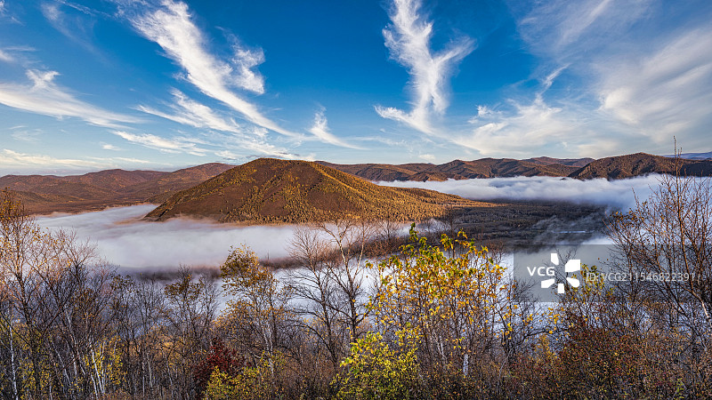
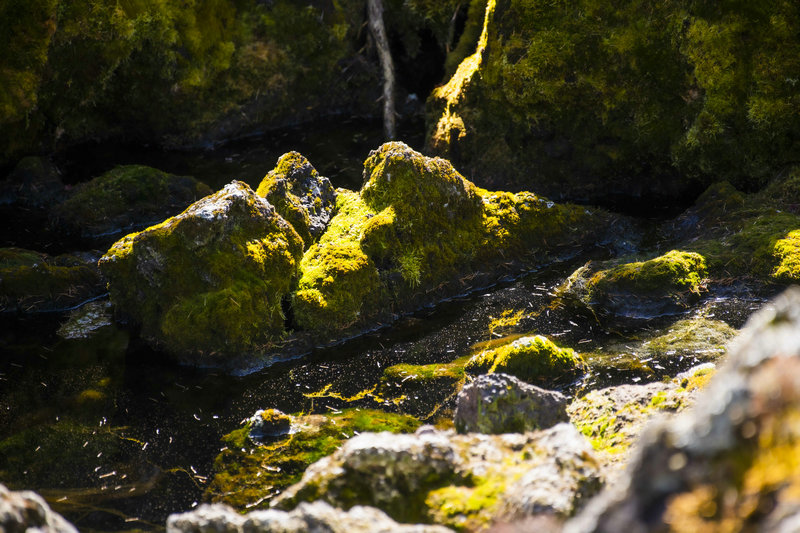
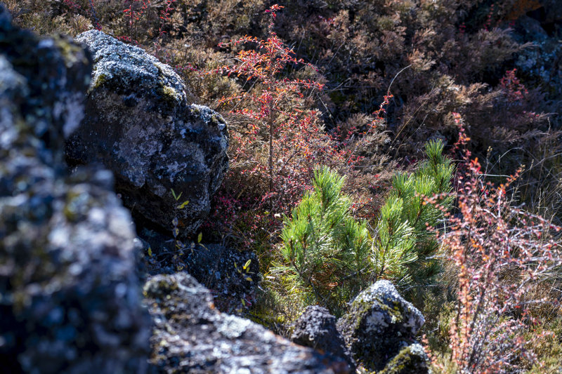
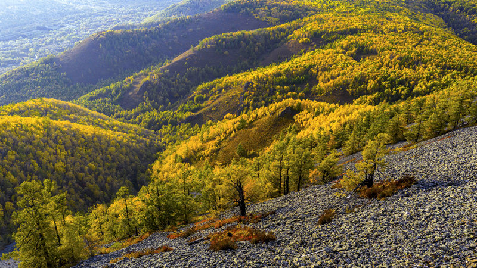

# 阿尔山·柴河旅游景区

## 🎤 AI导游带你游

### 【开场白】
各位朋友，大家好！欢迎来到内蒙古自治区兴安盟，欢迎来到阿尔山·柴河旅游景区。我是你们今天的导游小艾。

站在这片土地上，你们可能想象不到，千百年前，这里曾是怎样一番景象。历史的年轮在这里留下了深深的印记，每一寸土地都在诉说着古老的故事。

一、阿尔山-柴河旅游景区详细介绍 1.1 景区基础规模与资质 阿尔山-柴河旅游景区是国家5A级旅游景区、联合国教科文组织世界地质公园，总面积达13168.7平方公里。 景区地跨内蒙古兴安盟阿尔山市与呼伦贝尔扎兰屯市柴河镇，是国内规模顶尖的综合性自然文旅景区。 景区涵盖阿尔山国家森林公园、好森沟国家森...

今天，就让我们一起走进这片神奇的土地，感受它独有的魅力。建议游览时间：半天到一天。拍照最佳时间是清晨或傍晚，光线柔和时最美。

---

## 🗺️ 景区全景导览
阿尔山·柴河旅游景区位于内蒙古自治区兴安盟阿尔山市境内，是国家AAAAA级旅游景区。

一、阿尔山-柴河旅游景区详细介绍 1.1 景区基础规模与资质 阿尔山-柴河旅游景区是国家5A级旅游景区、联合国教科文组织世界地质公园，总面积达13168.7平方公里。 景区地跨内蒙古兴安盟阿尔山市与呼伦贝尔扎兰屯市柴河镇，是国内规模顶尖的综合性自然文旅景区。 景区涵盖阿尔山国家森林公园、好森沟国家森林公园、阿尔山国家地质公园等多个核心园区，生态资源富集。 1.2 历史与地质文化背景 景区以罕见的火山地貌、温泉资源为核心特色，拥有完整的火山地质演化遗迹，科研与观赏价值极高。 历史上这里是鄂温克、鄂伦春等少数民族的世代聚居地，留存着浓郁的北方游牧与狩猎民俗文化。 2017年景区成功获评国家5A级景

**游览路线推荐**：景区入口 → 核心景观区 → 精华景点 → 观景平台 → 出口

---

## 🏛️ 主要景点详解

### 📍 核心景区

**核心看点**：
- 这里曾是历史上重要的场所，意义非凡
- 建筑/景观的设计独具匠心，体现了古人智慧
- 站在这里，仿佛能与历史对话

> 💡 **导游贴士**：
> 核心景区是整个景区的精华所在，建议至少预留20-30分钟在这里慢慢欣赏。

---

### 📍 精华观景台

**核心看点**：
- 这里是景区最具代表性的景观，绝对不可错过
- 独特的自然/人文风貌，是拍照打卡的首选之地
- 建议停留15-20分钟，细细品味它的独特魅力

> 💡 **导游贴士**：
> 在精华观景台游览时，注意爱护环境，让这份美能够长久留存。

---

### 📍 特色景观区

**核心看点**：
- 这里承载着景区最深厚的历史文化底蕴
- 每一处细节都诉说着动人的故事
- 建议跟随讲解员深入了解背后的历史

> 💡 **导游贴士**：
> 想要深度了解特色景观区，可以提前做些功课，了解它的历史背景，游览时会更有感触。

---

### 📍 文化展示区

**核心看点**：
- 远离人群的小众精华景点，安静而美好
- 喜欢深度游的朋友一定不要错过
- 这里能让你感受到不一样的景区魅力

> 💡 **导游贴士**：
> 文化展示区的景色四季皆宜，每个季节都有不同的美，值得多次来访。

---

### 📍 历史遗迹区

**核心看点**：
- 景区的标志性景观，没来过等于没来过
- 最佳观赏时间是清晨和傍晚，光线最美
- 记得带上充电宝，美景会让你停不下快门

> 💡 **导游贴士**：
> 游览历史遗迹区时，不妨找个地方坐下来，静静感受周围的氛围，这才是旅行的意义。

---

### 📍 自然观光带

**核心看点**：
- 观景位置绝佳，视野开阔
- 是拍摄全景照片的最佳地点
- 傍晚时分来，夕阳西下的景色美不胜收

> 💡 **导游贴士**：
> 如果你是摄影爱好者，自然观光带一定能让你拍出满意的作品，记得带上广角镜头！

---

## 【结束语】
各位朋友，今天的游览即将结束。希望阿尔山·柴河旅游景区的美景能给你们留下美好的回忆。

有人说，旅行的意义不在于去过多少地方，而在于那些让你心动的瞬间。希望在阿尔山·柴河旅游景区的这一天，能成为你旅途中一个温暖的记忆。

临走前，别忘了回头再看一眼。夕阳下的阿尔山·柴河旅游景区，会给你最温柔的道别。

> ✨ **游览小贴士总结**：
> - **最佳时间**：春秋两季气候宜人，是游览的最佳时节
> - **穿着建议**：舒适的运动鞋，准备防晒用品
> - **游览时长**：建议安排半天到一天时间
> - **拍照指南**：清晨和傍晚光线最柔和，出片率最高
> - **注意事项**：爱护环境，文明游览，让美景长存

祝你们旅途愉快，平安吉祥！🙏

---

## 📷 景区美图

*景区全景*

*核心景观*

*特色风光*

*细节之美*

---

## 📚 阿尔山·柴河旅游景区小档案

| 项目 | 信息 |
|------|------|
| 景区级别 | 国家AAAAA级旅游景区 |
| 所属省份 | 内蒙古自治区 |
| 所属城市 | 兴安盟 |
| 建议游览时间 | 半天 - 1天 |
| 最佳游览季节 | 春秋两季 |

---

> 💡 **本页说明**：
> 本README由AI导游小艾根据网络公开资料整理生成。
> 坐标、图片、简介均来自豆包搜索API，仅供参考。
