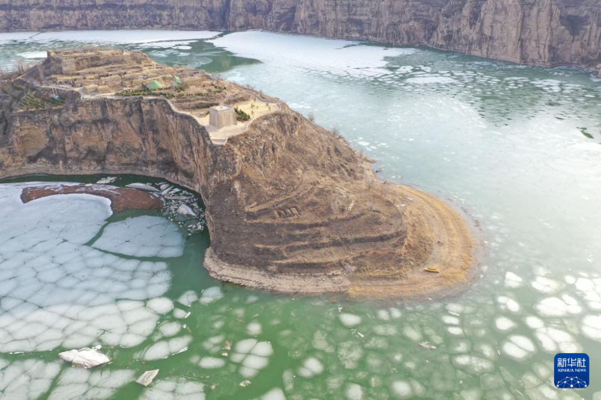
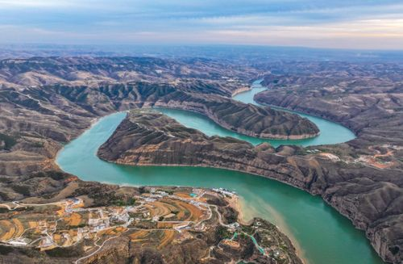
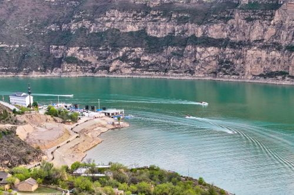
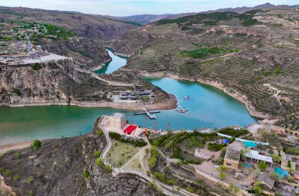

# 老牛湾黄河大峡谷旅游区

## 🎤 AI导游带你游

### 【开场白】
各位朋友，大家好！欢迎来到内蒙古自治区呼和浩特市，欢迎来到老牛湾黄河大峡谷旅游区。我是你们今天的导游小艾。

站在这片土地上，你们可能想象不到，千百年前，这里曾是怎样一番景象。历史的年轮在这里留下了深深的印记，每一寸土地都在诉说着古老的故事。

清水河县老牛湾黄河大峡谷景区 老牛湾国家地质公园 老牛湾黄河大峡谷旅游区 老牛湾黄河大峡谷旅游区是一个特色明显、极具观赏性和科普性的地质公园，地处晋、蒙黄河大峡谷的核心地段和黄河“几”字弯腹地，滔滔黄河、幽幽峡谷、铮铮长城在这里汇聚，有“天下黄河第一湾”“北方小三峡”等美誉。老牛湾黄河大峡谷旅游区内...

今天，就让我们一起走进这片神奇的土地，感受它独有的魅力。建议游览时间：半天到一天。拍照最佳时间是清晨或傍晚，光线柔和时最美。

---

## 🗺️ 景区全景导览
老牛湾黄河大峡谷旅游区位于内蒙古自治区呼和浩特市清水河县境内，是国家AAAAA级旅游景区。

清水河县老牛湾黄河大峡谷景区 老牛湾国家地质公园 老牛湾黄河大峡谷旅游区 老牛湾黄河大峡谷旅游区是一个特色明显、极具观赏性和科普性的地质公园，地处晋、蒙黄河大峡谷的核心地段和黄河“几”字弯腹地，滔滔黄河、幽幽峡谷、铮铮长城在这里汇聚，有“天下黄河第一湾”“北方小三峡”等美誉。老牛湾黄河大峡谷旅游区内文物古迹众多，有宁边州故城遗址、老牛湾古村落、神牛广场、九曲黄河阵、杨家川小峡谷、太极湾、游步道望河楼、神牛乐园、VR体验馆、神狮护水石、镇水石柱、西岔祠遗址、太极峰、如意岛、万里江山岩壁等景观30余处。 老牛湾黄河大峡谷旅游区基本信息 官方网站： 点击查看 开放时间： 08:00~18:00 适宜

**游览路线推荐**：景区入口 → 核心景观区 → 精华景点 → 观景平台 → 出口

---

## 🏛️ 主要景点详解

### 📍 核心景区

**核心看点**：
- 自然风光与人文景观完美融合的典范
- 四季景致各异，无论何时来都有惊喜
- 摄影爱好者的天堂，随手一拍都是大片

> 💡 **导游贴士**：
> 在核心景区游览时，注意爱护环境，让这份美能够长久留存。

---

### 📍 精华观景台

**核心看点**：
- 这里承载着景区最深厚的历史文化底蕴
- 每一处细节都诉说着动人的故事
- 建议跟随讲解员深入了解背后的历史

> 💡 **导游贴士**：
> 想要深度了解精华观景台，可以提前做些功课，了解它的历史背景，游览时会更有感触。

---

### 📍 特色景观区

**核心看点**：
- 景区的标志性景观，没来过等于没来过
- 最佳观赏时间是清晨和傍晚，光线最美
- 记得带上充电宝，美景会让你停不下快门

> 💡 **导游贴士**：
> 特色景观区的景色四季皆宜，每个季节都有不同的美，值得多次来访。

---

### 📍 文化展示区

**核心看点**：
- 景区内最受欢迎的打卡点，游客必到
- 站在这里可以俯瞰整个景区的壮丽景色
- 天气好的时候拍照效果绝佳，记得预留时间

> 💡 **导游贴士**：
> 游览文化展示区时，不妨找个地方坐下来，静静感受周围的氛围，这才是旅行的意义。

---

### 📍 历史遗迹区

**核心看点**：
- 这里是景区最具代表性的景观，绝对不可错过
- 独特的自然/人文风貌，是拍照打卡的首选之地
- 建议停留15-20分钟，细细品味它的独特魅力

> 💡 **导游贴士**：
> 如果你是摄影爱好者，历史遗迹区一定能让你拍出满意的作品，记得带上广角镜头！

---

### 📍 自然观光带

**核心看点**：
- 这里曾是历史上重要的场所，意义非凡
- 建筑/景观的设计独具匠心，体现了古人智慧
- 站在这里，仿佛能与历史对话

> 💡 **导游贴士**：
> 来自然观光带游览，建议穿舒适的鞋子，这里需要多走走才能发现它的美。

---

## 【结束语】
各位朋友，今天的游览即将结束。希望老牛湾黄河大峡谷旅游区的美景能给你们留下美好的回忆。

有人说，旅行的意义不在于去过多少地方，而在于那些让你心动的瞬间。希望在老牛湾黄河大峡谷旅游区的这一天，能成为你旅途中一个温暖的记忆。

临走前，别忘了回头再看一眼。夕阳下的老牛湾黄河大峡谷旅游区，会给你最温柔的道别。

> ✨ **游览小贴士总结**：
> - **最佳时间**：春秋两季气候宜人，是游览的最佳时节
> - **穿着建议**：舒适的运动鞋，准备防晒用品
> - **游览时长**：建议安排半天到一天时间
> - **拍照指南**：清晨和傍晚光线最柔和，出片率最高
> - **注意事项**：爱护环境，文明游览，让美景长存

祝你们旅途愉快，平安吉祥！🙏

---

## 📷 景区美图

*景区全景*

*核心景观*

*特色风光*

*细节之美*

---

## 📚 老牛湾黄河大峡谷旅游区小档案

| 项目 | 信息 |
|------|------|
| 景区级别 | 国家AAAAA级旅游景区 |
| 所属省份 | 内蒙古自治区 |
| 所属城市 | 呼和浩特市 |
| 建议游览时间 | 半天 - 1天 |
| 最佳游览季节 | 春秋两季 |

---

> 💡 **本页说明**：
> 本README由AI导游小艾根据网络公开资料整理生成。
> 坐标、图片、简介均来自豆包搜索API，仅供参考。
