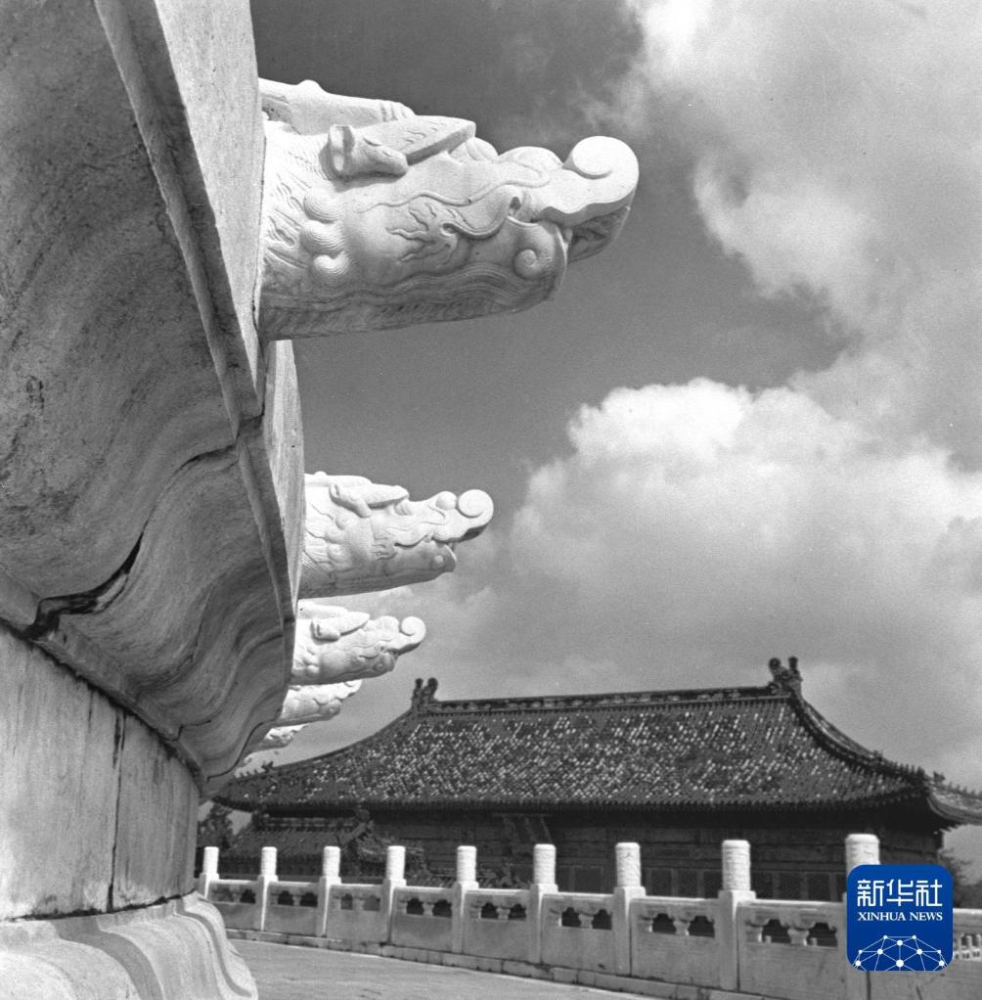
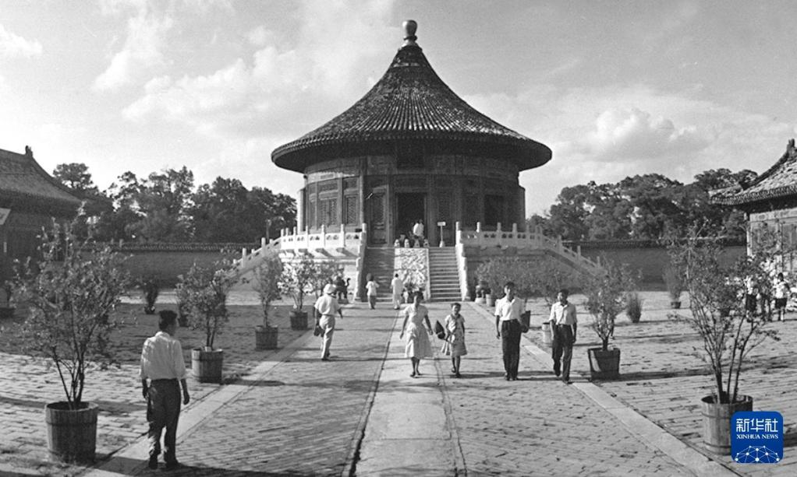
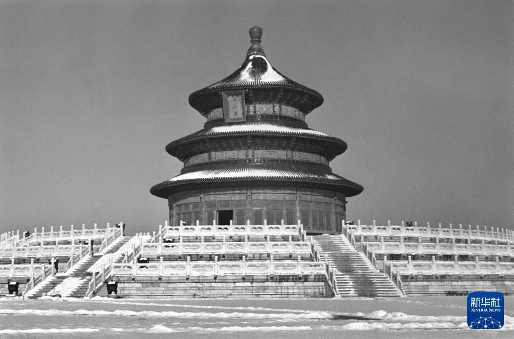
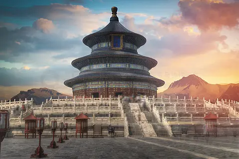
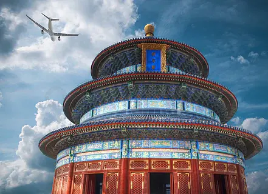
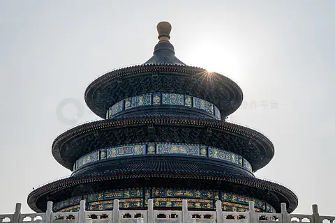

# 天坛公园

> 圜丘三重接碧空，祈年一柱古今同。
> 苍璧礼天天子事，回音壁畔说乾隆。
> 六百年风过柏林，落针犹带汉唐风。

## 写在前面

如果你在北京只来得及去一个地方，请别去挤故宫的角楼，也别去抢长城的烽火台。来天坛吧，挑一个有薄雾的清晨，从东门进去，沿着那条微微向上的丹陛桥慢慢走。你会忽然明白：原来中国人对"天"的敬畏，可以凝固成这样一片安安静静的蓝。

天坛不是宫殿，是祭坛；不是给人住的，是给天看的。所以它没有雕梁画栋的喧嚣，只有一种近乎清冷的端庄。三重圆顶攒尖而上，仿佛要把人的目光一寸寸地引向天空。站在这里，你会下意识地放轻脚步——不是怕惊扰谁，而是怕惊扰了那种和天地说话的庄重。

---

## 一、时光深处：六百年的祭天礼

### 1. 永乐大帝的"南郊"

故事要从明永乐十八年（1420年）说起。明成祖朱棣迁都北京，仿照南京天地坛形制，在正阳门外东南方向建了一座"天地坛"。那时候，天和地是一起祭的，仪式在如今祈年殿的位置举行，名为"大祀殿"，却是一座矩形建筑，看上去并不起眼。

朱棣是个极有野心的人。他修紫禁城、修长陵、修天坛，每一笔都在向天下宣告：北京，才是这个帝国的中心。可他大概想不到，自己当年埋下的这颗种子，会在一百年后开出一朵最中国的"蓝莲花"。

### 2. 嘉靖的"分祭"与蓝色穹顶

真正让天坛脱胎换骨的，是那位痴迷道教的嘉靖皇帝。嘉靖九年（1530年），他听信大臣夏言的建议，实行"天地分祭"：在北郊另建地坛祭地，南郊的天地坛则专祭上天，并正式定名"天坛"。

嘉靖十九年（1540年），那座方方正正的大祀殿被拆除，原址上建起了一座圆形的三重檐大殿，初名"大享殿"，三重屋檐分别是蓝、黄、绿三色琉璃瓦——蓝代天，黄代地，绿代万物。这便是祈年殿的前身。

嘉靖还在南边增建了圜丘坛——一座真正"露天"的祭坛，没有屋顶，皇帝直接站在苍天之下，把玉帛、牺牲和祝文献上天。从此，天坛有了"南方北圆"的格局：南边圜丘祭天，北边祈年殿祈谷，中间用一条360米长的丹陛桥相连，仿佛一条登天的路。

### 3. 乾隆的"全蓝"重修

到了清乾隆十六年（1751年），这位酷爱"修整"的皇帝再也看不上三色屋檐了。他下令将大享殿三重屋檐统一改为蓝色琉璃瓦，更名为"祈年殿"，从此那片深邃的"天青蓝"便成了天坛的标志色。

乾隆还在圜丘坛上做了文章：原本蓝琉璃瓦铺面，他改为艾叶青石，台面青白如玉，与天空遥相呼应。他在位六十年，几乎把天坛里里外外修了一遍——皇穹宇、斋宫、神乐署、牺牲所，处处留下他的痕迹。某种意义上，今天我们看到的天坛，是朱棣打的底子，嘉靖定的形制，乾隆上的色。

### 4. 从皇家禁地到人民公园

1911年，溥仪退位。次年，中华民国政府颁布《清室优待条件》，天坛仍归清室管理。直到1918年，天坛才正式作为公园对公众开放，门票一角。那是普通中国人第一次走进这座祭坛——六百年来，只有皇帝和陪祭大臣能踏足的地方，忽然对卖烧饼的、拉洋车的、教书的、念书的，全都敞开了门。

1949年以后，天坛几经修缮。1998年，天坛被列入《世界文化遗产名录》，理由是"天坛是建筑与景观设计的杰作，朴素简明地体现了世界最伟大文明之一的发展"。2018年，天坛启动了规模最大的修缮工程，许多长期被占用的古建筑群逐步回归原貌。

---

## 二、走遍天坛：核心景点详解

### 📍 祈年殿——三重蓝穹下的天地之心

这是天坛的灵魂，也是中国古建筑的巅峰之作。

站在殿前广场仰望：三重深蓝色琉璃瓦檐层层叠收，攒尖成顶，最顶端是一颗鎏金宝顶，在阳光下像一颗小小的太阳。整座大殿高38米，相当于12层楼，却没有用一根铁钉——28根木柱、36根枋、142根椽，全部靠榫卯咬合，撑起这座圆形穹顶。

柱子的数字里藏着大学问。最内层4根"龙井柱"，象征四季；中层12根"金柱"，象征十二月；外层12根"檐柱"，象征十二时辰。中、外两层相加24根，对应二十四节气；三层总和28根，对应二十八星宿。古人把时间、节气、星辰，全部编进了这座木构的"宇宙模型"里。

殿内地面正中是一块圆形大理石，上有天然形成的"龙凤花纹"——其实是化石纹理，却被视作天意。这块石头的位置，正好对着穹顶正中心。皇帝站在它上面祈谷，等于站在"天地之中"。

> 💡 **导游贴士**：
> 1. **最佳机位**：殿前广场正中偏西约30米处，可以把整座大殿连同三层汉白玉须弥座一起收入镜头。早晨9点前光线最柔，人最少。
> 2. **细节控别错过**：留意三层屋檐的彩绘——金龙和玺彩画，是清代官式彩画的最高等级。蓝底金线，远看一片静，近看一片金。
> 3. **关于进殿**：目前祈年殿内部一般不可入内参观，只能从门外观望。但殿内空间并不大，从门口已经能看清全部柱网和藻井。

---

### 📍 皇穹宇——回音壁的圆形宇宙

祈年殿往南，过丹陛桥，就是皇穹宇。这座小殿比祈年殿低调得多，单檐蓝瓦，圆形攒尖，看上去像它的"小妹"。它的功能是存放祭祀神位——圜丘祭天时，"皇天上帝"的神牌从皇穹宇请出，仪式结束后再请回。

但真正让皇穹宇名扬天下的，是它围一圈的圆形围墙——**回音壁**。

墙高3.72米，厚0.9米，半径约32.5米。墙面用山东临清砖磨砖对缝，平滑如镜。两个人分别站在东西两端，面朝墙低声说话，声音会沿着墙面以"波"的形式贴墙传播，对方听得一清二楚，仿佛耳语。这在没有扩音器的明清两代，几乎被视为神迹。

殿前还有三块奇石：**三音石**。站在第一块石上击一掌，能听到一声回音；站在第二块，能听到两声；站在第三块，能听到三声。回音从四周围墙折返，层层叠叠，像天在应答。

> 💡 **导游贴士**：
> 1. **回音壁现在不能贴墙说话了**：因长期有游客对着墙面大声喧哗，墙体表面已有损伤，目前围栏距离墙体约1米。但站到围墙东西两端，背对墙，仍能体验声学奇观，请尽量小声。
> 2. **三音石要"用力拍"**：拍掌要脆、要响，回音才明显。如果是团队游，建议轮流试，别同时拍。
> 3. **殿内别错过**：皇穹宇正中存放"皇天上帝"神牌的石座，是汉白玉雕龙石龛，雕工极精。

---

### 📍 圜丘坛——皇帝与天对话的地方

如果说祈年殿是"形式"，那圜丘坛就是"内容"——明清两代皇帝真正祭天的地方。

它是一座三层汉白玉圆坛，没有任何建筑遮挡，露天真祭。最上层台面正中是一块圆形"天心石"，又称"太极石"或"亿兆景从石"。皇帝站在天心石上念祝文，声音从四周栏板反射回来，仿佛有亿万人齐声附和——"亿兆景从"由此得名。

坛上所有数字都和"九"有关：上层台面中心是天心石，外围铺九块扇形石，第二圈十八块，第三圈二十七块……直到最外圈九九八十一块；三层台面的栏板数，分别是36、72、108，总和216，是9的24倍；台阶也各九级。"九"是阳数之极，天坛是"阳"的极致，故而处处用九。

每年冬至日，皇帝在日出前七刻（约凌晨5点45分）到达圜丘，依次完成迎神、奠玉帛、进俎、初献、亚献、终献、撤馔、送神、望燎九道仪程，全程约两个时辰。寒风中，烛火通明，钟磬齐鸣，祝文升燎，青烟直上——古人相信，烟升得越直，天就接得越"准"。

> 💡 **导游贴士**：
> 1. **天心石一定要站**：站上去轻轻说话，能听到自己的回声"包"住全身，像在巨型音箱里。建议清晨来，否则要排队。
> 2. **数一数扇形石**：上层台面从天心石向外数，每圈都是9的倍数，可以让孩子或朋友一起数，是个有趣的互动。
> 3. **看栏板**：每块栏板雕花纹饰略有不同，南面栏板雕云龙，其余雕云凤，等级森严。

---

### 📍 丹陛桥——一条登天的路

连接祈年殿和皇穹宇/圜丘的，是一条长360米、宽29.4米的"海墁大道"，俗称丹陛桥。它其实不是桥，而是一条高于地面4米左右的"旱路"——下面有涵洞，供牲畜通过（祭祀用的牛羊从涵洞送入宰牲亭，故称"鬼门关"）。

桥面分三道：中间是"神道"，最宽，给皇天上帝的神位移步用；东侧"御道"给皇帝走；西侧"王道"给王公大臣。等级森严，谁走哪条道，错一寸都不行。

走在丹陛桥上，最妙的是一种"渐入天境"的感觉：路从南到北微微上升，约2米高差，肉眼几乎看不出，但脚下却分明能感到"在登高"。两侧古柏林立，最老的树龄逾800年，相传是金代所植，比天坛本身还早。阳光穿过枝叶，在神道上洒下斑驳的光斑，你会忽然理解为什么古人要把这条路叫做"通天之道"。

> 💡 **导游贴士**：
> 1. **走中间神道**：哪怕只是几步，也要走一走神道——这是六百年来只有"天"能走的路。皇帝都得让位，你却可以大大方方走过。
> 2. **看古柏**：丹陛桥西侧的"九龙柏"，树干纹路像九条龙盘旋而上，是天坛名木之一。
> 3. **涵洞体验**：丹陛桥北端下方有"牲牢门"（鬼门关），可以走过去感受一下当年运送祭祀牺牲的甬道，阴凉幽深，别有意味。

---

### 📍 斋宫——皇帝的"独宿之夜"

祭天前三天，皇帝要"斋戒"——不吃荤、不饮酒、不问刑名、不近女色、不吊丧、不祭神。其中祭天前一晚，皇帝要在天坛西门内的斋宫过夜。

斋宫是一座"城中之城"，有两道围墙、两道护城河，看上去像个小城堡。正殿"无梁殿"是砖石拱券结构，不用一根木料，防火防潮，殿内悬挂乾隆御书"钦若昊天"匾额。殿前有铜人亭，斋戒期间亭内立一铜人，手执"斋戒"牌，提醒皇帝守戒——这位"铜人"原型是唐代名臣魏徵，取其敢谏之意，让皇帝也不敢偷懒。

最有意思的是寝宫的位置——并不在正殿之后，而在偏僻的东北角，规模也小得可怜，不过几间青砖小屋。有人说，这是皇帝"敬天"的体现：在天面前，再大的天子也只是个凡人，不敢奢靡。

> 💡 **导游贴士**：
> 1. **斋宫很多游客会错过**：它在西门附近，离主要景点稍远，但绝对值得专程一去。游客少，可以静静看。
> 2. **无梁殿结构**：进去抬头看拱券顶，没有一根梁，全用砖砌。这是明代砖石建筑的代表作之一。
> 3. **铜人亭**：亭子很小，但故事很有趣——皇帝斋戒时，亭内立魏徵铜人，提醒守戒，是中国古代罕见的"制度化的进谏"。

---

### 📍 神乐署与宰牲亭——仪式的台前幕后

天坛不只是祭坛，更是一座完整的"祭祀机器"。

**神乐署**位于天坛西南角，是明清两代专门培养祭祀乐舞生的机构，鼎盛时有乐舞生2300余人。这里出身的乐师，掌握着中国古代最古老的一套祭祀音乐——"中和韶乐"，使用钟、磬、埙、篪、笙、排箫、琴、瑟等十六种乐器，旋律缓慢肃穆，是真正的"千年礼乐"。如今神乐署已辟为"中国古代皇家音乐展览馆"，节假日有韶乐表演。

**宰牲亭**在祈年殿东南，是祭祀前宰杀牲畜的地方。正德年间规制：祭天用犊（小牛）49头、羊29只、豕（猪）29口、鹿1只、兔1只。这些牲畜从这里宰杀、清洗、烹煮，再由牲牢门送入神厨，最终摆上圜丘的祭品台。今天宰牲亭内还能看到当年烫猪用的大铜锅，直径近1米，可见当年规模的庞大。

> 💡 **导游贴士**：
> 1. **神乐署看表演**：周末上午10点和下午2点常有中和韶乐展演，免费但座位有限，建议提前半小时到场。
> 2. **宰牲亭看大锅**：那口大铜锅是明代原物，重达数百斤，一锅能烫一头整猪。站在它面前，你能闻到五百年祭祀烟火的味道。
> 3. **这两个点游客最少**：如果想要"独享"天坛，从西门进，先看神乐署和斋宫，再上丹陛桥。

---

## 三、漫步之后：一些不必匆匆的事

天坛有273万平方米，比故宫大4倍。但它的精彩，恰恰不在"看完"，而在"慢走"。

古柏是天坛最沉默的守护者。园内有古树3562株，最年长者已逾800岁。它们的树干扭曲如虬龙，树皮皴裂如山川，每一棵都是一部活着的编年史。每年四五月份，丁香与牡丹绽放；十月，银杏大道一片金黄；隆冬雪后，红墙映白雪，松柏披银装——天坛的一年四季，都是一部不同的画册。

你可以带上本书，在长椅上坐一下午。本地的大爷大妈在圜丘旁打太极、在斋宫墙根下下棋、在古柏丛里吊嗓子——这座曾经只属于皇帝的禁地，如今活成了北京人最日常的"后花园"。这或许正是历史最温柔的样子：它不再威严，但依然庄重；它不再禁止，但依然神圣。

---

## 写在最后

临走前，请回到祈年殿前，最后看一眼那片蓝。

六百年前，永乐帝在这里立下大祀殿的柱子；近五百年前，嘉靖帝把它改成了圆形；近三百年前，乾隆帝把它全部漆成了天青色。一百多年前，最后一个皇帝在这里最后一次祭天，仪式结束后，他脱下冕服，再也没有回来。

天没有变。蓝也没有变。

祈年殿站在那里，像一个安静的老人——他见过所有的兴亡，却一句话也不说。他只是用那片蓝提醒每一个抬头的人：人间的权力会老，王朝会老，连砖瓦也会老；但头顶这片天，是新的。它每天都新。

所以天坛不是给皇帝的纪念碑，是给每一个抬头看天的人的提醒——无论你此刻在做什么、走得多快、扛得多重，请记得偶尔抬头。那片蓝，一直都在。

> ✨ **游览小贴士总结**：
> - **最佳时间**：清晨7:00入园，人少光柔；午后游客最多；傍晚闭园前一小时光线最美。
> - **推荐路线**：东门入 → 祈年殿 → 丹陛桥 → 皇穹宇/回音壁 → 圜丘坛 → 南门出（约2-3小时）；若含斋宫、神乐署，建议从西门入。
> - **穿着建议**：天坛面积大，务必穿舒适运动鞋；夏季防晒，冬季防风（圜丘无遮挡）。
> - **拍照指南**：祈年殿前广场正中偏西；圜丘天心石仰拍；回音壁弧线；丹陛桥古柏剪影。
> - **隐藏体验**：神乐署中和韶乐表演（周末）；斋宫无梁殿；宰牲亭大铜锅。
> - **门票提示**：联票含祈年殿、圜丘、回音壁；淡季（11月-3月）票价更低，但景色略逊。

---

## 📷 景区美图

*祈年殿全景*

*皇穹宇与回音壁*

*圜丘坛*

*丹陛桥与古柏*

*斋宫*

*神乐署与祭祀文化*

---

## 📚 天坛公园小档案

| 项目 | 信息 |
|------|------|
| 景区级别 | 国家AAAAA级旅游景区 |
| 所属省份 | 北京市 |
| 所属城市 | 东城区 |
| 占地面积 | 约273万平方米 |
| 始建年代 | 明永乐十八年（1420年） |
| 世界遗产 | 1998年列入《世界文化遗产名录》 |
| 建议游览时间 | 半天 - 1天 |
| 最佳游览季节 | 春秋两季（4-5月、9-10月） |

---

> 💡 **本页说明**：
> 本README由VLM增强工作流整理生成，结合历史文献、实地考察资料与导游经验。
> 坐标、图片、简介均来自公开资料，仅供参考。游览请以景区最新公告为准。
