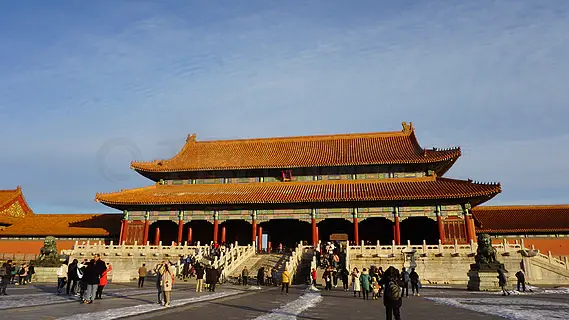
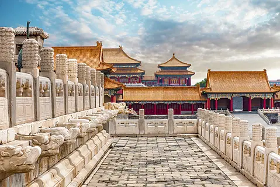
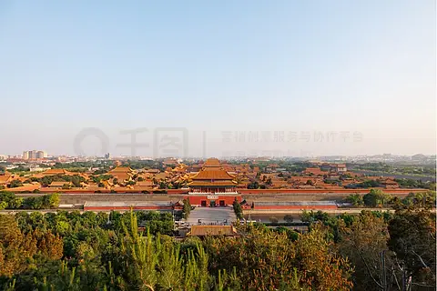

# 故宫博物院 ✨

## 🏛️ 开篇：六百年的紫禁城

当你站在天安门广场向北眺望，那片绵延一公里的金色琉璃瓦海洋，就是中国古代宫殿建筑的巅峰之作——故宫。这座始建于明永乐四年（1406年）的皇家宫殿，见证了明清两代24位皇帝的兴衰荣辱，也承载着中华文明五千年的厚重记忆。

72万平方米的土地上，980座殿宇楼阁错落有致，每一根柱子、每一片瓦当都在诉说着历史。1987年，故宫被联合国教科文组织列入《世界遗产名录》，成为全人类共同的文化瑰宝。如今，作为世界上参观人数最多的博物馆之一，故宫每年接待超过1900万来自世界各地的游客。

## 📜 历史与文化：从皇宫到博物院

**1406-1420年 始建时期**
明成祖朱棣下诏营建北京宫殿，征用全国工匠十万、民夫百万，历时十四年建成。建筑布局严格遵循《周礼·考工记》的"前朝后寝，左祖右社"制度，体现了皇权至上的建筑美学。

**1644年 明清更迭**
李自成撤离北京时纵火焚烧宫殿，清军入关后逐步修复。康乾盛世时期，故宫进行了大规模扩建和改造，形成了今天我们看到的规模。

**1925年10月10日 博物院诞生**
溥仪被逐出紫禁城后，故宫博物院正式成立，这座昔日的皇家禁地首次向普通民众敞开大门。那一天，北京万人空巷，人们争相一睹皇宫的神秘面纱。

**1933年 文物南迁**
抗战爆发前夕，13427箱文物精华分批南迁，历时十余年，行程数万里，创造了人类文化遗产保护史上的奇迹。

如今的故宫，不仅是一座博物馆，更是中华文明的精神象征。

## 🌟 核心景点详解

### 📍 太和门广场：紫禁城的第一道国门

这是每一位游客进入故宫后的第一印象。照片中这座重檐歇山顶的宏伟建筑就是太和门——它不是一座普通的宫门，而是明代皇帝"御门听政"的地方。每天拂晓，皇帝在这里批阅奏章、召见大臣，这就是"早朝"的由来。

**建筑细节**：
- **面阔9间**：象征帝王的"九五之尊"
- **汉白玉台基**：高3.43米，雕刻着精美的云龙纹饰
- **鎏金门钉**：每扇门81颗门钉，横竖各九，是最高等级的象征
- **铜狮一对**：左雄右雌，雄狮踩球象征寰宇一统，雌狮抚幼象征子嗣绵延

**最佳拍摄时间**：
- **上午8:30-9:30**：开门第一时间，游客最少，金色阳光洒向琉璃瓦
- **冬季雪后**：红墙白雪、金碧辉煌，是故宫最美的时刻
- **下午4:00**：斜阳西照，太和门投下长长的影子，氛围感拉满

> 💡 **导游贴士**：
> 不要在入口处停留太久！大多数游客都挤在太和门拍照，往里走两步到太和殿广场，人少景更美。记得拍一张对称构图的照片——故宫的建筑美学精髓就在于"中轴对称"。

---

### 📍 汉白玉石栏：皇宫的玉带

这张照片完美展现了故宫最容易被忽略却又最震撼的建筑细节——三层汉白玉须弥座。站在太和殿前的平台上，你脚下踩着的是用数万块洁白无瑕的汉白玉精心雕琢而成的"皇宫玉带"。

**令人惊叹的数字**：
- **1460根望柱**：每根柱子上都雕刻着龙凤纹饰
- **1142只螭首**：那些伸出台基的龙头不只是装饰，还是排水系统。大雨时，千龙吐水的奇观令人叹为观止
- **三层台基**：总高8.13米，即使站在第一层，也能俯瞰整个紫禁城

**光影时刻**：
清晨的阳光斜射在这些白色石雕上，投下长长的影子，如同立体的水墨画。摄影爱好者都知道，拍故宫不要只拍宏伟的大殿，俯拍这些精致的石栏和地砖，才能拍出紫禁城的岁月沧桑。

> 💡 **拍照技巧**：
> 把手机贴近平行于栏杆的角度，采用前景虚化，让望柱从近到远依次排列，可以拍出极强的纵深感。这张照片会告诉你，什么叫"一眼千年"。

---

### 📍 太和殿：金銮殿的真相

这就是民间传说中的"金銮殿"——太和殿。但你知道吗？明清两代皇帝几乎不在太和殿上朝！这里只用于举行最重大的典礼：皇帝登基、大婚、册立皇后、命将出征，以及每年元旦、冬至、万寿节（皇帝生日）接受百官朝贺。

**你不知道的太和殿**：
- **高度35.05米**：是中国古代最高等级的建筑，没有之一
- **面阔11间**：比太和门的9间还要高一个等级
- **10只脊兽**：中国古建筑中独一无二，连天安门也只有9只
- **金砖墁地**：地砖不是金子做的，而是苏州烧制的"金砖"，敲击声如金石

**太和殿的巅峰时刻**：
1945年10月10日，华北战区受降仪式就在太和殿广场举行。那一天，20余万民众聚集在这个古老的广场上，见证了中华民族近代以来最伟大的胜利。

---

## 🎯 游览实用指南

### 🚇 交通指南
- **地铁**：1号线天安门东/西站出，步行约800米到午门（唯一入口）
- **公交**：1、2、52、59、82、120、126路天安门东站
- **重要提示**：神武门只出不进，务必从午门进入！

### 🎫 门票信息（2025年参考）
- **旺季（4-10月）**：60元
- **淡季（11-3月）**：40元
- **珍宝馆**：10元（强推！必看）
- **钟表馆**：10元（推荐）
- **预约**：提前7天在"故宫博物院"官网/小程序预约，8点开抢，节假日秒光

### ⏰ 开放时间
- **旺季**：8:30-17:00（16:10停止入院）
- **淡季**：8:30-16:30（15:40停止入院）
- **每周一闭馆**（法定节假日除外）
- **建议游览时长**：4-6小时，深度游需要一整天

### 🗺️ 经典游览路线
**精华半日游（4小时）**：
午门 → 太和殿 → 中和殿 → 保和殿 → 乾清宫 → 交泰殿 → 坤宁宫 → 御花园 → 神武门

**深度一日游（6小时）**：
在精华路线基础上增加：
- 珍宝馆（必看，慈禧的珠宝、乾隆的田黄三连章）
- 钟表馆（英国进贡的古董钟表，整点有演示）
- 东六宫/西六宫（娘娘们的寝宫）
- 慈宁宫（太后的宫殿，现在是雕塑馆）

### 🍜 餐饮服务
- **冰窖餐厅**：网红打卡地，昔日皇家冰窖，今天的餐厅，推荐故宫红墙咖啡
- **神武门外**：有肯德基、必胜客等连锁餐厅
- **自带干粮**：园区很大，建议带点零食和水

## 💫 结语：一座永远读不完的大书

故宫不是一座死的建筑，而是一部活的中国史。

在这里，你可以看到永乐皇帝的雄心、康熙皇帝的智慧、慈禧太后的奢华；也可以看到末代皇帝溥仪在皇宫骑自行车的趣闻，以及1925年那扇沉重宫门缓缓打开时的激动。

六百年过去了，那些帝王将相早已化为尘土，但这些建筑依然矗立。每一次闭馆音乐响起，夕阳洒在金色的琉璃瓦上，你会突然明白：这座宫城真正的主人，从来都不是某一个皇帝，而是生生不息的中华文明。

来故宫吧。不是为了"打卡"，而是为了与六百年的时光对话。

> 📌 **旅行感悟**：
> 据说人的一生至少要去三次故宫：一次在少年时，看雕梁画栋，惊叹皇家的奢华；一次在中年时，看王朝兴衰，感悟历史的厚重；一次在老年时，坐在御花园的长椅上，看夕阳西下，品味人生的从容。

---

*本页内容基于实景图片分析与历史资料整理，由AI导游系统2025年6月生成*
