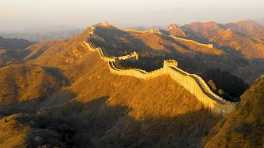
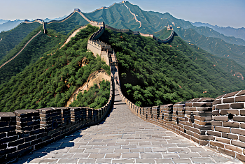

# 八达岭长城 ✨

## 🏔️ 开篇：万里长城的代名词

"不到长城非好汉"——对于绝大多数中国人来说，这句话中的长城，指的就是八达岭。作为万里长城中最早开放、最著名、保存最完好的段落，八达岭长城早已成为中华文明的名片。

这条蜿蜒在燕山山脉脊梁上的灰色巨龙，自明代以来就默默守护着北京的北大门。站在海拔1015米的北八楼"好汉坡"上极目远眺，群山连绵，长城如龙游走，那一刻你会真正理解，为什么这条人工建造的军事防线，会成为整个民族的精神图腾。

1987年，八达岭长城作为中国长城的代表，被联合国教科文组织列入《世界遗产名录》。如今，每年有超过1000万的中外游客来到这里，在古老的城砖上，留下属于自己的"好汉"印记。

## 📜 历史与文化：两千年的守望

**春秋战国 长城起源**
八达岭地区修筑长城的历史可以追溯到战国时期的燕国。为了防御北方游牧民族的侵扰，燕国在此修筑了最早的防御工事。如今在八达岭的深山里，依然能找到战国长城的残垣断壁。

**明代 重建与辉煌**
今天我们看到的八达岭长城，是明代重建的。明朝建立后，为了防御蒙古残余势力，先后18次大规模修建长城。八达岭作为"居庸关外口"，是整个防御体系的核心，修建得异常坚固。

**1961年 国家文物保护单位**
新中国成立后，八达岭成为第一批全国重点文物保护单位。

**1972年 尼克松访华**
美国总统尼克松登上八达岭长城，留下了那句著名的评价："只有一个伟大的民族，才能造得出这样一座伟大的长城。"此后，四百多位国家元首和政府首脑相继登上八达岭，这里成为中国向世界展示中华文明的窗口。

## 🌟 核心景点详解

### 📍 日出八达岭：巨龙披金的震撼

这是只有早起的"好汉"才能看到的景象。当第一缕阳光越过燕山山脉，洒向蜿蜒起伏的长城时，整条巨龙仿佛被镀上了一层金色。灰色的城砖在朝阳下泛着温暖的光芒，与周围还沉在阴影中的山峦形成强烈对比。

**最佳观赏时机**：
- **夏季日出**：凌晨4:30-5:00，需在景区开门前就到达
- **秋季日落**：下午5:30-6:30，是拍摄长城日落的黄金时间
- **冬季雪后**：白雪覆盖下的长城，宛如一条白色巨龙，是摄影爱好者的最爱

**拍摄机位**：
北四楼到北六楼之间的这段城墙，是拍摄长城蜿蜒全景的最佳位置。摄影师常说："在八达岭，永远是下一个烽火台的风景更美。"

> 💡 **导游贴士**：
> 想看日出的话，可以前一天住在八达岭镇的民宿，第二天一早坐头班索道上山。虽然辛苦，但当你看到金色阳光洒满长城的那一刻，一切都值得。

---

### 📍 好汉坡：第一视角的震撼

这张照片完美还原了每一个攀登者亲身经历的感受——抬头望去，长城步道如天梯一般陡峭地向上延伸，消失在远处的山峦之巅。脚下的每一块城砖都被六百年的岁月和千万人的脚步磨得光滑发亮。

**你不知道的数字**：
- **坡度**：最陡的地方接近45度，台阶高约40厘米，需要手脚并用才能爬上去
- **距离**：从关城到北八楼（好汉坡）单程约1200米，海拔上升400米
- **城砖**：每块城砖重约15公斤，全部由人力背上山，砖上还能看到当年制砖工匠的名字

**真实体验**：
很多人爬到北四楼就已经气喘吁吁，决定放弃。但当你咬着牙继续向上，终于站在北八楼的"好汉碑"前，回望走过的路时，那种成就感是无法用语言形容的。这大概就是"不到长城非好汉"这句话真正的含义——它说的不是你到了某个地方，而是你克服了自己的极限。

> 💡 **爬山技巧**：
> 不要走太快，保持匀速呼吸。"之"字形走路可以省力，扶着外侧的城墙比扶内侧的栏杆更安全。穿防滑的运动鞋，不要穿新鞋——磨脚是爬长城最大的敌人。

---

### 📍 南楼与北楼：两条不同的路线

八达岭长城分为南线和北线两条游览路线：
- **北线（北一楼到北十二楼）**：风景更壮美，坡度更陡，著名的"好汉坡"就在北八楼，游客也更多
- **南线（南一楼到南七楼）**：相对平缓，游客较少，适合喜欢安静的人，最高处南四楼可以俯瞰整个关城

**推荐路线**：
北索道上 → 北八楼（好汉坡）→ 北十一楼（人少景美）→ 步行下山 → 南城 → 关城 → 出口

全程约4小时，既能打卡经典景点，又能避开人潮，体验感最佳。

---

## 🎯 游览实用指南

### 🚇 交通指南
- **高铁**：清河站/北京北站 → 八达岭长城站，车程20分钟，出站即到景区（最推荐！）
- **公交**：德胜门坐877路公交，直达景区前山，车程约1.5小时，12元
- **自驾**：京藏高速八达岭出口，停车场充足，10元/次
- **旅游专线**：前门、天安门东有旅游专线，但不如高铁快捷

### 🎫 门票信息（2025年参考）
- **旺季（4-10月）**：40元
- **淡季（11-3月）**：35元
- **索道**：单程80元，往返140元
- **缆车**：单程100元，往返180元（直达北七楼，离好汉坡最近）
- **预约**：提前7天在"八达岭长城"公众号预约，节假日务必提前预约！

### ⏰ 开放时间
- **旺季**：6:30-16:30
- **淡季**：7:30-16:00
- **建议游览时长**：3-5小时（含来回交通需一整天）

### ⚠️ 避坑指南（非常重要！）
1. ❌ 不要相信路边的"一日游"小广告，很多是黑导游
2. ❌ 877路公交车只在德胜门发车，其他地方都是假的
3. ✅ 高铁是最靠谱、最快的交通方式
4. ✅ 景区内物价较高，建议自带水和食物
5. ❌ 下山不要坐黑车，要么步行，要么坐景区正规接驳车

### 🍜 餐饮服务
- **八达岭饭店**：景区内的国营餐厅，价格合理，口味一般
- **南楼小吃城**：有庆丰包子铺等连锁小吃
- **八达岭镇**：景区外有很多农家院，推荐尝尝延庆特色的柳沟豆腐宴

## 💫 结语：我们为什么要爬长城

长城不是一座纪念碑，也不是一个符号。它是千千万万个普通人，用双手、用汗水、甚至用生命垒起来的防线。

站在长城上，摸着那些被岁月磨平的城砖，你似乎能感受到六百年前那些修城人的温度——他们可能是被征发来的农民，可能是守边的士兵，可能和你我一样，只是想好好活着的普通人。

但正是这些普通人，用自己的一生，筑起了这条横亘万里、跨越千年的巨龙。

所以，去爬一次长城吧。不是为了在"好汉碑"前拍一张打卡照，而是为了亲自走一走那些被无数人走过的台阶，摸一摸那些被风雨侵蚀的城砖，真正感受一下——什么是中华民族的脊梁。

> 📌 **旅行感悟**：
> 长城最震撼人的，从来不是它的宏伟，而是它的真实。每一块砖上的刻痕，每一个被磨平的台阶，每一道城墙的裂缝，都在告诉你：这条巨龙，是活生生的历史。

---

*本页内容基于实景图片分析与历史资料整理，由AI导游系统2025年6月生成*
