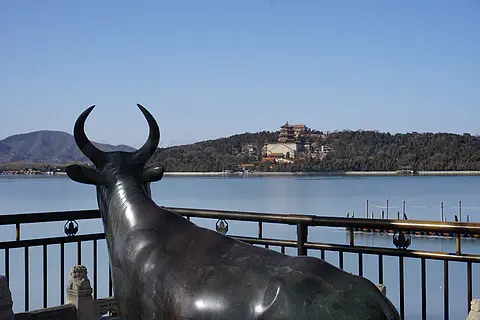

# 颐和园 ✨

## 🌅 开篇：中国皇家园林的巅峰

在北京的西北郊，有一座被称为"皇家园林博物馆"的杰作。它不是一座普通的公园，而是中国几千年造园艺术的集大成者——颐和园。

这座占地300公顷的巨型园林，以昆明湖、万寿山为基址，以杭州西湖为蓝本，汲取了江南园林的设计手法，同时保留了北方皇家园林的宏大气魄。在这里，你可以看到苏州街的江南水乡韵味，可以看到佛香阁的皇家气派，可以看到长廊的精美彩绘，也可以看到十七孔桥的长虹卧波。

1998年，颐和园被联合国教科文组织列入《世界遗产名录》，评语写道："颐和园是中国风景造园艺术的杰出典范，人与自然和谐共生的完美诠释。"

## 📜 历史与沧桑：一座园林的百年沉浮

**1750年 清漪园时期**
乾隆皇帝为庆祝母亲孝圣宪皇后六十大寿，下令在瓮山修建"清漪园"，也就是颐和园的前身。这座园林先后修建了15年，耗银480万两，成为"三山五园"中最璀璨的一颗明珠。

**1860年 第一次劫难**
第二次鸦片战争期间，英法联军火烧圆明园，清漪园也未能幸免，大部分建筑被焚毁。

**1888年 重建与更名**
慈禧太后挪用海军经费3000万两白银重建清漪园，并更名为"颐和园"，作为她颐养天年的夏宫。

**1900年 第二次劫难**
八国联军入侵北京，颐和园再次遭到洗劫和破坏。1902年慈禧再次下令修复。

**1924年 对外开放**
溥仪被逐出紫禁城后，颐和园正式对外开放，普通百姓第一次得以进入这座昔日的皇家禁地。

如今的颐和园，不仅是一座公园，更是一部浓缩的中国近代史。

## 🌟 核心景点详解

### 📍 铜牛与佛香阁：跨越时空的对望

这是颐和园最经典的构图之一。站在昆明湖东岸的铜牛旁，向西望去，万寿山、佛香阁、昆明湖完美地融为一体。这座铸造于乾隆二十年（1755年）的铜牛，已经在这里静静守望了270年。

**铜牛的秘密**：
- **造型**：仿大禹治水铸铁牛镇压水患的典故，用于"永镇悠水"
- **工艺**：采用中国传统的失蜡法铸造，通体中空，表面呈古铜色
- **金牛尾**：据说铜牛的尾巴是纯金的，后来被八国联军盗走，现在看到的是后来补铸的
- **乾隆铭文**：铜牛背上刻有乾隆皇帝御笔的《金牛铭》

**为什么这个角度最美**：
佛香阁正好位于万寿山的黄金分割点上，铜牛、南湖岛、佛香阁三点一线。蓝天、碧水、青山、古建完美融合，这就是中国传统造园艺术"借景"手法的最高境界。

> 💡 **拍照技巧**：
> 下午3-4点是这个机位的最佳拍摄时间，阳光从西南方向照来，佛香阁被镀上一层金色，铜牛的剪影效果也最好。记得用广角镜头，才能完整拍下这个经典画面。

---

### 📍 昆明湖日落：水天一线的绝美

这是颐和园最震撼人心的时刻——当夕阳西下，漫天彩霞倒映在平静如镜的昆明湖上，你会分不清哪里是天，哪里是水。佛香阁的剪影在水天之间矗立，仿佛一幅流动的中国山水画。

**最佳观赏时间**：
- **春秋季日落**：傍晚5:30-6:30，是拍摄晚霞倒影的黄金时间
- **夏季雨后**：空气通透，云彩层次丰富，容易出大片
- **冬季雪后**：雪后初晴的颐和园，红墙白雪，是北京最美的雪景之一

**拍摄机位**：
西堤是拍日落的最佳位置。从豳风桥到柳桥之间的这段路，每一步都是不同的风景。摄影爱好者常说："颐和园的日落，每一分钟都不一样。"

> 💡 **导游贴士**：
> 想拍日落的话，一定要提前1小时到达机位。日落前的"蓝调时刻"（日落后20分钟）比日落本身更美——天空会呈现出深邃的蓝色，与暖色调的晚霞形成强烈对比，这是出大片的最佳时机。

---

### 📍 长廊：世界最长的画廊

颐和园长廊全长728米，共273间，是世界上最长的画廊。廊上绘有14000余幅彩画，内容包括山水、花鸟、人物、历史故事。

**你不知道的长廊**：
- **1990年**：被列入《吉尼斯世界纪录》
- **四亭**：留佳、寄澜、秋水、清遥，象征春夏秋冬四季
- **彩画故事**：《三国演义》《西游记》《红楼梦》《水浒传》中的经典场景都能在长廊里找到
- **1860年**：长廊被英法联军烧毁，1888年重建时，画师们参考了乾隆时期的底稿，重新绘制了所有彩画

漫步长廊，抬头看画，低头赏荷，侧耳听风，这就是属于颐和园的慢时光。

---

## 🎯 游览实用指南

### 🚇 交通指南
- **地铁**：4号线北宫门站A口出，步行200米即到北宫门（最推荐！）
- **公交**：331、332、346、508、579、584路颐和园站
- **自驾**：颐和园停车场车位紧张，建议公共交通出行

### 🎫 门票信息（2025年参考）
- **旺季（4-10月）**：30元
- **淡季（11-3月）**：20元
- **联票**：旺季60元，淡季50元（含德和园、佛香阁、苏州街、文昌院）
- **佛香阁**：10元（强烈建议登阁，俯瞰整个昆明湖）
- **预约**：提前7天在"颐和园"公众号预约

### ⏰ 开放时间
- **旺季**：6:30-18:00（17:00停止入园）
- **淡季**：7:00-17:00（16:00停止入园）
- **建议游览时长**：4-6小时，深度游需要一整天

### 🗺️ 经典游览路线

**精华半日游（4小时）**：
北宫门 → 苏州街 → 四大部洲 → 佛香阁 → 排云殿 → 长廊 → 石舫 → 乘船到南湖岛 → 十七孔桥 → 铜牛 → 新建宫门出

**深度一日游（6小时）**：
在精华路线基础上增加：
- 谐趣园（颐和园中的"小江南"）
- 德和园（看慈禧大戏楼）
- 西堤（人少景美，适合拍照散步）

### 🍜 餐饮服务
- **听鹂馆**：颐和园里的宫廷菜餐厅，曾经是慈禧看戏的地方，价格较高
- **颐和园内小卖部**：有泡面、烤肠、矿泉水，价格比外面贵
- **西苑/龙湖星悦荟**：园区外有各种餐厅，建议出园后用餐

## 💫 结语：一座可以走进去的中国山水画

很多人说，颐和园去一次就够了。但真正懂颐和园的人知道，这座园林是永远看不完的。

春天，西堤的山桃花开了，整个昆明湖被粉色的花海环绕；夏天，荷花满池，长廊下清风徐来；秋天，桂花飘香，万寿山的秋叶层林尽染；冬天，雪落昆明湖，整个世界安静得只剩下风声。

每一次去，都是不同的风景。

这就是颐和园的魅力。它不是一堆冷冰冰的古建筑，而是一座有生命、有温度、有故事的园林。走在这里，你会突然理解，什么叫"虽由人作，宛自天开"。

> 📌 **旅行感悟**：
> 270年过去了，乾隆皇帝、慈禧太后、光绪皇帝都已经成为历史。但昆明湖的水还在流，佛香阁的风铃还在响，长廊的彩画还在诉说着那些古老的故事。
>
> 原来，真正不朽的，从来不是权力，而是美。

---

*本页内容基于实景图片分析与历史资料整理，由AI导游系统2025年6月生成*
