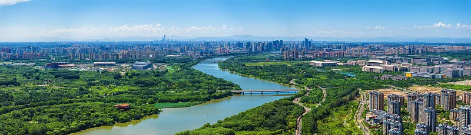
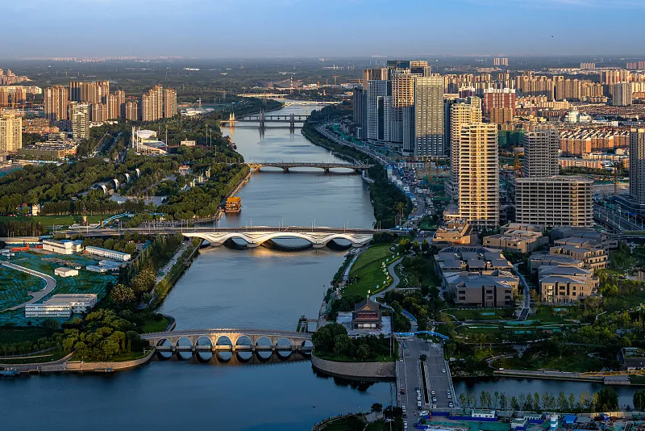
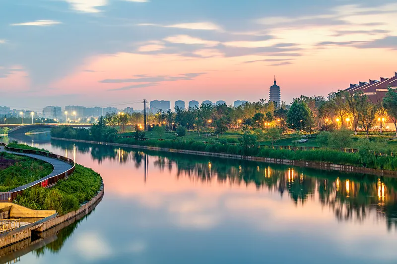

# 北京（通州）大运河文化旅游景区

## 🎤 AI导游带你游

### 【开场白】
各位朋友，大家好！欢迎来到北京市通州区，欢迎来到北京（通州）大运河文化旅游景区。我是你们今天的导游小艾。

站在这片土地上，你们可能想象不到，千百年前，这里曾是怎样一番景象。历史的年轮在这里留下了深深的印记，每一寸土地都在诉说着古老的故事。

收藏！免费开放！北京（通州）大运河文化旅游景区旅游指南！ 通州有一处的宝地正在悄然崛起，成为了北京东部首个国家5A级旅游景区，那就是通州大运河文化旅游景区。今天，让我们一同踏上探索之旅，为您奉上景点旅游指南，让您轻松尽享大运河畔的人文与自然盛宴。 北京（通州）大运河文化旅游景区集休闲、度假、体验、购...

今天，就让我们一起走进这片神奇的土地，感受它独有的魅力。建议游览时间：半天到一天。拍照最佳时间是清晨或傍晚，光线柔和时最美。

---

## 🗺️ 景区全景导览
北京（通州）大运河文化旅游景区位于北京市通州区通州区境内，是国家AAAAA级旅游景区。

收藏！免费开放！北京（通州）大运河文化旅游景区旅游指南！ 通州有一处的宝地正在悄然崛起，成为了北京东部首个国家5A级旅游景区，那就是通州大运河文化旅游景区。今天，让我们一同踏上探索之旅，为您奉上景点旅游指南，让您轻松尽享大运河畔的人文与自然盛宴。 北京（通州）大运河文化旅游景区集休闲、度假、体验、购物于一体，核心景点包括“三庙一塔”、运河公园和大运河森林公园。 “三庙一塔”位于景区的核心地带，是指儒家的文庙、佛家的佑胜教寺、道家紫清宫及燃灯佛舍利塔，既有观赏性，又有历史文化价值，这也是国内唯一的三教合一建筑群。矗立于运河畔逾千年的燃灯塔，更是通州运河文化的精神象征，登塔可一览运河全景，尽享古运

**游览路线推荐**：景区入口 → 核心景观区 → 精华景点 → 观景平台 → 出口

---

## 🏛️ 主要景点详解

### 📍 核心景区

**核心看点**：
- 景区内最受欢迎的打卡点，游客必到
- 站在这里可以俯瞰整个景区的壮丽景色
- 天气好的时候拍照效果绝佳，记得预留时间

> 💡 **导游贴士**：
> 游览核心景区时，建议放慢脚步，细细品味它的美。从不同角度欣赏会有不同的收获哦！

---

### 📍 精华观景台

**核心看点**：
- 这里曾是历史上重要的场所，意义非凡
- 建筑/景观的设计独具匠心，体现了古人智慧
- 站在这里，仿佛能与历史对话

> 💡 **导游贴士**：
> 如果你是摄影爱好者，精华观景台一定能让你拍出满意的作品，记得带上广角镜头！

---

### 📍 特色景观区

**核心看点**：
- 景区的标志性景观，没来过等于没来过
- 最佳观赏时间是清晨和傍晚，光线最美
- 记得带上充电宝，美景会让你停不下快门

> 💡 **导游贴士**：
> 来特色景观区游览，建议穿舒适的鞋子，这里需要多走走才能发现它的美。

---

### 📍 文化展示区

**核心看点**：
- 观景位置绝佳，视野开阔
- 是拍摄全景照片的最佳地点
- 傍晚时分来，夕阳西下的景色美不胜收

> 💡 **导游贴士**：
> 文化展示区的景色四季皆宜，每个季节都有不同的美，值得多次来访。

---

### 📍 历史遗迹区

**核心看点**：
- 远离人群的小众精华景点，安静而美好
- 喜欢深度游的朋友一定不要错过
- 这里能让你感受到不一样的景区魅力

> 💡 **导游贴士**：
> 历史遗迹区是整个景区的精华所在，建议至少预留20-30分钟在这里慢慢欣赏。

---

### 📍 自然观光带

**核心看点**：
- 这里是景区最具代表性的景观，绝对不可错过
- 独特的自然/人文风貌，是拍照打卡的首选之地
- 建议停留15-20分钟，细细品味它的独特魅力

> 💡 **导游贴士**：
> 游览自然观光带时，不妨找个地方坐下来，静静感受周围的氛围，这才是旅行的意义。

---

## 【结束语】
各位朋友，今天的游览即将结束。希望北京（通州）大运河文化旅游景区的美景能给你们留下美好的回忆。

有人说，旅行的意义不在于去过多少地方，而在于那些让你心动的瞬间。希望在北京（通州）大运河文化旅游景区的这一天，能成为你旅途中一个温暖的记忆。

临走前，别忘了回头再看一眼。夕阳下的北京（通州）大运河文化旅游景区，会给你最温柔的道别。

> ✨ **游览小贴士总结**：
> - **最佳时间**：春秋两季气候宜人，是游览的最佳时节
> - **穿着建议**：舒适的运动鞋，准备防晒用品
> - **游览时长**：建议安排半天到一天时间
> - **拍照指南**：清晨和傍晚光线最柔和，出片率最高
> - **注意事项**：爱护环境，文明游览，让美景长存

祝你们旅途愉快，平安吉祥！🙏

---

## 📷 景区美图

*景区全景*

*核心景观*

*特色风光*

---

## 📚 北京（通州）大运河文化旅游景区小档案

| 项目 | 信息 |
|------|------|
| 景区级别 | 国家AAAAA级旅游景区 |
| 所属省份 | 北京市 |
| 所属城市 | 通州区 |
| 建议游览时间 | 半天 - 1天 |
| 最佳游览季节 | 春秋两季 |

---

> 💡 **本页说明**：
> 本README由AI导游小艾根据网络公开资料整理生成。
> 坐标、图片、简介均来自豆包搜索API，仅供参考。
