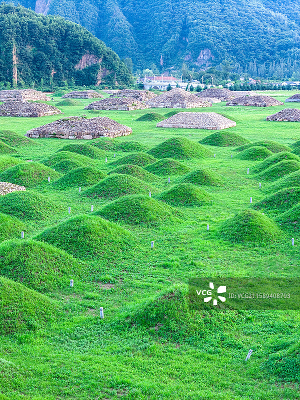
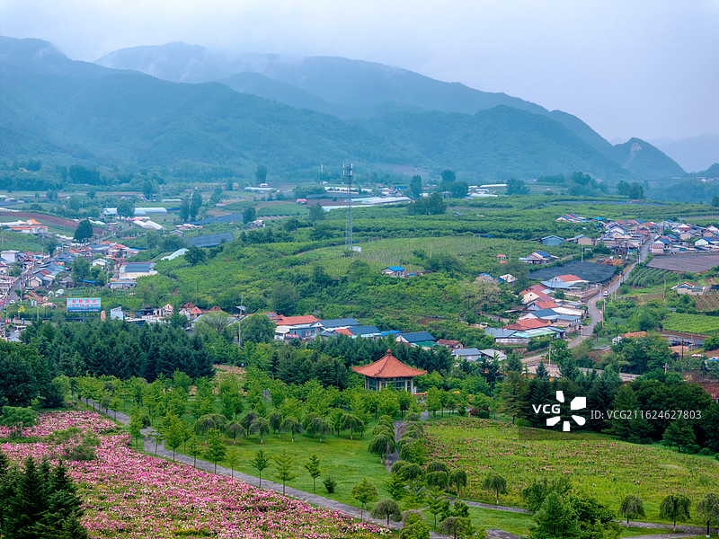
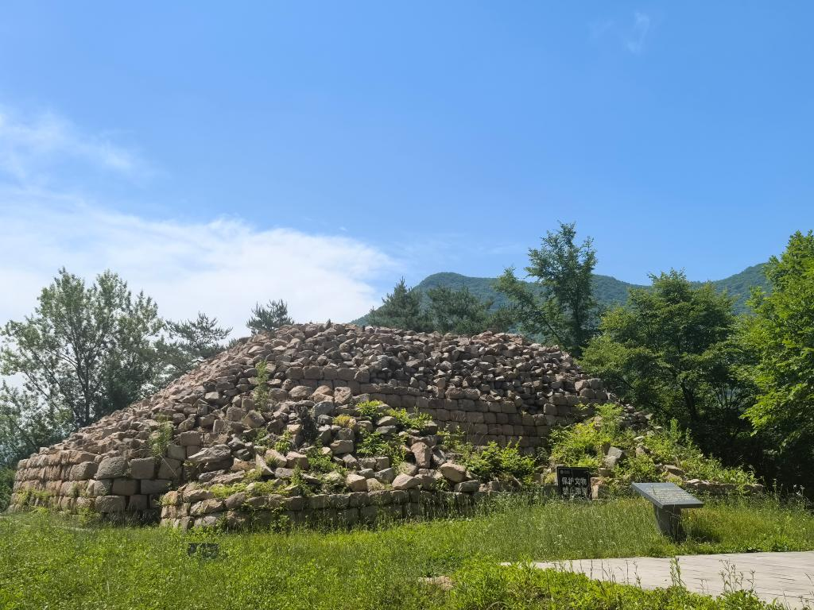
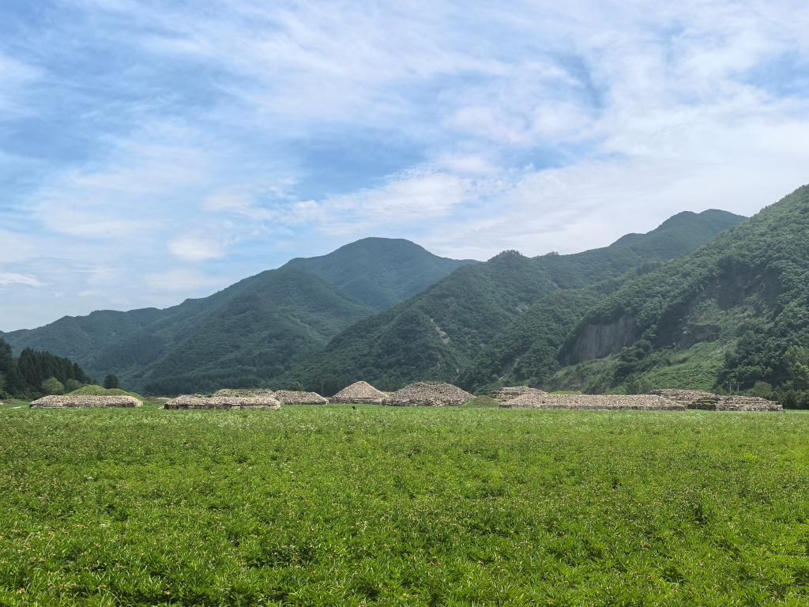
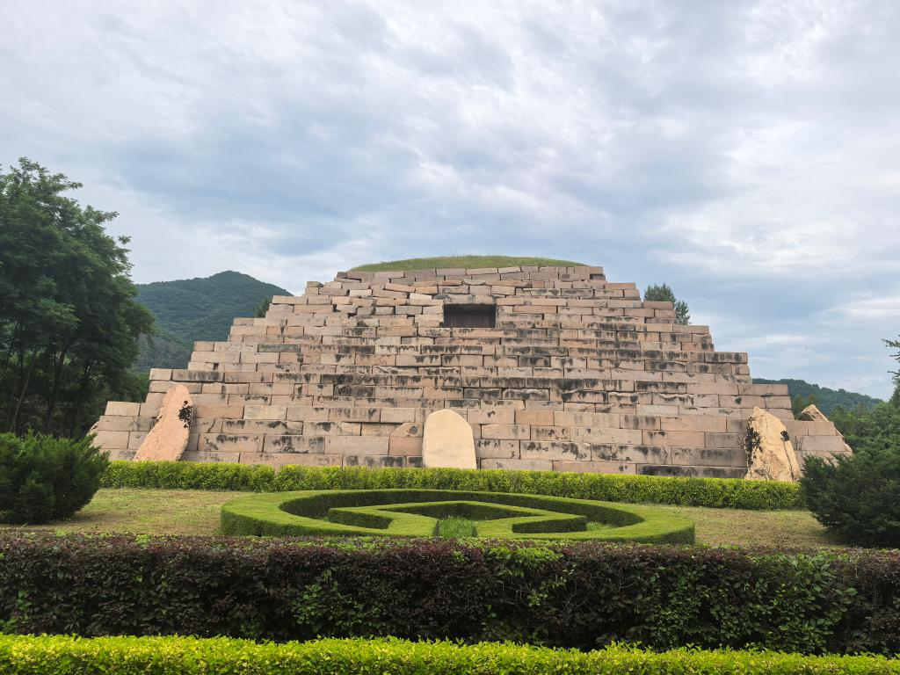
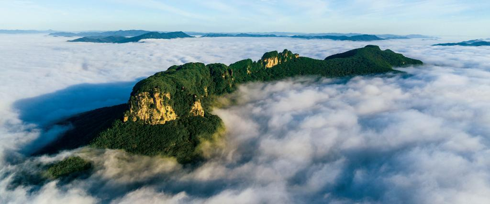

# 高句丽文物古迹旅游景区

## 🎤 AI导游带你游

### 【开场白】
各位朋友，大家好！欢迎来到吉林省通化市，欢迎来到高句丽文物古迹旅游景区。我是你们今天的导游小艾。

站在这片土地上，你们可能想象不到，千百年前，这里曾是怎样一番景象。历史的年轮在这里留下了深深的印记，每一寸土地都在诉说着古老的故事。

通化景点深度攻略：集安高句丽遗址与龙湾群的完整打卡地图 通化拥有世界文化遗产高句丽遗址和壮观的龙湾火山湖群两大核心旅游资源。集安高句丽遗址记录了一个存续705年的东北亚古王国的辉煌文明，龙湾群则是中国密度最大的火山湖群。本文将为您深度解析通化各大景点的游览路线和打卡要点，确保您不错过任何一处精彩。 ...

今天，就让我们一起走进这片神奇的土地，感受它独有的魅力。建议游览时间：半天到一天。拍照最佳时间是清晨或傍晚，光线柔和时最美。

---

## 🗺️ 景区全景导览
高句丽文物古迹旅游景区位于吉林省通化市集安市境内，是国家AAAAA级旅游景区。

通化景点深度攻略：集安高句丽遗址与龙湾群的完整打卡地图 通化拥有世界文化遗产高句丽遗址和壮观的龙湾火山湖群两大核心旅游资源。集安高句丽遗址记录了一个存续705年的东北亚古王国的辉煌文明，龙湾群则是中国密度最大的火山湖群。本文将为您深度解析通化各大景点的游览路线和打卡要点，确保您不错过任何一处精彩。 一、各景点最佳游览时间 集安高句丽遗址全年开放，但5-10月最佳。其中9-10月天气凉爽、秋色怡人，是最舒适的游览季节。将军坟和好太王碑为户外遗址，夏季需注意防晒。丸都山城建议上午游览，光线适合拍摄全景。室内壁画墓（五盔坟）全年可参观，但湿度较大时可能暂停开放以保护壁画。三角龙湾6-9月湖水碧绿如翡

**游览路线推荐**：景区入口 → 核心景观区 → 精华景点 → 观景平台 → 出口

---

## 🏛️ 主要景点详解

### 📍 核心景区

**核心看点**：
- 自然风光与人文景观完美融合的典范
- 四季景致各异，无论何时来都有惊喜
- 摄影爱好者的天堂，随手一拍都是大片

> 💡 **导游贴士**：
> 游览核心景区时，建议放慢脚步，细细品味它的美。从不同角度欣赏会有不同的收获哦！

---

### 📍 精华观景台

**核心看点**：
- 这里承载着景区最深厚的历史文化底蕴
- 每一处细节都诉说着动人的故事
- 建议跟随讲解员深入了解背后的历史

> 💡 **导游贴士**：
> 想要深度了解精华观景台，可以提前做些功课，了解它的历史背景，游览时会更有感触。

---

### 📍 特色景观区

**核心看点**：
- 景区内最受欢迎的打卡点，游客必到
- 站在这里可以俯瞰整个景区的壮丽景色
- 天气好的时候拍照效果绝佳，记得预留时间

> 💡 **导游贴士**：
> 特色景观区最适合拍照的时间是清晨和傍晚，光线柔和，人也相对较少。

---

### 📍 文化展示区

**核心看点**：
- 这里是景区最具代表性的景观，绝对不可错过
- 独特的自然/人文风貌，是拍照打卡的首选之地
- 建议停留15-20分钟，细细品味它的独特魅力

> 💡 **导游贴士**：
> 文化展示区的景色四季皆宜，每个季节都有不同的美，值得多次来访。

---

### 📍 历史遗迹区

**核心看点**：
- 这里曾是历史上重要的场所，意义非凡
- 建筑/景观的设计独具匠心，体现了古人智慧
- 站在这里，仿佛能与历史对话

> 💡 **导游贴士**：
> 历史遗迹区是整个景区的精华所在，建议至少预留20-30分钟在这里慢慢欣赏。

---

### 📍 自然观光带

**核心看点**：
- 远离人群的小众精华景点，安静而美好
- 喜欢深度游的朋友一定不要错过
- 这里能让你感受到不一样的景区魅力

> 💡 **导游贴士**：
> 在自然观光带游览时，注意爱护环境，让这份美能够长久留存。

---

## 【结束语】
各位朋友，今天的游览即将结束。希望高句丽文物古迹旅游景区的美景能给你们留下美好的回忆。

有人说，旅行的意义不在于去过多少地方，而在于那些让你心动的瞬间。希望在高句丽文物古迹旅游景区的这一天，能成为你旅途中一个温暖的记忆。

临走前，别忘了回头再看一眼。夕阳下的高句丽文物古迹旅游景区，会给你最温柔的道别。

> ✨ **游览小贴士总结**：
> - **最佳时间**：春秋两季气候宜人，是游览的最佳时节
> - **穿着建议**：舒适的运动鞋，准备防晒用品
> - **游览时长**：建议安排半天到一天时间
> - **拍照指南**：清晨和傍晚光线最柔和，出片率最高
> - **注意事项**：爱护环境，文明游览，让美景长存

祝你们旅途愉快，平安吉祥！🙏

---

## 📷 景区美图

*景区全景*

*核心景观*

*特色风光*

*细节之美*

*四季风光*

*人文景观*

---

## 📚 高句丽文物古迹旅游景区小档案

| 项目 | 信息 |
|------|------|
| 景区级别 | 国家AAAAA级旅游景区 |
| 所属省份 | 吉林省 |
| 所属城市 | 通化市 |
| 建议游览时间 | 半天 - 1天 |
| 最佳游览季节 | 春秋两季 |

---

> 💡 **本页说明**：
> 本README由AI导游小艾根据网络公开资料整理生成。
> 坐标、图片、简介均来自豆包搜索API，仅供参考。
