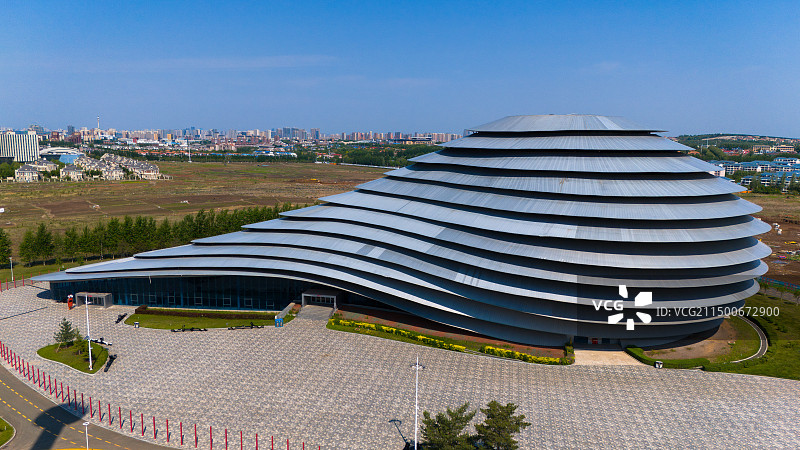
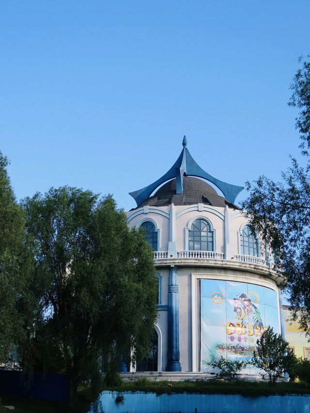

# 长影世纪城旅游区

## 🎤 AI导游带你游

### 【开场白】
各位朋友，大家好！欢迎来到吉林省长春市，欢迎来到长影世纪城旅游区。我是你们今天的导游小艾。

站在这片土地上，你们可能想象不到，千百年前，这里曾是怎样一番景象。历史的年轮在这里留下了深深的印记，每一寸土地都在诉说着古老的故事。

长影世纪城 5A 󰺂7.1 4.1/5 吉林夜游必打卡景点榜 No.2 地址 长春市净月国家高新技术产业开发区净月大街与永顺路交叉口西北侧 开放时间 未开园；今天09:30-17:00开放（16:00停止入园） 官方电话 票务咨询：0431-84550888 介绍 长影世纪城位于吉林省长春市净月高...

今天，就让我们一起走进这片神奇的土地，感受它独有的魅力。建议游览时间：半天到一天。拍照最佳时间是清晨或傍晚，光线柔和时最美。

---

## 🗺️ 景区全景导览
长影世纪城旅游区位于吉林省长春市南关区境内，是国家AAAAA级旅游景区。

长影世纪城 5A 󰺂7.1 4.1/5 吉林夜游必打卡景点榜 No.2 地址 长春市净月国家高新技术产业开发区净月大街与永顺路交叉口西北侧 开放时间 未开园；今天09:30-17:00开放（16:00停止入园） 官方电话 票务咨询：0431-84550888 介绍 长影世纪城位于吉林省长春市净月高新技术产业开发区，是电影主题公园。 长影世纪城娱乐项目分为创新科技、惊险刺激、体验演艺、游艺欣赏四大板块。节目科技含量高、体验性强、互动性强。园区内拥有动感技术与球幕技术结合的“长影世纪城-星际探险“，正交多幕特种影院”空间迷城“，3D《巨幕影院》及4D影院”非常实验室“。4D影片《非常实验室》长影

**游览路线推荐**：景区入口 → 核心景观区 → 精华景点 → 观景平台 → 出口

---

## 🏛️ 主要景点详解

### 📍 核心景区

**核心看点**：
- 这里承载着景区最深厚的历史文化底蕴
- 每一处细节都诉说着动人的故事
- 建议跟随讲解员深入了解背后的历史

> 💡 **导游贴士**：
> 核心景区的景色四季皆宜，每个季节都有不同的美，值得多次来访。

---

### 📍 精华观景台

**核心看点**：
- 自然风光与人文景观完美融合的典范
- 四季景致各异，无论何时来都有惊喜
- 摄影爱好者的天堂，随手一拍都是大片

> 💡 **导游贴士**：
> 游览精华观景台时，建议放慢脚步，细细品味它的美。从不同角度欣赏会有不同的收获哦！

---

### 📍 特色景观区

**核心看点**：
- 景区内最受欢迎的打卡点，游客必到
- 站在这里可以俯瞰整个景区的壮丽景色
- 天气好的时候拍照效果绝佳，记得预留时间

> 💡 **导游贴士**：
> 特色景观区是整个景区的精华所在，建议至少预留20-30分钟在这里慢慢欣赏。

---

### 📍 文化展示区

**核心看点**：
- 景区的标志性景观，没来过等于没来过
- 最佳观赏时间是清晨和傍晚，光线最美
- 记得带上充电宝，美景会让你停不下快门

> 💡 **导游贴士**：
> 文化展示区最适合拍照的时间是清晨和傍晚，光线柔和，人也相对较少。

---

### 📍 历史遗迹区

**核心看点**：
- 这里曾是历史上重要的场所，意义非凡
- 建筑/景观的设计独具匠心，体现了古人智慧
- 站在这里，仿佛能与历史对话

> 💡 **导游贴士**：
> 如果你是摄影爱好者，历史遗迹区一定能让你拍出满意的作品，记得带上广角镜头！

---

### 📍 自然观光带

**核心看点**：
- 这里是景区最具代表性的景观，绝对不可错过
- 独特的自然/人文风貌，是拍照打卡的首选之地
- 建议停留15-20分钟，细细品味它的独特魅力

> 💡 **导游贴士**：
> 游览自然观光带时，不妨找个地方坐下来，静静感受周围的氛围，这才是旅行的意义。

---

## 【结束语】
各位朋友，今天的游览即将结束。希望长影世纪城旅游区的美景能给你们留下美好的回忆。

有人说，旅行的意义不在于去过多少地方，而在于那些让你心动的瞬间。希望在长影世纪城旅游区的这一天，能成为你旅途中一个温暖的记忆。

临走前，别忘了回头再看一眼。夕阳下的长影世纪城旅游区，会给你最温柔的道别。

> ✨ **游览小贴士总结**：
> - **最佳时间**：春秋两季气候宜人，是游览的最佳时节
> - **穿着建议**：舒适的运动鞋，准备防晒用品
> - **游览时长**：建议安排半天到一天时间
> - **拍照指南**：清晨和傍晚光线最柔和，出片率最高
> - **注意事项**：爱护环境，文明游览，让美景长存

祝你们旅途愉快，平安吉祥！🙏

---

## 📷 景区美图

*景区全景*

*核心景观*

*特色风光*

---

## 📚 长影世纪城旅游区小档案

| 项目 | 信息 |
|------|------|
| 景区级别 | 国家AAAAA级旅游景区 |
| 所属省份 | 吉林省 |
| 所属城市 | 长春市 |
| 建议游览时间 | 半天 - 1天 |
| 最佳游览季节 | 春秋两季 |

---

> 💡 **本页说明**：
> 本README由AI导游小艾根据网络公开资料整理生成。
> 坐标、图片、简介均来自豆包搜索API，仅供参考。
