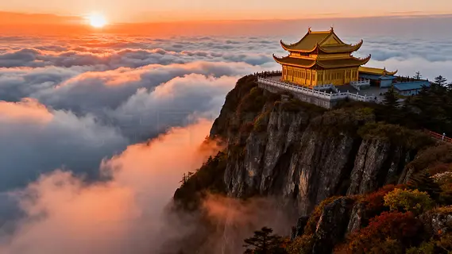
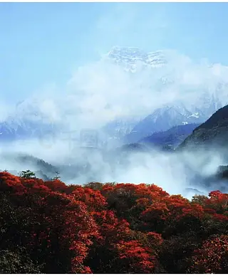
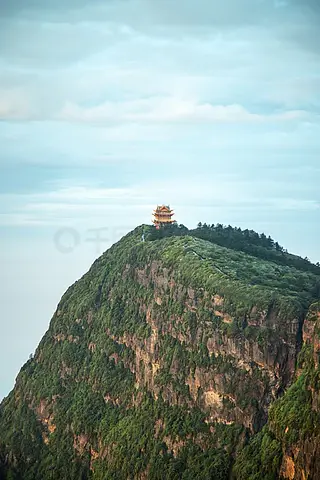
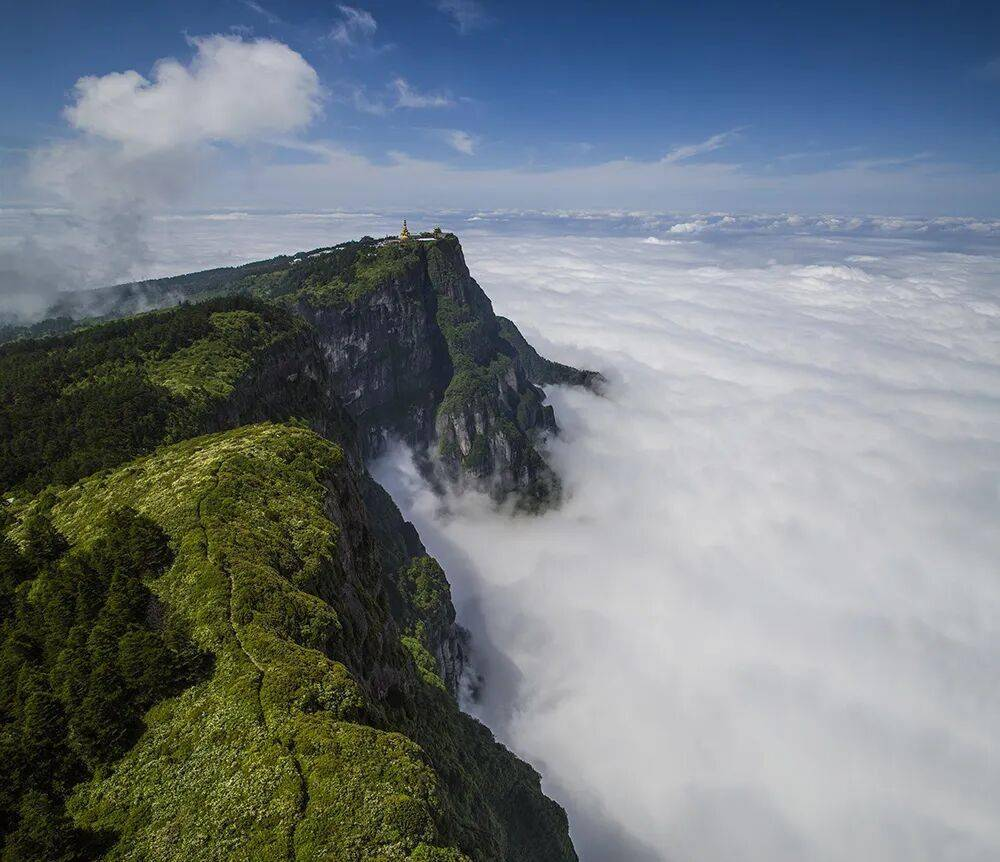

# 峨眉山 ✨

## 🌄 开篇：蜀国多仙山，峨眉邈难匹

李白说："蜀国多仙山，峨眉邈难匹。"

在四川的所有山里，峨眉山是最特别的那一个。

它不是最高的，也不是最险的。但它是最"秀"的。从海拔500米的山脚，到海拔3099米的金顶，2600米的垂直落差，让这座山拥有了从亚热带到寒带的完整气候带。山脚是夏天，山腰是春天，山顶是冬天。同一天，你可以经历四个季节。

它是中国四大佛教名山之一。
它是普贤菩萨的道场。
它是世界文化与自然双重遗产。

公元一世纪，佛教沿着丝绸之路来到中国，第一站就是峨眉山。两千年来，晨钟暮鼓在这座山里从未停歇。从山脚到山顶，几十座寺庙散落在山林之间，红墙黄瓦，掩映在绿树白云之中。

站在金顶看着脚下翻涌的云海，看着十方普贤菩萨在阳光下闪着金光，你会突然明白：为什么一千年前，人们会相信这里是离天最近的地方。

## 📜 两千年的佛教名山

**公元1世纪 佛教初传**
西域高僧蒲公在峨眉山采药，看见一头长着六根象牙的白象，向着山顶走去。他追上去，却只看到了普贤菩萨的佛光。从此，峨眉山成为了普贤菩萨的道场。

这是一个传说。但真实的历史是，峨眉山确实是中国佛教最早传入的地方之一。公元1世纪，第一座寺庙就在这里建起了。

**唐代 鼎盛时期**
唐代是峨眉山的黄金时代。李白、杜甫都来过这里。李白写下了"蜀国多仙山，峨眉邈难匹"的千古名句。峨眉山成为了整个西南地区的佛教中心。

**明清 佛教中兴**
明清两代，峨眉山的寺庙达到了上百座。十方丛林，香火鼎盛。每天都有成千上万的信徒，从四川、云南、贵州，甚至西藏，一步一拜地登上金顶。

**1996年 双重遗产**
峨眉山被列入《世界文化与自然双重遗产名录》。联合国教科文组织说："峨眉山是佛教文化与自然景观完美结合的杰出典范。"

---

## 🌟 核心景观详解

### 📍 金顶：离天三尺三

这就是峨眉山的灵魂——金顶。

海拔3079米，是峨眉山的第二高峰。站在这里，脚下是云海，头顶是蓝天，往前一步，就是万丈深渊。

最震撼的是那尊十方普贤菩萨像。高48米，重660吨，通体鎏金。太阳一照，金光万丈，几十公里外都能看到。

很多人第一次站在金顶，看着这尊佛像，都会突然流泪。

不是因为信仰。是因为那种震撼。你站在3000米的山顶，看着面前这尊巨大的佛像，看着脚下翻涌的云海，你会突然觉得，人类好渺小，而有些东西，真的很伟大。

**金顶四大奇观**：
- **日出**：凌晨6点，云海之上，红日喷薄而出，那是峨眉山最壮观的时刻
- **云海**：脚下是一片白茫茫的海，山峰像小岛一样露在上面，风一吹，云在动，像仙境
- **佛光**：下午3-4点，太阳在你身后，你面前的云雾上会出现一个彩色的光环，光环里有你的影子，这就是佛光
- **圣灯**：没有月亮的夜晚，黑山谷里会出现一点一点的绿光，像万家灯火，传说那是普贤菩萨点亮的灯

**你不知道的金顶冷知识**：
- 十方普贤像的48米，代表阿弥陀佛的四十八愿
- 像有十个头，对着十个方向，所以叫"十方普贤"
- 金顶上的温度，比山脚低15度左右，夏天也要穿羽绒服

> 💡 **导游贴士**：
> 不要白天上金顶拍个照就走了。
> 在金顶住一晚。
> 晚上看星空，凌晨看日出，
> 那种整个山都是你的感觉，
> 是白天挤在人群里永远体会不到的。

---

### 📍 万年寺：深山里的千年古刹

万年寺是峨眉山最古老的寺庙，也是最有灵气的一座。

公元401年，印度高僧跋陀罗在这里建起了第一座寺庙。一千六百年了，火灾、地震、战争，这座庙毁了又建，建了又毁，但它一直都在。

最有名的是那座无梁砖殿。

整座殿没有一根木头，全是用砖砌成的。明朝万历皇帝为他的母亲祝寿，花了十年时间，建成了这座殿。殿里供奉着一尊普贤菩萨骑六牙白象的铜像，是北宋年间铸造的，重62吨，已经在那里坐了一千年了。

很多人来万年寺，不是为了旅游，是为了"还愿"。

据说万年寺的普贤菩萨特别灵。很多人年轻时来这里许了愿，后来愿望实现了，几年后、十几年后、甚至几十年后，专门回来还愿。

寺庙里有一棵千年的银杏树。

秋天的时候，满树金黄，叶子落下来，铺得满地都是。坐在树下，听着庙里的钟声，你会突然觉得，时间好像在这里停止了。

---

### 📍 清音阁：双桥清音

清音阁是峨眉山最秀气的地方。

两条溪水从山上流下来，在阁前汇合。一座石桥跨在两条溪上。溪水撞在石头上，发出清脆的声音，在山谷里回荡，像有人在弹琴。

所以叫"清音"。

这里是"双桥清音"，峨眉山十景之一。

很多人说，清音阁的水，是峨眉山的灵魂。你可以坐在溪边的石头上，什么都不想，就听着水流的声音，听一个下午。

那种安静，是你在城市里永远找不到的。

---

### 📍 洗象池：明月池中照

洗象池在峨眉山的半山腰，海拔2070米。

传说普贤菩萨骑象上山，在这里的池子里给象洗过澡，所以叫"洗象池"。

这是峨眉山看月亮最好的地方。

没有云的夜晚，一轮明月照在池子里，池水映着月亮，天上一个月亮，水里一个月亮。山里特别安静，只有偶尔的几声鸟鸣。

那个时候，你会突然明白，为什么古人说"月是故乡明"。

---

### 📍 峨眉山的猴子：山大王

峨眉山的猴子，是这座山真正的主人。

它们不怕人，它们会抢你的塑料袋，会拉开你的包包，会拿走你的零食。它们会坐在栏杆上，等着你投喂，就像在收过路费一样。

很多人被峨眉山的猴子吓到过。但其实，它们很聪明。你只要不拿塑料袋，不主动招惹它们，它们也不会理你。它们只是住在山里的居民而已。

**喂猴子的正确姿势**：
- 不要拿塑料袋，猴子看见塑料袋就会抢
- 不要用手喂，把食物放在地上，让它自己拿
- 不要和猴子对视，那是挑衅的意思
- 不要打猴子，它们会记仇，会叫同伴来一起揍你

> 💡 **真心话**：
> 被猴子抢过东西，才算真正来过峨眉山。
> 这是这座山给你的"见面礼"。

---

## 🙏 普贤菩萨的行愿

峨眉山是普贤菩萨的道场。

很多人不知道，普贤菩萨代表的是什么。

文殊菩萨代表智慧，观音菩萨代表慈悲，地藏菩萨代表愿力，而普贤菩萨，代表的是"行愿"——也就是实践，是行动，是把你知道的道理，真正地做出来。

所以峨眉山的朝圣，从来都不是坐车到金顶，拜一拜佛就完了。

真正的朝圣，是从山脚开始，一步一步，爬六十公里的山路，爬三天，爬到金顶。那个过程，就是"行愿"。

你爬过的每一级台阶，你流过的每一滴汗，你腿的酸痛，你气喘吁吁的呼吸——这些，才是朝圣本身。

佛在山顶。
但路，在脚下。

---

## 🎯 游览实用指南

### 🚗 交通指南

峨眉山的交通很方便。

**高铁**：
- **峨眉山站**：成都东站→峨眉山站，约1.5小时
- 出站后坐公交12路到报国寺，约20分钟，1元
- 打车约20元，10分钟

**飞机**：
- **成都双流机场**：然后坐高铁到峨眉山
- **乐山机场**：离峨眉山约30公里

**自驾**：
- 成都→峨眉山：约2小时
- 重庆→峨眉山：约3.5小时
- 车子可以开到零公里停车场，20元/天，然后坐景区车上山

**景区内交通**：
- 景区观光车：90元（全山段），往返各景点之间，必须买
- 金顶索道：上行65元，下行55元，建议买，不然爬死你
- 万年寺索道：上行65元，下行45元

### 🎫 门票信息（2025年参考）
- **旺季门票**：160元（1月16日-12月14日）
- **淡季门票**：110元（12月15日-1月15日）
- **半价票**：学生、60-64岁老人
- **免票**：65岁以上、军人、残疾人、记者、僧人
- **寺庙门票**：万年寺10元，报国寺8元，伏虎寺6元，都很便宜
- **预约**：关注"峨眉山"公众号预约，节假日提前约
- **门票有效期**：3天，可以多次进山，很良心

### ⏰ 最佳游览时间
- **夏季（6-8月）**：最佳！山脚35度，山顶只有15度，避暑圣地
- **秋季（10-11月）**：秋高气爽，看日出云海的概率最高
- **冬季（12-2月）**：雪景特别美，人最少，还可以滑雪
- **春季（3-5月）**：漫山遍野的杜鹃花，很美
- **建议游览时长**：2天1夜是标配，3天2夜最舒服

### 🗺️ 推荐路线

**经典两日游（最推荐）**：
- **第一天**：报国寺 → 清音阁 → 生态猴区 → 万年寺 → 洗象池 → 雷洞坪（住雷洞坪）
- **第二天**：凌晨5点起床 → 坐索道上金顶看日出 → 逛金顶 → 索道下山 → 返程

**懒人两日游**：
- **第一天**：报国寺 → 直接坐景区车到雷洞坪 → 索道上金顶 → 住金顶
- **第二天**：看日出 → 逛金顶 → 下山 → 万年寺 → 返程

**徒步朝圣三日游**：
- **第一天**：报国寺 → 清音阁 → 洪椿坪 → 仙峰寺（住仙峰寺）
- **第二天**：仙峰寺 → 洗象池 → 雷洞坪 → 金顶（住金顶）
- **第三天**：看日出 → 徒步下山 → 返程

> 💡 **重要提醒**：
> 徒步上山要走整整两天，六十公里山路，对体力要求很高。
> 不是经常锻炼的人，不要轻易尝试。
> 坐索道不丢人，真的。

### 🏨 住宿建议

**住金顶**：
- **金顶大酒店**：位置最好，出门就是金顶，看日出不用走路
- **乡怀里酒店**：性价比高，离金顶步行10分钟
- **价格**：平时标间600-1000元/晚，节假日翻倍
- **优点**：可以看日出日落星空，体验感拉满
- **缺点**：贵，条件一般，海拔高可能会高反

**住雷洞坪**：
- 各种酒店都有，200-500元/晚
- 离索道站步行15分钟，凌晨要早起坐索道上金顶看日出
- 性价比最高

**住山脚报国寺**：
- 100-300元/晚，条件好，选择多
- 缺点是每天要上下山，浪费时间

### 🍜 峨眉山美食
- **峨眉豆花饭**：峨眉山第一名菜，嫩豆花蘸蘸水，配米饭，绝了
- **雪魔芋烧鸭**：峨眉山特产雪魔芋，吸满了鸭子的汤汁，特别香
- **笋子烧牛肉**：山里的新鲜竹笋，烧牛肉，鲜得掉眉毛
- **峨眉烧烤**：晚上在山脚吃烧烤，喝啤酒，特别舒服
- **峨眉山茶**：竹叶青，是中国最好的绿茶之一，一定要喝一杯

### ⚠️ 注意事项
1. **带厚衣服**：山顶比山脚低15度，即使夏天，也要带羽绒服！
2. **小心猴子**：不要拿塑料袋，不要喂猴子，不要和猴子对视
3. **高反**：金顶海拔3079米，少数人会有高反，不要跑跳，慢慢走
4. **带雨衣**：山里天气变化快，说下雨就下雨，不要带雨伞，雷雨天危险
5. **防滑**：石板路很滑，尤其是下雨天，穿防滑的鞋子
6. **不要买"开光"物件**：街上的"开光佛珠""开光佛像"基本都是假的

## 💫 结语：云上的佛山

站在金顶看着云海的时候，你会突然明白。

为什么两千年了，人们一代一代，还是要往这座山上爬。

不是因为这里有佛。

是因为在这里，你离天空更近一点。
在这里，你离自己更近一点。

在城市里，你每天想的是工作，是房子，是车子，是KPI，是别人的眼光。
但在这座山上，你什么都不用想。

你只需要一步一步，往上走。
你只需要看着脚下的每一级台阶。
你只需要听着自己的呼吸，自己的心跳。

爬到山顶，站在云上，看着那尊金光闪闪的佛像。
你会突然发现：
原来那些你以为很重要的东西，其实一点都不重要。
原来那些你以为过不去的坎，其实一步一步，走着走着，就过去了。

这就是峨眉山。

它不教你什么大道理。
它只是让你爬一座山。
然后，让你在爬山的过程中，
自己找到答案。

> 📌 **旅行感悟**：
> 有人问，爬山的意义是什么？
> 山就在那里，
> 你爬，或者不爬，
> 它都在那里。
> 但是你爬过了，
> 你就不一样了。

---

*本页内容基于实景图片分析与峨眉山佛教文化历史研究整理，由AI导游系统2025年6月生成*
