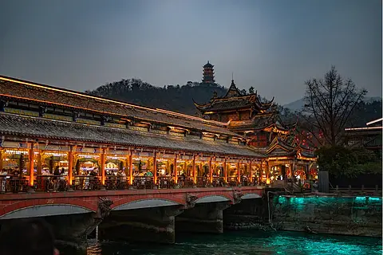
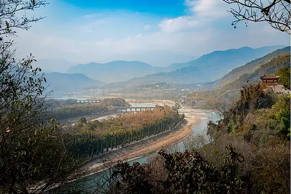
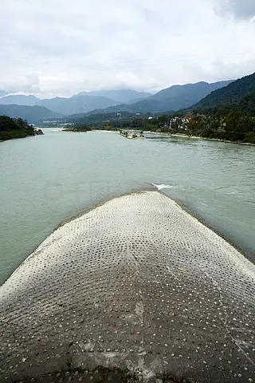

# 青城山-都江堰 ✨

## 🌊 开篇：长城是骨头，都江堰是血脉

余秋雨写过一篇《都江堰》，开头第一句是：

> "我以为，中国历史上最激动人心的工程不是长城，而是都江堰。"

长城当然伟大。但长城是死的。它横在那里，挡过风沙，挡过胡马，今天它只是一个符号，一段遗迹，给人凭吊。

都江堰不一样。都江堰是活的。

它已经活了两千两百多年。从公元前256年活到今天，没有一天停止工作。它养活了成都平原两千多年，让这里成了"天府之国"。今天你吃的每一粒四川大米，喝的每一口岷江水，都还在它的怀里。

长城是一个民族的骨头。都江堰是一个民族的血脉。

骨头可以断，血脉不能停。

而离都江堰不远的青城山，是另一种活法。

它是道教的发源地之一。公元143年，一个叫张道陵的人，在青城山创立了天师道。他教人"道法自然"，教人和山水共生，教人在一棵松树下一坐就是一天，不争，不抢，不慌，不忙。

"青城天下幽"。一个"幽"字，是青城山的魂。

都江堰教我们"用"，怎么和水相处，怎么把洪灾变成灌溉。
青城山教我们"不用"，怎么和自己相处，怎么把浮躁放下，把心安放。

一用一不用，一入世一出世。这两座地方挨在一起，是老天的安排。

来青城山-都江堰，你看的不只是山水。你看的是两种活法，是中国人两千年来一直在琢磨的、那个关于"怎么活"的问题。

## 📜 一条江、一个人、一座山

**公元前256年 李冰来了**

两千两百多年前，四川还叫"蜀"。

蜀地最大的祸患，是岷江。

岷江从岷山流下来，一路狂奔，到了成都平原西边，地势突然变平。江水失去约束，雨季发洪水，冲毁农田村庄；旱季水又不够，田里干得裂口。

蜀人苦岷江，苦了几千年。

公元前256年左右，秦国派了一个叫李冰的人，来做蜀郡守。

李冰不是四川人。他是一个北方工程师，懂水利。他到任后，没有先坐在衙门里办公，而是带着儿子，沿着岷江走了一遍。

他走了一个月。

他看水，看山，看泥沙，看洪水退去后的痕迹。他站在玉垒山前，盯着那座山看了很久。然后他做了一个决定--在这里，把岷江治住。

**八年凿山，开出宝瓶口**

李冰要做的第一件事，是在玉垒山上开一个口子，把岷江水引到成都平原去。

那时候没有炸药，没有机械，只有铁锤和凿子。玉垒山是坚硬的砾岩，一锤子下去，只掉一点粉末。

李冰想了个办法：在石头上堆柴火烧。烧红了，再浇冷水。热胀冷缩，石头裂开，再凿。

就这样，烧、浇、凿，烧、浇、凿。整整八年。

八年，玉垒山被凿开一个宽20米、高40米的口子。因为这个口子形状像一个瓶口，李冰叫它"宝瓶口"。

被凿开的那块山体，和玉垒山分开了，成了一座小石山，叫"离堆"。

宝瓶口一开，岷江水从这里流进成都平原。但李冰知道，光有口子还不够。

**鱼嘴分水，飞沙泄洪**

李冰又在宝瓶口上游，修了一个分水堤，叫"鱼嘴"。因为它像一条鱼的嘴，把岷江分成两条：内江和外江。

内江窄而深，引水灌溉；外江宽而浅，排洪泄水。

李冰算得很精。他把内江设计成"四六分水"：枯水季节，六成水进内江，保证灌溉；洪水季节，六成水进外江，保证排洪。

更绝的是"飞沙堰"。它在内江外侧，是一个低低的堰。水大了，会漫过飞沙堰，流回外江；水里的沙石，会因为水流的弯道离心力，被甩过飞沙堰，排出去。

这样，进宝瓶口的水，永远是清水，不会淤积。

李冰把这六个字留给后人："深淘滩，低作堰。"

意思是：每年枯水季，要把内江河床淘深到一定的位置（他埋了石马作标记）；飞沙堰要保持低，不能加高。

这六个字，被刻在二王庙的墙上。两千年来，每年冬天，都江堰的人都要按这六个字，淘滩、修堰。所以都江堰才能活两千年。

**李冰之后，再无李冰**

李冰的死，史书没有明确记载。传说他治水累死在工地上。

但他留下的都江堰，一直活着。

成都平原从此"水旱从人，不知饥馑"。别人问四川为什么富，四川人说：因为有都江堰。

没有李冰，就没有"天府之国"。

**公元143年 张道陵上了青城山**

李冰之后四百年，青城山来了另一个人。

他叫张道陵，沛国人（今江苏），是个太学生，通《道德经》。他六十多岁入蜀，公元143年到青城山，在赤城岩结茅修道。

他创立的教派，叫"正一盟威之道"，俗称"天师道"。他是第一代天师。

张道陵在青城山，教人信道、修心、不争。他说：道生万物，人要顺应自然，不要逆天而行。

青城山从此成了道教名山。后来葛洪、杜光庭、陈抟，这些道教的大家，都来过青城山。青城山成了道教的"第五洞天"。

道教在中国，一直是一种"退"的智慧。儒家教人入世，道教教人出世。儒家说"修身齐家治国平天下"，道教说"道法自然，无为而治"。

青城山的"幽"，就是这种"退"的味道。山深、林密、人少、声音低。你在这里走一走，心里那些乱七八糟的事，慢慢就退了。

**你不知道的冷知识：**
- 都江堰是全世界唯一一座两千多年还在使用的无坝引水工程。今天的葛洲坝、三峡大坝，都是"坝"。都江堰没有坝，它靠的是"顺"
- 李冰的六字诀"深淘滩，低作堰"，被联合国列为古代水利工程的典范
- 青城山有36峰、8大洞、72小洞、108景
- 青城山的道士，至今还住在山上。你爬山时会遇到真正的道长，他们穿道袍、束发髻，爬山比你快
- 2000年，青城山-都江堰被列入《世界文化遗产名录》

---

## 🌟 都江堰核心景点详解

### 📍 鱼嘴分水堤：把一条江分成两条

鱼嘴是都江堰的"第一道关"。

它像一条鱼的嘴，伸进岷江里，把江水一分为二：内江、外江。

你站在鱼嘴上，能看到一个奇妙的景象--两江的水，颜色不同。外江水浑，因为它是排洪的，带着上游的泥沙；内江水清，因为飞沙堰已经把沙子甩出去了。

最妙的是"四六分水"。这是李冰两千年前算出来的：

枯水季节，岷江水少。内江河床低，外江河床高。水往低处流，所以六成水进内江，保证成都平原灌溉。

洪水季节，岷江水大。内江满了，多余的水漫过飞沙堰，流回外江。所以六成水进外江，保证不淹成都。

两千年前的工程师，用一个鱼嘴，解决了旱涝两个问题。没有电，没有电脑，没有模型，全靠脑子算，靠手摸石头量。

鱼嘴旁边有一座"安澜索桥"。这座桥横跨内外江，是古代从内地进藏的必经之路。走在桥上，桥晃，水在脚下吼，你会捏一把汗。但过桥之后，你会觉得，值了。

> 💡 **导游贴士**：
> 看鱼嘴最佳位置是索桥上和鱼嘴对面的观景台。
> 拍鱼嘴，最好用广角，把分水的"V"字拍出来。
> 安澜索桥晃得厉害，老人小孩慢慢走，不要并排。
> 鱼嘴旁边有"四六分水"的图解碑，先看懂了再看水，感受完全不同。

---

### 📍 飞沙堰：李冰的物理学

飞沙堰是都江堰最聪明的地方。

它在内江外侧，是一道低低的堰。平时，内江水从这里过，不会漫出来。但洪水季节，水大了，会漫过飞沙堰，流回外江。

这还不算最聪明。最聪明的是"飞沙"两个字。

内江在这里拐了个弯。水流过弯道时，会产生离心力。表层的水走外圈，底层的水（带着泥沙）走内圈。底层的泥沙，被离心力甩到内江外侧，正好被漫过飞沙堰的洪水，一起甩回外江。

所以，过了飞沙堰的内江水，是清水。进了宝瓶口，再进成都平原的灌溉网，不会淤积。

这是物理学。是两千年前李冰，靠观察水流的规律，琢磨出来的物理学。

今天的工程师看了都江堰，会承认一件事：李冰的设计，用现代水利学验证，几乎没有可以改进的地方。

两千年前的人，是怎么想到的？

答案很简单：他站在水里，看了一万遍。

> 💡 **导游贴士**：
> 飞沙堰现在有栈道可以近距离看，注意防滑。
> 看飞沙堰一定要结合"鱼嘴-飞沙堰-宝瓶口"三位一体来理解。这三个工程缺一不可。
> 堰边有李冰的"六字诀"碑："深淘滩，低作堰。"看一眼，记心里。
> 洪水季节（7-8月）能看到飞沙堰真正"飞沙"，平时看不到。

---

### 📍 宝瓶口与离堆：八年凿出来的口子

宝瓶口是都江堰的"咽喉"。

它是玉垒山上凿出来的一个口子，宽20米，高40米。所有进成都平原的水，都要从这个口子过。

你站在宝瓶口前，能看到江水从这里挤过去，水势湍急，吼声震天。这个口子，李冰用八年时间凿出来。

那时候没有炸药。李冰用的是"火烧水浇"法：在石头上堆柴烧，烧到发红，再浇冷水。石头一热一冷，裂开，再凿。

八年，多少柴烧了，多少水浇了，多少铁锤砸了，没有记载。我们只知道，玉垒山被凿开了，蜀地被救活了。

宝瓶口旁边那座孤零零的小石山，叫"离堆"。它原本和玉垒山连在一起。被凿开之后，它"离"开了主山，所以叫"离堆"。

离堆上有一座伏龙观。传说李冰在这里治水时，岷江有一条蛟龙作怪，发洪水。李冰入水与蛟龙搏斗，最终把它锁在江底的"锁龙柱"上。

传说当然是假的。但它说了一个真的意思：治水，就是治龙。把蛟龙驯服了，江水就听话了。李冰，就是那个驯龙的人。

> 💡 **导游贴士**：
> 宝瓶口是拍照必到。最佳机位在伏龙观前的平台，能把口子、水势、离堆一起拍进去。
> 伏龙观里有一座李冰石像，是东汉原件，1974年从江里捞出来的，国宝级文物，一定要看。
> 站在宝瓶口前，听一听水的声音。那水，流了两千两百年，一天没停过。

---

### 📍 二王庙：李冰父子的家

二王庙在玉垒山下，是为纪念李冰父子而建的。

李冰的儿子叫李二郎。传说他帮父亲治水，"二王"指的就是李冰和李二郎。

二王庙依山而建，层层叠叠，飞檐翘角，是川西建筑的典范。庙里供奉着李冰父子的塑像。墙上刻着李冰的治水三字诀和六字诀：

- 三字诀："乘势利导，因时制宜"
- 六字诀："深淘滩，低作堰"

还有八字格言："遇湾截角，逢正抽心。"

这几句话，是都江堰两千年的"操作手册"。每一年的岁修，都按这几句话做。所以都江堰才能从李冰活到今天。

二王庙最有意思的，是后山的一面墙。墙上刻着"深淘滩，低作堰"六个大字，每个字有一米见方。这六个字，是都江堰的灵魂。

2008年汶川大地震，二王庙严重受损，山门坍塌，大殿移位。后来国家花了三年，按"修旧如旧"的原则，把二王庙原样修复。今天你看到的二王庙，和地震前几乎一样。

> 💡 **导游贴士**：
> 二王庙是都江堰的"文化心脏"，不要错过。
> 庙里的治水口诀墙一定要看，拍下来，回去慢慢琢磨。
> 5月12日是地震纪念日，庙里有相关展览，看完会对都江堰有更深的感情。
> 庙后山可观都江堰全景，爬山约20分钟，值得。

---

## 🌟 青城山核心景点详解

### 📍 建福宫：青城山的山门

青城山有前山、后山。绝大多数游客去的是前山，前山的起点，是建福宫。

建福宫在山脚下，始建于唐代，是青城山最大的道观之一。

走进建福宫，第一感觉是"静"。

外面是游客的喧嚣，一进山门，立刻安静下来。香火的味道，木鱼的声音，道士们低低的诵经声，让人的心一下子沉下来。

宫里有一副长联，叫"青城长联"，共394字，是全国第三长联。联里写尽了青城山的历史和风光。你看不完，但你可以看几句，感受一下。

宫外有一棵古银杏，据说有一千多年。树干粗得几个人抱不过来。秋天，满树金黄，叶子落一地，像铺了一层金。

> 💡 **导游贴士**：
> 建福宫是前山入口，不要急着过。在里面坐十分钟，让心静下来，再上山。
> 宫里的长联可以拍下来回去读，现场读不完。
> 古银杏秋天最美，10月底到11月初是黄金期。

---

### 📍 天师洞：张道陵讲道的地方

天师洞是青城山最重要的道观。

它在山腰一处岩洞旁。公元143年，张道陵就是在这里结茅修道，创立天师道。

洞里供奉着张道陵的塑像。他面容清癯，长髯，目光深邃，像一个看透了一切的人。

天师洞有三件宝：
- **张道陵天师像**：唐代石刻，国宝
- **一棵银杏树**：传说张道陵亲手种的，已经一千八百多年，依然枝繁叶茂
- **三岛石**：洞前的三块巨石，传说张道陵用剑劈开，象征"劈开三界"

你在天师洞坐一会儿，会理解什么叫"幽"。

山在四周，树在头上，洞在身后，雾在脚下。鸟叫声远远地传过来，又远远地消失。道士在殿里扫地，扫帚"沙沙"地响。除此之外，没有别的声音。

这种"幽"，不是寂寞，是"静到能听见自己"。

城市里住久了的人，来这里坐半小时，会觉得自己"回来了"。回到一个原本就属于自己的、安静的、不慌不忙的自己。

> 💡 **导游贴士**：
> 天师洞是青城山的"魂"，必到。
> 在洞前台阶上坐15分钟，什么都不想。这是青城山给你最好的礼物。
- 那棵1800年的银杏，是张道陵亲手种的（传说）。秋天满树金黄，是青城山最美的树。
> 拍三岛石，从下往上仰拍，能拍出"劈开三界"的气势。

---

### 📍 上清宫与老君阁：青城山的顶

上清宫在青城山前山的较高处，是青城山最大的道观之一。

宫门上有"上清宫"三个字，是蒋介石1940年题的。宫里供奉着道教三清：玉清元始天尊、上清灵宝天尊、太清道德天尊。

从上清宫再往上，到山顶，就是老君阁。

老君阁是青城山的最高点，海拔1260米。阁里有一尊老子骑牛的铜像，高13.6米。老子面容慈祥，青牛低头，像是刚从函谷关走来。

站在老君阁前，能俯瞰整个青城山。山峦起伏，云雾缭绕，远处的成都平原若隐若现。风一吹，云在动，山在动，你的心也跟着动。

老子说："人法地，地法天，天法道，道法自然。"

站在这里，你会懂这句话。人不是世界的主人，人只是自然的一部分。顺应自然，才能长久。逆着自然，就会败。

这是青城山教了两千年的道理。

> 💡 **导游贴士**：
> 上清宫到老君阁还要爬一段，约30分钟。体力不好的可以在上清宫休息后折返。
> 老君阁是看青城山全景的最佳点，天气好能看到成都平原。
> 山顶温度低，带件外套。
> 老君阁的老子像，从下往上仰拍，最有气势。

---

### 📍 青城后山：另一种青城

前山是道教文化，后山是自然山水。

后山开发较晚，比前山原始，比前山安静，比前山"野"。

后山的精华是"五龙沟"和"飞泉沟"。两条沟里都是瀑布、深潭、古树。水从山顶下来，一路跌落，形成几十个大小瀑布。最壮观的"双泉水帘洞"，水从几十米高的悬崖上泻下来，在崖壁上挂成一道帘子，人可以从帘后走过。

后山还有一座"泰安古镇"。古镇在山脚下，是后山的起点。镇上有老房子、老茶馆、老客栈。爬完山，在泰安古镇喝杯茶，吃碗豆花，歇一歇，是后山最舒服的玩法。

> 💡 **导游贴士**：
> 后山要单独买票（90元），和前山是两个景区。
> 后山比前山累，全程步行5-6小时。建议坐一段索道（金骊索道，单程30元）。
> 后山人少，适合喜欢安静和自然的人。
> 后山湿滑，必须穿防滑鞋，雨后更要注意。

---

## 🎯 游览实用指南

### 🚗 交通指南

**高铁**：
- **成都站/犀浦站->青城山站**：城际列车，约30分钟，10-15元
- 出青城山站，步行5分钟到青城山景区
- **成都站->都江堰站**：城际列车，约30分钟
- 出站坐公交或打车到都江堰景区，约20分钟

**自驾**：
- 成都市区->青城山：约1.5小时，65公里
- 成都市区->都江堰：约1小时，60公里
- 走成灌高速，很方便
- 两景区之间约15公里，开车20分钟

**景区之间**：
- 都江堰和青城山之间有公交101路，约40分钟
- 打车约50元

### 🎫 门票信息（2025年参考）
- **都江堰景区**：80元
- **青城前山**：80元
- **青城后山**：90元
- **前山索道**：单程35元，往返60元
- **后山金骊索道**：单程30元，往返55元
- **月城湖船票**：5元（前山）
- **半价**：学生、60-64岁老人
- **免票**：65岁以上、1.2米以下儿童、军人、残疾人
- **联票**：都江堰+青城前山联票约140元，比单买便宜
- **预约**：节假日建议提前在公众号预约

### ⏰ 最佳游览时间
- **春季（3-5月）**：山花烂漫，温度舒适
- **秋季（9-11月）**：天高气爽，银杏金黄，最美
- **夏季（6-8月）**：避暑胜地，青城山比成都低5-8度
- **冬季（12-2月）**：人最少，可能下雪，雪景极美
- **建议游览时长**：2天。一天青城山，一天都江堰。1天太赶
- **开门时间**：8:00-17:30，建议一早进

### 🗺️ 推荐路线

**经典两日游（最推荐）**：
- **第一天**：早上成都->都江堰 -> 鱼嘴 -> 飞沙堰 -> 宝瓶口 -> 二王庙 -> 伏龙观 -> 下午回都江堰市区，吃晚饭
- **第二天**：早上都江堰->青城山 -> 建福宫 -> 天师洞 -> 上清宫 -> 老君阁（索道上，步行下）-> 下午回成都

**一日游（赶时间版）**：
- 上午都江堰（3小时），下午青城前山（4小时）
- 不推荐，太赶，等于都没看透

> 💡 **最重要的建议**：
> 来青城山-都江堰，不要只拍照。
> 在天师洞坐15分钟，在老君阁站10分钟，在宝瓶口听一会儿水声。
> 这两个地方，一个教你怎么活，一个教水和人怎么活。
> 拍照是给别人看的，坐下来，是给自己的。

### 🍜 都江堰-青城山美食
- **青城四绝**：青城苦丁茶、青城雪芽（茶）、青城泡菜、青城老腊肉
- **白果炖鸡**：青城山的银杏果（白果）炖土鸡，汤鲜味美
- **老腊肉**：青城山老腊肉，烟熏味，下饭
- **都江堰鱼**：岷江的鱼，清蒸或红烧，鲜美
- **张醪糟**：都江堰名小吃，甜酒酿配糍粑
- **葱葱卷**：都江堰本地小吃，薄饼卷萝卜丝，蘸料吃

### ⚠️ 注意事项
1. **穿运动鞋**：青城山全程爬台阶，都江堰也要走不少路
2. **带雨具**：山区多雨，说下就下
3. **带外套**：青城山比成都低5-8度，早晚凉
4. **防滑**：后山湿滑，雨后更要注意
5. **都江堰水边**：注意安全，不要翻越栏杆
6. **道教礼仪**：进道观请肃静，不要大声喧哗，不要对神像拍照用闪光灯
7. **索道排队**：节假日索道排队1小时以上，建议早去或步行

## 💫 结语：用和不用，都是活法

青城山-都江堰，是两个地方，也是两种智慧。

都江堰教我们"用"。

李冰用八年凿开一座山，用一道鱼嘴分了一条江，用一句"深淘滩低作堰"管了两千年。他用他的脑子、他的手、他的命，把一条害人的江，变成了一条养人的江。

李冰是"入世"的人。他不回避问题，他直面它，解决它。他不抱怨岷江难治，他下水去摸它的脾气。他不知道自己的工程能活两千年，他只知道，他这一代，要把水治好。

这种"用"，是"用尽全力，做对的事"。

青城山教我们"不用"。

张道陵上青城山，不是为了做什么，是为了"不做"。他教人放下，教人顺应，教人在一棵松树下一坐就是一天。

青城山的"幽"，是"不用"的味道。你在这里，不需要证明什么，不需要争取什么，不需要成为什么。你只需要，做你自己。

这种"不用"，是"放下执念，回到本心"。

一个用，一个不用。

一个是李冰的汗，一个是张道陵的茶。
一个是入世的工程，一个是出世的修行。
一个把水治住，一个把心安放。

中国人两千年来，一直在琢磨的就是这件事：什么时候该用，什么时候该不用？

该用的时候用尽全力，像李冰。
该不用的时候放下执念，像张道陵。

这，就是青城山-都江堰教给我们的、关于"怎么活"的答案。

你走出都江堰的时候，回头看一眼宝瓶口的水。那水，从李冰凿开山的那一刻，流到今天，没有一天停过。

你走出青城山的时候，回头看一眼天师洞。那棵张道陵种的银杏，从东汉活到今天，一千八百年，年年发新芽。

一个活了2200年的工程。
一棵活了1800年的树。

它们告诉你一件事：

真正长久的东西，都不是"硬撑"出来的。
是"顺"出来的。

顺水的脾气，所以都江堰活了2200年。
顺树的脾气，所以银杏活了1800年。
顺人的脾气，所以人，才能活得长久。

> 📌 **旅行感悟**：
> 站在宝瓶口前，听水。
> 站在天师洞前，听风。
> 你忽然明白--
> 李冰和张道陵，是同一种人。
> 他们都懂得"顺"。
> 一个顺水，一个顺心。
> 顺，才是最长久的活法。
> 强扭的瓜不甜，硬挡的水会淹。
> 你这一生，要学的，
> 不过是这一个"顺"字。

---

*本页内容基于实景图片分析与都江堰青城山历史文化研究整理，由AI导游系统2025年7月生成*
