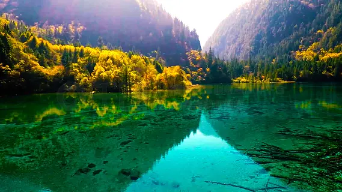
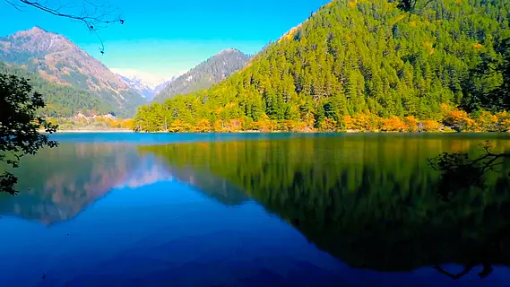

# 九寨沟 ✨

## 💧 开篇：上帝打翻的调色盘

如果说中国最美的水在哪里，答案一定是九寨沟。

在青藏高原向四川盆地过渡的崇山峻岭中，有一条纵深50余公里的山谷。亿万年来，冰川的运动、岩溶的渗透、钙化的沉积，在这里创造出了地球上独一无二的水景奇观——108个高山湖泊，像一颗颗遗落在人间的宝石，镶嵌在原始森林之间。

这里的水，是Tiffany蓝、是翡翠绿、是孔雀蓝，是任何调色盘都调不出来的颜色。阳光透过林梢洒向湖面，湖水像一块巨大的水晶，清澈得让人分不清哪里是水、哪里是天。

1992年，九寨沟被列入《世界自然遗产名录》，联合国教科文组织的专家考察时惊叹："这里是地球上最美的地方之一，看到它，就看到了造物主的恩宠。"

## 🌿 水的故事：亿万年的奇迹

**3亿年前 海洋时代**
这里曾经是一片汪洋大海，海底沉积了厚厚的石灰岩。喜马拉雅造山运动让这片海底拔地而起，成为了海拔2000-3000米的山地。

**冰川与岩溶的杰作**
第四纪冰川期，冰川的侵蚀雕琢出了U型的山谷。冰川退却后，岩石中的碳酸钙开始溶解在水中。富含钙离子的水流过这片土地，碳酸钙慢慢沉积，形成了一层层的钙化堤，拦截住水流，就成了一个个湖泊——当地人叫它们"海子"。

**1970年代 被发现的秘境**
九寨沟一直是藏民心中的圣地，与世隔绝。直到70年代，伐木工人意外闯入这片山谷，被眼前的美景惊呆了。消息传开后，九寨沟才渐渐为世人所知。

**1978年 建立保护区**
九寨沟成为中国第一个以保护自然风景为主要目的的自然保护区，所有伐木活动全部停止。

**2017年 地震与重生**
8月8日，7.0级地震突袭九寨沟。火花海决堤，诺日朗瀑布受损。全世界都在问：九寨沟还美吗？

答案是：大自然有自我修复的能力。几年过去，那些受损的海子渐渐恢复了往日的颜色，有些地方甚至比以前更美了。

九寨沟没有消失，它只是打了个盹，然后醒来，依然惊艳。

## 🌟 核心景点详解

### 📍 五花海：九寨沟的灵魂

这是九寨沟最经典的照片——如果说九寨沟是童话世界，那么五花海就是童话的心脏。

你看这湖水，绿松石般的蓝绿色，清澈得可以看到水底每一根沉木、每一块石头。阳光照射下，湖底的钙化、藻类、沉木在水中折射出五彩斑斓的色彩，这就是"五花海"名字的由来。

**为什么五花海这么美**：
- **颜色分层**：浅处是绿松石色，深处是宝蓝色，阳光斜照时会呈现出鹅黄、墨绿、藏青、赤红等多种颜色
- **清澈度**：能见度高达20米，你看到的"水底"，可能其实在水下十几米深
- **季节变幻**：10月中下旬是五花海最美的时候，周围的树叶变成金黄、橙红、深紫，倒映在湖中，整个湖面就像打翻了的调色盘

**最佳拍摄时间**：
- **上午9:00-10:30**：阳光正好斜射湖面，没有阴影，颜色最鲜艳
- **下午3:00-4:30**：侧逆光，湖面有金闪闪的波光
- **10月15日-25日**：秋色最浓的十天，也是整个九寨沟最美的十天

> 💡 **导游贴士**：
> 拍五花海不要只在湖边拍，一定要爬到老虎嘴观景台——那是俯视五花海全景的最佳位置，也是那张流传最广的九寨沟宣传照的拍摄点。早上8点半之前到，人少景美。

---

### 📍 镜海：水面以下的另一个世界

这张照片会让你产生错觉——哪个是天？哪个是水？

这就是镜海，九寨沟最安静的海子。每天早上8点之前，当山谷里还没有风的时候，湖面平静得没有一丝涟漪，像一面完美的镜子，把天空、云彩、雪山、树林完完整整地倒映在水里。

当地人说，镜海是仙女梳妆的地方。仙女每天早上在这里照镜子，所以水才会这么静、这么清。

**看倒影的三个秘诀**：
1. **时间**：必须是早上8点之前，8点半以后山谷起风，水面就开始有波纹了
2. **天气**：晴天有云最好，蓝天白云倒映在水里，层次最丰富
3. **位置**：不要在栈道入口处拍，往里走200米，有几棵树做前景的位置，拍出来最有层次感

> 💡 **拍照技巧**：
> 用对称构图，把地平线放在画面正中间，然后故意不告诉别人哪个是倒影——能骗过别人的眼睛，就是一张成功的镜海照片。

---

### 📍 诺日朗瀑布：中国最美的钙华瀑布

诺日朗，在藏语里是"男神"的意思。

这座宽270米、高24.5米的瀑布，是中国最宽的钙华瀑布。86版《西游记》的片尾，唐僧师徒四人就是从这座瀑布上走过的。

2017年地震中，诺日朗瀑布受损严重，一度出现了几十米的缺口。但几年过去，水流又慢慢把钙化沉积下来，瀑布渐渐恢复了往日的壮观。

这就是大自然——你以为它被摧毁了，但它只是换了一种方式，继续美丽着。

---

## 🎯 游览实用指南

### 🚗 交通指南
- **飞机**：成都双流/天府机场 → 九寨黄龙机场，飞行1小时，机场到景区车程1.5小时
- **大巴**：成都茶店子客运站 → 九寨沟，车程8-9小时
- **自驾**：成都→都江堰→汶川→茂县→松潘→九寨沟，全程400公里，路况良好
- **景区观光车**：必须坐！景区太大，步行根本走不完，观光车90元包含在门票里

### 🎫 门票信息（2025年参考）
- **旺季（4-11月）**：190元+观光车90元=280元
- **淡季（12-3月）**：80元+观光车80元=160元
- **预约**：必须提前在"九寨沟"官网/公众号预约，每天限流4.1万人，旺季务必提前3天以上预约！
- **门票有效期**：1天，想玩两天需要买两次票

### ⏰ 最佳游览时间
- **10月15日-11月5日**：九寨沟的秋天，全世界最美的秋色，没有之一
- **6-8月**：夏季水量充沛，瀑布最壮观，也是避暑胜地
- **12月-2月**：冬季人少，看冰瀑和蓝冰，别有一番风味
- **建议游览时长**：1整天（早上7点进沟，下午5点出沟）

### 🗺️ 经典一日游路线
**最佳路线（亲测有效）**：
7:00 景区入口坐车 → 镜海（看8点前的倒影）→ 诺日朗中心 → 原始森林 → 箭竹海 → 熊猫海 → 五花海（老虎嘴拍全景）→ 珍珠滩瀑布 → 诺日朗瀑布 → 长海 → 五彩池 → 树正群海 → 17:00 出沟

**划重点**：
- 一定要坐最早一班车进沟！
- 上午玩日则沟（五花海那条线），下午玩则查洼沟和树正沟
- 镜海必须早上去！过了8点就没有完美倒影了

### 🍜 餐饮服务
- **诺日朗中心**：景区唯一的餐厅，自助餐60-98元/人，味道一般但能吃饱
- **自带干粮**：强烈建议带零食和水，景区内物价较高
- **沟口漳扎镇**：各种川菜馆、藏餐，推荐尝尝牦牛肉火锅

## 💫 结语：见过九寨，天下无水

很多人从九寨沟回来后都说："五岳归来不看山，九寨归来不看水。"

这句话真的不夸张。见过了九寨沟的水，你会觉得其他地方的水都差点意思——要么不够清，要么不够蓝，要么颜色不够丰富。

但九寨沟最让人感动的，不是它的美，而是它的坚韧。2017年地震后，所有人都以为九寨沟毁了。但仅仅几年过去，那些海子又恢复了往日的颜色。

大自然永远比我们想象的更有力量。它创造，它毁灭，它重生。

所以，趁它现在正好，去看看它吧。去看看那片不可思议的蓝，去踩踩那些落在钙化滩上的阳光，去呼吸一下原始森林里带着松香的空气。

你会明白，为什么人们说——九寨沟，是离天堂最近的地方。

> 📌 **旅行感悟**：
> 九寨沟不是一个"景点"。它是造物主在亿万年间，用冰川、用水、用时间，一点点打磨出来的艺术品。
>
> 站在五花海边的时候，你会突然觉得：人类的那点烦恼，在这样的美景面前，真的什么都不是。

---

*本页内容基于实景图片分析与自然历史资料整理，由AI导游系统2025年6月生成*
