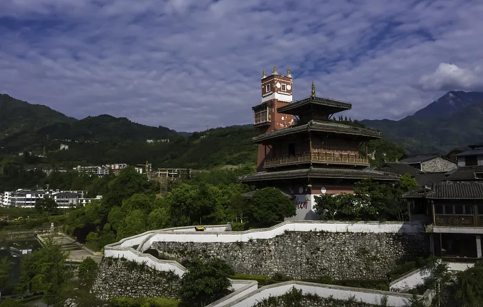
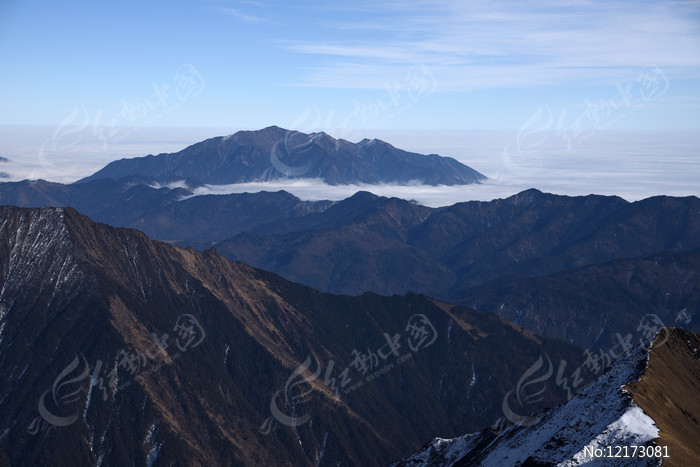

# 汶川特别旅游区

## 🎤 AI导游带你游

### 【开场白】
各位朋友，大家好！欢迎来到四川省阿坝藏族羌族自治州，欢迎来到汶川特别旅游区。我是你们今天的导游小艾。

站在这片土地上，你们可能想象不到，千百年前，这里曾是怎样一番景象。历史的年轮在这里留下了深深的印记，每一寸土地都在诉说着古老的故事。

阿坝州汶川 阿坝州汶川特别旅游区简介 在川西北的群山环抱之中，阿坝州汶川特别旅游区以其厚重的历史记忆与蓬勃的重生力量，成为全国独一无二的5A级特别旅游区。这里不仅是2008年汶川大地震的震中所在，更是一处集灾难纪念、民族文化传承与生态旅游于一体的综合性景区。自灾后重建以来，汶川以“铭记·感恩·奋进”...

今天，就让我们一起走进这片神奇的土地，感受它独有的魅力。建议游览时间：半天到一天。拍照最佳时间是清晨或傍晚，光线柔和时最美。

---

## 🗺️ 景区全景导览
汶川特别旅游区位于四川省阿坝藏族羌族自治州汶川县境内，是国家AAAAA级旅游景区。

阿坝州汶川 阿坝州汶川特别旅游区简介 在川西北的群山环抱之中，阿坝州汶川特别旅游区以其厚重的历史记忆与蓬勃的重生力量，成为全国独一无二的5A级特别旅游区。这里不仅是2008年汶川大地震的震中所在，更是一处集灾难纪念、民族文化传承与生态旅游于一体的综合性景区。自灾后重建以来，汶川以“铭记·感恩·奋进”为精神内核，将创伤转化为希望，吸引着无数游客前来缅怀、感悟与体验。 游乐旅行网小编整理了主要景点包括：映秀震中遗址、汶川地震震中纪念馆、水磨古镇、萝卜寨、云中羌寨、西羌文化街等。 映秀震中遗址静静伫立在岷江之畔，保留着地震瞬间的断壁残垣，漩口中学遗址上倾斜的教学楼成为最震撼人心的历史见证。不远处的汶

**游览路线推荐**：景区入口 → 核心景观区 → 精华景点 → 观景平台 → 出口

---

## 🏛️ 主要景点详解

### 📍 核心景区

**核心看点**：
- 景区内最受欢迎的打卡点，游客必到
- 站在这里可以俯瞰整个景区的壮丽景色
- 天气好的时候拍照效果绝佳，记得预留时间

> 💡 **导游贴士**：
> 想要深度了解核心景区，可以提前做些功课，了解它的历史背景，游览时会更有感触。

---

### 📍 精华观景台

**核心看点**：
- 这里曾是历史上重要的场所，意义非凡
- 建筑/景观的设计独具匠心，体现了古人智慧
- 站在这里，仿佛能与历史对话

> 💡 **导游贴士**：
> 游览精华观景台时，建议放慢脚步，细细品味它的美。从不同角度欣赏会有不同的收获哦！

---

### 📍 特色景观区

**核心看点**：
- 远离人群的小众精华景点，安静而美好
- 喜欢深度游的朋友一定不要错过
- 这里能让你感受到不一样的景区魅力

> 💡 **导游贴士**：
> 特色景观区最适合拍照的时间是清晨和傍晚，光线柔和，人也相对较少。

---

### 📍 文化展示区

**核心看点**：
- 自然风光与人文景观完美融合的典范
- 四季景致各异，无论何时来都有惊喜
- 摄影爱好者的天堂，随手一拍都是大片

> 💡 **导游贴士**：
> 游览文化展示区时，不妨找个地方坐下来，静静感受周围的氛围，这才是旅行的意义。

---

### 📍 历史遗迹区

**核心看点**：
- 这里承载着景区最深厚的历史文化底蕴
- 每一处细节都诉说着动人的故事
- 建议跟随讲解员深入了解背后的历史

> 💡 **导游贴士**：
> 在历史遗迹区游览时，注意爱护环境，让这份美能够长久留存。

---

### 📍 自然观光带

**核心看点**：
- 这里是景区最具代表性的景观，绝对不可错过
- 独特的自然/人文风貌，是拍照打卡的首选之地
- 建议停留15-20分钟，细细品味它的独特魅力

> 💡 **导游贴士**：
> 来自然观光带游览，建议穿舒适的鞋子，这里需要多走走才能发现它的美。

---

## 【结束语】
各位朋友，今天的游览即将结束。希望汶川特别旅游区的美景能给你们留下美好的回忆。

有人说，旅行的意义不在于去过多少地方，而在于那些让你心动的瞬间。希望在汶川特别旅游区的这一天，能成为你旅途中一个温暖的记忆。

临走前，别忘了回头再看一眼。夕阳下的汶川特别旅游区，会给你最温柔的道别。

> ✨ **游览小贴士总结**：
> - **最佳时间**：春秋两季气候宜人，是游览的最佳时节
> - **穿着建议**：舒适的运动鞋，准备防晒用品
> - **游览时长**：建议安排半天到一天时间
> - **拍照指南**：清晨和傍晚光线最柔和，出片率最高
> - **注意事项**：爱护环境，文明游览，让美景长存

祝你们旅途愉快，平安吉祥！🙏

---

## 📷 景区美图

*景区全景*

*核心景观*

*特色风光*

---

## 📚 汶川特别旅游区小档案

| 项目 | 信息 |
|------|------|
| 景区级别 | 国家AAAAA级旅游景区 |
| 所属省份 | 四川省 |
| 所属城市 | 阿坝藏族羌族自治州 |
| 建议游览时间 | 半天 - 1天 |
| 最佳游览季节 | 春秋两季 |

---

> 💡 **本页说明**：
> 本README由AI导游小艾根据网络公开资料整理生成。
> 坐标、图片、简介均来自豆包搜索API，仅供参考。
