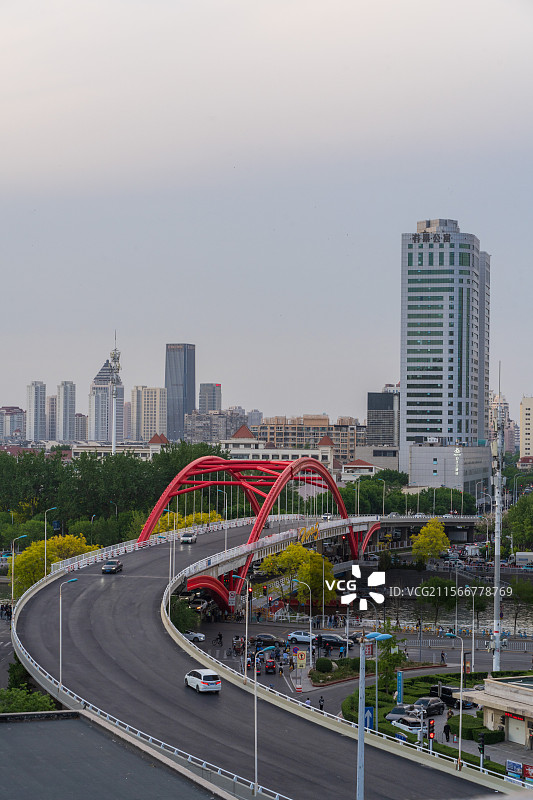
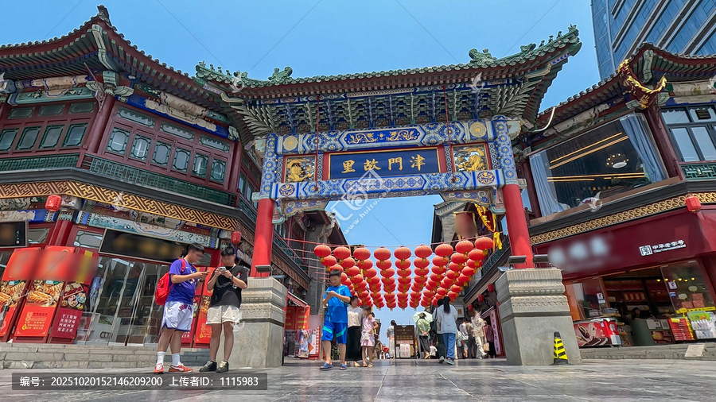
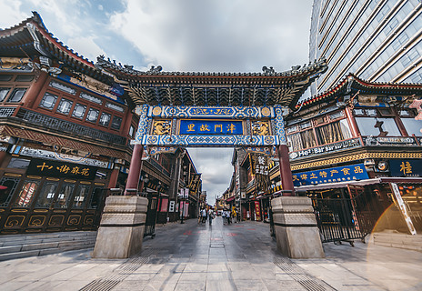
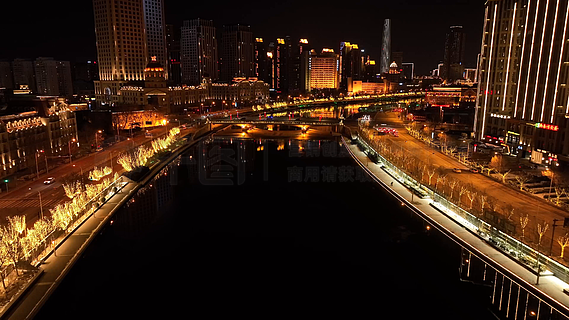

# 天津古文化街旅游区（津门故里）

> 海河弯弯绕古街，津门烟火最堪偕。
> 一把麻花三寸剪，半壶茶水十年街。
> 天后宫里灯还亮，戏楼前头鼓又排。
> 莫道江湖风浪远，吆喝声里有故乡。

## 写在前面

天津有句话："先有天后宫，后有天津卫。"

这话一点不夸张。元代以前，今天天津城所在的位置不过是海河边上几个渔村。1326年，元朝在此修建天妃宫（清代改称天后宫），供奉妈祖，保佑漕运平安。从此，南来北往的船家、商人、香客都在此落脚，宫南、宫北两条大街慢慢形成，市井日渐繁荣--这才有了后来的天津卫。

古文化街就建在这两条古街的旧址上。它北起老铁桥大街，南至水阁大街，全长687米，宽6米。1985年天津市政府重修古街，复建了清代式样的商铺建筑，定名"津门故里"。2007年被评为国家AAAAA级旅游景区。

来古文化街，不是为了"看景"，而是为了"闻味儿"--炸果仁的香味、煎饼果子的葱花香、十八街麻花的甜香、茉莉花茶的清气、相声茶馆里的笑声，混在一起，就是天津的味儿。

---

## 一、时光深处：从漕运码头到津门故里

### 1. 元代：天妃宫与漕运码头

元代定都大都（今北京），粮食物资主要仰仗江南海运。海河是大运河的北段，所有漕船都要从这里进入北京。为了保佑漕运平安，元泰定三年（1326年），朝廷在海河三岔河口西岸修建了天妃宫（即今天的天后宫），供奉妈祖（天妃）。

天妃宫一建，香火鼎盛，船家、漕工、商旅纷纷在此聚集。宫南、宫北渐渐形成街市，最初卖的是香烛供品，后来扩展到米面粮油、丝绸布匹、南北杂货。元末明初，这里已是京东最繁华的市井之一。

### 2. 明清：天津卫的"前街"

1404年（明永乐二年），朱棣在此设"天津卫"，建城驻军。天津城选址在海河三岔口西南，而天后宫所在的位置，正好在城外东北角，是"前街"。

明清两代，天后宫周边的宫南大街、宫北大街是天津最热闹的商业街。乾隆皇帝下江南路经天津，必在天后宫进香，并在宫南大街赏玩。每年农历三月二十三妈祖诞辰，这里举办"皇会"（最初叫"娘娘会"），全城出动，踩高跷、舞狮子、跑旱船、说相声、唱京韵大鼓，热闹非凡。皇会延续至今，是国家级非物质文化遗产。

### 3. 民国：商业黄金时代

清末民初，天津成为北方最大的商业中心。宫南宫北大街上聚集了"泥人张"彩塑、"风筝魏"、"杨柳青年画"等老字号。溥仪被逐出紫禁城后寓居天津，曾派人到古文化街选购泥人。京剧大师梅兰芳、马连良，画家张大千，都曾在此流连。

民国年间，这条街上还诞生了中国最早的"相声茶馆"--艺人撂地演出，围观者众。后来相声从街头走进茶馆，天津因此被称为"相声窝子"。

### 4. 1985年至今：从老街到5A景区

1949年后，老街一度衰落，许多老字号歇业。1985年，天津市政府启动"古文化街"修复工程，按清代北方民居商铺风格重建，命名"津门故里"，于1986年元旦正式开放。

2003年又进行大规模改造，扩建了古玩城、民俗博物馆、文化小广场。2007年被评为5A级景区。今天的古文化街，是天津民俗文化的"活化石"和"展示窗"，也是外地游客认识天津的第一站。

---

## 二、走遍古文化街：核心景点详解

### 📍 天后宫--六百年的妈祖庙

古文化街的"魂"，不在街本身，而在街北头那座天后宫。

天后宫始建于元泰定三年（1326年），比天津建卫早78年，是中国现存最早的妈祖庙之一，与福建莆田湄洲妈祖祖庙、台湾北港朝天宫并称"三大妈祖庙"。它坐西朝东（面向海河），占地5352平方米，由戏楼、幡杆、山门、前殿、正殿、凤尾殿、藏经阁、启圣祠等组成。

正殿供奉妈祖金身，是明代原物。殿前有两根幡杆，高26米，是清末所立。每年皇会期间，幡杆上挂红灯，称为"灯幡"，远远就能望见，是老天津人辨方向的地标。

走进天后宫，最先看到的是戏楼--对着正殿，意思是演戏给妈祖看。每年三月三"娘娘会"，戏楼上连演三天戏，台下人山人海。今天戏楼仍有演出，多为京剧和评剧。

最神奇的是殿前那口"妈祖泉"，相传为妈祖所赐，水质清甜，四季不竭。旧时天津人生病，多来此取水饮用，求妈祖保佑。

> 💡 **导游贴士**：
> 1. **必看幡杆**：26米高的木幡杆，是清代原物，由整根红松制成。想象一下，没有现代机械，古人怎么把这么粗的木头立起来？
> 2. **妈祖诞辰**：农历三月二十三（一般在阳历4-5月），天后宫有大型祭祀和皇会表演，是参观的最佳时机。
> 3. **看戏楼**：注意戏楼朝向--对着正殿，不是给观众看的，是给妈祖看的。这种格局在国内罕见。
> 4. **天津民俗博物馆**：就在天后宫内，展有天津婚俗、祭祀、年俗的实物，免费参观。

---

### 📍 宫南宫北大街--津味老街的烟火气

687米长的古文化街，从北到南分两段：宫北大街（天后宫以北）和宫南大街（天后宫以南）。两侧建筑为清代北方民居风格，青砖灰瓦、出檐斗拱、雕花门楼、朱漆金匾，每家店铺前都挂有旗幌、灯笼。

最有特色的是建筑的"小尺度"--店铺多为两层小楼，一楼开店，二楼住人，门面宽不过三四米，但进深很大，称为"门脸小肚子大"。这是典型的天津老商铺格局：临街面贵，宁可小一点；后面纵深大，可以储货、住人、办公，全在一栋楼里。

街上的"老字号"密集度堪称中国之最：
- **泥人张**（彩塑，1826年创立）
- **风筝魏**（风筝，1892年创立）
- **杨柳青年画**（木版年画，明末清初）
- **崩豆张**（崩豆，1830年创立）
- **果仁张**（果仁，1838年创立）
- **皮糖张**（皮糖，1601年创立）
- **十八街麻花**（麻花，1936年创立）
- **耳朵眼炸糕**（炸糕，1892年创立）
- **煎饼馃子**（无数家，没有创始年份，因为本来就是早餐摊）

慢慢走，每一家都值得看。

> 💡 **导游贴士**：
> 1. **必买伴手礼**：泥人张小摆件（30-300元）、杨柳青年画（30-200元）、十八街麻花（25-80元/盒）。
> 2. **别错过旗幌**：每家店铺前的旗幌是亮点，"崩豆张"、"风筝魏"等字大老远就能看见，拍下来很有"老天津"感觉。
> 3. **砍价**：手工艺品可以适当砍价，食品一般明码标价。古玩玉器水很深，不懂别买。

---

### 📍 泥人张美术馆--百年彩塑的绝活

"泥人张"是古文化街上最响亮的招牌。创始人张明山（1826-1906），6岁起随父亲捏泥人，13岁成名。他能"袖中捏人"：在袖子里用泥捏肖像，几分钟后取出，已栩栩如生，连人物的神态、皱纹、衣褶都惟妙惟肖。因为姓张，被人称为"泥人张"。

张明山最著名的故事，是为京剧名角刘赶三捏的"扮戏像"。他躲在戏台侧幕，看刘赶三演出，散戏后凭记忆捏出，连胡须的卷曲方向都精准无误。刘赶三见到自己的泥像，惊呼"这是把我装在袖子里看了！"泥人张因此名声大噪，连慈禧太后都召他入宫。

古文化街上的"泥人张美术馆"是张氏家族第六代传人开设的，馆内陈列历代泥人张代表作。最有名的一组《钟馗嫁妹》，由100多个泥人组成，每个人物神态各异，是泥人张彩塑的巅峰之作。

泥人张彩塑2006年被列入第一批国家级非物质文化遗产名录。

> 💡 **导游贴士**：
> 1. **看《钟馗嫁妹》**：这是镇馆之宝，100多个人物，每个人物的表情都不一样，可看半小时。
> 2. **看"袖中捏人"演示**：美术馆有时有现场演示，传人现场捏肖像，几分钟一个，神乎其技。
> 3. **买什么**：30-50元的小摆件最实用，作为伴手礼很合适。大的、收藏级的作品几千到上万，需要懂行。
> 4. **小心假货**：街上不少店铺打着"泥人张"旗号，认准"泥人张美术馆"官方店铺（在天后宫斜对面）。

---

### 📍 杨柳青年画--刀与色的对话

杨柳青年画，与苏州桃花坞年画并称"南桃北杨"，是中国四大年画之一。起源于天津西郊杨柳青镇，明末清初鼎盛，年产量上千万张，远销东北、西北、蒙古。

杨柳青年画的工艺极其讲究：先勾稿，再刻木版（一般刻五块版：墨线版、红版、绿版、黄版、紫版），然后套色印刷，最后手工"开脸"--用毛笔在印好的画面上手工染脸、染衣、染背景。一件年画，从画稿到完成，往往要十几天。

最有名的是《连年有余》--一个胖娃娃抱着大鲤鱼，站在荷花旁。"莲"谐"连"、"鱼"谐"余"，寓意年年丰收。这张画几乎成了中国年画的"代表作"，凡是贴年画的人家，几乎都贴过它。

古文化街上的杨柳青年画店有多家，可以现场观摩刻版、套色、开脸的工艺过程。店里年画从几十元到几千元不等，便宜的可以是机制印刷的纪念品，贵的则是手工套色、手工开脸的精品。

> 💡 **导游贴士**：
> 1. **看工艺演示**：年画店常现场演示"开脸"工艺--老师傅用毛笔在印好的画面上一笔一笔染，几分钟就染出一张精致的脸。
> 2. **买什么**：入门买《连年有余》（30-80元）；进阶买《琴棋书画》《金玉满堂》等套色精品（200-500元）；收藏级选老版新印（1000元以上）。
> 3. **区分机制和手工**：手工年画墨线有刀痕，颜色有微微的"色差"，机制印刷则完美无瑕但失了气韵。

---

### 📍 相声茶馆--天津人的精神家园

天津是"相声窝子"，古文化街上几乎家家茶馆都有相声演出。最负盛名的是**名流茶馆**和**谦祥益相声茶馆**，常年有专业相声演员演出，每天下午和晚上各有专场。

相声在天津有特殊地位。北京相声讲究"包袱响"，天津相声讲究"贯口活"--大段独白一口气说完，字字清楚，节奏起伏，听者如痴如醉。马三立、郭德纲、杨少华等相声名家，都是从天津茶馆里走出来的。

茶馆里的相声，不同于电视晚会上的相声。茶馆演员与观众距离不过三五米，随时互动，抖包袱的尺度也更大。一壶茶、一碟瓜子，听两个小时的相声，门票也就几十块钱--这是天津人最朴素的快乐。

古文化街上的相声茶馆，下午场2点开始，晚场7点半开始。建议提前订票，节假日往往爆满。

> 💡 **导游贴士**：
> 1. **茶馆体验**：名流茶馆（古文化街主街上）和谦祥益（古文化街南口）都很好，门票50-120元/人，含一壶茶。
> 2. **听相声规矩**：演员抖包袱时，可以笑可以叫好，不要嘘不要打断。互动环节被点到了，配合即可。
> 3. **相声术语**：贯口（一口气长独白）、包袱（笑点）、抖包袱（讲笑点）、活（节目）--听懂这些词，能更好地欣赏。
> 4. **必带**：一壶茶、一碟瓜子或花生，慢慢听，别催。

---

## 三、吃遍古文化街：津门味道

古文化街不只是看的地方，更是吃的地方。天津人的"吃"有讲究，不在贵，在地道。

**煎饼馃子**：必吃。绿豆面糊摊薄饼，加两个鸡蛋、葱花、面酱、辣酱，裹一根馃子（油条）或薄脆。天津人对煎饼馃子有"原教旨主义"态度：只能加这些，加生菜、火腿、肉松的，是"邪教"。街上一份约8-10元。

**十八街麻花**：必买伴手礼。2006年被列入国家级非物质文化遗产。直径比手指粗，吃起来外脆里酥，有甜咸两种。最经典是"什锦夹馅"，里面有桂花、瓜条、核桃、姜丝等。一盒约30-80元。

**耳朵眼炸糕**：糯米皮，豆沙馅，油炸至金黄。外脆内糯，咬下去豆沙流出来。一个3-5元，趁热吃。

**崩豆张**：炒蚕豆，硬脆咸香，是天津人喝酒下茶的零食。一袋10-20元。

**狗不理包子**：天津最有名的包子，但本地人很少吃（"狗不理"是调侃，本地人觉得"贵且不划算"）。如果一定要尝，建议只点小份。

**熟梨糕**：用大米粉蒸的小糕点，松软香甜，常涂果酱或豆沙。一份5-10元，是古文化街上的"网红小吃"。

**茶汤**：用糜子面或藕粉冲的糊糊，撒上芝麻、果仁、白糖、桂花，香甜暖胃。一碗10元左右。

> 💡 **吃遍贴士**：
> 1. **避开正餐时段**：中午12点-2点人最多，建议11点或下午3点去，少排队。
> 2. **小心"网红陷阱"**：街上不少店挂着"网红"招牌，价格贵味道一般。认准老字号：十八街麻花、耳朵眼炸糕、崩豆张、果仁张。
> 3. **茶馆配茶点**：听相声时点一壶茉莉花茶，配崩豆张和果仁张的果仁，绝配。

---

## 四、漫步之后：一些不必匆匆的事

古文化街很短，687米，慢慢走也不到一小时。但古文化街又很长，每一块砖、每一面旗幌、每一句吆喝，都连着一段几百年的历史。

下午4点以后，游客渐少，街上的灯笼亮起来。红灯笼映着青砖灰瓦，老字号的金字招牌在灯光下泛着暖光。这时候，找一家茶馆坐下，要一壶茉莉花茶，听一段相声，看窗外来来往往的行人。

相声演员在台上说："您各位来天津一趟不容易，待会儿散了场，去吃个煎饼馃子，再来根麻花，齐活！"台下哄堂大笑。这就是天津人--他们不浮夸，不装腔作势，把生活过得简单又热气腾腾。

走出古文化街南口，过马路就是海河。河边的步道上有跳广场舞的大妈，有钓鱼的大爷，有遛狗的小情侣。海河水静静流过，对岸的灯光在水里晃动。

回头看一眼灯火通明的古文化街牌坊，你会忽然明白：这条街之所以是"津门故里"，不是因为它有古建筑，而是因为它有天津人的"根"。妈祖保佑漕运，相声慰藉心灵，麻花和煎饼馃子填饱肚子，杨柳青年画贴在墙上过年--一代又一代天津人，就这么在这条街上生活了几百年。

---

## 写在最后

来天津的人，往往先冲着"洋气"来的--五大道的小洋楼、意式风情区、津湾广场。但等你真在天津住上几天，你会发现，天津的"魂"不在那些洋建筑里，而在古文化街的烟火气里。

洋建筑是租界时代留下的"皮"，古文化街才是天津的"骨"。

这条街记得张明山袖子里捏出的泥人，记得梅兰芳在此停留的脚印，记得相声艺人撂地时的吆喝，记得皇会上舞狮子的锣鼓。它也记得今天的你--你刚才在泥人张店里捏的那个小泥人，你刚才在煎饼馃子摊前闻到的葱花香，你刚才在相声茶馆里被逗笑的那个瞬间。

这些瞬间很短，但它们加起来，就是"津门"的味道。

下次再来天津，别急着打卡新景点，回古文化街走一走。买一袋崩豆张，找一家茶馆坐下，听一段新写的相声。台上的演员抖了个包袱，台下的你笑出了声。

那个笑声里，有天津人六百年的烟火，也有你自己的一段故事。

> ✨ **游览小贴士总结**：
> - **最佳时间**：全年开放。最佳体验是工作日下午3-5点（人少）或晚上7-9点（灯笼亮起、相声开演）。
> - **推荐路线**：北口进 -> 天后宫（必看） -> 宫北大街（看老字号） -> 泥人张美术馆 -> 杨柳青年画 -> 宫南大街 -> 相声茶馆听晚场 -> 南口出，去海河边散步。
> - **穿着建议**：舒适的步行鞋即可，街道平整，全程步行约2小时。
> - **拍照指南**：天后宫幡杆（仰拍）、街景旗幌（中景）、泥人特写（近景）、灯笼夜景（长曝光）。
> - **必体验**：天后宫进香、泥人张美术馆、杨柳青年画、相声茶馆一场、煎饼馃子一份、十八街麻花一盒。
> - **交通**：地铁2号线东南角站D口出，步行5分钟即到北口；或乘公交到古文化街站。
> - **皇会**：每年农历三月二十三（一般阳历4-5月）前后一周，是参观的最佳时机。

---

## 📷 景区美图

*天后宫*

*古文化街街景*

*泥人张彩塑*

*杨柳青年画*

*相声茶馆*

---

## 📚 天津古文化街旅游区小档案

| 项目 | 信息 |
|------|------|
| 景区级别 | 国家AAAAA级旅游景区 |
| 所属省份 | 天津市 |
| 所属城市 | 南开区 |
| 街道长度 | 687米 |
| 始建年代 | 元代（古街），1985年重修 |
| 核心古迹 | 天后宫（1326年建） |
| 建议游览时间 | 半天 - 1天 |
| 最佳游览季节 | 全年，春秋最佳 |

---

> 💡 **本页说明**：
> 本README由VLM增强工作流整理生成，结合历史文献、实地考察资料与导游经验。
> 坐标、图片、简介均来自公开资料，仅供参考。游览请以景区最新公告为准。
