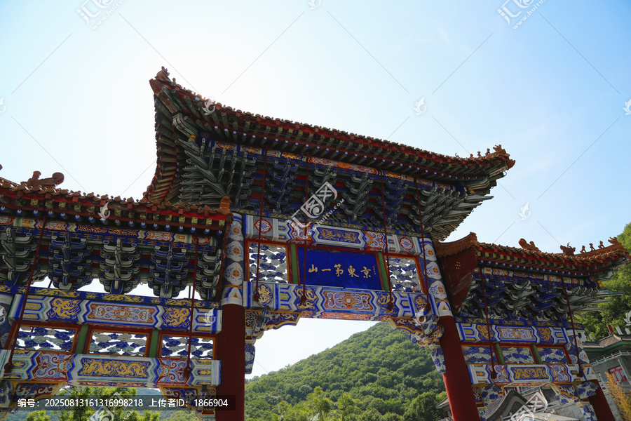
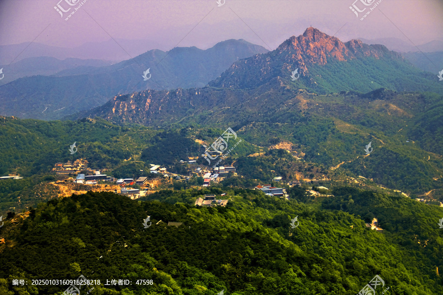
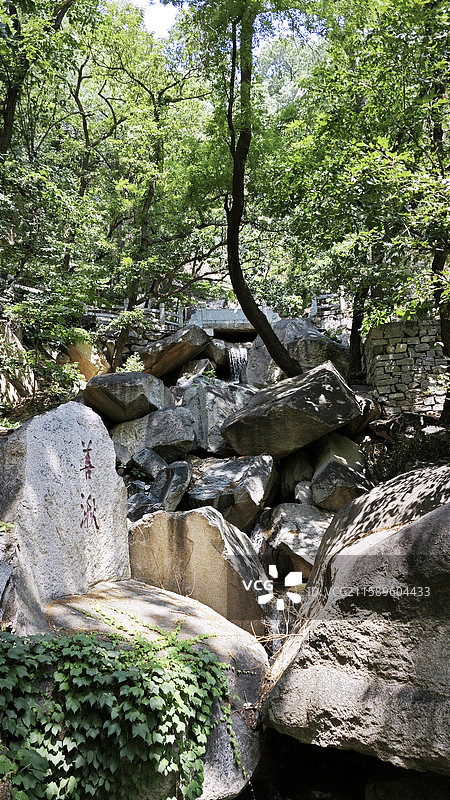

# 天津盘山风景名胜区

> 乾隆三十二盘山，松声石韵总难攀。
> "早知有此山，何必下江南。"
> 一语留崖六百年，至今风过尚潺湲。

## 写在前面

乾隆皇帝一生出巡无数，下江南六次，五台山五次，泰山九次。但如果你问他最爱哪座山，他的回答可能不是这些"名山大川"，而是北京以东、蓟州城北、一座海拔只有864米的小山--盘山。

他来过盘山三十二次，留下诗作1700余首，几乎把这座山写"尽"了。他那句"早知有盘山，何必下江南"，至今刻在山门外的石壁上，凡上山者，无不在它面前驻足一笑。

盘山不高，却有奇松、怪石、清泉、古刹、云海，五者俱全。它不像泰山那样雄、不像华山那样险，更像一位江南来的文人--书卷气足，骨子里又带着北方的硬。来盘山，不必急着登顶，慢一些，再慢一些，才能听到松针落在石头上的声音。

---

## 一、时光深处：从三国古战场到皇家行宫

### 1. 三国时代的"无终山"

盘山古名"无终山"--春秋时属无终子国，得名于此。三国时期，它已是一方名山。《三国志》载，田畴隐居无终山，曹操北征乌桓时亲访其出山，为曹操谋划运粮之路，最终助其大破乌桓。这位"无终隐士"，让盘山在历史长河里留下了第一笔清晰的人影。

到魏晋南北朝，盘山开始建寺。最古老的"感化寺"建于东晋，相传为高僧昙无兰所创。山间云雾缭绕，僧侣云集，盘山渐渐成为北方佛教重镇。

### 2. 唐辽金元的"东五台"

唐代，盘山已与五台山齐名，被称作"东五台"。李世民东征高丽时曾驻军于此，留下了"御甲"的传说。辽金时期，盘山佛教鼎盛，云罩寺、天成寺、万松寺、上方寺等相继兴建，山中僧众多达千余人。元代的盘山已成"京东第一山"，文人墨客纷至沓来，留下大量摩崖石刻。

### 3. 明清的皇家行宫

盘山真正"出圈"，是在清代。康熙皇帝第一次来盘山是1684年，他登顶后写道："盘山奇秀，洵京东第一也。"但他儿子雍正帝却更爱圆明园，盘山稍受冷落。

真正让盘山"封神"的是乾隆。自乾隆四年（1739年）首次来盘山，到嘉庆元年（1796年）最后一次，前后32次登临。他在盘山修建了"静寄山庄"，这是清代四大行宫之一（其余三处为避暑山庄、畅春园、圆明园），占地千亩，亭台楼阁散布山间。每来必住数日，每住必作诗，他的《盘山诗集》厚厚一册，几乎把山中每一块奇石、每一棵古松都写到了。

乾隆十六年，他第一次登顶盘山挂月峰，望着云海翻腾，写下了那句流传至今的："早知有盘山，何必下江南。"

### 4. 近现代的劫难与重生

19世纪末20世纪初，盘山屡遭兵燹。抗日战争时期，盘山是冀东抗日根据地的重要组成部分，"盘山义勇军"在此与日寇周旋七年之久。许多古建筑毁于战火，静寄山庄仅存遗址。

新中国成立后，盘山被列为天津市风景名胜区。1984年修复开放，2007年正式评定为国家AAAAA级旅游景区。如今，静寄山庄的部分遗址已经清理展示，山中主要古寺也已修复。

---

## 二、走遍盘山：核心景点详解

### 📍 三盘暮雨--盘山第一奇观

盘山以"三盘"分景：上盘松胜、中盘石胜、下盘水胜。"三盘暮雨"是盘山古八景之一，被列入"津门十景"。

何谓"三盘暮雨"？夏日傍晚，山间云雾骤起，下盘水汽蒸腾、中盘石壁凝滴、上盘松针含露，三个海拔段的"雨"同时出现，却又各有不同。下盘是真雨，中盘是石雨，上盘是松雨--层层叠叠，如同天人在三个高度同时洒水。乾隆对此景赞不绝口，曾作《三盘暮雨诗》二十余首。

站在三盘之间的小路上，云雾从脚下漫上来，松针上滴下露珠，石壁上渗出水痕--你会忽然理解，为什么古人把这种"立体下雨"称作神迹。

> 💡 **导游贴士**：
> 1. **最佳时机**：每年6-8月下午4-6点，雨后初晴时最容易看到。
> 2. **机位**：从入胜亭往上的山路上，回头俯视，云雾在三层盘道间流动，最易出片。
> 3. **穿什么**：哪怕外面是大晴天，进山也要带件薄外套，山里湿冷，气温比山下低5-8度。

---

### 📍 上盘松胜--古松盘虬的奇景

盘山最让人念念不忘的，是那些"长在石头里"的松树。

上盘（海拔600米以上）的松树，几乎全部生长在岩石缝隙中，根须穿透石壁，虬枝横生，姿态万千。著名的有"挂月松"、"蟠龙松"、"迎客松"、"凤翘松"等。其中"蟠龙松"已逾800年，主干平卧如龙，枝叶匍匐数丈，宛如一条苍龙盘踞山巅。

为什么这里的松树如此奇特？因为盘山岩石为花岗岩，节理发育，松籽落入裂缝后生根，根系被迫沿裂缝生长，逐渐形成扭曲的姿态。再加上山顶风大、土薄，松树长得慢，反而更显苍劲。

最负盛名的"凤翘松"长在云罩寺旁，主干斜出，树冠翘起如凤凰展翅。乾隆曾在其下打坐，赋诗曰："一松卧一石，石老松愈奇。"

> 💡 **导游贴士**：
> 1. **必拍古松**：蟠龙松（云罩寺前）、凤翘松（云罩寺旁）、迎客松（天成寺下）是盘山"三大名松"，记得合影。
> 2. **观察根部**：仔细看古松根部，几乎都"嵌"在石头里，根须裸露如龙爪，这是盘山松最奇的地方。
> 3. **别破坏松针**：盘山松生长极慢，每一根松针都是几十年甚至上百年积累。不要攀爬、折枝。

---

### 📍 中盘石胜--天成奇石博物馆

中盘（海拔300-600米）几乎是一座"露天奇石博物馆"。花岗岩经亿万年风化，形成千姿百态的奇石。

最负盛名的是"将军石"--一块高约10米的独立巨石，形似披甲将军，立于山道旁。传说唐太宗李世民东征时曾在此驻足，望石赞叹，故得名。乾隆多次在诗中提及，并题"将军石"三字于石侧。

另一奇石是"喝断石"--一道长约5米的裂缝将巨石劈为两半，传说三国时期张飞在此喝断桥梁，余威把山石都震裂了。当然，这只是民间传说，真正的成因是花岗岩的热胀冷缩与冻融风化。

中盘还有一片"石海"--上千块巨石散落山坡，最大者如屋，最小者如桌，层层叠叠如浪涛凝固。这是第四纪冰川搬运堆积的遗迹，距今约200万年，是华北地区罕见的冰川地质景观。

> 💡 **导游贴士**：
> 1. **数一数奇石**：盘山有名可考的奇石有32处，可以照着景区图一一寻找，像一场寻宝游戏。
> 2. **看摩崖石刻**：中盘沿途石刻密集，最有名的是"入胜"、"漱峡"四字，为清代名将僧格林沁所书。
> 3. **石海拍照**：石海区域建议用广角，拍出"凝固的浪涛"效果。注意安全，石面湿滑。

---

### 📍 下盘水胜--飞瀑流泉的清凉世界

下盘（海拔300米以下）是水的世界。溪流、瀑布、深潭、浅濑，构成盘山最清凉的一段。

最壮观的"三瀑"由上而下：**飞帛涧**瀑布，落差20余米，水流如白练垂落；**漱峡**瀑布，水流从两石之间喷涌而出，声如雷鸣；**红龙池**瀑布，水落深潭，相传池中有红龙潜伏，故名。

夏日盛水期，三瀑同时奔腾，整座山谷轰鸣作响，水雾弥漫。沿溪步道多有"听泉亭"、"观瀑亭"，亭中独坐，凉意沁骨，是北京周边最爽快的避暑地之一。

最有意境的是"仙人桥下"的"红桥溪"。溪水清澈见底，水下卵石五色斑斓。传说八仙之一的吕洞宾曾在此濯足，留下一块"脚印石"，至今清晰可辨（其实是水流冲蚀的自然坑洼）。

> 💡 **导游贴士**：
> 1. **最佳赏瀑时间**：6-9月雨后2-3天，水量最大，瀑布最壮观。旱季来可能只见涓涓细流。
> 2. **溯溪玩法**：下盘步道沿溪而建，可以脱鞋涉水（注意安全），是夏日最爽的玩法。
> 3. **红桥溪拍照**：上午10点前光线最佳，水面平如镜，能拍出溪底卵石的倒影。

---

### 📍 天成寺与古佛舍利塔

天成寺是盘山规模最大的古刹，始建于唐代，辽代重修，明清两代均有扩建。寺名"天成"，取"天然自成"之意--寺庙依山而建，岩石为基，古松为盖，仿佛山的一部分。

寺内最珍贵的是**古佛舍利塔**，建于辽天庆年间（1111-1120年），八角十三级密檐式砖塔，高22.6米。塔身浮雕佛像、菩萨、飞天、宝相花，是辽代密檐塔的代表作。塔下地宫曾出土释迦牟尼佛真身舍利数粒，现藏于天津博物馆。

寺前有一株"银杏王"，胸径近2米，树龄逾千年，相传为辽代所植。每年深秋，金叶满树，落地如金毯，是天成寺最美的时刻。

乾隆曾在天成寺建"行宫"，并在寺后石壁题"一片云"三字，至今犹存。

> 💡 **导游贴士**：
> 1. **看塔**：古佛舍利塔是天成寺的灵魂，绕塔三圈，可近距离欣赏辽代浮雕。绕塔方向顺时针（右绕），是佛教传统。
> 2. **古银杏**：11月初是最佳观赏期，金叶铺地，是华北最美秋景之一。
> 3. **"一片云"石刻**：在寺后山壁上，要绕到寺后才能看到。字大如斗，是乾隆御笔。

---

### 📍 挂月峰与云罩寺--登顶之路

盘山主峰挂月峰，海拔864米，因月夜云雾缭绕如月挂山顶而得名。登顶有三条路：东路（沿天成寺）、西路（沿万松寺）、中路（沿少林寺），其中东路最经典。

**云罩寺**位于挂月峰下，始建于唐，名"云盖寺"，清代改"云罩寺"。寺庙规模不大，但位置绝佳--云雾常笼罩其上，故名。乾隆多次宿于此，并在此写下《盘山云罩寺》数十首。

登顶最后一段叫"天桥"，是悬崖上凿出的石阶，仅容一人通过，两侧铁链护栏。顶峰有一块"挂月石"，传为月宫嫦娥挂月之处（实际是冰川漂砾）。站在这里，可以远眺蓟州城、于桥水库，天气好时甚至能看到北京西山。

> 💡 **导游贴士**：
> 1. **登顶方式**：体力好的步行3-4小时登顶；体力一般可乘入胜索道到万松寺，再步行1小时到挂月峰；或乘云松索道直达挂月峰下。
> 2. **最佳时间**：清晨登顶看日出云海，或下午3点后登顶看夕阳。中午山顶暴晒，避免此时登顶。
> 3. **必备物品**：水（至少1.5升）、登山杖、防晒帽、能量食品。山顶无补给。
> 4. **索道周一检修**：每周一上午索道检修（法定节假日除外），下午1点左右恢复，请提前查询。

---

## 三、漫步之后：一些不必匆匆的事

盘山的美，是分层的。下盘的水让你凉爽，中盘的石让你惊叹，上盘的松让你沉思，山顶的云让你忘记自己。

乾隆三十二次来盘山，每次必住数日。他在静寄山庄里听松、看雨、写诗、品茶，把这座山当成了自己的"另一个家"。今天的我们，没有静寄山庄可住，但仍然可以在天成寺旁的茶舍坐一坐，听溪水，看古塔，泡一杯蓟州本地的"盘山云雾"。

如果你时间充裕，强烈推荐在山下住一晚。盘山脚下的"官庄"村，有蓟州特色的农家院，能吃上地道的贴饽饽熬小鱼、炒柴鸡蛋、山庄豆腐。晚饭后散步到山门前，看看夜晚的盘山--云罩寺的灯亮了，山间零星几盏，像天上的星掉进了山里。

清晨5点起床，沿盘山公路往上行至"入胜亭"，等日出。东方渐渐泛白，山谷里云雾涌动，第一缕阳光照在挂月峰顶，整座山从黑暗中"显影"出来--那一刻，你会忽然明白乾隆为什么把这里叫做"京东第一山"。

---

## 写在最后

盘山不像五岳那样需要"征服"，它更像一个朋友，邀请你来散步。

乾隆来过三十二次，他大概也不是为了"看景"，而是为了"避世"--避开紫禁城的奏折、避开上朝的钟声、避开那些永远处理不完的国事。他在盘山的小路上走，在古松下坐，在云罩寺的窗前发呆。那些时刻，他不是皇帝，只是一个想喘口气的普通人。

我们今天来盘山，大概也是一样。我们不是为了"打卡"或者"晒图"，而是为了在松声和石韵之间，找回一点点自己。

下山时，回头看一眼。云雾从挂月峰漫下来，漫过云罩寺，漫过天成寺，漫过那些不知站了多少百年的奇石和古松。山还是那座山，松还是那些松。它们见过乾隆，也见过你。

它们什么也没说。它们只是站在那里，等下一个愿意慢下来的人。

> ✨ **游览小贴士总结**：
> - **最佳时间**：4-5月（山花）、9-10月（红叶）、6-8月（看瀑布）。避开节假日，否则索道排队1-2小时。
> - **推荐路线**：东门入 -> 入胜亭 -> 三盘暮雨 -> 元宝石 -> 天成寺 -> 古佛舍利塔 -> 万松寺 -> 云罩寺 -> 挂月峰（约5-6小时）。
> - **穿着建议**：登山鞋必备，山路湿滑。夏季防晒，冬季防滑（雪后不建议登山）。
> - **拍照指南**：三盘暮雨（云雾）、蟠龙松（古松奇姿）、将军石（侧光）、古佛舍利塔（夕阳逆光）。
> - **隐藏体验**：天成寺旁茶舍品"盘山云雾"茶；官庄村农家院吃蓟州菜；山门石刻"早知有盘山"必合影。
> - **交通**：自驾津蓟高速盘山出口下；或天津站乘津蓟铁路到蓟州北站，再换公交旅游专线11路。
> - **注意事项**：每周一上午索道检修（节假日除外）；山区手机信号弱，提前下载离线地图。

---

## 📷 景区美图

*盘山三盘暮雨*

*上盘古松奇姿*

*中盘奇石*

*下盘飞瀑*

*天成寺与古佛舍利塔*

---

## 📚 天津盘山风景名胜区小档案

| 项目 | 信息 |
|------|------|
| 景区级别 | 国家AAAAA级旅游景区 |
| 所属省份 | 天津市 |
| 所属城市 | 蓟州区 |
| 占地面积 | 约106平方公里 |
| 主峰海拔 | 挂月峰864米 |
| 始建年代 | 唐代（古刹） |
| 建议游览时间 | 1天 |
| 最佳游览季节 | 春秋两季，夏季看瀑 |

---

> 💡 **本页说明**：
> 本README由VLM增强工作流整理生成，结合历史文献、实地考察资料与导游经验。
> 坐标、图片、简介均来自公开资料，仅供参考。游览请以景区最新公告为准。
