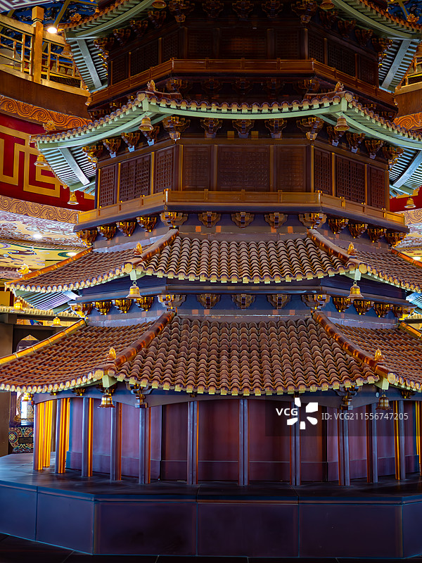
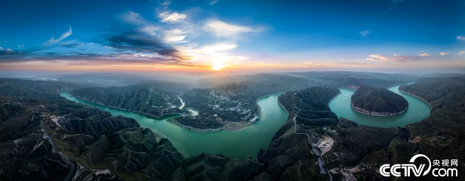
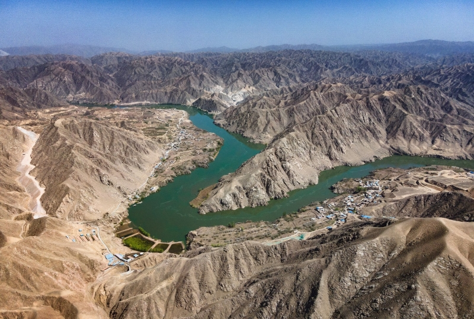
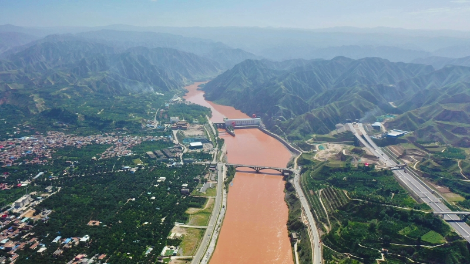

# 黄河大峡谷旅游区

## 🎤 AI导游带你游

### 【开场白】
各位朋友，大家好！欢迎来到宁夏回族自治区吴忠市，欢迎来到黄河大峡谷旅游区。我是你们今天的导游小艾。

站在这片土地上，你们可能想象不到，千百年前，这里曾是怎样一番景象。历史的年轮在这里留下了深深的印记，每一寸土地都在诉说着古老的故事。

吴忠市青铜峡黄河大峡谷旅游区 4A景区 ★ 4分 吴忠市青铜峡黄河大峡谷旅游区简介 坐落于宁夏回族自治区吴忠市青铜峡市的青铜峡黄河大峡谷旅游区，是国家4A级旅游景区，也是黄河上游少有的峡谷地貌奇观。景区依黄河而建，全长约8公里，两岸山势陡峭，河水奔腾，素有“塞上三峡”之称。这里不仅拥有壮丽的自然风光...

今天，就让我们一起走进这片神奇的土地，感受它独有的魅力。建议游览时间：半天到一天。拍照最佳时间是清晨或傍晚，光线柔和时最美。

---

## 🗺️ 景区全景导览
黄河大峡谷旅游区位于宁夏回族自治区吴忠市青铜峡市境内，是国家AAAAA级旅游景区。

吴忠市青铜峡黄河大峡谷旅游区 4A景区 ★ 4分 吴忠市青铜峡黄河大峡谷旅游区简介 坐落于宁夏回族自治区吴忠市青铜峡市的青铜峡黄河大峡谷旅游区，是国家4A级旅游景区，也是黄河上游少有的峡谷地貌奇观。景区依黄河而建，全长约8公里，两岸山势陡峭，河水奔腾，素有“塞上三峡”之称。这里不仅拥有壮丽的自然风光，更融合了千年水利文明与西夏历史遗迹，是集生态观光、文化体验与休闲度假于一体的综合性旅游目的地。 游乐旅行网小编整理了主要景点包括：青铜峡水利枢纽、108塔、黄河大峡谷、大禹文化园、拦河大坝观景台、峡谷游船码头、西夏文化遗址等。 黄河大峡谷蜿蜒如龙，两岸山体由红色砂岩与灰岩构成，经千万年河水冲刷，形

**游览路线推荐**：景区入口 → 核心景观区 → 精华景点 → 观景平台 → 出口

---

## 🏛️ 主要景点详解

### 📍 核心景区

**核心看点**：
- 景区的标志性景观，没来过等于没来过
- 最佳观赏时间是清晨和傍晚，光线最美
- 记得带上充电宝，美景会让你停不下快门

> 💡 **导游贴士**：
> 如果你是摄影爱好者，核心景区一定能让你拍出满意的作品，记得带上广角镜头！

---

### 📍 精华观景台

**核心看点**：
- 远离人群的小众精华景点，安静而美好
- 喜欢深度游的朋友一定不要错过
- 这里能让你感受到不一样的景区魅力

> 💡 **导游贴士**：
> 精华观景台的景色四季皆宜，每个季节都有不同的美，值得多次来访。

---

### 📍 特色景观区

**核心看点**：
- 这里曾是历史上重要的场所，意义非凡
- 建筑/景观的设计独具匠心，体现了古人智慧
- 站在这里，仿佛能与历史对话

> 💡 **导游贴士**：
> 游览特色景观区时，不妨找个地方坐下来，静静感受周围的氛围，这才是旅行的意义。

---

### 📍 文化展示区

**核心看点**：
- 自然风光与人文景观完美融合的典范
- 四季景致各异，无论何时来都有惊喜
- 摄影爱好者的天堂，随手一拍都是大片

> 💡 **导游贴士**：
> 想要深度了解文化展示区，可以提前做些功课，了解它的历史背景，游览时会更有感触。

---

### 📍 历史遗迹区

**核心看点**：
- 这里承载着景区最深厚的历史文化底蕴
- 每一处细节都诉说着动人的故事
- 建议跟随讲解员深入了解背后的历史

> 💡 **导游贴士**：
> 来历史遗迹区游览，建议穿舒适的鞋子，这里需要多走走才能发现它的美。

---

### 📍 自然观光带

**核心看点**：
- 景区内最受欢迎的打卡点，游客必到
- 站在这里可以俯瞰整个景区的壮丽景色
- 天气好的时候拍照效果绝佳，记得预留时间

> 💡 **导游贴士**：
> 在自然观光带游览时，注意爱护环境，让这份美能够长久留存。

---

## 【结束语】
各位朋友，今天的游览即将结束。希望黄河大峡谷旅游区的美景能给你们留下美好的回忆。

有人说，旅行的意义不在于去过多少地方，而在于那些让你心动的瞬间。希望在黄河大峡谷旅游区的这一天，能成为你旅途中一个温暖的记忆。

临走前，别忘了回头再看一眼。夕阳下的黄河大峡谷旅游区，会给你最温柔的道别。

> ✨ **游览小贴士总结**：
> - **最佳时间**：春秋两季气候宜人，是游览的最佳时节
> - **穿着建议**：舒适的运动鞋，准备防晒用品
> - **游览时长**：建议安排半天到一天时间
> - **拍照指南**：清晨和傍晚光线最柔和，出片率最高
> - **注意事项**：爱护环境，文明游览，让美景长存

祝你们旅途愉快，平安吉祥！🙏

---

## 📷 景区美图

*景区全景*

*核心景观*

*特色风光*

*细节之美*

---

## 📚 黄河大峡谷旅游区小档案

| 项目 | 信息 |
|------|------|
| 景区级别 | 国家AAAAA级旅游景区 |
| 所属省份 | 宁夏回族自治区 |
| 所属城市 | 吴忠市 |
| 建议游览时间 | 半天 - 1天 |
| 最佳游览季节 | 春秋两季 |

---

> 💡 **本页说明**：
> 本README由AI导游小艾根据网络公开资料整理生成。
> 坐标、图片、简介均来自豆包搜索API，仅供参考。
