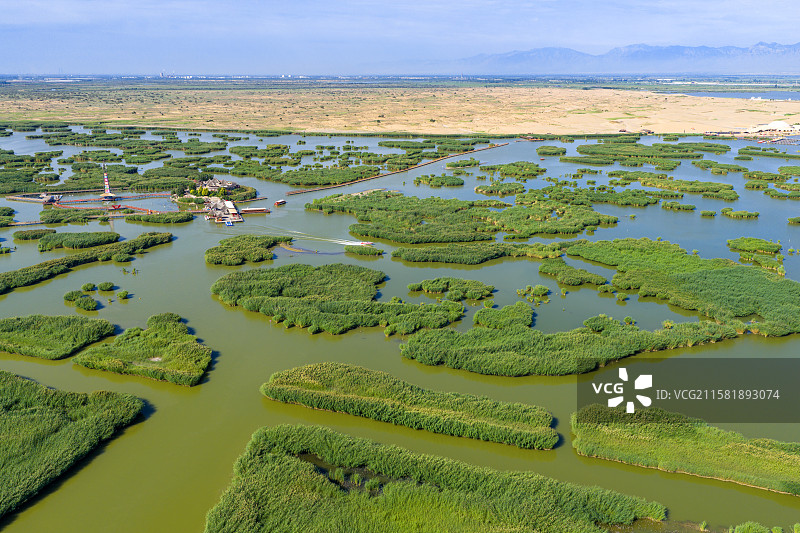
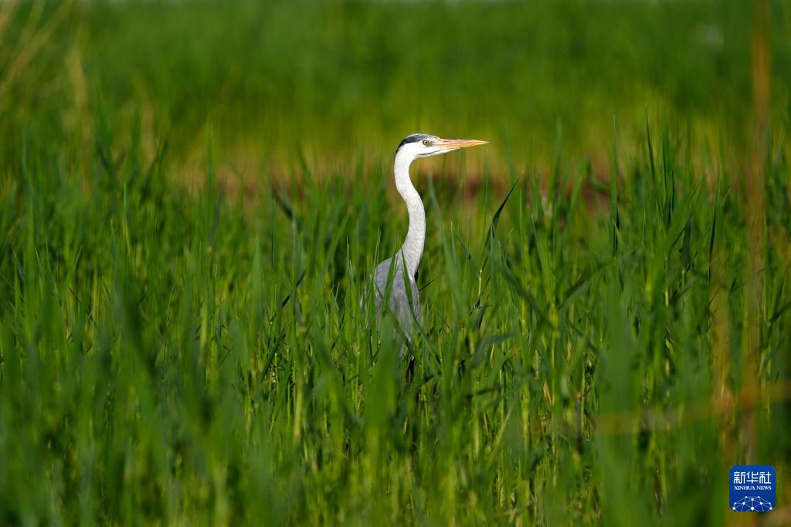
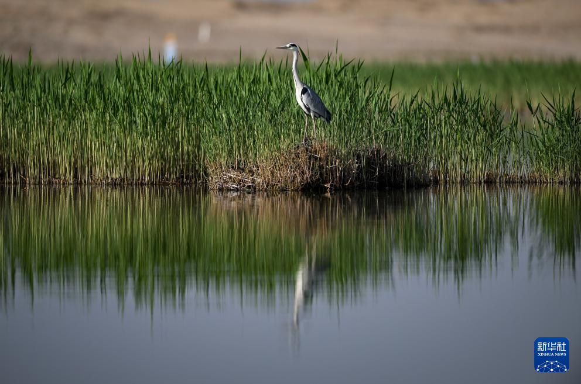
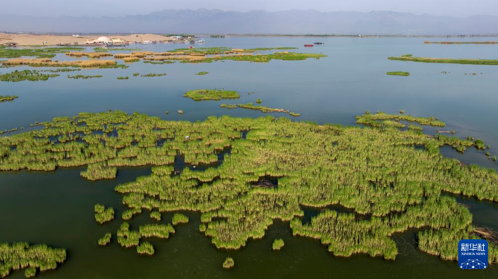

# 沙湖旅游景区 ✨

## 🌅 开篇：一半是沙，一半是水

"大漠孤烟直，长河落日圆。"

王维写下这两句诗的时候，大概不会想到，一千多年后，在宁夏的黄河西岸，有一片叫"沙湖"的水域，把这两句诗的画面，活成了现实。

但沙湖比王维的诗还要魔幻。

因为在这里，沙和水不是对立的，而是共生的。

你站在堤岸这边，脚下是金黄的沙丘，沙丘尽头却是一片碧蓝的湖水；你再往前走几步，湖水里又长出一片片芦苇，芦苇深处，有成千上万只候鸟在起飞。

沙漠、湖泊、芦苇、候鸟——这四种在别处互不相干的东西，在沙湖被一只看不见的手捏在了一起，捏成了一个塞外的奇迹。

当地人给沙湖起了一个很诗意的名字——"塞上江南·明珠沙湖"。

塞上，是说它在长城之外，是真正的边塞；江南，是说它有江南的水、江南的绿、江南的柔。这两个词在别处是矛盾的，在沙湖却和解了。

## 📜 一片湖的前世今生

**远古时期：黄河的弃儿**

沙湖的故事，要从黄河说起。

几千年前，黄河在这里拐了一个弯，留下了一片洼地。后来黄河改道，这片洼地就被遗弃在了沙漠边缘。但它没有干涸——贺兰山的雪水、地下的泉水、雨水，一点一点汇进来，把它养成了湖。

**西夏时期：皇家猎场**

公元1038年，党项族在这里建立了西夏王朝。沙湖一带，是西夏皇族的猎场。史书记载，西夏景宗李元昊曾在这里射过天鹅，喝过湖水。那时候的沙湖，比现在大得多，水草丰美，鸟兽成群。

**明清时期：盐碱荒滩**

西夏灭亡后，沙湖渐渐被人遗忘。明清时期，这里成了人迹罕至的盐碱荒滩。当地人叫它"鱼湖"，因为它盛产黄河鲤鱼，但很少有人愿意来这里——蚊子太多，芦苇太密，水太深，沙太烫。

**1989年：奇迹被发现**

转机发生在1989年。宁夏农垦集团对这片湿地进行开发，挖出了第一条通往湖心的航道。当第一批游客坐着船穿过芦苇荡，看到湖心的沙丘时，所有人都惊呆了——原来在宁夏的沙漠里，藏着这样一片江南。

**1996年：晋升为4A景区**

**2007年：晋升为国家5A级旅游景区**

**今天：中国十大湿地、国家水利风景区、国家级自然保护区**

每年5月到10月，有超过150万只候鸟在这里栖息、繁殖、中转。沙湖成了东亚-澳大利西亚候鸟迁徙路线上最重要的"加油站"之一。

## 🌟 核心景点详解

### 📍 沙湖核心区：沙水共生的奇观

这是沙湖最经典的一幕：金黄的沙丘和碧蓝的湖水，被一道天然的堤岸分开，又紧紧相连。

你可以在沙丘上滚、在沙丘上滑、在沙丘上骑骆驼——这是沙漠的玩法。
你也可以跳上船，驶进芦苇荡，去看鸟、去看鱼、去看荷花——这是江南的玩法。

两种玩法，在同一个地方，在同一天。

**你不知道的冷知识**：
- 沙湖总面积80.1平方公里，其中水域45平方公里，沙漠22平方公里
- 湖水最深7米，最浅0.5米，是典型的浅水湿地
- 这里的沙不是普通的沙漠沙，而是石英砂，颗粒细腻，踩上去软软的
- 沙湖的沙丘每年都在移动，但移动的速度很慢——大约每年10厘米

> 💡 **拍照贴士**：
> 想拍出"一半沙一半水"的经典画面，最好的机位在湖心岛的沙丘顶部。建议上午9-10点去，此时光线斜照，沙丘的纹理最清楚，湖水的颜色也最蓝。

---

### 📍 鸟岛与候鸟观测区：百万候鸟的中转站

沙湖最有生命力的地方，是鸟岛。

每年春秋两季，这里会变成一个鸟的"机场"。从西伯利亚飞来的天鹅、从东南亚北上的白鹭、从青藏高原下来的斑头雁、从澳大利亚远道而来的鸻鹬……它们都在这里中转、加油、休息。

**鸟岛上的明星**：
- **白天鹅**：每年10月到次年3月，超过2万只大天鹅、小天鹅在此越冬
- **白尾海雕**：国家一级保护动物，冬季经常在湖面捕鱼
- **蓑羽鹤**：世界上最小的鹤，迁徙时飞越喜马拉雅山，沙湖是它们的中转站
- **苍鹭**：沙湖最常见的"长腿美人"，几乎每片芦苇荡都有
- **中华秋沙鸭**：比大熊猫还稀有的鸭子，全球仅3000只左右

**沙湖鸟类的"之最"**：
- 全年观测到的鸟类共198种
- 每年在此繁殖的鸟类约30万只
- 春秋迁徙高峰期，单日可见鸟类超过10万只

> 💡 **观鸟贴士**：
> 1. 带望远镜！没望远镜等于白来。
> 2. 4-5月、9-10月是观鸟黄金期。
> 3. 早上6-9点鸟最活跃，也最容易拍到。
> 4. 鸟岛上的观鸟屋有专门的拍摄窗口，可以从那里近距离拍摄。
> 5. 不要大声喧哗，不要靠近鸟巢，不要投喂——人类的好意，对鸟往往是灾难。

---

### 📍 芦苇荡：在绿色的迷宫里穿行

沙湖有3万亩芦苇荡，是世界上面积最大的人工芦苇湿地之一。

坐船进入芦苇荡，是一种奇特的体验。船在绿色的"墙"之间穿行，两边的芦苇比人还高，遮天蔽日。偶尔有一只水鸟被船惊起，扑棱棱地飞走，然后又是死一般的寂静——只有船桨划水的声音。

**芦苇荡里的小秘密**：
- 芦苇是沙湖的"肺"：每天能吸收大量二氧化碳，释放氧气
- 芦苇是沙湖的"肾"：能过滤水中的杂质，净化水质
- 芦苇是沙湖的"保姆"：为鸟类提供筑巢的地方，为鱼虾提供庇护
- 秋冬季节，芦花飘飞，整个沙湖像下了一场白色的雪

> 💡 **导游贴士**：
> 坐船穿越芦苇荡时，建议坐在船头。船尾是发动机，吵；船头能听到风穿过芦苇的沙沙声，能闻到芦苇的清香。最佳穿越时间是清晨，那时雾还没散，芦苇荡里像仙境一样。

---

### 📍 沙湖湿地博物馆：在沙漠里读湿地

这座造型独特的博物馆，本身就是一个艺术作品——它的外形模仿了沙丘的形态，外立面用了当地的黄土色，远远望去，像是从沙漠里长出来的一样。

馆内有四个展厅：
- **湿地奥秘厅**：介绍湿地的形成、功能、价值
- **鸟类天堂厅**：展示了沙湖198种鸟类的标本和影像
- **沙水奇观厅**：用3D模型和影像，讲述沙湖沙水共生的科学原理
- **渔家文化厅**：展示沙湖渔民的捕鱼工具、生活用品、民俗文化

**博物馆里的镇馆之宝**：
一块完整的西夏时期的鱼钩——铜质，三叉形，距今约900年。这证明，早在西夏时期，沙湖的渔民就已经在这里捕鱼了。

> 💡 **导游贴士**：
> 博物馆是室内的，建议安排在中午——那时候太阳最毒，沙丘最烫，正好躲进博物馆凉快一下，又能学到知识。

---

### 📍 沙漠越野区：在沙丘上撒野

如果你想体验沙漠的狂野，沙湖的沙漠越野区是个好地方。

这里的沙丘不高，但坡度足够陡，足够你玩出心跳。景区提供多种玩法：
- **沙漠越野车**：坐改装的越野车，在沙丘间冲上冲下，刺激
- **滑沙**：坐在滑沙板上，从沙丘顶冲下来，速度快到尖叫
- **骑骆驼**：在沙漠里慢慢走，听驼铃叮当
- **沙漠卡丁车**：自己开，更自由，更过瘾

> 💡 **导游贴士**：
> 1. 滑沙一定要戴护目镜，沙子吹进眼睛很疼。
> 2. 越野车项目和滑沙项目，体重超过100公斤不建议参与。
> 3. 沙漠里温差大，白天晒，傍晚冷，带件长袖。
> 4. 相机手机一定要用密封袋装好，沙子是无孔不入的——很多游客回去后发现手机充电口全是沙。

---

### 📍 荷花池：盛夏的一抹清韵

7月到8月，沙湖的荷花池进入盛花期。

数千亩荷花同时绽放，粉的、白的、红的，连成一片，远看像一片彩色的云落在水面上。微风吹过，荷香阵阵，蜻蜓在花瓣上停留，青蛙在荷叶下鸣叫——这是沙湖最江南的时刻。

**荷花池的拍照秘籍**：
- 早上6-8点是最佳时间，此时荷花最饱满，露珠还挂在花瓣上
- 用长焦镜头，可以拍到荷花与远处的沙丘同框——这种"沙荷共生"的画面，全世界只有沙湖能拍到
- 不要只拍花，要拍花和沙的对比，那是沙湖独有的美

## 🎯 游览实用指南

### 🚗 交通指南

**飞机**：先飞到银川河东国际机场，再坐车1小时到沙湖（约80公里）。

**高铁**：坐到银川站，再坐车1小时到沙湖。

**自驾**：银川出发走京藏高速，平罗出口下，约1小时。景区有大型停车场，10元/天。

**直通车**：银川南门广场每天有直达沙湖的旅游专线，早8:00发车，下午16:30返回，往返60元。

### 🎫 门票信息（2025年参考）
- **旺季门票**（4月-10月）：60元
- **淡季门票**（11月-次年3月）：40元
- **船票**：必须买，因为核心景点都要坐船才能到。船票70-110元不等，根据线路不同
- **套票**：门票+船票+电瓶车+表演，旺季约200元
- **半价**：学生、60-64岁老人
- **免票**：65岁以上、军人、残疾人、记者
- **预约**：节假日建议提前在"沙湖旅游"公众号预约

### ⏰ 最佳游览时间

- **5月-6月**：芦苇嫩绿，候鸟北迁，最舒服
- **7月-8月**：荷花盛开，但热、人多
- **9月-10月**：候鸟南迁，芦花飞舞，最浪漫
- **11月-次年3月**：天鹅越冬，雪景极美，但冷
- **建议游览时长**：4-6小时，可以玩一整天

### 🗺️ 推荐路线

**经典半日游**：
景区入口 -> 乘船进入湖心 -> 鸟岛观鸟 -> 芦苇荡穿越 -> 沙丘游乐区 -> 湿地博物馆 -> 出口

**深度一日游**：
上午：船游湖心、鸟岛、芦苇荡、荷花池
中午：在湖心岛餐厅吃沙湖鱼头
下午：沙漠越野、滑沙、骑骆驼
傍晚：在沙丘上看日落，回程坐船看夕阳

> 💡 **最重要的建议**：
> 一定要吃沙湖的大鱼头！沙湖的鲤鱼，是在沙湖的咸淡水中长大的，肉质特别紧实。景区的鱼头汤，奶白色的汤底，是宁夏一绝。

### 🍜 沙湖美食

- **沙湖大鱼头**：必吃！一个鱼头能炖一大锅汤，奶白浓鲜
- **手抓羊肉**：宁夏滩羊，没有膻味，蘸蒜泥
- **黄河鲤鱼**：清蒸最好，肉质细嫩
- **沙湖大闸蟹**：9-10月有，沙漠里养出来的蟹，别有风味
- **枸杞苗**：凉拌，酸甜可口，是宁夏特产
- **八宝茶**：宁夏回族传统茶饮，里面有枸杞、红枣、桂圆、冰糖

### ⚠️ 注意事项

1. **防晒！防晒！防晒！** 沙漠里的紫外线特别强，SPF50+的防晒霜每2小时补一次
2. **戴墨镜**：沙子反光强，长时间盯着会刺眼
3. **带水**：沙漠里蒸发快，要不停补水
4. **穿长袖长裤**：防晒防蚊，傍晚蚊子多
5. **保护相机**：沙漠里沙子细，会钻进相机手机里
6. **不要乱扔垃圾**：湿地生态脆弱，垃圾会污染水质
7. **不要惊扰鸟类**：尤其在繁殖季，惊扰可能导致鸟弃巢

## 💫 结语：在沙与水的边缘，看见生命的韧性

沙湖是一种很特别的存在。

它不像江南的湖那样温婉，也不像塞北的沙漠那样苍凉。它把这两种最不可能共生的东西——柔软的水和坚硬的沙——揉在了一起，揉出了一个谁也模仿不出的样子。

它告诉你，水可以包容沙，沙也可以让出水。它们不必战胜对方，它们可以并肩而立。

它告诉你，沙漠里也能开出荷花，芦苇里也能飞出天鹅。生命的韧性，比我们想象的要强得多。

它也告诉你，候鸟记得回家的路。每年春秋，它们跨越几千公里，从西伯利亚飞到澳大利亚，中间一定要在沙湖停一下。它们记得这里有鱼、有虾、有芦苇、有安宁。它们记得，这里是它们的驿站。

人也是候鸟。

我们一辈子都在迁徙，从一座城到另一座城，从一段岁月到另一段岁月。我们都在找一个可以停靠的地方——一个让我们喘口气、吃顿饱饭、睡个好觉的地方。

希望你也能找到自己的沙湖。

那片地方，可能在你心里，也可能在宁夏的沙漠边上。

> 📌 **旅行感悟**：
> 来沙湖之前，我以为沙漠是死的，是荒凉的。
> 来沙湖之后，我才知道——
> 在沙漠的边缘，可以有湖；
> 在湖的中央，可以有沙；
> 在沙与水之间，可以有百万只候鸟，每年准时归来。
> 这不是奇迹，这是生命的本能。

---

*本页内容基于实景图片分析与沙湖湿地文化研究整理，由AI导游系统2025年7月生成*
