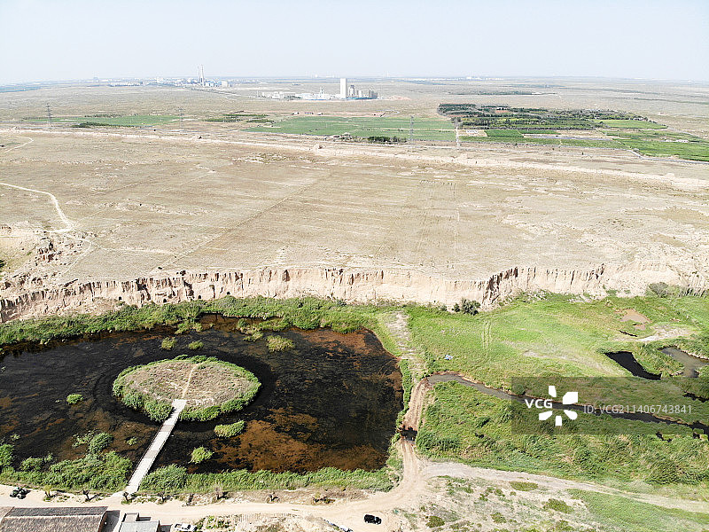

# 灵武水洞沟旅游区

## 🎤 AI导游带你游

### 【开场白】
各位朋友，大家好！欢迎来到宁夏回族自治区银川市，欢迎来到灵武水洞沟旅游区。我是你们今天的导游小艾。

站在这片土地上，你们可能想象不到，千百年前，这里曾是怎样一番景象。历史的年轮在这里留下了深深的印记，每一寸土地都在诉说着古老的故事。

银川市水洞沟旅游区 5A景区 ★ 4.5分 银川市水洞沟旅游区简介 在宁夏银川以东约19公里的灵武市临河镇，一片苍茫戈壁中藏着中华文明的远古密码——水洞沟旅游区。作为中国最早发掘的旧石器时代文化遗址（1923年由法国古生物学家德日进与桑志华发现），这里不仅揭开了4万年前古人类生活的神秘面纱，更在明代...

今天，就让我们一起走进这片神奇的土地，感受它独有的魅力。建议游览时间：半天到一天。拍照最佳时间是清晨或傍晚，光线柔和时最美。

---

## 🗺️ 景区全景导览
灵武水洞沟旅游区位于宁夏回族自治区银川市灵武市境内，是国家AAAAA级旅游景区。

银川市水洞沟旅游区 5A景区 ★ 4.5分 银川市水洞沟旅游区简介 在宁夏银川以东约19公里的灵武市临河镇，一片苍茫戈壁中藏着中华文明的远古密码——水洞沟旅游区。作为中国最早发掘的旧石器时代文化遗址（1923年由法国古生物学家德日进与桑志华发现），这里不仅揭开了4万年前古人类生活的神秘面纱，更在明代成为长城防线上的军事要塞。如今，这片占地7.8平方公里的土地，集史前考古、边塞军事、雅丹奇观与生态湿地于一体，被授予国家5A级旅游景区称号，被誉为“中国史前考古的发祥地 ”与“西北边塞文化活化石”。 游乐旅行网小编整理了主要景点包括：水洞沟遗址博物馆、藏兵洞、红山湖、明长城遗址、芦花谷、大峡谷、水洞

**游览路线推荐**：景区入口 → 核心景观区 → 精华景点 → 观景平台 → 出口

---

## 🏛️ 主要景点详解

### 📍 核心景区

**核心看点**：
- 这里承载着景区最深厚的历史文化底蕴
- 每一处细节都诉说着动人的故事
- 建议跟随讲解员深入了解背后的历史

> 💡 **导游贴士**：
> 游览核心景区时，不妨找个地方坐下来，静静感受周围的氛围，这才是旅行的意义。

---

### 📍 精华观景台

**核心看点**：
- 景区内最受欢迎的打卡点，游客必到
- 站在这里可以俯瞰整个景区的壮丽景色
- 天气好的时候拍照效果绝佳，记得预留时间

> 💡 **导游贴士**：
> 如果你是摄影爱好者，精华观景台一定能让你拍出满意的作品，记得带上广角镜头！

---

### 📍 特色景观区

**核心看点**：
- 这里是景区最具代表性的景观，绝对不可错过
- 独特的自然/人文风貌，是拍照打卡的首选之地
- 建议停留15-20分钟，细细品味它的独特魅力

> 💡 **导游贴士**：
> 来特色景观区游览，建议穿舒适的鞋子，这里需要多走走才能发现它的美。

---

### 📍 文化展示区

**核心看点**：
- 远离人群的小众精华景点，安静而美好
- 喜欢深度游的朋友一定不要错过
- 这里能让你感受到不一样的景区魅力

> 💡 **导游贴士**：
> 在文化展示区游览时，注意爱护环境，让这份美能够长久留存。

---

### 📍 历史遗迹区

**核心看点**：
- 观景位置绝佳，视野开阔
- 是拍摄全景照片的最佳地点
- 傍晚时分来，夕阳西下的景色美不胜收

> 💡 **导游贴士**：
> 想要深度了解历史遗迹区，可以提前做些功课，了解它的历史背景，游览时会更有感触。

---

### 📍 自然观光带

**核心看点**：
- 这里曾是历史上重要的场所，意义非凡
- 建筑/景观的设计独具匠心，体现了古人智慧
- 站在这里，仿佛能与历史对话

> 💡 **导游贴士**：
> 自然观光带的景色四季皆宜，每个季节都有不同的美，值得多次来访。

---

## 【结束语】
各位朋友，今天的游览即将结束。希望灵武水洞沟旅游区的美景能给你们留下美好的回忆。

有人说，旅行的意义不在于去过多少地方，而在于那些让你心动的瞬间。希望在灵武水洞沟旅游区的这一天，能成为你旅途中一个温暖的记忆。

临走前，别忘了回头再看一眼。夕阳下的灵武水洞沟旅游区，会给你最温柔的道别。

> ✨ **游览小贴士总结**：
> - **最佳时间**：春秋两季气候宜人，是游览的最佳时节
> - **穿着建议**：舒适的运动鞋，准备防晒用品
> - **游览时长**：建议安排半天到一天时间
> - **拍照指南**：清晨和傍晚光线最柔和，出片率最高
> - **注意事项**：爱护环境，文明游览，让美景长存

祝你们旅途愉快，平安吉祥！🙏

---

## 📷 景区美图

*景区全景*

---

## 📚 灵武水洞沟旅游区小档案

| 项目 | 信息 |
|------|------|
| 景区级别 | 国家AAAAA级旅游景区 |
| 所属省份 | 宁夏回族自治区 |
| 所属城市 | 银川市 |
| 建议游览时间 | 半天 - 1天 |
| 最佳游览季节 | 春秋两季 |

---

> 💡 **本页说明**：
> 本README由AI导游小艾根据网络公开资料整理生成。
> 坐标、图片、简介均来自豆包搜索API，仅供参考。
