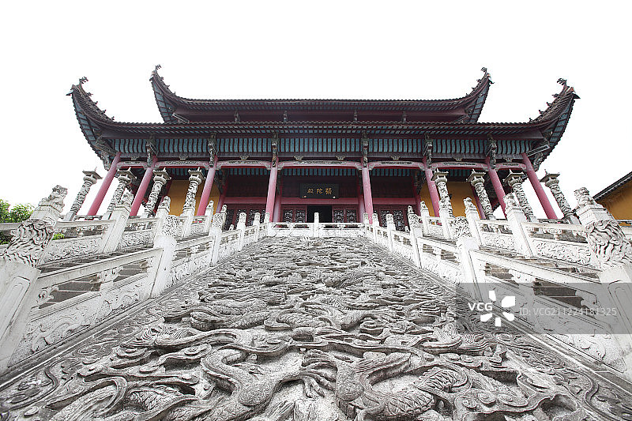
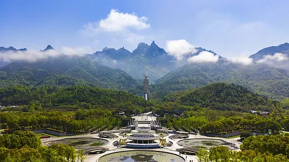
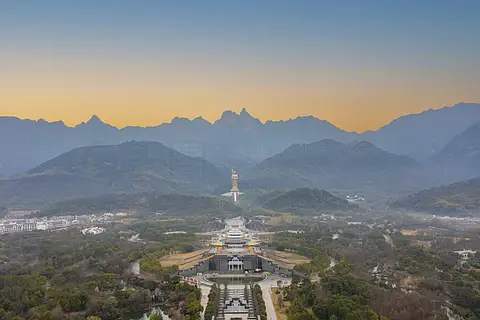

# 九华山 ✨

## 🏛️ 开篇：地狱不空，誓不成佛

"地狱不空，誓不成佛。众生度尽，方证菩提。"

这是地藏王菩萨的誓言。

而九华山，就是地藏王菩萨的道场。

在中国佛教四大名山里，九华山可能不是最有名的，不是最高的，也不是最壮观的。但它一定是最"接地气"的那一个。

在安徽南部的长江边上，有这样一座山。九十九座山峰，像一朵盛开的莲花。山上有99座寺庙，住着1000多个出家人。每天清晨四点钟，晨钟响起，整个山都醒了。

一千多年来，无数的人来到这座山。他们来烧香，来许愿，来还愿，来寻求心灵的慰藉。他们相信，地藏王菩萨会听到他们的心愿。

2019年，九华山被列入《世界文化与自然双重遗产名录》。联合国教科文组织说："九华山是中国佛教名山的杰出代表，是人与自然和谐相处的典范。"

但对于普通人来说，九华山不是什么"遗产"。它是一个能让人心静下来的地方。

## 📜 一座山，一千年

**公元719年 金乔觉渡海而来**
这一年，一个24岁的新罗国王子，坐船渡海，来到了中国。他的名字叫金乔觉。他在九华山找到了一个山洞，就在那里住了下来，修行。这一住，就是75年。

**公元794年 肉身成圣**
金乔觉99岁圆寂。三年后，人们打开他的墓，发现他的肉身完好无损，就像睡着了一样。人们这才知道，原来他是地藏王菩萨的化身。

从此，九华山成为了地藏王菩萨的道场。

**明清 香火鼎盛**
明清两代是九华山的黄金时代。高峰时期，山上有300多座寺庙，4000多个出家人。全国各地的人，千里迢迢，一步一拜地来到九华山，烧香许愿。

"上有九华，下有普陀。"
九华山，成为了中国人心中最灵验的山之一。

---

## 🌟 核心景观详解

### 📍 化城寺：九华山的开山祖寺

这是九华山的第一座寺庙，也是九华山的"心脏"。

公元401年，就有僧人在这里建寺修行。金乔觉来了以后，把这里扩建成了九华山的主寺。一千多年来，所有来九华山的人，第一个要去的地方，就是化城寺。

寺庙现在是九华山历史文物馆。里面最有名的，是那口大钟——幽冥钟。

"杨花落尽子规啼，闻道龙标过五溪。"
李白写的这首诗，写的就是九华山。李白当年在九华山，就是住在化城寺里，听着这口钟的声音。

**你不知道的化城寺**：
- 寺庙门口的那对石狮子，是宋代的，已经站在这里一千年了
- 藏经楼里藏着明朝的《藏经》，是九华山的镇山之宝
- 寺庙门口的那口池塘，叫"月牙池"，据说金乔觉当年就在这里放生

> 💡 **导游贴士**：
> 不要急着烧香。就在寺庙的院子里坐一会儿。
> 听听钟声，听听念经的声音，
> 看着来来往往的香客，
> 你会突然觉得，
> 什么烦恼，都不重要了。

---

### 📍 肉身宝殿：金乔觉的肉身

这是九华山最神圣的地方。

金乔觉的肉身，就安放在这座大殿下面的塔里。

一千二百多年了。

无数次的兵荒马乱，无数次的天灾人祸，无数次的王朝更迭。但这座塔，一直都在。

大殿门口挂着一块匾，上面写着："众生度尽，方证菩提；地狱不空，誓不成佛。"

这是地藏王菩萨的誓言。

很多人来九华山，什么景点都不看，就来肉身宝殿。他们绕着大殿走，一圈，两圈，三圈……嘴里念着"南无大愿地藏王菩萨"。

他们说，在这里许愿，最灵。

**你不知道的肉身宝殿**：
- 大殿建在一个台阶上，一共有99级台阶，对应金乔觉活了99岁
- 每年农历七月三十（地藏王圣诞），这里会举行盛大的法会，几万人来朝拜
- 大殿里面不让拍照，不是因为别的，是因为这里太神圣了

---

### 📍 天台峰：九华山的最高点

"不上天台，等于没来。"

天台峰是九华山的最高点，海拔1306米。站在天台上，脚下是九十九座山峰，像一朵盛开的莲花。如果运气好，还能看到云海——整个山都在云里，像仙境一样。

山顶上有一座寺庙，叫天台寺。寺门口有一块石头，上面写着"非人间"三个大字。

站在那里，你真的会觉得，自己不在人间了。

**上天台的两种方式**：
- **徒步**：从凤凰松开始，爬7.5公里，约3小时，沿途风景很好
- **索道**：坐索道到半山腰，然后再爬半小时到山顶，省力气

**最佳时间**：
- 凌晨看日出，是九华山最美的时刻
- 雨过天晴，云海概率最大

> 💡 **真心话**：
> 爬天台真的很累。
> 但是当你站在山顶，
> 看着脚下的云海，
> 看着远处的九十九座山峰，
> 你会觉得，
> 一切都值了。

---

### 📍 百岁宫：五百岁的肉身

百岁宫在九华山的东崖顶上，是一座建在悬崖上的寺庙。

这里供奉着明代高僧无瑕禅师的肉身。

无瑕禅师活了126岁，在山洞里修行了一百年。他圆寂后，肉身不腐，被明朝崇祯皇帝封为"应身菩萨"。

现在，他的肉身还在百岁宫里，已经快五百年了。

很多人来百岁宫，不是来看风景的，是来看看这位活了126岁的老和尚。

他们想知道，一个人，在山洞里，一个人，住了一百年，到底是怎么过来的。

---

### 📍 九华街：佛国里的人间

很多名山，山上只有寺庙，没有人。但九华山不一样。

九华山的半山腰，有一条九华街。说是"街"，其实是一个完整的小镇。有银行，有邮局，有菜市场，有超市，有学校，有酒店，有民宿。当然，最多的还是寺庙。

早上，你能看到和尚、尼姑在菜市场买菜。
中午，你能看到出家人在面馆里吃素面。
晚上，整个小镇都安静下来，只有寺庙的灯光亮着。

这就是九华街最特别的地方——它不是一个"景区"，它是一个生活的地方。

佛就在人间，人间就是佛国。

---

## 🙏 来九华山，到底是为了什么

很多人问：九华山到底灵不灵？

答案是：有人觉得灵，有人觉得不灵。

但这不重要。

重要的是，当你站在肉身宝殿，看着那些虔诚的香客，看着那些一步一拜的人，看着那些脸上写满了希望的面孔——你会突然发现，原来这个世界上，还有人相信一些看不见摸不着的东西。

原来这个世界上，还有希望。

这就够了。

地藏王菩萨说："地狱不空，誓不成佛。"

其实这句话还有另一层意思——只要还有一个人在受苦，我就陪着他。

这就是九华山最让人感动的地方。

它不是一座高高在上的山。
它是一座陪着你受苦、陪着你许愿、陪着你等待的山。

---

## 🎯 游览实用指南

### 🚗 交通指南

**怎么到九华山**：
- **高铁**：池州站，出站后坐直达九华山的大巴，20元/人，约1小时
- **飞机**：池州九华山机场，然后坐大巴到九华山，约1小时
- **自驾**：可以直接开到九华街（山上的小镇），很方便
- **景区大巴**：50元/人，山下游客中心到九华街往返，各景点之间也可以坐

### 🎫 门票信息（2025年参考）
- **大门票**：160元，3天有效
- **景区大巴**：50元，必买
- **天台索道**：上行85元，下行75元
- **花台索道**：上行90元，下行80元
- **百岁宫缆车**：上行55元，下行55元
- **半价票**：学生、60-64岁老人
- **免票**：65岁以上、军人、残疾人、记者、出家人
- **预约**：关注"九华山"公众号预约

### ⏰ 最佳游览时间
- **春秋季（3-5月、9-11月）**：天气最好，不冷不热
- **夏季（6-8月）**：避暑圣地，山上只有20多度
- **冬季（12-2月）**：雪景特别美，人特别少，门票还便宜
- **农历七月三十**：地藏王圣诞，九华山最热闹的时候，全山都是人
- **建议游览时长**：2天1夜是标配，3天2夜最佳

### 🗺️ 推荐路线

**经典两日游**：
- **第一天**：九华街 → 化城寺 → 肉身宝殿 → 百岁宫 → 祗园寺 → 晚上住九华街
- **第二天**：天台峰看日出 → 古拜经台 → 下山 → 返程

**深度三日游**：
在两日游基础上，增加：
- 第三天：花台景区（看自然风光，没有寺庙，人特别少）

> 💡 **重要提醒**：
> 一定要住九华街！不要住山下！
> 住山上才能感受到凌晨的钟声、夜晚的安静，
> 那才是真正的九华山。

### 🏨 住宿建议

**住在九华街上**：
- **高端酒店**：聚龙大酒店、东崖宾馆，位置好，条件好，300-800元/晚
- **经济型酒店**：各种快捷酒店、民宿，150-300元/晚
- **寺庙挂单**：很多寺庙接待居士，几十块钱一晚，还可以和师父们一起过堂吃饭，强烈推荐！

### 🍜 九华山美食
都是素的！都是素的！都是素的！
- **九华山素斋**：一定要吃！各种素菜做得惟妙惟肖，比肉还好吃
- **黄精**：九华山特产，黄精炖鸡，补身体
- **石耳**：长在石头上的木耳，炖鸡蛋特别香
- **笋干烧肉**：虽然叫烧肉，其实是素的，用豆制品做的
- **九华山毛峰**：当地的茶叶，很香

### ⚠️ 注意事项
1. **不要相信门口的野导**："100块钱带你玩一天"都是坑，带你去烧香买东西拿回扣
2. **不要在门口买香**：门口卖的香特别贵，寺庙里有请香的地方，很便宜，很多寺庙还免费
3. **穿着要得体**：进寺庙不要穿短裤短裙
4. **不要踩门槛**：寺庙的门槛是佛的肩膀，不要踩
5. **不要在大殿拍照**：尤其是有佛像的地方，这是基本的尊重
6. **带厚外套**：山上比山下低10度，即使夏天，早晚也很凉

## 💫 结语：一座有温度的山

很多名山，你去一次就够了。

但九华山不是。

很多人，来了一次又一次。

他们来许愿，来还愿，来还愿之后再许新的愿。

他们说，这座山有灵性。

其实不是山有灵性。

是这座山上的人，有灵性。

是那些在山洞里修行的和尚，
是那些一步一拜的香客，
是那些在寺庙里扫了一辈子地的老居士，
是那些一千多年来，一代又一代，
守护着这座山的人。

他们让这座山，有了温度。

所以来一次九华山吧。

不是为了求什么。

只是为了，
在这个快得不像话的时代里，
找一个地方，
让自己的心跳，
慢下来。

> 📌 **旅行感悟**：
> 地藏王菩萨说：
> "我不入地狱，谁入地狱。"
>
> 其实这句话的意思是：
> 如果你正在受苦，
> 我陪着你。
>
> 这就是九华山。
> 它不保佑你一帆风顺，
> 它只陪着你，
> 一步一步，
> 走过人生的所有苦。

---

*本页内容基于实景图片分析与九华山佛教文化研究整理，由AI导游系统2025年6月生成*
