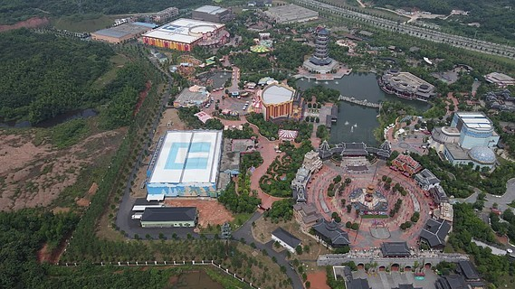
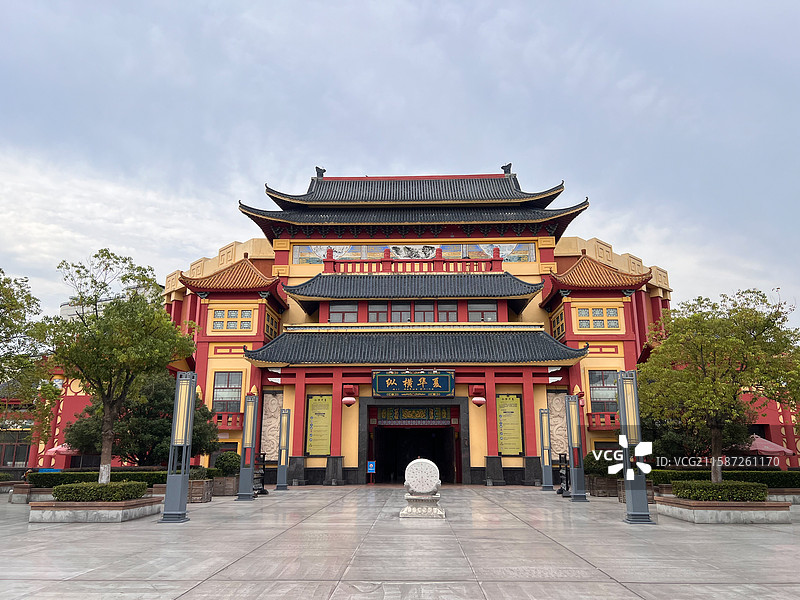
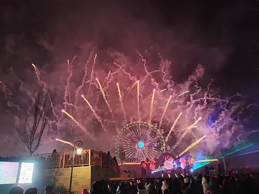
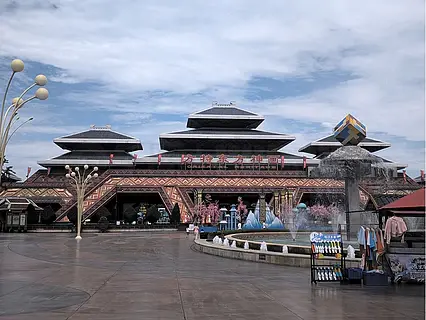

# 方特旅游区

## 🎤 AI导游带你游

### 【开场白】
各位朋友，大家好！欢迎来到安徽省芜湖市，欢迎来到方特旅游区。我是你们今天的导游小艾。

站在这片土地上，你们可能想象不到，千百年前，这里曾是怎样一番景象。历史的年轮在这里留下了深深的印记，每一寸土地都在诉说着古老的故事。

芜湖方特梦幻王国 4 分 芜湖华强文化科技产业园·方特梦幻王国，坐落于安徽省芜湖市城东新区，占地70万平方米，总投资18亿元人民币，是继方特欢乐世界之后深圳华强文化科技集团在芜兴建的又一个现代综合性主题公园。风景名胜方特梦幻王国的游玩项目有卡通城堡，在这里大家可以看到方特电视演播室，亲身感受电视拍摄...

今天，就让我们一起走进这片神奇的土地，感受它独有的魅力。建议游览时间：半天到一天。拍照最佳时间是清晨或傍晚，光线柔和时最美。

---

## 🗺️ 景区全景导览
方特旅游区位于安徽省芜湖市鸠江区境内，是国家AAAAA级旅游景区。

芜湖方特梦幻王国 4 分 芜湖华强文化科技产业园·方特梦幻王国，坐落于安徽省芜湖市城东新区，占地70万平方米，总投资18亿元人民币，是继方特欢乐世界之后深圳华强文化科技集团在芜兴建的又一个现代综合性主题公园。风景名胜方特梦幻王国的游玩项目有卡通城堡，在这里大家可以看到方特电视演播室，亲身感受电视拍摄的氛围和过程，还能在卡通工作室近距离接触动画师，了解现代卡通制作的奥妙，更可走入卡通工作室，动画专家向你揭开卡通的奥秘。未来警察，高科技灾难体验项目——未来警察，以同名电影为故事背景，采用超大多屏立体电影、**现场表演、巨型机械模型和大型游览车等表现技术，烘托出宏大震撼、亦真亦幻的激战场面，让您身临

**游览路线推荐**：景区入口 → 核心景观区 → 精华景点 → 观景平台 → 出口

---

## 🏛️ 主要景点详解

### 📍 核心景区

**核心看点**：
- 景区的标志性景观，没来过等于没来过
- 最佳观赏时间是清晨和傍晚，光线最美
- 记得带上充电宝，美景会让你停不下快门

> 💡 **导游贴士**：
> 游览核心景区时，不妨找个地方坐下来，静静感受周围的氛围，这才是旅行的意义。

---

### 📍 精华观景台

**核心看点**：
- 远离人群的小众精华景点，安静而美好
- 喜欢深度游的朋友一定不要错过
- 这里能让你感受到不一样的景区魅力

> 💡 **导游贴士**：
> 想要深度了解精华观景台，可以提前做些功课，了解它的历史背景，游览时会更有感触。

---

### 📍 特色景观区

**核心看点**：
- 观景位置绝佳，视野开阔
- 是拍摄全景照片的最佳地点
- 傍晚时分来，夕阳西下的景色美不胜收

> 💡 **导游贴士**：
> 如果你是摄影爱好者，特色景观区一定能让你拍出满意的作品，记得带上广角镜头！

---

### 📍 文化展示区

**核心看点**：
- 自然风光与人文景观完美融合的典范
- 四季景致各异，无论何时来都有惊喜
- 摄影爱好者的天堂，随手一拍都是大片

> 💡 **导游贴士**：
> 游览文化展示区时，不妨关掉手机，用眼睛和心灵去感受这份美好。

---

### 📍 历史遗迹区

**核心看点**：
- 这里承载着景区最深厚的历史文化底蕴
- 每一处细节都诉说着动人的故事
- 建议跟随讲解员深入了解背后的历史

> 💡 **导游贴士**：
> 来历史遗迹区游览，建议穿舒适的鞋子，这里需要多走走才能发现它的美。

---

### 📍 自然观光带

**核心看点**：
- 景区内最受欢迎的打卡点，游客必到
- 站在这里可以俯瞰整个景区的壮丽景色
- 天气好的时候拍照效果绝佳，记得预留时间

> 💡 **导游贴士**：
> 在自然观光带游览时，注意爱护环境，让这份美能够长久留存。

---

## 【结束语】
各位朋友，今天的游览即将结束。希望方特旅游区的美景能给你们留下美好的回忆。

有人说，旅行的意义不在于去过多少地方，而在于那些让你心动的瞬间。希望在方特旅游区的这一天，能成为你旅途中一个温暖的记忆。

临走前，别忘了回头再看一眼。夕阳下的方特旅游区，会给你最温柔的道别。

> ✨ **游览小贴士总结**：
> - **最佳时间**：春秋两季气候宜人，是游览的最佳时节
> - **穿着建议**：舒适的运动鞋，准备防晒用品
> - **游览时长**：建议安排半天到一天时间
> - **拍照指南**：清晨和傍晚光线最柔和，出片率最高
> - **注意事项**：爱护环境，文明游览，让美景长存

祝你们旅途愉快，平安吉祥！🙏

---

## 📷 景区美图

*景区全景*

*核心景观*

*特色风光*

*细节之美*

*四季风光*

*人文景观*

---

## 📚 方特旅游区小档案

| 项目 | 信息 |
|------|------|
| 景区级别 | 国家AAAAA级旅游景区 |
| 所属省份 | 安徽省 |
| 所属城市 | 芜湖市 |
| 建议游览时间 | 半天 - 1天 |
| 最佳游览季节 | 春秋两季 |

---

> 💡 **本页说明**：
> 本README由AI导游小艾根据网络公开资料整理生成。
> 坐标、图片、简介均来自豆包搜索API，仅供参考。
