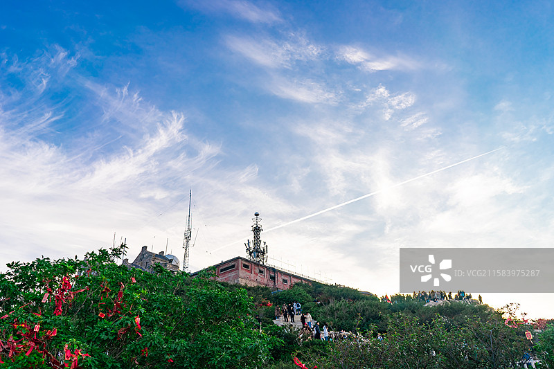
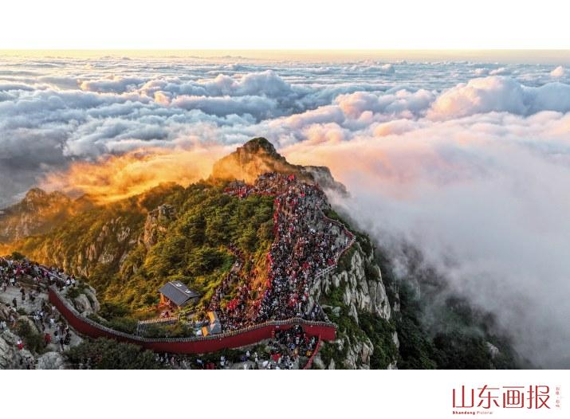
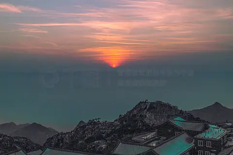

# 泰山景区 ⛰️

## 🌅 开篇：会当凌绝顶，一览众山小

"岱宗夫如何？齐鲁青未了。造化钟神秀，阴阳割昏晓。"

泰山，五岳之首，中华民族的精神象征。这座海拔只有1545米的山，在中国的名山中不算最高，不算最险，也不算最秀，但是它的地位，没有任何一座山可以取代。

从秦始皇开始，先后有13位帝王来到泰山封禅祭天。他们认为，泰山是离天最近的地方，只有在这里祭祀天地，才能得到上天的认可，才能表明自己是"真龙天子"。几千年来，无数文人墨客也来到泰山，留下了数以万计的诗词歌赋和摩崖石刻。

爬泰山，从来都不是简单的体力运动。它是一次朝圣，一次与历史的对话，一次对自我的超越。当你沿着6600级石阶，从红门一步一步爬到南天门，当你在玉皇顶上看着太阳从云海中冉冉升起，你会真正明白，为什么孔子会说"登泰山而小天下"，为什么杜甫会写下"会当凌绝顶，一览众山小"。

来泰山吧。为了那一场震撼人心的日出，为了那一段刻骨铭心的攀登，为了那种站在山顶，整个世界都在你脚下的感觉。

## 📜 历史与文化：五岳之首，天下第一山

**远古时期 泰山的崇拜**
早在原始社会，泰山就已经是人们崇拜的神山。古人认为，泰山是万物生长的地方，是太阳升起的地方，是生命的源泉。"泰"字就是大、稳、平安的意思，"稳如泰山"、"国泰民安"，泰山已经成为了平安、稳定、厚重的象征。

**秦始皇 封禅的开始**
公元前219年，秦始皇统一中国后的第三年，他带领文武百官，来到泰山举行封禅大典。这是中国历史上第一次有明确记载的泰山封禅。从此，泰山从一座普通的山，变成了国家祭祀的神山，变成了君权神授的象征。

**汉武帝 七次封禅**
汉武帝是历史上到泰山封禅次数最多的皇帝——七次。他第一次来泰山的时候，被泰山的雄伟震撼了，说了一句话："高矣，极矣，大矣，特矣，壮矣，赫矣，骇矣，惑矣。"翻译成大白话就是：太高了，太牛了，太震撼了，我都不知道说什么好了。

**唐宋时期 文化的高峰**
唐代的杜甫、李白，宋代的苏轼、欧阳修，都来过泰山。杜甫的《望岳》，李白的"天门一长啸，万里清风来"，这些千古名句，让泰山的文化内涵越来越深厚。现在泰山上的摩崖石刻，有一半以上都是唐宋时期留下的。

**明清到现代 平民的泰山**
明清时期，封禅的皇帝少了，但是普通老百姓来泰山的越来越多。人们来泰山烧香，祈福，求平安。"泰山老奶奶"碧霞元君的信仰，传遍了整个中国北方。现在，每年有超过500万人来泰山旅游，泰山不再是帝王的专属，它已经成为了全体中国人的精神家园。

## 🌟 核心景点详解

### 📍 泰山日出：中国最有名的日出

这是泰山最经典的景观——泰山日出。照片中，一轮红日从云海中冉冉升起，把整个天空都染成了金色。这是中国最有名的日出，也是无数人爬泰山的终极目标。

**看日出的完整体验**：
- **半夜12点**：从红门开始爬，带着头灯，沿着石阶一步步往上
- **凌晨4点**：到达南天门，这时候你已经爬了4个小时，累得话都说不出来
- **凌晨4点30分**：继续往玉皇顶或者日观峰走，找一个好位置
- **凌晨5点左右**：东方开始发亮，然后太阳一点点跳出来，全场欢呼
- **看完日出**：你会觉得所有的辛苦都是值得的，那种感觉一辈子都忘不了

**最佳看日出的地点**：
- **日观峰**：最经典的位置，人也最多，需要提前去占位置
- **玉皇顶**：泰山最高点，视野开阔，但是前面有点挡
- **拱北石**：一块向北伸出的大石头，站在上面看日出，非常有感觉

**你不知道的冷知识**：
泰山一年中能看到日出的天数只有不到100天。大部分时候，山顶都是云雾缭绕的。很多人爬了好几次泰山，都没看到过日出。所以，如果你来的时候看到了，那你真的很幸运。

> 💡 **看日出贴士**：
> 一定要带厚衣服！山顶温度比山下低8-10度，即使是夏天，凌晨的时候也只有十几度。可以在山顶租军大衣，20块钱一件。另外，穿舒适的运动鞋，带足够的水和巧克力补充能量。不要坐缆车，如果坐缆车上去，你就体会不到那种辛苦之后看到日出的感动了。

---

### 📍 十八盘：最艰难的797级石阶

这是泰山最有名的一段路——十八盘。照片中这一段陡峭的石阶，从对松山到南天门，不到1公里的距离，垂直高度却有400米，一共有797级石阶。这是整个泰山最难爬的一段，也是最考验人的一段。

**爬十八盘的感受**：
站在十八盘下面往上看，你会觉得南天门就在天上，石阶像一架天梯一样挂在那里。每走一步，你都要付出巨大的努力。你的腿会像灌了铅一样，每抬一步都很困难。你会无数次想放弃，但是看到身边的人都在坚持，你也会咬着牙继续往上爬。

**为什么叫十八盘**：
"盘"就是弯道的意思。十八盘一共有十八个弯道，所以叫十八盘。其实，这里的"十八"是虚数，形容弯道很多，不是真的只有十八个。

**最让人感动的场景**：
爬十八盘的时候，你会看到各种各样的人。有七八十岁的老人，拄着拐杖一步步往上挪；有七八岁的小孩，跟着父母一起爬；还有挑山工，挑着一百多斤的担子，健步如飞。看到他们，你就会觉得自己这点累算不了什么。

> 💡 **爬十八盘建议**：
> 不要急，慢慢爬，累了就歇一会儿，不要硬撑。"紧十八，慢十八，不紧不慢又十八"，按照自己的节奏来就好。另外，不要总往上看，那样会觉得遥遥无期，就看着自己脚下的路，一步一步走，不知不觉就到南天门了。

---

### 📍 摩崖石刻：石头上的中国书法史

泰山上有超过1000处摩崖石刻，从秦朝到现代，跨越了两千多年。照片中这些刻在石头上的字，不仅仅是书法作品，更是历史的见证，是中国书法史的活化石。

**最有名的几处石刻**：
- **秦泰山刻石**：李斯的小篆，只剩下10个字了，是泰山上最古老的石刻
- **经石峪金刚经**：北齐时期刻的，每个字有半米大，被称为"大字鼻祖"
- **"五岳独尊"刻石**：光绪年间刻的，现在是泰山的标志，人民币5元背后的图案就是它
- **"果然"刻石**：据说康熙皇帝爬完泰山后，觉得太震撼了，千言万语汇成两个字："果然"

**摩崖石刻的意义**：
这些石刻，有的是皇帝写的，有的是大臣写的，有的是文人写的，有的甚至是普通人写的。它们的字体各不相同，有篆书、隶书、楷书、行书、草书。两千多年来，人们来到泰山，都想在这里留下一点什么。这种跨越千年的对话，是泰山最独特的魅力。

**你不知道的故事**：
当年杜甫爬泰山的时候，也想在泰山上刻字，但是他看了前辈们的书法，觉得自己写得不够好，最后还是没刻。所以泰山上没有杜甫的石刻，但是他的《望岳》，比任何石刻都要深入人心。

> 💡 **游览建议**：
> 爬泰山的时候，不要只顾着低头爬山，多看看两边的石头。你会看到很多熟悉的名字，很多熟悉的句子。看到喜欢的，就停下来拍张照，看看是什么时候，谁写的。这样，你的泰山之旅，就不仅仅是一次体力运动，更是一次文化之旅。

---

### 📍 南天门：天界与人间的分界线

这是泰山的标志性建筑——南天门。照片中这座建在山顶的城门，海拔1460米，是泰山天街的入口。穿过南天门，你就进入了"天界"。

**南天门的历史**：
南天门始建于元代，明清两代多次重修。它建在飞龙岩和翔凤岭之间的山口上，两边是陡峭的山崖，就像一座天然的门户。站在南天门往下看，十八盘像一条天梯一样垂下来，那种感觉，真的像是从天上往下看。

**穿过南天门的感受**：
当你爬了五六个小时，终于爬到南天门的时候，穿过那道门洞，风一下子吹过来，你会觉得豁然开朗。身后是你爬过的6600级石阶，身前是平坦的天街，远处是连绵的群山。那一刻，你所有的疲惫都会烟消云散，你会有一种重生的感觉。

**天街**：
南天门后面就是天街——天上的街市。这是一条建在山顶的商业街，有旅馆，有饭店，有纪念品商店。住在天街的旅馆里，早上起来推开门就能看到云海，那种感觉太特别了。

> 💡 **住宿建议**：
> 如果想看日出，最好住在山顶的旅馆里。虽然条件简陋，价格也不便宜，但是不用半夜爬，能休息好。而且，傍晚的时候可以在山顶看日落，晚上可以看星空，第二天早上再看日出，体验非常完整。

---

## 🎯 游览实用指南

### 🚗 交通指南
- **高铁**：京沪高铁到泰安站，出站后打车到红门，车程约20分钟
- **火车**：京沪铁路到泰山站，离红门更近，打车10分钟
- **自驾**：从济南出发，走京台高速，全程约1小时
- **景区交通**：天外村有到中天门的旅游大巴，30元/人

### 🎫 门票信息（2025年参考）
- **门票**：115元/人，三天有效
- **索道**：中天门到南天门，单程100元，往返140元
- **桃花峪索道**：单程100元
- **后山索道**：单程20元

### ⏰ 最佳旅游时间
- **4-5月**：春天，山上的桃花、海棠花盛开，非常美
- **9-11月**：秋天，秋高气爽，能见度高，看日出概率最大
- **12-2月**：冬天，可能会看到雪凇，人也最少
- **避开**：五一、十一黄金周，人挤人，根本走不动

### 🗺️ 经典游览路线

**夜爬看日出路线（最经典）**：
晚上10点：红门出发 → 中天门（凌晨1点） → 十八盘（凌晨3点） → 南天门（凌晨4点） → 日观峰等日出（凌晨5点） → 看完日出后逛山顶景点 → 坐索道或者步行下山

**一日休闲游路线**：
上午：天外村坐大巴到中天门 → 坐索道到南天门 → 逛山顶（天街、碧霞祠、玉皇顶）
中午：山顶吃饭
下午：步行下山，看沿途的石刻和景点 → 红门出 → 返程

**两日深度游**：
Day1：下午开始爬，晚上住山顶，看日落，看星空
Day2：早上看日出 → 逛后山景点 → 步行下山 → 岱庙 → 返程

### 🍜 美食推荐
- **泰山煎饼**：泰山特色，粗粮做的，卷上大葱和酱，香极了
- **赤鳞鱼**：泰山独有的鱼，生长在海拔800米以上的溪水里，非常珍贵
- **泰安豆腐**：泰安的豆腐特别嫩，清水煮就很好吃
- **泰山炒鸡**：当地的土鸡，用大铁锅炒的，味道浓郁

## 💫 结语：每一个中国人都应该爬一次泰山

我一直觉得，每一个中国人，都应该爬一次泰山。

不是为了拍一张打卡照，不是为了发朋友圈，而是为了亲身体验一下那种一步一步往上爬的感觉，那种累到极致想要放弃但是最终坚持下来的感觉，那种站在山顶看着日出，觉得所有辛苦都是值得的感觉。

泰山不高，但是它厚重。它不像黄山那样秀美，不像华山那样险峻，它就像一位饱经沧桑的老人，沉默，稳重，充满了智慧。它看着中国几千年的历史，看着一代代的人来到这里，又一代代的人离开。它什么都不说，但是什么都知道。

爬泰山的过程，就像人生的过程。有平坦的路，也有陡峭的十八盘；有想放弃的时候，也有咬着牙坚持的时候。但是只要你一直往前走，总有一天，你会到达山顶，看到最美的风景。

"会当凌绝顶，一览众山小。"

这不是一句诗，这是一种人生境界。只有真正爬过泰山的人，才能真正懂得这句话的意思。

来泰山吧。爬一次泰山，你会更懂中国，也会更懂自己。

> 📌 **旅行感悟**：
> 人生就像爬泰山。重要的不是你爬得多快，而是你有没有坚持到最后。那些让你累到想要放弃的时刻，那些你咬着牙走过来的路，最终都会变成你人生中最宝贵的财富。当你站在山顶的那一刻，你会明白：所有的坚持，都是值得的。

---

*本页内容基于实景图片分析与历史资料整理，由AI导游系统2025年7月生成*
