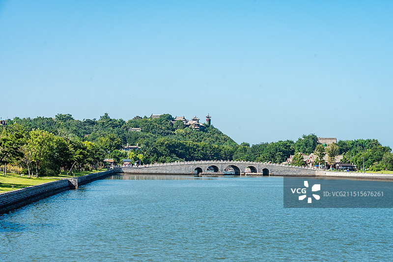
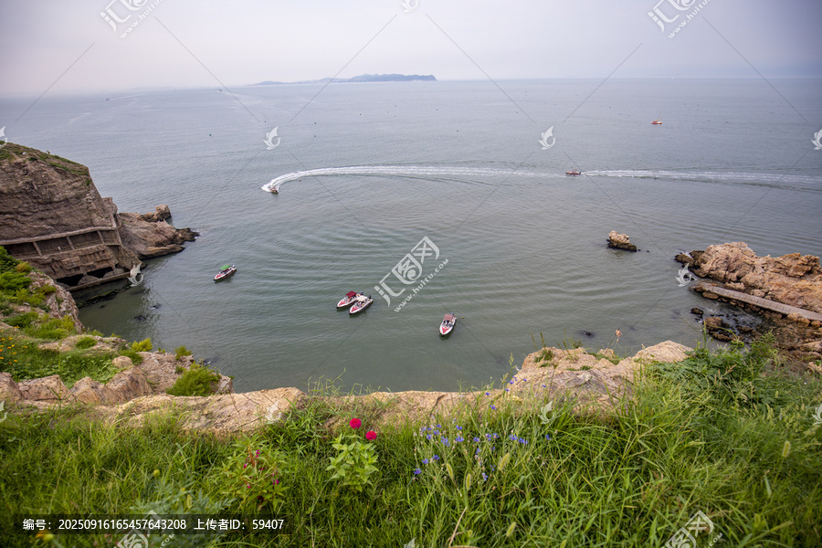
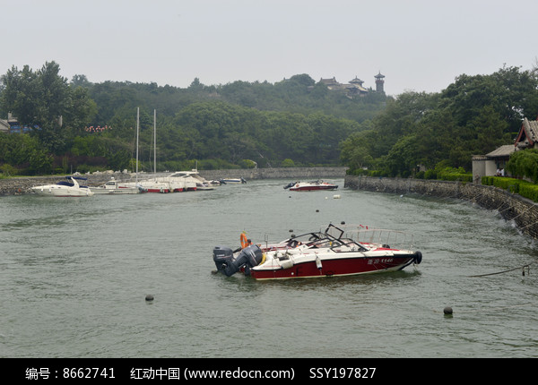

# 蓬莱阁 ✨

## 🌊 开篇：人间仙境，海上有山

苏轼写过一首《海市诗》，开头几句是："东方云海空复空，群仙出没空明中。荡摇浮世生万象，岂有贝阙藏珠宫。"

他在蓬莱只待了五天，却一辈子忘不掉那片海。

蓬莱这个名字，本身就是一剂迷药。两千多年前，司马迁在《史记》里说，渤海之东有五座仙山，岱舆、员峤、方壶、瀛洲、蓬莱，山上住着神仙，长生不老。秦始皇信了，汉武帝也信了，他们千里迢迢来到这片海岸，望眼欲穿地等一艘永远不回来的船。

仙山当然没有找到。但人们不甘心。于是公元1061年，北宋的登州太守朱处约，在海边丹崖山上看了一阵海，决定在这里盖一座楼，取名"蓬莱阁"。

他想把神仙的传说，安放在人间。

从此，这座楼替仙山站着，一站就是近千年。

它与黄鹤楼、岳阳楼、滕王阁并称"中国古代四大名楼"。但蓬莱阁有一点是别的楼比不了的——它是唯一一座建在海上的名楼。它的脚下，是黄海和渤海的分界线；它的远方，是几千年没有兑现的传说。

## 📜 一片海岸和两千年的执念

**公元前219年 秦始皇东巡**

这一年，秦始皇统一天下刚两年。他来到渤海边，听方士说海上有蓬莱、方丈、瀛洲三座仙山，山上有长生不老药。他信了。

他派一个叫徐福的方士，带着几千童男童女，驾船出海去找。

船没有回来。

八年后，公元前210年，秦始皇又来了。他站在海边，望了一整天。还是什么也没有。这一年他在回咸阳的路上病死，那年他49岁。

长生不老药，他到底没等到。

**公元前109年 汉武帝也来了**

汉武帝比秦始皇还执着。他亲自带兵来到渤海边，等海市蜃楼。等到了，他高兴坏了，下令在这里筑城，名字就叫"蓬莱"。

这是"蓬莱"第一次作为一个地名，落在地图上。

汉武帝也没找到仙药。但他留下了一座城。

**公元1061年 一座楼盖起来了**

时光一晃到了北宋。登州（今蓬莱）太守朱处约，常常登丹崖山看海。他也想看海市蜃楼，但他更想做一件事——把这座山、这片海、这个千年的传说，永远留住。

他在丹崖山上修了一座阁，起名"蓬莱阁"。

从那以后，蓬莱阁历经宋、元、明、清，多次毁于战火，又多次重建。每一次重建，都比上一次更高、更壮。

**公元1528年 戚继光出生在这里**

蓬莱还出过一个不靠神仙、靠自己的人——戚继光。

他生在蓬莱，长在蓬莱。17岁袭父职任登州卫指挥佥事。后来他带兵到浙江、福建打倭寇，创下"鸳鸯阵"，杀得倭寇闻风丧胆。

戚继光没有去找长生不老药。他知道，保一方平安，比修仙更难，也更重要。

今天蓬莱阁旁边，有戚继光祠，有戚继光牌坊。那是蓬莱给这个儿子最高的礼遇。

**你不知道的冷知识：**
- 苏轼在蓬莱只当了五天登州知州，却被调走。临走前他上书朝廷，请求减免登州盐税，登州百姓为此感念他近千年。蓬莱阁里至今有"苏公祠"。
- "蓬莱"二字，"蓬"是蓬草，"莱"是藜草。古人觉得仙山上长满这种草，所以这么叫它。
- 海市蜃楼是真的。苏轼见过，写进了诗里；戚继光见过，写进了日记；今天每年夏天，仍有人能在蓬莱海边看到。

---

## 🌟 蓬莱阁核心景点详解

### 📍 蓬莱阁主阁：一座楼替仙山站着

蓬莱阁是整个景区的灵魂。

它坐落在丹崖山顶，背山面海，飞檐翘角，远远望去像一只展翅欲飞的鸟。从山下往上看，它在云端；从阁上往下看，海在脚下。

阁内有一副对联，是全阁的点睛之笔：

> "海市蜃楼皆幻影，忠臣孝子即神仙。"

这副对联说透了蓬莱。两千年来，人们来这儿找神仙、找长生。可蓬莱阁告诉你：神仙不在海上，在你心里。你做一个忠臣，做一个孝子，你就是神仙。

阁分两层。一层供奉着八仙的塑像——就是那八个在蓬莱阁喝醉了酒、各显神通过海的人。吕洞宾背剑、铁拐李拄拐、张果老倒骑驴、何仙姑执荷花……他们一个个笑嘻嘻的，像是刚从海那头回来。

> 💡 **导游贴士**：
> 上阁前，先在山下仰拍一张，把"蓬莱阁"三个字和飞檐一起收进画面。
> 进阁后别急着走，在二层的回廊上站一会儿，面朝大海。
> 晴天能看到长山岛，像一条墨线浮在水上。
> 要是赶上雾天，海面白茫茫一片，你才懂什么叫"人间仙境"。
> 早晨七点和傍晚五点，光线斜着打在阁上，最适合拍照。

---

### 📍 田横山：五百壮士的最后归宿

蓬莱阁所在的丹崖山往西，隔一条小路，就是田横山。

田横山得名于一个让人心碎的故事。

公元前202年，刘邦灭了项羽，统一天下。齐国最后一个贵族田横，带着五百个部下逃到海岛上，宁死不降。刘邦派人招降，说：来，封王；不来，发兵灭你。

田横带着两个门客上路。走到离洛阳三十里的驿站，他对门客说："我田横曾是汉王的对手，如今要向他称臣，已是耻辱。陛下要看我，不过是想看看我长什么样。"说完，他拔剑自刎，让门客捧着他的头去见刘邦。

刘邦见了，流泪，以王礼葬他。葬完，田横的两个门客在墓旁挖了两个洞，自刎而死。

消息传回海岛，岛上五百人，全部自杀。没有一个人投降。

这个岛，后来就叫田横岛。蓬莱的这座山，也叫田横山。

山上有一座合海亭，是看黄渤海分界线的最佳点。天气好的时候，你能看到两股颜色不同的海水在脚下交汇——黄海偏蓝，渤海偏黄，界线分明得像有人用尺子画过。

> 💡 **导游贴士**：
> 田横山和蓬莱阁之间有一条栈道相连，叫田横栈道，修在悬崖边上，走着很刺激。
> 合海亭是看日落的最佳点，比蓬莱阁还合适，因为这里朝西。
> 山上有一个"黄渤海分界坐标"雕塑，是打卡必拍的地方。
> 来这里之前，建议先在心里默念一遍田横和五百壮士的故事。你知道了这故事，再看这片海，感受完全不同。

---

### 📍 蓬莱水城：戚继光练兵的地方

蓬莱阁脚下的这片水城，是全中国保存最完整的古代水军基地。

它最早是北宋的"刀鱼寨"，因为这一带盛产刀鱼。到了明代，戚继光的曾祖父戚斌在这里备倭，所以又叫"备倭城"。

水城是一个完整的小海湾，被城墙围起来。城墙上有炮台，城门叫"振扬门"，朝海开。涨潮时，战船从这门出去，直奔渤海；退潮时，船回来，停在水城里。

戚继光小时候就在这里长大。他17岁袭职，在这里带兵、练兵。后来他写的《纪效新书》《练兵实纪》，很多操练方法是在这片水城里琢磨出来的。

今天你走进水城，还能看到：
- **水城小海**：当年的内港，停战船的地方，水很静
- **振扬门**：水城朝海的城门，戚继光的船从这里出港
- **太平楼**：建在城墙上，是俯瞰整个水城的制高点
- **古船博物馆**：里面有几艘从蓬莱海底打捞上来的古船，最早的是元代的

> 💡 **导游贴士**：
> 水城最好从振扬门进，沿着城墙走一圈，感受一下"城在海中，海在城里"的格局。
> 古船博物馆一定要进，那艘元代战船是原件，不是仿的，木质船身在水底埋了七百年，捞上来还能看出当年的形状。
> 戚继光曾在这里练兵，建议脑补一下：几百年前，这个港口停满了战船，水兵们操练的呐喊声从这门里传出来，飘到海上。

---

### 📍 苏公祠：五天知州，千年感念

蓬莱阁景区里有一座不起眼的小祠堂，叫苏公祠，供奉的是苏轼。

苏轼在蓬莱只当了五天登州知州。

公元1085年，苏轼被朝廷从贬谪地召回，任命为登州知州。他千辛万苦走到登州，上任第五天，朝廷又一道圣旨，调他回京任礼部郎中。

五天，能干什么？

苏轼用这五天，干了一件让登州人念他千年的事。

他了解到，登州百姓靠煮盐为生，但朝廷规定登州盐只能官卖，百姓自己煮的盐不能吃、不能卖，还得买官府的高价盐。苏轼连夜写了一道《登州召还议水军状》和一道《乞罢登州榷盐状》，请求朝廷减免登州盐税，让百姓自煮自食。

朝廷准了。

从此，登州百姓再不用买高价官盐。这一项德政，从北宋一直延续到清末，整整八百年。

登州人给苏轼修了祠，叫苏公祠。祠里有苏轼的画像，还有他写的《海市诗》刻石。前人有一句话："五日知登州，千年苏公祠。"

> 💡 **导游贴士**：
> 苏公祠里一定要看那方《海市诗》刻石，是苏轼亲笔写的，记录了他在蓬莱看到海市蜃楼的经过。
> 看完祠堂，想想这件事：一个人当五天官，能被记一千年。为官一任，到底该留下什么，苏轼给出了答案。
> 祠堂不大，十分钟就能看完。但这十分钟，值得花。

---

### 📍 八仙过海景区：八个醉汉的渡海传奇

"八仙过海，各显神通"——这句话，全世界华人都知道。它的发生地，就在蓬莱。

传说有一天，八仙在蓬莱阁上喝酒，喝高了。有人提议：咱们别坐船，各凭本事过海，怎么样？

于是——
- 铁拐李把葫芦往海上一扔，骑上去
- 汉钟离把芭蕉扇扔海里，站上去
- 张果老倒骑毛驴，踏浪而行
- 吕洞宾御剑飞行
- 何仙姑乘荷花
- 蓝采和踏花篮
- 韩湘子吹笛子，笛声开路
- 曹国舅踩玉板

八个人，八种法器，八种过法。他们从蓬莱阁下的海边出发，渡过了渤海。

故事是神话。但它说的道理不假：世上没有一条路是唯一的路，各有各的活法，各有各的精彩。

2012年，蓬莱阁景区把旁边的"三仙山·八仙过海景区"并入，整个旅游区扩大了。八仙过海景区是一个伸入海中的葫芦形半岛，从空中看像一个葫芦漂在海上。景区里有八仙桥、八仙坊、望瀛楼、会仙阁，全是围绕八仙故事建的。

> 💡 **导游贴士**：
> 八仙过海景区在蓬莱阁以东一公里，步行可达。门票通常和蓬莱阁联售。
> 整个景区建在海中，三面环海，是看海的最佳位置。风大的时候，浪打在岸边，溅起一人高的水花。
> 望瀛楼是制高点，登楼能看到整个渤海湾。
> 拍照tip：站在八仙桥上往回拍，能把桥、海、楼一起收进画面，是经典机位。

---

### 📍 蓬莱古船博物馆：海底打捞上来的元朝

1984年，蓬莱水城清淤，工人在淤泥里挖出一艘船。

不是普通的船。是一艘元代的战船，长达28米，木质，黑漆漆的，在水底埋了七百年。

后来又陆续挖出两艘。一艘是高丽船，一艘是明代战船。

这三艘船，现在就躺在蓬莱古船博物馆里。

这是中国发现最早、保存最完整的古代海船实物。你看那艘元船，船板上的铆钉还在，舱壁隔得密密实实——这就是当年戚继光的船的"祖宗"。元船的设计，到明代还在用。

博物馆里还有出土的瓷器、铜钱、铁锚、缆绳。每一件都是当年船上真实用过的东西。一根缆绳，你想想，七百年前水手的手摸过它，七百年后你的眼睛看到它——时间就是这样被一根绳子串起来。

> 💡 **导游贴士**：
> 博物馆在水城里面，门票含在蓬莱阁景区联票里。
> 一定要听讲解员讲，自己看很多细节看不出来。比如那艘元船为什么没有龙骨，为什么船头是尖的，为什么隔舱那么密——每一处都有门道。
> 拍照时注意，馆内光线暗，建议用大光圈或提高ISO。船体太大，广角才能拍全。
> 出馆前，回头看一眼那艘元船。它在海底睡了七百年，被你看见了。这是缘分。

---

## 🎯 游览实用指南

### 🚗 交通指南

**高铁**：
- **蓬莱市站**：从烟台、青岛方向有动车可达
- 出站打车到蓬莱阁约15分钟，20元左右
- 也可坐蓬莱公交5路、7路直达景区

**飞机**：
- **烟台蓬莱国际机场**：离景区约30公里
- 机场大巴到蓬莱市区约40分钟，再打车到景区
- 直接打车约80元

**自驾**：
- 烟台市区->蓬莱阁：约1小时，70公里
- 青岛市区->蓬莱阁：约2.5小时，200公里
- 景区有大型停车场，10元/次

### 🎫 门票信息（2025年参考）
- **蓬莱阁景区**：100元（含蓬莱阁、水城、古船博物馆、田横山）
- **八仙过海景区**：60元（单独购买）
- **三仙山景区**：120元（单独购买）
- **通票**：180-220元（含所有景区，最划算）
- **半价**：学生、60-64岁老人
- **免票**：65岁以上、1.4米以下儿童、军人、残疾人
- **预约**：节假日建议提前在"蓬莱阁"公众号预约

### ⏰ 最佳游览时间
- **夏季（6-8月）**：看到海市蜃楼概率最高（但仍需运气），也是避暑胜地
- **秋季（9-10月）**：天高气爽，海最蓝，最适合拍照
- **春季（4-5月）**：海鲜肥美，樱花开
- **冬季（11-3月）**：人最少，海风大，看惊涛拍岸别有感觉
- **建议游览时长**：蓬莱阁核心区3-4小时，加上八仙过海景区需要1整天

### 🗺️ 推荐路线

**经典半日游**：
- 振扬门入水城 -> 古船博物馆 -> 蓬莱阁主阁 -> 苏公祠 -> 田横山 -> 合海亭看黄渤海分界 -> 出

**深度一日游**：
- 上午：蓬莱阁 + 水城 + 古船博物馆 + 田横山
- 下午：八仙过海景区 + 三仙山景区
- 傍晚：回田横山合海亭看日落

> 💡 **最重要的建议**：
> 一定要在蓬莱阁上等一次日落。
> 太阳从黄渤海交界处沉下去，整片海被染成金色，蓬莱阁的飞檐被勾上一道金边。
> 那一刻你会理解，为什么两千年来，人们一直觉得这里住着神仙。

### 🍜 蓬莱美食
- **蓬莱小面**：蓬莱人的早餐，面条细如发丝，浇上海鲜卤，3-5元一碗，配卤蛋
- **鲅鱼水饺**：春天鲅鱼最肥，饺子馅大得像包子，一个能顶半碗饭
- **海肠子**：看着吓人，吃着鲜，韭菜炒海肠是蓬莱名菜
- **咸鱼饼子**：老蓬莱的味道，咸鱼煎得焦香，配玉米面饼子
- **八仙宴**：以八仙故事为主题的海鲜宴席，菜名都带仙气，适合人多时点

### ⚠️ 注意事项
1. **海风大**：即使夏天，傍晚也很凉，带件薄外套
2. **防晒**：海边紫外线强，帽子墨镜防晒霜都备上
3. **潮汐**：田横山栈道和部分海边步道退潮时才能走全，去之前查潮汐表
4. **海市蜃楼**：可遇不可求，别为这个执念太深，看到了是福气，没看到蓬莱也很美
5. **联票划算**：如果时间够，买通票比单买便宜很多
6. **戚继光祠**：在蓬莱阁西南，是单独的景点，喜欢历史的别错过

## 💫 结语：仙境不在远方，在你站的地方

蓬莱阁最动人的，不是海市蜃楼。

海市蜃楼是假的。它出现，又消失。两千年里，秦始皇等过它，汉武帝等过它，苏轼等过它。他们都看到了，又都没抓住。

蓬莱阁真正动人的，是那些"真"的东西。

是朱处约在山上盖楼的那一刻——他想把传说留住。
是苏轼当五天知州就为民请命的那一夜——他比神仙还像神仙。
是戚继光十七岁就在这里练兵的那段青春——他没去找长生，他守护了一方平安。
是田横和五百壮士宁死不降的那片海——他们让"气节"二字有了重量。

蓬莱阁那副对联说得好：

> "海市蜃楼皆幻影，忠臣孝子即神仙。"

人们来蓬莱找神仙。可蓬莱阁站在这里一千年，就是为了告诉你一件事：

神仙不在海上。
神仙，是那些把人间活出样子的人。

你来蓬莱，看到的不是仙山。你看到的是一群普通人，用一千年的时间，把一片海边，活成了人间仙境。

这才是蓬莱阁。这才是它一千年不倒的原因。

> 📌 **旅行感悟**：
> 走出蓬莱阁的时候，回头看一眼那座楼。
> 它立在丹崖山上，背后是云，脚下是海。
> 你忽然明白——
> 所谓仙境，不是找到一个没有烦恼的地方。
> 而是在有烦恼的人间，
> 依然相信，有一些东西值得仰望。

---

*本页内容基于实景图片分析与蓬莱历史文献研究整理，由AI导游系统2025年7月生成*
