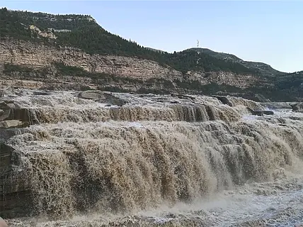

# 黄河壶口瀑布 ✨

## 🌊 开篇：母亲河的怒吼

世界上的瀑布有很多。

有的瀑布是白色的，比如尼亚加拉；
有的瀑布是蓝色的，比如九寨沟；
有的瀑布是绿色的，比如黄果树。

但只有一个瀑布，是黄色的。

这就是壶口瀑布——全世界最大的黄色瀑布。

黄河从青藏高原出发，流经九省，在晋陕大峡谷之间，被两岸的苍山夹峙，从300米宽的河面，骤然收窄到50米，然后从20多米高的断层上倾泻而下——就像一个巨大的茶壶，把整个黄河的水都倒了出来。

"壶口"之名，由此而来。

站在瀑布边，你听不到别的声音。只有黄河的怒吼。那是一种从地心深处传出来的、带着泥土气息的、让整个大地都在颤抖的声音。

这就是母亲河的声音。

这就是中华民族的心跳。

## 📜 一条河，一个民族的史诗

**约180万年前 最早的人类**
在壶口附近的匼河遗址，考古学家发现了180万年前古人类生活的痕迹。我们的祖先，就是在这条河边，学会了用火，学会了制造工具，一步步走出了蒙昧。

**公元前2000年 大禹治水**
大禹治水的故事，就发生在这里。"大禹治水，壶口始"——相传大禹就是从壶口开始，疏通了九河，把泛滥的黄河水引入了大海。

"三过家门而不入"的故事，也发生在这一带。

**公元398年 北魏郦道元**
《水经注》里，郦道元这样描写壶口："其中水流交冲，素气云浮，往来遥观者，常若雾露沾人，窥深悸魄。"
——1600年前的人看到的壶口，和今天你看到的，几乎一模一样。

**1938年 《黄河大合唱》**
光未然带领抗敌演剧三队，从壶口附近东渡黄河。目睹了黄河奔腾的景象，诗人泪流满面，写下了著名的《黄河大合唱》歌词。
"风在吼，马在叫，黄河在咆哮，黄河在咆哮！"

这首歌曲，从此成为了整个民族的精神号角。

---

## 🌟 核心景观详解

### 📍 主瀑布：三千弱水一壶收

这就是壶口瀑布最经典的画面。黄河水从层层叠叠的岩石上倾泻而下，每秒几千立方米的黄水砸向下方的河谷，激起几十米高的水雾。

站在岸边，你能感觉到整个地面都在颤抖。

**你不知道的壶口奇观**：
- **水底冒烟**：瀑布激起的水雾升到几十米的高空，几公里外就能看到，像烟囱里冒出的烟
- **旱地行船**：古代的船到了壶口，必须拖上岸，从陆地上绕过瀑布，再从下游下水。这个奇特的景象，持续了几千年
- **彩虹通天**：阳光好的时候，水雾中会出现彩虹，从水面一直连到天上
- **十里龙槽**：黄河水从壶口落下后，在坚硬的岩石上切出了一条几公里长、几十米深的峡谷——这就是黄河的力量

**四季的壶口，四个完全不同的瀑布**：
- **春季（3-4月）桃花汛**：上游冰雪融化，水量最大，瀑布最宽，是一年中最壮观的时候
- **夏季（7-8月）主汛期**：黄河水夹杂着大量泥沙，颜色最黄，吼声最大
- **秋季（9-11月）雨季过后**：水量适中，天空最蓝，最适合拍照
- **冬季（12-2月）冰瀑奇观**：整个瀑布冻成了冰雕，晶莹剔透，是一年中最难得的景象

> 💡 **最佳观赏建议**：
> 不要只站在观景台上！往下走，走到离瀑布最近的地方——那个叫"龙洞"的地方。
> 从下往上看瀑布，你才能真正体会到什么叫"黄河之水天上来"。
> 记得带雨衣——真的会浑身湿透！

---

### 📍 山西侧 vs 陕西侧：两个景区，哪个更好？

这是所有人都会问的问题。

简单说：
- **山西吉县侧**：可以从下往上看，可以走到瀑布旁边，可以看到瀑布的正面，可以进龙洞，体验感更好。看瀑布，山西侧更好。
- **陕西宜川侧**：可以从上往下看，可以看到瀑布的全貌，视野更开阔。看全景，陕西侧更好。

**终极建议**：
如果时间充裕，两边都去！
因为这根本就是两个完全不同的视角，看到的是两个完全不同的瀑布。

两个景区之间开车约20分钟，门票是分开卖的。

> 💡 **省钱技巧**：
> 买山西侧的门票就够了。山西侧可以走到瀑布旁边，那种被水雾包围、被黄河声浪冲击的体验，是陕西侧没有的。

---

### 📍 孟门山：黄河中的小岛

瀑布下游几公里的黄河中间，有两座小岛，叫孟门山。

相传这就是大禹治水时，第一个被劈开的地方。

岛上有一块巨石，上面刻着四个大字："卧镇狂流"。
站在岛上看黄河，河水从你身边奔腾而过，那种感觉，一辈子都忘不了。

---

## 💛 黄河：为什么我们叫她母亲河？

很多人问：黄河水这么黄，这么浊，为什么中国人还这么爱她？

答案很简单：因为中华文明，就是从这条河里长出来的。

我们的祖先在黄河岸边学会了耕种，学会了建房，学会了制陶，学会了写字。
夏商周秦汉唐，所有那些让我们骄傲的伟大王朝，都建立在黄河流域。

这条河塑造了我们的民族性格。
就像壶口瀑布一样——
它不清澈，不温柔，不婉约。
它浑浊，它粗犷，它怒吼，它奔腾。
但它真实，它有力量，它一往无前。

这不就是中国人的性格吗？

所有来到壶口瀑布的中国人，站在黄河边，听着黄河的怒吼，都会有一种莫名的感动，一种想流泪的冲动。

因为这是刻在我们基因里的记忆。
我们的血液里，就流着这条河的水。

---

## 🎯 游览实用指南

### 🚗 交通指南
壶口瀑布的交通相对不便，这也是它的游客一直不算太多的原因。

**从山西临汾出发**：
- 临汾汽车站有直达壶口的大巴，车程约3.5小时，票价60元
- 包车往返约400元，适合3-4人同行

**从陕西延安出发**：
- 延安汽车南站有到壶口的大巴，车程约2小时
- 包车往返约300元

**自驾**：
- 青兰高速有"壶口"出口，下来就是景区
- 山西侧和陕西侧各有一个高速出口，注意不要下错了

**景区观光车**：
- 山西侧：观光车20元，从停车场到瀑布入口，约3公里
- 陕西侧：观光车40元，从停车场到瀑布入口，约6公里
- 必须坐，走路太远了

### 🎫 门票信息（2025年参考）
- **山西壶口**：旺季100元，淡季90元
- **陕西壶口**：旺季90元，淡季75元
- **龙洞**：山西侧独有，20元，强烈推荐！
- **《黄河大合唱》实景演出**：198元，每天下午有，非常震撼
- **半票**：学生、60-64岁老人
- **免票**：65岁以上、军人、残疾人、记者

### ⏰ 最佳游览时间
- **8:00-10:00**：人少，光线好，容易看到彩虹
- **下午3-5点**：侧光，瀑布的层次感最强
- **建议游览时长**：2-3小时（如果看演出需要半天）

**最佳季节**：
- 首选：3-4月桃花汛，水量最大，最壮观
- 次选：7-8月主汛期，最黄最野
- 再次：12-2月冰瀑，最难得一见

### ⚠️ 游览贴士（非常重要！）
1. ✅ **带雨衣**：不管天气预报说什么，只要去壶口，一定要带雨衣！瀑布的水雾会把你全身打湿
2. ✅ **穿防水的鞋子**：岸边全是水，普通鞋子分分钟湿透
3. ❌ **不要穿浅色衣服**：黄河的泥点子溅上去就洗不掉了
4. ✅ **带替换的衣服**：真的会浑身湿透
5. ❌ **不要太靠近无防护的岸边**：石头很滑，每年都有人掉下去
6. ✅ **冬天去的话，多穿点**：河边的风，比你想象的冷十倍

### 🍜 当地美食
- **黄河大鲤鱼**：来壶口必吃！用黄河水炖的，鲜美无比
- **山西刀削面**：临汾的刀削面，全山西最好吃的刀削面
- **油糕**：陕北特色，外酥里嫩，甜而不腻
- **羊肉面**：西北的羊肉，没有一点膻味

## 💫 结语：每一个中国人，都应该来一次壶口

你可能看过很多更壮观的瀑布。
它们可能更高，可能更宽，可能更清澈。

但没有任何一个瀑布，能像壶口一样，让你浑身的血液都沸腾起来。

因为这不是一个普通的瀑布。
这是黄河。
这是母亲河。

站在瀑布边，听着黄河的怒吼，你会突然明白：
为什么我们这个民族，经历了那么多苦难，却总能一次次站起来。
因为我们的血脉里，就流着这条河的水。
它教会我们——
要像黄河一样，奔腾，向前，永不停歇。

所以，来一次壶口吧。
不为什么，就为了听听母亲河的声音。

> 📌 **旅行感悟**：
> 光未然说："黄河是中华民族的摇篮，是中华民族的象征，是中华民族的骄傲。"
>
> 站在壶口瀑布边，你才会真正懂这句话。
>
> 原来我们的民族性格，早就写在了这条奔腾的黄河里。
>
> 百折不挠，一往无前。

---

*本页内容基于实景图片分析与黄河文化研究整理，由AI导游系统2025年6月生成*
