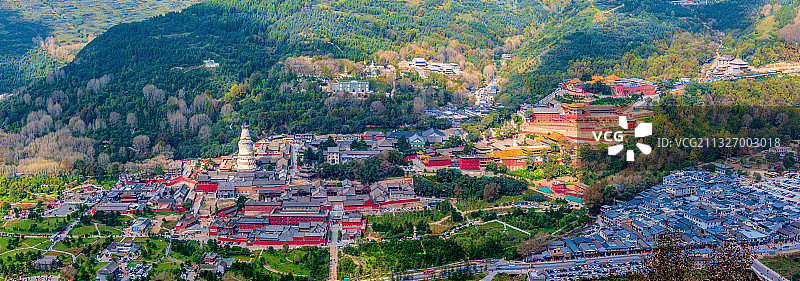

# 五台山 ✨

## 🏔️ 开篇：东北方的清凉世界

佛经里说："东北方有山，名曰清凉。从昔以来，诸菩萨众，于中止住。现有菩萨，名曰文殊，与其眷属，诸菩萨众，一万人俱，常在其中，而演说法。"

这座清凉山，就是五台山。

在山西的东北部，有五座山峰，峰顶平坦如台，所以叫五台。这里海拔3000多米，夏天最热的时候也只有二十几度。一千九百年来，它一直是中国人心中的"清凉世界"——不仅是身体的清凉，更是心灵的清凉。

它是中国四大佛教名山之首。
它是文殊菩萨的道场。
它是全世界唯一一个汉传佛教和藏传佛教共存的地方。
120多座寺庙散落在山谷之间，1900年来，晨钟暮鼓，从未停息。

2009年，五台山被列入《世界文化景观遗产名录》。联合国教科文组织说："五台山完美地体现了天人合一的中国哲学思想，是人类文化与自然环境和谐共存的杰出典范。"

## 📜 一千九百年的信仰传承

**公元68年 佛教初传**
东汉明帝永平十一年，摄摩腾和竺法兰两位高僧从洛阳来到五台山，建起了这座山的第一座寺庙——显通寺。这是中国最早的寺庙之一，几乎和洛阳白马寺同时。

**北魏 孝文帝的推广**
孝文帝特别尊崇文殊菩萨，在五台山大规模建寺，还把自己的女儿送来这里出家。五台山从此成为了中国北方的佛教中心。

**唐代 鼎盛时期**
唐代是五台山的黄金时代。这里有寺庙360多座，僧尼上万人。日本、朝鲜、印度的僧人万里迢迢来这里求法。五台山成为了整个东亚的佛教中心。

**明清 汉藏共存**
康熙皇帝五次上五台山，雍正皇帝把自己的行宫改成了菩萨顶。从此，藏传佛教进入五台山，形成了今天汉传、藏传佛教共存的独特景象。

青色的和尚庙，黄色的喇嘛庙。
两种佛教，一个信仰，在这座山里和谐共存了五百年。

---

## 🌟 核心景点详解

### 📍 台怀全景：山谷中的佛国

这就是五台山的核心——台怀镇。

站在黛螺顶向下望，整个山谷尽收眼底。中间那座洁白的佛塔，是五台山的标志——大白塔。周围红墙黄瓦的，是一座座寺庙。再往外，是僧人的寮房、居士的精舍、香客的旅店。

山环抱中，就是一个完整的佛国世界。

**几座必看的寺庙**：

**显通寺**：五台山的开山祖寺，1900年历史。寺里的铜殿，是用十万斤铜铸成的，阳光一照，金光闪闪。

**塔院寺**：大白塔所在的寺庙。塔高56.4米，是五台山的象征。很多人就是冲着这座塔，千里迢迢来的。

**菩萨顶**：五台山最大的喇嘛庙，康熙皇帝的行宫。黄琉璃瓦，汉白玉台阶，那气派，和皇宫一样。

**五爷庙**：五台山最灵的庙，没有之一。每天凌晨三四点就有人来排队上香。当地人说，五爷有求必应。

**黛螺顶**：1080级台阶，爬上去可以朝拜五方文殊。乾隆皇帝说："登黛螺顶，等于朝了五个台。"

**最佳观景时间**：
- **清晨5-7点**：晨雾笼罩山谷，寺庙的炊烟升起，有如仙境
- **傍晚6-8点**：夕阳照在大白塔上，整个山谷都是金色的
- **夜晚**：看星空，听寺庙的钟声，那是五台山最安静的时候

> 💡 **导游贴士**：
> 不要只在寺庙里看佛像。找一个清晨，沿着台怀镇的河边走走。
> 听着各个寺庙的早课钟声，看着炊烟从僧房的烟囱里飘出来。
> 那一刻，你就懂什么叫"清凉世界"了。

---

### 📍 大五台：五座台顶的朝圣路

很多人来五台山，只在台怀镇转了转就走了。他们不知道，真正的五台山，在那五座台顶上。

**东台望海峰**：海拔2795米，看日出的最佳地点。云海之上，红日喷薄而出，是五台山第一胜景。

**南台锦绣峰**：海拔2485米，五台山最美的一个台。春天漫山遍野都是野花，像铺了一层锦绣。

**西台挂月峰**：海拔2773米，看月亮的最佳地点。秋夜，一轮明月挂在峰顶，故名"挂月"。

**北台叶斗峰**：海拔3061米，五台山的最高峰，也是华北地区的最高点。"华北屋脊"说的就是这里。

**中台翠岩峰**：海拔2894米，五台之中最宏大的一个，山顶有太华池，常年不枯。

**朝台的两种方式**：
- **大朝台**：徒步走遍五个台顶，全程约60公里，需要2-3天。这是真正的朝圣。
- **小朝台**：爬黛螺顶的1080级台阶，拜五方文殊。乾隆皇帝说，小朝台等于大朝台。

> 💡 **朝台者说**：
> 很多来朝台的人，不是游客，是信徒。
> 他们一步一拜，有的从几百公里外一路拜过来。
> 问他们累不累，他们说："心诚，就不累。"

---

### 📍 龙泉寺：华北第一石雕

龙泉寺的石牌坊，是全中国最精美的石牌坊。

三根石柱，三个门洞，上面刻满了飞龙、仙鹤、莲花、人物。每一个细节都精美到极致。据说当年十几个工匠，刻了整整十年才刻完。

站在这座牌坊前，你会突然明白：
什么叫把一件事做到极致。
什么叫信仰的力量。

---

## 🙏 五台山，到底灵不灵？

这是每个人来五台山都会问的问题。

答案是：有人觉得灵，有人觉得不灵。

但这不重要。

重要的是，当你在这座山里，看着那些一步一拜的朝台者，看着那些凌晨三点就起来上香的人，看着那些脸上写满了虔诚的面孔——
你会突然发现：
原来这个世界上，还有人愿意为了一个信念，付出这么多。
原来这个世界上，还有人相信一些看不见摸不着的东西。

这就够了。

五台山最灵的，从来都不是佛。
是你自己的心。

心诚，则灵。

---

## 🎯 游览实用指南

### 🚗 交通指南
五台山的交通不算方便，但这正是它能保持清净的原因。

**公共交通**：
- **火车**：五台山站（其实在繁峙县砂河镇），下车后坐大巴到台怀镇，约1小时，25元
- **高铁**：忻州西站/太原南站，然后坐大巴到五台山，忻州约2小时，太原约3小时
- **飞机**：五台山机场（在定襄县），然后坐大巴到台怀镇，约1.5小时

**自驾**：
- 北京→五台山：约4小时，全程高速
- 太原→五台山：约2.5小时
- 大同→五台山：约2小时
- 景区内：私家车可以开进台怀镇，各寺庙之间停车方便

**景区交通**：
- 观光车：50元/人，3天有效，各景点之间无限次乘坐
- 朝台车：350元/人，一天跑完五个台顶，适合时间紧张的游客

### 🎫 门票信息（2025年参考）
- **进山门票**：旺季135元，淡季118元
- **半价票**：学生、60-64岁老人
- **免票**：65岁以上、军人、残疾人、记者、僧人
- **寺庙门票**：大部分寺庙免费，个别收费5-10元，很便宜
- **预约**：关注"五台山游客服务中心"公众号预约，节假日一定要提前！

### ⏰ 最佳游览时间
- **夏季（6-8月）**：最佳季节！清凉避暑，白天20多度，晚上还要盖被子
- **春季（4-5月）**：台顶的雪刚化，漫山野花，人少清净
- **秋季（9-10月）**：秋高气爽，看日出的最佳季节
- **冬季（11-3月）**：非常冷，但人特别少，能看到雪后的五台山，别有一番味道
- **建议游览时长**：2天1晚是基础，3天2晚最佳，7天才能真正静下心来

### 🗺️ 推荐路线
**经典两日游**：
- **第一天**：五爷庙 → 塔院寺（大白塔）→ 显通寺 → 菩萨顶 → 黛螺顶（看日落）
- **第二天**：东台看日出 → 碧山寺 → 龙泉寺 → 返程

**朝台三日游**：
- **第一天**：到达，适应海拔，台怀镇逛寺庙
- **第二天**：东台看日出 → 北台 → 中台 → 西台（住西台）
- **第三天**：西台看日出 → 南台 → 下山返程

### 🏨 住宿建议
五台山的住宿从几十块的床位到几千块的精品酒店都有。

**推荐**：
- **经济型**：住在台怀镇中心的农家院，100-200元/晚，方便
- **舒适型**：栖贤阁、云峰宾馆等，300-600元/晚
- **体验型**：住在寺庙的客堂！很多寺庙都接待居士，几十块钱一晚，还可以和师父们一起过堂吃饭，这才是真正的体验

### 🍜 五台山美食
- **素斋**：一定要试试！显通寺、塔院寺的素斋都很好吃，仿荤菜做得惟妙惟肖
- **五台山蘑菇**：台蘑炖鸡，是当地第一名菜
- **莜面栲栳栳**：山西特色，蘸着卤汁吃，非常香
- **五台山素饼**：可以当伴手礼

### ⚠️ 注意事项
1. **海拔高**：台怀镇海拔1700米，台顶3000米，注意不要跑跳，避免高反
2. **温差大**：即使夏天，晚上也只有十几度，一定要带厚外套！
3. **紫外线强**：尤其是台顶，一定要做好防晒
4. **尊重信仰**：进寺庙要脱帽，不要踩门槛，不要对着佛像拍照
5. **不要贪便宜**：路边的"野导游"不要信，街上的"开光物件"谨慎买

## 💫 结语：一次五台山，因缘五百年

佛经里说："能来五台山的人，都是有五百年善根的人。"

不管你信不信佛，都应该来一次五台山。

不是为了求什么，而是为了在这个浮躁的时代，找一个能让心静下来的地方。

在这里，你可以什么都不想。
就听听晨钟暮鼓，看看云卷云舒。
就沿着河边走走，看看转经的人。
就坐在寺庙的台阶上，发一下午的呆。

你会发现，原来生活，其实不需要那么快。
原来快乐，其实不需要那么多。

这就是五台山的魔力。
它不教你什么大道理。
它只是安安静静地在那里。
你来，或者不来。
它都在那里。
一千九百年了。
一直都在。

> 📌 **旅行感悟**：
> 有人说，五台山去一次是不够的。
> 第一次去，看的是风景。
> 第二次去，看的是寺庙。
> 第三次去，看的是自己的心。
>
> 你什么时候来，看你的心。

---

*本页内容基于实景图片分析与五台山佛教文化整理，由AI导游系统2025年6月生成*
