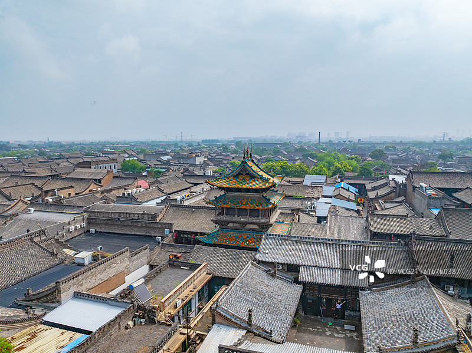
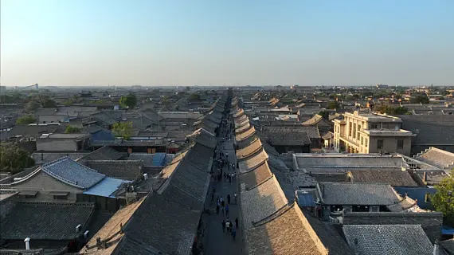

# 平遥古城 ✨

## 🏮 开篇：活着的明清古城

1997年，平遥古城申遗的时候，联合国教科文组织的专家来了。他们站在城墙上往下一看，惊呆了。

整个城市，从城墙到街道，从店铺到民居，从文庙到城隍庙，完完整整地保留了明清时期的样子。没有高楼大厦，没有玻璃幕墙，没有霓虹灯。几百年过去了，这里的人们还住在祖宗留下的房子里，走着祖宗走过的街道，过着和几百年前几乎一样的生活。

专家说："这不是一个遗址，这是一个活着的古城。"

于是，平遥成为了全中国第一个以整座古城申报世界文化遗产的城市。

今天，当你走在平遥的街道上，脚下的石板路已经被几百年的脚步磨得发亮。两旁的店铺还挂着清代的招牌，票号的柜台还在原来的位置，甚至镖局院子里的练武场，还能看到当年留下的脚印。

这就是平遥。
一座活着的、会呼吸的、保存了六百年的古城。

## 📜 晋商：中国华尔街的黄金时代

很多人知道平遥，是因为票号。但很少有人知道，票号到底意味着什么。

**公元1823年 日升昌的诞生**
平遥西达蒲村的李家，在西大街上开了一家叫"日升昌"的铺子。没有人想到，这家小小的铺子，会成为中国银行业的乡下祖父。

在那之前，商人做生意要带着银子上路，路上土匪横行，风险极大。日升昌发明了"汇票"——你在平遥存银子，拿着一张纸去全国各地就能兑银子。凭着一张纸，凭着诚信两个字，他们把生意做到了全中国。

**1900年 八国联军进北京**
慈禧太后西逃，路过平遥。日升昌借给了朝廷十万两银子。后来太后回京，把全国的官银汇兑都交给了日升昌。从此，平遥票号开始掌控整个大清帝国的金融命脉。

**鼎盛时期**
小小的平遥城，有22家票号。全国各地有400多个分号，北到莫斯科，南到新加坡，西到喀什噶尔，东到东京。

当时有句话叫："平遥城打个喷嚏，全中国都要感冒。"

那是晋商的黄金时代。那是平遥城最风光的时候。

---

## 🌟 核心景点详解

### 📍 俯瞰古城：青灰色的时光容器

这是平遥古城最经典的视角。站在城墙上往下看，一望无际的青灰色瓦顶，像一片灰色的海洋。中间那座金碧辉煌的建筑，是古城的中心——市楼。

整个城市像一个棋盘，四大街、八小街、七十二条蚰蜒巷，整整齐齐，横平竖直。这是明代初年的城市规划，六百年过去了，几乎没有变过。

**你不知道的古城格局**：
- **乌龟城**：平遥城的形状像一只乌龟，南门是头，北门是尾，东西四门是四条腿
- **四大街**：南大街是中轴线，是当年最繁华的"中国华尔街"
- **马面**：城墙上每隔一段就有一个突出的"马面"，上面可以站士兵，敌人攻城时可以三面夹击
- **没有高楼**：古城里所有的建筑都不能超过城墙的高度，所以你看不到任何破坏天际线的建筑

**最佳拍摄时间**：
- **清晨6-8点**：炊烟从家家户户的烟囱里冒出来，整个古城笼罩在一层薄雾里
- **傍晚5-7点**：夕阳把灰色的瓦顶染成金色，市楼的影子拉得很长
- **夜晚**：红灯笼都亮起来了，是平遥最美的时候

> 💡 **导游贴士**：
> 一定要在城墙上租一辆自行车，绕城墙骑一圈（全程6公里）。
> 骑在车上，看着脚下的古城，看着远处的夕阳，你会突然明白：
> 什么叫"一眼千年"。

---

### 📍 南大街：六百年的街道

这张照片是从南门的城墙上往北拍的。笔直的南大街，像一把剑一样，从南城门一直插到市中心的市楼。两旁的店铺，一栋挨着一栋，都是清代的老建筑。

站在这条街上，你闭上眼睛，就能想象出一百年前这里的样子：
票号的伙计在门口鞠躬迎客，镖局的镖师押着银车走过，卖平遥牛肉的铺子飘出肉香，说书的在茶馆里拍着醒木……

**南大街上必看的几个地方**：

**日升昌票号**：中国第一家票号，"汇通天下"的发源地。一定要看看他们当年的保险柜，看看那张可以防伪的汇票是怎么造出来的。

**协同庆钱庄**：地下金库是亮点！当年的银子就藏在院子底下，钻进去，你会看到几百年前银行的金库是什么样的。

**古县衙**：全国保存最完整的清代县衙。每天有县太爷升堂的表演，特别有意思。

**城隍庙**：庙里的琉璃瓦是明代的，颜色到现在还特别鲜亮。

> 💡 **夜游平遥**：
> 晚上的平遥，和白天完全是两个世界。
> 红灯笼亮起来，酒吧的歌声飘出来，卖文创的小店开着门，游客在街上悠闲地走着。
> 找个清吧坐下来，喝杯小酒，听着歌，看着街上的人来人往。
> 那一刻你会爱上这座城。

---

### 📍 王家大院：民间的紫禁城

很多人说，来平遥，一定要去王家大院。不是因为它最大，而是因为它最能代表晋商的精神。

这座大院有123个院子，1118间房子。逛三个小时都逛不完。

你看那些房子的砖雕、木雕、石雕，每一个细节都有讲究。蝙蝠代表"福"，鹿代表"禄"，葡萄代表"多子多孙"。晋商把所有的人生理想，都刻在了房子上。

更让人感动的是那些家训。几乎每个院子的正屋墙上，都刻着家训：
"一粥一饭，当思来处不易"
"子孙贤，族将大"
"和气生财"

这就是晋商成功的秘密——
不是因为他们有多聪明，
而是因为他们把"诚信"两个字，刻进了骨子里，传给了一代又一代人。

---

## 🏮 平遥的日与夜

白天的平遥，是历史的平遥。
你逛票号，逛镖局，逛县衙，看着那些老房子，想着几百年前发生的故事。

夜晚的平遥，是活着的平遥。
红灯笼亮起来，酒吧的歌声飘出来，年轻人在街上拍照，老奶奶在门口纳凉，狗在路中间趴着睡觉。

这才是平遥最珍贵的地方。
它不是一个博物馆。
它是有人在里面生活的、有烟火气的、活着的古城。

**一定要做的几件小事**：
1. 早上起来，找个路边摊，吃一碗平遥牛肉面
2. 傍晚在城墙上散步，看夕阳落下
3. 晚上找个清吧，听一听驻唱歌手的歌
4. 凌晨起来，看没有游客的、最安静的平遥
5. 临走前，带一瓶平遥陈醋回去

---

## 🎯 游览实用指南

### 🚗 交通指南
平遥的交通非常方便。

**高铁**：
- 平遥古城站，距离古城约8公里，打车15分钟
- 北京→平遥：约3小时
- 太原→平遥：约40分钟
- 西安→平遥：约2小时

**自驾**：
- 古城里面不能开车，车停在城外的停车场，10-20元/天
- 推荐停北门或者下西门，离古城核心区最近

**古城内交通**：
- 全程靠走！古城不大，从南走到北也就20分钟
- 有观光车，15元/人，但不推荐——古城就是要慢慢逛才有味道

### 🎫 门票信息（2025年参考）
- **古城通票**：125元，包含22个景点，3天有效
- **双林寺**：35元，非常推荐！明代彩塑，东方艺术宝库
- **镇国寺**：25元，五代建筑，唐代彩塑
- **《又见平遥》演出**：238元起，强烈推荐！王潮歌导演，非常震撼
- **半票**：学生、60-64岁老人
- **免票**：65岁以上、军人、残疾人、记者
- **预约**：关注"平遥古城景区"公众号预约即可，不用提前太久

### ⏰ 最佳游览时间
- **3-5月、9-11月**：春秋季，天气最好，人也相对少
- **春节期间**：有社火表演，年味最浓，但人特别多
- **7-8月**：暑假，人多，比较热
- **建议游览时长**：2天1晚是基础，3天2晚最佳，住一晚才能感受到古城的夜

### 🗺️ 推荐路线
**经典两日游**：
- **第一天**：西门进城 → 西大街 → 日升昌 → 协同庆 → 南大街 → 市楼 → 县衙 → 城隍庙 → 晚上看《又见平遥》
- **第二天**：早上登城墙（租自行车绕一圈）→ 文庙 → 镖局博物馆 → 下午去双林寺 → 返程

**懒人一日游**：
上午：城墙 → 日升昌 → 县衙
下午：协同庆 → 镖局 → 城隍庙
晚上：夜游古城

### 🏨 住宿建议
一定要住在古城里面！不住古城等于白来。

**推荐**：
- **经济型**：明清四合院改造的民宿，150-300元/晚，很有味道
- **舒适型**：精品酒店，300-600元/晚，服务好，位置佳
- **体验型**：真正的老院子，有历史的那种，600+元/晚

> 避雷：不要住特别靠近酒吧街的地方，晚上会吵。选衙门街或者西大街附近的，安静又方便。

### 🍜 平遥美食
- **平遥牛肉**：第一名！一定要吃，切成薄片，蘸着醋吃，绝了
- **平遥碗托**：荞麦面做的，凉拌，酸辣爽口，是平遥人的日常
- **平遥牛肉面**：早上起来一碗，热乎乎的，特别香
- **莜面栲栳栳**：山西特色，蘸着卤汁吃
- **陈醋冰淇淋**：黑暗料理？意外的好吃！一定要试试

### ⚠️ 避坑指南
1. ❌ 不要在景区门口买"假古董"，十有八九都是假的
2. ❌ 不要相信路边拉客的"导游"，很多是野导
3. ✅ 买醋要去正规的醋坊，不要在路边买
4. ✅ 《又见平遥》一定要看！虽然贵，但值回票价
5. ❌ 不要在古城里买"沙金"首饰，都是骗人的

## 💫 结语：为什么我们爱平遥？

中国的古城很多。
有的太商业化了，除了卖义乌小商品的就是卖奶茶的，看不到一点本地人生活的痕迹。
有的太破旧了，年轻人都走了，只剩下老人和狗，没有一点生气。

平遥不一样。
它还活着。

早上你能看到送孩子上学的家长，能看到买菜回来的阿姨，能看到开铺子开门的老板。
晚上你能看到出来散步的老人，能看到谈恋爱的年轻人，能看到坐在门口聊天的街坊邻居。

这就是平遥最珍贵的地方。
它不是一个为游客建的主题公园。
它是一个真正的、有人在里面生活的家。

六百年了。
朝代换了，皇帝换了，票号倒了，晋商没了。
但这座城还在。
这里的人还在。
这里的生活还在。

所以来一次平遥吧。
不是为了看什么景点。
是为了在这个快得不像话的时代，找一个地方，慢下来。
过两天六百年前的日子。

> 📌 **旅行感悟**：
> 余秋雨说："在平遥，我突然明白了，中国文化中最珍贵的东西，往往不在那些宏伟的宫殿里，而在这些普通的街道、普通的房子、普通人的生活里。"
>
> 平遥最珍贵的，从来都不是什么景点。
> 是生活。

---

*本页内容基于实景图片分析与晋商文化研究整理，由AI导游系统2025年6月生成*
