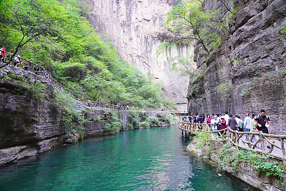
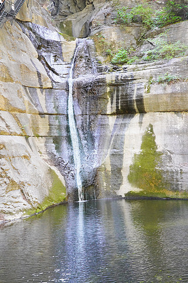
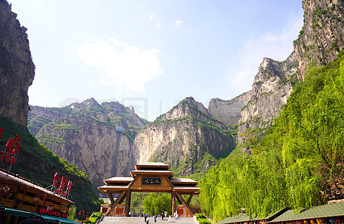
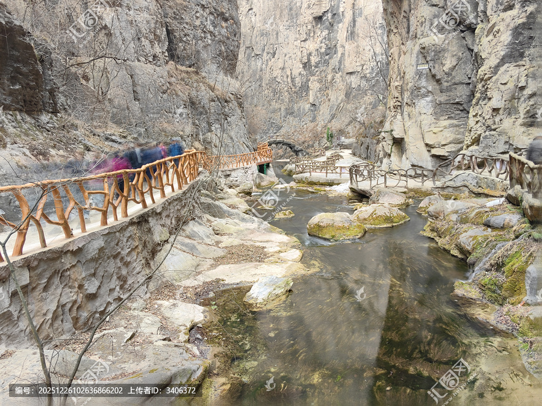
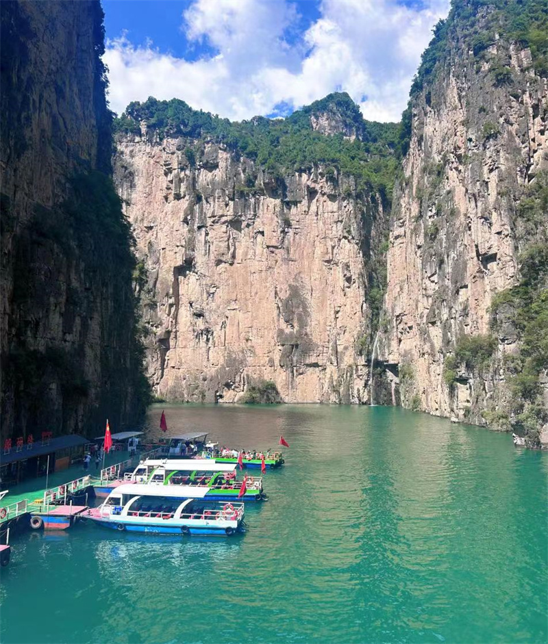

# 壶关太行山大峡谷八泉峡景区

## 🎤 AI导游带你游

### 【开场白】
各位朋友，大家好！欢迎来到山西省长治市，欢迎来到壶关太行山大峡谷八泉峡景区。我是你们今天的导游小艾。

站在这片土地上，你们可能想象不到，千百年前，这里曾是怎样一番景象。历史的年轮在这里留下了深深的印记，每一寸土地都在诉说着古老的故事。

长治市太行山大峡谷八泉峡景区 5A景区 ★ 4.5 长治市太行山大峡谷八泉峡景区简介 八泉峡，坐落于山西省长治市壶关县太行山大峡谷腹地，是国家5A级旅游景区，亦被誉为“太行第一雄峡”。这里山势巍峨，峡谷深邃，湖光山色交相辉映，集雄、奇、险、秀于一身，尤以八道清泉、高峡平湖、千米索道与悬壁栈道四大奇观...

今天，就让我们一起走进这片神奇的土地，感受它独有的魅力。建议游览时间：半天到一天。拍照最佳时间是清晨或傍晚，光线柔和时最美。

---

## 🗺️ 景区全景导览
壶关太行山大峡谷八泉峡景区位于山西省长治市壶关县境内，是国家AAAAA级旅游景区。

长治市太行山大峡谷八泉峡景区 5A景区 ★ 4.5 长治市太行山大峡谷八泉峡景区简介 八泉峡，坐落于山西省长治市壶关县太行山大峡谷腹地，是国家5A级旅游景区，亦被誉为“太行第一雄峡”。这里山势巍峨，峡谷深邃，湖光山色交相辉映，集雄、奇、险、秀于一身，尤以八道清泉、高峡平湖、千米索道与悬壁栈道四大奇观闻名遐迩。 游乐旅行网小编整理了主要景点包括：八泉峡高峡平湖、千米索道、悬壁栈道、八道清泉、玉皇阁、生肖峡、北天门、龙王洞、一线天、八泉飞瀑等，每一处都如诗如画，令人流连忘返。 乘船游弋于高峡平湖之上，碧水如镜，倒映着两岸千仞绝壁，仿佛行舟于水墨长卷之中。湖面全长约5公里，最窄处仅十余米，两岸峭壁如

**游览路线推荐**：景区入口 → 核心景观区 → 精华景点 → 观景平台 → 出口

---

## 🏛️ 主要景点详解

### 📍 核心景区

**核心看点**：
- 观景位置绝佳，视野开阔
- 是拍摄全景照片的最佳地点
- 傍晚时分来，夕阳西下的景色美不胜收

> 💡 **导游贴士**：
> 如果你是摄影爱好者，核心景区一定能让你拍出满意的作品，记得带上广角镜头！

---

### 📍 精华观景台

**核心看点**：
- 这里是景区最具代表性的景观，绝对不可错过
- 独特的自然/人文风貌，是拍照打卡的首选之地
- 建议停留15-20分钟，细细品味它的独特魅力

> 💡 **导游贴士**：
> 游览精华观景台时，建议放慢脚步，细细品味它的美。从不同角度欣赏会有不同的收获哦！

---

### 📍 特色景观区

**核心看点**：
- 自然风光与人文景观完美融合的典范
- 四季景致各异，无论何时来都有惊喜
- 摄影爱好者的天堂，随手一拍都是大片

> 💡 **导游贴士**：
> 游览特色景观区时，不妨关掉手机，用眼睛和心灵去感受这份美好。

---

### 📍 文化展示区

**核心看点**：
- 这里曾是历史上重要的场所，意义非凡
- 建筑/景观的设计独具匠心，体现了古人智慧
- 站在这里，仿佛能与历史对话

> 💡 **导游贴士**：
> 来文化展示区游览，建议穿舒适的鞋子，这里需要多走走才能发现它的美。

---

### 📍 历史遗迹区

**核心看点**：
- 景区内最受欢迎的打卡点，游客必到
- 站在这里可以俯瞰整个景区的壮丽景色
- 天气好的时候拍照效果绝佳，记得预留时间

> 💡 **导游贴士**：
> 在历史遗迹区游览时，注意爱护环境，让这份美能够长久留存。

---

### 📍 自然观光带

**核心看点**：
- 这里承载着景区最深厚的历史文化底蕴
- 每一处细节都诉说着动人的故事
- 建议跟随讲解员深入了解背后的历史

> 💡 **导游贴士**：
> 自然观光带的景色四季皆宜，每个季节都有不同的美，值得多次来访。

---

## 【结束语】
各位朋友，今天的游览即将结束。希望壶关太行山大峡谷八泉峡景区的美景能给你们留下美好的回忆。

有人说，旅行的意义不在于去过多少地方，而在于那些让你心动的瞬间。希望在壶关太行山大峡谷八泉峡景区的这一天，能成为你旅途中一个温暖的记忆。

临走前，别忘了回头再看一眼。夕阳下的壶关太行山大峡谷八泉峡景区，会给你最温柔的道别。

> ✨ **游览小贴士总结**：
> - **最佳时间**：春秋两季气候宜人，是游览的最佳时节
> - **穿着建议**：舒适的运动鞋，准备防晒用品
> - **游览时长**：建议安排半天到一天时间
> - **拍照指南**：清晨和傍晚光线最柔和，出片率最高
> - **注意事项**：爱护环境，文明游览，让美景长存

祝你们旅途愉快，平安吉祥！🙏

---

## 📷 景区美图

*景区全景*

*核心景观*

*特色风光*

*细节之美*

*四季风光*

*人文景观*

---

## 📚 壶关太行山大峡谷八泉峡景区小档案

| 项目 | 信息 |
|------|------|
| 景区级别 | 国家AAAAA级旅游景区 |
| 所属省份 | 山西省 |
| 所属城市 | 长治市 |
| 建议游览时间 | 半天 - 1天 |
| 最佳游览季节 | 春秋两季 |

---

> 💡 **本页说明**：
> 本README由AI导游小艾根据网络公开资料整理生成。
> 坐标、图片、简介均来自豆包搜索API，仅供参考。
