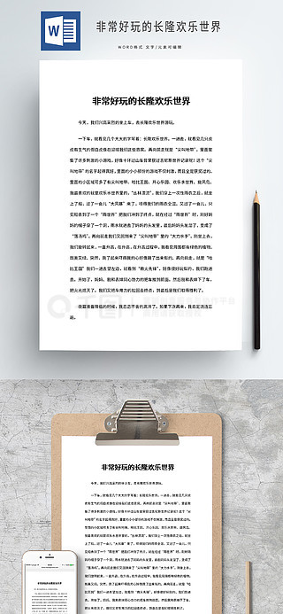
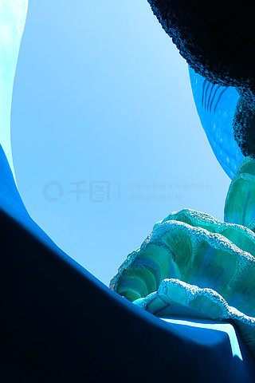
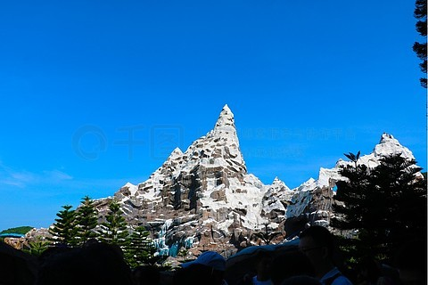
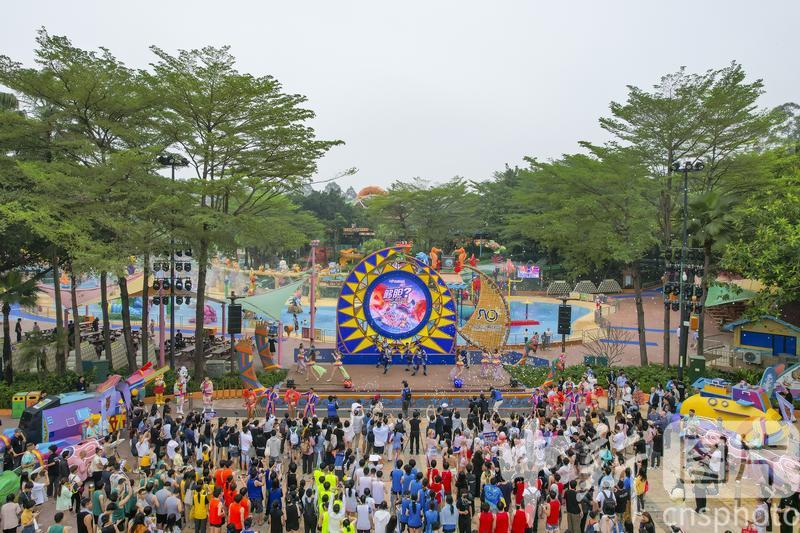

# 长隆旅游度假区 ✨

## 🌅 开篇：一个农民，造了一个动物王国

1989年，番禺大石镇，一个叫苏志刚的农民，借钱开了一家小酒楼。

那时候，番禺还是广州郊区的乡下，到处是农田和水塘。苏志刚的小酒楼，开在村口，卖一些家常菜。

没有人想到，35年后，这个农民会拥有中国最大的主题乐园帝国--长隆。

也没有人想到，他会把酒楼旁边的荒地，变成一个能养500多种、20000多只动物的"野生动物世界"。

更没有人想到，他会在广州造一座全球最大的马戏剧院，让俄罗斯、乌克兰、哈萨克斯坦的马戏精英都来为他表演。

苏志刚做长隆，做的是一件很"疯"的事--

别人开主题乐园，是为了赚钱。
他开主题乐园，是为了"养动物"。

为了养好动物，他建了全国最大的私人动物园。
为了养好动物，他从澳洲空运桉树过来，因为他要养考拉。
为了养好动物，他专门买了一架波音747货机，从非洲运长颈鹿。

苏志刚说："我不是商人，我是养动物的。"

他这句话有点凡尔赛。但他说的是真的。

因为长隆的"动物"才是主角，"乐园"只是配角。

来长隆，你会明白：人，可以和动物做朋友。
人，可以从动物身上，学到一些我们已经忘了的东西。

## 📜 一个动物王国的崛起

**1989年：苏志刚的小酒楼**

苏志刚，番禺本地人，农民出身。1989年，他在番禺大石镇开了一家叫"香江酒家"的小酒楼，赚到了第一桶金。

**1997年：香江野生动物世界开业**

1997年12月，苏志刚投资2亿元，在番禺大石镇建了"香江野生动物世界"。这是华南地区第一个大型野生动物园。

开业第一年，游客300万人次。

**2000年：从非洲引进大批动物**

2000年，苏志刚花1000万美元，从南非、津巴布韦、肯尼亚等国引进了2000多只野生动物，包括白犀牛、长颈鹿、斑马、角马等。

这是中国历史上最大规模的一次海外动物引进。

**2004年：长隆欢乐世界开业**

2004年，苏志刚在野生动物世界旁边，建了"长隆欢乐世界"。这是华南地区第一个大型现代主题乐园。

**2006年：长隆水上乐园开业**

2006年，长隆水上乐园开业。这是中国最大的水上乐园，每年5-10月开放，单日游客最高6万人次。

**2007年：晋升5A景区**

长隆度假区成为中国第一批5A级主题旅游度假区。

**2008年：考拉到来**

2008年5月，长隆从澳大利亚引进6只考拉。这是中国大陆首次引进考拉。

为了这6只考拉，长隆提前3年就在广州种了2000多棵桉树，专门为它们提供食物。

**2014年：《爸爸去哪儿》电影版在长隆拍摄**

2014年大电影《爸爸去哪儿》在长隆野生动物世界拍摄，让长隆火遍全国。

**2014年：长隆海洋王国（珠海）开业**

2014年，长隆在珠海横琴建了"长隆海洋王国"。这是全球最大的海洋主题乐园之一。

**2016年：清远长隆开建**

2016年，长隆在清远开建第三个度假区，主打森林主题。

**今天**：长隆度假区年接待游客超过3000万人次，是中国规模最大的旅游度假区之一。

## 🌟 核心景点详解

### 📍 长隆野生动物世界：中国最好的动物园

长隆野生动物世界是长隆的"灵魂"，是中国规模最大、动物种类最多的野生动物园。

**园区数据**：
- 占地2000亩（约1.3平方公里）
- 动物500多种、20000多只
- 全国首个"自驾看动物"的动物园
- 全国首个"放养式"野生动物园

**长隆野生动物世界的"中国之最"**：
- 中国最大的考拉种群（50多只，海外最大）
- 中国最大的白虎种群（150多只，全球1/4）
- 中国最大的火烈鸟群（800多只）
- 中国最大的大象群（20多头）
- 中国唯一能看到大熊猫三胞胎的地方

**必看动物**：

1. **大熊猫三胞胎**：2014年出生，全球唯一存活的大熊猫三胞胎。妈妈叫菊笑，三个孩子叫萌萌、帅帅、酷酷。
2. **考拉群**：50多只考拉，从澳大利亚引进。每天睡22小时，所以你看考拉时它基本在睡觉。
3. **白虎**：150多只白虎，全球1/4。白虎不是白化病，是孟加拉虎的变异种。
4. **金丝猴**：川金丝猴、滇金丝猴、黔金丝猴都有，是中国金丝猴种类最全的动物园。
5. **亚洲象**：20多头，每天14:00有"大象表演"。
6. **长颈鹿**：30多头，可以喂它们吃树叶。
7. **火烈鸟**：800多只，整个湖都是粉红色的。

**必玩项目**：

1. **自驾看动物区**：坐景区电瓶车或自己开车，穿越5大放养区。动物在你车窗外走，长颈鹿会探头进来要吃的。
2. **空中缆车**：从空中俯瞰整个放养区，3条线路，免费乘坐。
3. **小火车游览**：和自驾区类似，但坐景区小火车，有讲解。
4. **青龙山恐龙谷**：仿真恐龙区，孩子们最爱。
5. **熊猫餐厅**：在熊猫餐厅吃饭，旁边就是熊猫的活动区。

> 💡 **导游贴士**：
> 1. 必须早上9:00开门就进！动物上午活跃，下午睡觉
> 2. 必坐空中缆车！免费！从空中看动物，视角独特
> 3. 必看大熊猫三胞胎！全球唯一，只在长隆有
> 4. 必看白虎！长隆的"招牌"
> 5. 不要带食物喂动物！动物饮食有讲究，乱喂会让动物生病
> 6. 自驾区不能开窗！开窗会被罚款，且危险

---

### 📍 长隆欢乐世界：刺激指数爆表

长隆欢乐世界是华南地区最大的现代主题乐园。

**园区分为6大主题区**：
1. **哈比王国**：儿童区，适合1.2米以下儿童
2. **尖叫地带**：刺激项目区
3. **旋风岛**：旋转类项目
4. **彩虹湾**：水上项目
5. **欢乐水世界**：夏天开放的水上区
6. **演艺中心**：表演区

**必玩的刺激项目**：

1. **垂直过山车**：长隆"镇园之宝"。从60米高空垂直俯冲下来，速度120公里/小时。是全球最刺激的过山车之一。
2. **十环过山车**：连续10个360度翻滚，吉尼斯世界纪录。
3. **摩托过山车**：起步0-100公里/小时只需2.8秒，像F1赛车起步。
4. **U型滑板**：30米高的U型轨道，来回摆动。
5. **飞马家庭过山车**：适合家庭的项目，1.2米以上即可玩。
6. **超级大摆锤**：30米高的大摆锤，最高点让你大头朝下。

**适合家庭的项目**：
- **旋转木马**：双层豪华版
- **碰碰车**：经典项目
- **4D影院**：每天有4D电影
- **飞行影院**：模拟飞行，俯瞰中国美景
- **海盗船**：经典摇摆项目

**必看表演**：
- **北美滑稽剧团**：每天3场，户外表演
- **国际魔术表演**：每天2场，剧场表演
- **北美特技剧场**：每天2场，汽车特技

> 💡 **导游贴士**：
> 1. 9:00开门就进，先排垂直过山车！这是排队最久的项目
> 2. 旺季排队1-2小时，建议买"快速通道"票（80-150元）
> 3. 必看晚上8:30的花车巡游！长隆最经典的表演
> 4. 不要穿拖鞋！很多项目不允许
> 5. 1.4米以下儿童有限制项目，请提前查好
> 6. 必带：防晒、雨衣（水上项目用）、充电宝

---

### 📍 长隆水上乐园：亚洲最大的水上乐园

长隆水上乐园是亚洲最大的水上乐园，每年5-10月开放。

**园区数据**：
- 占地40万平方米
- 单日游客最高6万人次
- 全球年游客量最高的水上乐园（多年蝉联第一）

**必玩项目**：

1. **大喇叭**：4人一组坐在皮筏上，被冲进一个15米高的喇叭形滑道，来回摆动。
2. **巨兽碗**：从20米高空冲进一个巨碗，旋转后落入水池。
3. **垂直极限**：3条不同角度的滑道，最垂直的是90度。
4. **超级大喇叭**：大喇叭的升级版，30米高。
5. **喷射滑道**：6条并排滑道，可以和朋友比赛。
6. **漂流河**：1.2公里长的人工河，慢慢漂。
7. **造浪池**：亚洲最大，能造3米高的浪。

**水上乐园的特色**：
- **电音派对**：每天晚上7:00开始，DJ打碟+水上蹦迪
- **比基尼派对**：每周末，主题派对
- **夜场**：晚上6-10点开放，灯光效果一流

> 💡 **导游贴士**：
> 1. 必须带泳衣、毛巾、防晒霜！否则没法玩
> 2. 必须穿拖鞋！地面烫脚
> 3. 旺季排队1小时以上，建议早上去
> 4. 必玩大喇叭！长隆水上乐园的招牌
> 5. 必看电音派对！晚上7点开始，气氛超嗨
> 6. 不要戴眼镜玩！会飞出去
> 7. 带防水手机壳！不然没法拍照

---

### 📍 长隆国际大马戏：全球最大的马戏殿堂

长隆国际大马戏是全球规模最大、演员最多的马戏表演。

**马戏剧院数据**：
- 占地9500平方米
- 观众席7500个
- 舞台直径25米
- 演员来自20多个国家
- 演出时长90分钟

**长隆马戏的"全球之最"**：
- 全球最大的马戏剧院
- 全球最多的马戏演员（300+人）
- 全球最多的马戏动物（300+只）
- 全球最贵的马戏设备（10亿+元）

**马戏剧目**：

1. **《极限震撼》**：长隆马戏的招牌节目，俄罗斯空中飞人。
2. **《马术表演》**：哈萨克斯坦马术团，20匹马同时表演。
3. **《空中绸吊》**：乌克兰杂技演员，在空中丝绸上做高难度动作。
4. **《生死轮》**：3个人在3个旋转的轮子里跑，最高点15米。
5. **《大跳板》**：俄罗斯跳板团，飞越3层楼。
6. **《驯兽表演》**：长隆独有的动物表演，包括老虎、狮子、熊、马、象。
7. **《小丑表演》**：来自欧洲的小丑，和孩子互动。

**长隆马戏的特别之处**：

长隆马戏和其他马戏最大的不同，是它养了一支"驻场马戏团"。

这支马戏团由300多名演员组成，来自20多个国家。他们长年住在长隆，每天演出。

很多演员是国际马戏大赛的金奖得主。来长隆之前，他们在世界各地巡演。来了长隆之后，他们不用再漂泊，可以稳定地生活、表演、养家。

苏志刚说："这些演员也是我的'动物'，我要让他们在长隆过得好。"

> 💡 **导游贴士**：
> 1. 必须提前买票！旺季经常售罄
> 2. 票价：380-880元不等，VIP前排更贵
> 3. 演出时间：晚上7:30-9:00，建议提前30分钟到场
> 4. 必带相机！但不要用闪光灯（会惊到动物）
> 5. 选座：前5排互动多，但可能被水溅到；中后排视野好
> 6. 不要带婴幼儿！声音大，灯光强，孩子可能害怕
> 7. 长隆马戏是"全场无座次表演"，演员会从观众席上来

---

### 📍 长隆飞鸟乐园：被遗忘的鸟类天堂

长隆飞鸟乐园是长隆度假区里"最被低估"的园区。

很多游客不知道长隆有飞鸟乐园。但它是华南地区最大的鸟类生态公园。

**园区数据**：
- 占地1200亩
- 鸟类100多种、10000多只
- 中国最大的火烈鸟群（800只）
- 中国最大的鹈鹕群（200只）
- 中国最大的天鹅群（500只）

**必看鸟类**：
- **火烈鸟**：800只，整个湖粉红色
- **鹈鹕**：200只，会排队捕鱼
- **丹顶鹤**：30只，每天有"百鸟飞歌"表演
- **天鹅**：500只，黑天鹅、白天鹅、疣鼻天鹅
- **鹦鹉**：100多只，会说话
- **秃鹫**：20只，国内少见的猛禽

**必看表演**：
- **百鸟飞歌**：每天上午11:00、下午3:00。100多种鸟一起飞，是国内规模最大的鸟类飞行表演。
- **湿地精灵秀**：每天10:30、14:00。鹤、鹳、鹈鹕的喂食表演。

> 💡 **导游贴士**：
> 1. 飞鸟乐园单独售票，100元/人
> 2. 这是最适合带孩子的园区，可以喂鸟
> 3. 必看百鸟飞歌！100种鸟一起飞，震撼
> 4. 鸟类活跃时间是上午，建议早上来
> 5. 不要大声喧哗！会惊吓到鸟类
> 6. 带望远镜，能看清鸟的细节

---

### 📍 长隆酒店：住在动物旁边

长隆酒店是度假区内最著名的酒店，最大特色是"动物就在你窗边"。

**酒店特色**：
- 1400间客房
- 主题客房：白虎房、火烈鸟房、长颈鹿房
- 餐厅旁边就是动物放养区
- 酒店有专属的"动物通道"，可以从酒店直达野生动物世界

**白虎餐厅**：
长隆酒店最出名的餐厅。早餐和午餐自助，餐厅中间是一片白虎放养区。你吃着饭，白虎就在玻璃另一边看着你。

**住店客人的福利**：
- 提前1小时进入野生动物世界
- 免费进入飞鸟乐园
- 大马戏VIP通道
- 欢乐世界快速通道

**酒店价格**：
- 普通房：800-1500元/晚
- 主题房（白虎房等）：2000-3000元/晚
- 套房：5000-10000元/晚
- 节假日价格翻倍

> 💡 **住宿贴士**：
> 1. 主题房（白虎房、长颈鹿房）很抢手，提前1个月订
> 2. 必吃白虎餐厅早餐！一边吃一边看白虎
> 3. 住店客人有专属通道，能避开普通游客
> 4. 长隆还有熊猫酒店、飞鸟酒店，各有特色
> 5. 节假日酒店价格翻倍，建议工作日住

## 🎯 游览实用指南

### 🚗 交通指南

**飞机**：广州白云国际机场，距长隆约50公里，打车1小时，约150元

**高铁**：广州南站，距长隆约10公里，打车20分钟，约30元。或坐地铁7号线直达

**地铁**：3号线/7号线汉溪长隆站，出站免费坐景区巴士

**自驾**：导航"长隆旅游度假区"，停车场30-50元/天

### 🎫 门票信息（2025年参考）

- **野生动物世界**：350元（成人），245元（儿童/老人）
- **欢乐世界**：300元（成人），210元（儿童/老人）
- **水上乐园**：200元（成人），140元（儿童/老人）
- **大马戏**：380-880元（按座位分区）
- **飞鸟乐园**：100元（成人），70元（儿童/老人）
- **两园联票**：野生动物世界+大马戏，约600元
- **三园联票**：野生动物世界+欢乐世界+大马戏，约800元
- **免票**：1.0米以下儿童
- **学生票**：部分园区有学生票，请提前问
- **预约**：节假日必须提前在"长隆"公众号预约

### ⏰ 最佳游览时间

- **10月-次年4月**：凉爽，是最佳季节
- **5月-6月**：天气渐热，但人少
- **7月-8月**：暑假旺季+水上乐园开放，热+人多
- **9月**：暑假结束，人少，但水上乐园最后1个月
- **建议游览时长**：每个园区1天，4个园区共4天

### 🗺️ 推荐路线

**经典两日游（最推荐）**：
- **第一天**：野生动物世界（玩一整天）-> 晚上看大马戏
- **第二天**：欢乐世界（玩一整天）-> 晚上看花车巡游

**亲子三日游**：
- **第一天**：野生动物世界 + 飞鸟乐园
- **第二天**：欢乐世界
- **第三天**：水上乐园（夏天）或欢乐世界（冬天）

**深度四日游**：
- **第一天**：野生动物世界
- **第二天**：欢乐世界
- **第三天**：水上乐园 + 大马戏
- **第四天**：飞鸟乐园 + 购物

**只玩一天**：
- 必选：野生动物世界！这是长隆的灵魂

> 💡 **最重要的建议**：
> 1. 不要想着一天玩3个园区！每个园区都要1整天
> 2. 必须住一晚长隆酒店！住店客人有专属福利
> 3. 必须看大马戏！这是全球最高水准的马戏
> 4. 必须看野生动物世界！这是中国最好的动物园
> 5. 必须提前预约！节假日现场买不到票
> 6. 必须穿运动鞋！一天走2万步起
> 7. 必须带充电宝！拍照拍一天，手机没电

### 🍜 广州美食

- **白切鸡**：广州第一名菜，皮黄肉白
- **烧鹅**：粤菜代表，皮脆肉嫩
- **煲仔饭**：广式传统，米饭焦香
- **早茶**：广州人的灵魂，必体验
- **艇仔粥**：广州特色粥品
- **肠粉**：广东早餐必吃
- **双皮奶**：广东甜品，必尝

### ⚠️ 注意事项

1. **不要穿拖鞋**：欢乐世界、水上乐园不允许
2. **防晒！**：广州紫外线强，SPF50+
3. **带雨衣**：水上项目和广州雨季都需要
4. **节假日人超多**：建议工作日来
5. **保护动物**：不要拍玻璃、不要乱喂、不要大声喧哗
6. **带孩子的注意**：园区大，注意防走失
7. **避开台风季**：6-10月部分室外项目会暂停
8. **不要插队**：广州人讨厌插队
9. **提前预约**：节假日必须预约才能入园

## 💫 结语：在动物的注视下，找回我们失去的纯真

长隆是一个动物王国。

它不只是动物园，它是一个"动物可以自由生活"的地方。

你看那些动物--

考拉每天睡22小时，无忧无虑。
白虎在放养区里自由奔跑，威风凛凛。
火烈鸟800只挤在一个湖里，粉红色的海洋。
长颈鹿从车窗外探头进来，眼神温柔。
大熊猫三胞胎在妈妈怀里打滚，无忧无虑。

它们不知道自己被"展览"。
它们只知道，这里有吃的、有玩的、有同伴、有阳光。
它们活得比我们简单。
它们活得比我们快乐。

我们呢？

我们每天忙。
忙工作、忙赚钱、忙房子、忙车子、忙孩子、忙面子。
我们什么都忙，就是不快乐。

我们忘了怎么像动物一样生活。

我们忘了，吃饭就是吃饭，睡觉就是睡觉，玩就是玩，爱就是爱。

我们吃饭要看手机，睡觉要想明天的事，玩要拍照发朋友圈，爱要算计值不值。

我们活得太复杂了。

长隆告诉你--

简单一点。

像考拉一样，该睡就睡。
像白虎一样，该跑就跑。
像火烈鸟一样，该飞就飞。
像大熊猫一样，该吃就吃，该玩就玩。

生活其实没那么复杂。

复杂的是我们自己。

苏志刚，一个农民，造了长隆。
他说他不是商人，他是"养动物的"。
他这句话，听起来有点凡尔赛。

但我相信他是真的。

因为他知道，动物比人单纯。
动物比人真实。
动物比人会生活。

希望你来长隆的时候，能学会这种"动物智慧"。

不是变笨，是变简单。
不是变野，是变真实。
不是放弃追求，是放下复杂。

像一只考拉一样。

睡22小时。
醒2小时，吃桉树叶。
什么都不想。
什么都不愁。

这才叫"活"。

> 📌 **旅行感悟**：
> 在长隆野生动物世界，
> 我看到一只小熊猫
> 在树枝上打哈欠。
> 它打哈欠的样子，
> 比我见过的所有人都可爱。
> 我突然明白--
> 我们人类，
> 已经很久没有这样
> 打过哈欠了。
> 我们的哈欠里
> 都是疲惫、压力、焦虑。
> 而小熊猫的哈欠里
> 是纯粹的、不需要解释的
> 困意。
> 那一刻，
> 我好想变成它。

---

*本页内容基于实景图片分析与长隆集团文化历史研究整理，由AI导游系统2025年7月生成*
