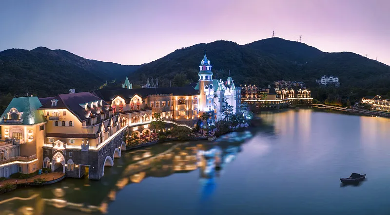
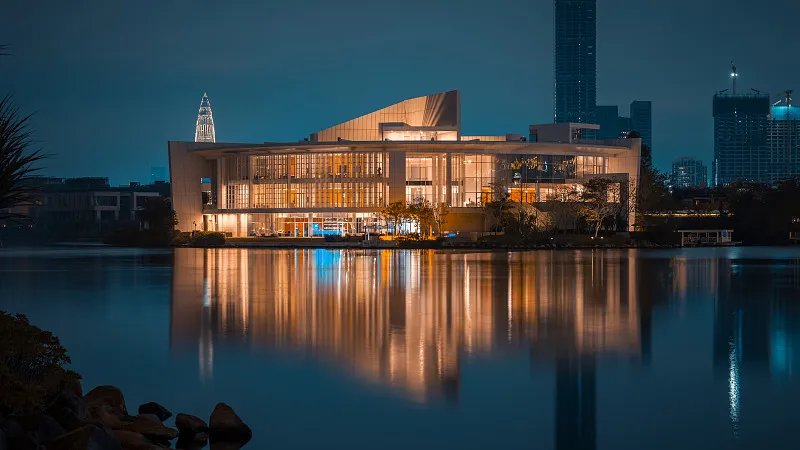

# 深圳华侨城旅游度假区 ✨

## 🌅 开篇：从一片海湾，到一座童话

1985年，深圳湾的北岸，还是一片滩涂。

那时候，深圳经济特区才成立5年。国贸大厦刚刚封顶，"深圳速度"刚刚被叫响。整个深圳，都是一个大工地。

但有一群人，看着这片滩涂，没有想"盖楼"，他们在想另一件事--

"能不能在这里，建一座让中国人开眼界的乐园？"

这群人，是国务院侨务办公室派来的。
他们要为归国华侨建一个安置区，叫"华侨城"。

但华侨城的总规划师，是一个叫马志民的香港人。
他说："安置区不能只是安置。我们要把它建成中国最好的旅游度假区。"

1989年，华侨城的第一个项目开业--锦绣中华。
这是中国第一个大型主题微缩景区。

开业第一天，游客挤爆了。
一年之内，500万人来看。

那时候全中国只有9亿人，500万人次的到访率，简直恐怖。

后来，又有了中国民俗文化村、世界之窗、欢乐谷……
华侨城成了中国主题乐园的"祖师爷"。
迪士尼进入中国之前，华侨城先教会了中国人什么是主题乐园。

今天，华侨城度假区占地6平方公里，包含4大主题公园、20多家酒店、3个购物中心、1个艺术中心、1个湿地公园。

它是深圳最"文艺"的地方。
也是深圳最"欢乐"的地方。

## 📜 一座度假区的诞生史

**1985年：华侨城起步**

国务院侨务办公室在深圳湾畔划出4.8平方公里的土地，建设"华侨城"--为归国华侨的安置和创业基地。

马志民出任华侨城建设指挥部总指挥。他提出"规划先行、文化立城"的理念，定下了华侨城的基调。

**1989年：锦绣中华开业**

锦绣中华是华侨城的第一个项目，也是中国第一个主题微缩景区。

园区占地30万平方米，把中国84个最有代表性的景观，按1:15的比例微缩复制。从万里长城到秦兵马俑，从故宫到乐山大佛，从黄果树瀑布到黄山奇松，全都在这里。

开业第一年，游客500万人次，营收破亿。这是当时中国旅游业的奇迹。

**1991年：中国民俗文化村开业**

民俗文化村占地20万平方米，展示中国56个民族的建筑、风俗、艺术。每个民族都有自己的"村落"，里面有真实的民族建筑、民族服饰、民族表演。

这里有中国第一场大型广场艺术表演--《中华百艺盛会》，每晚7:30开演，至今还在演。

**1994年：世界之窗开业**

世界之窗占地48万平方米，展示世界130多个著名景观的微缩版。从埃菲尔铁塔到金字塔，从泰姬陵到自由女神像，全都在这里。

世界之窗的108米高的埃菲尔铁塔复制品，是当时深圳最高的建筑之一。

**1998年：欢乐谷开业**

欢乐谷是华侨城第一个现代意义上的"主题游乐园"，有过山车、跳楼机、激流勇进等刺激项目。

它是中国本土第一个大型主题乐园品牌，比上海迪士尼早了18年。

**2006年：东部华侨城开业**

东部华侨城在深圳东部的大梅沙，占地9平方公里，是国家首个"国家级旅游度假区"。包含茶溪谷、大峡谷、云海谷三大主题区。

**2007年：晋升5A景区**

**今天**：华侨城度假区年接待游客超过3000万人次，是中国规模最大的旅游度假区之一。

## 🌟 核心景点详解

### 📍 锦绣中华：在一天里看遍中国

锦绣中华是华侨城的"开山之作"，至今仍是中国最经典的微缩景区。

**园区数据**：
- 占地30万平方米
- 微缩景观84处
- 比例：1:15
- 制作时间：4年（1985-1989）
- 制作人员：300多位工艺美术大师

**必看的微缩景观**：
- **万里长城**：园区最长景观，全长400米，按1:15微缩
- **故宫**：占地1000平方米，9000多间房全部微缩
- **秦兵马俑**：1:1复制，因为是按真人大小
- **乐山大佛**：高6米，按1:15微缩（真实71米）
- **黄山**：用真石头堆砌，云海用干冰模拟
- **黄果树瀑布**：用水循环系统模拟瀑布
- **布达拉宫**：13层全部微缩，金顶用真金
- **莫高窟**：复制了25个洞窟的壁画

**锦绣中华的"中国之最"**：
- 中国第一个主题微缩景区
- 中国第一个"开门红"的旅游项目（首年500万游客）
- 中国第一个出口海外的旅游品牌（在荷兰、台湾建了分园）

**有趣的小故事**：
1989年开业当天，一位老华侨站在微缩的故宫前哭了。他说："我离开中国40年了，今天终于'回'到了故宫。"

> 💡 **导游贴士**：
> 1. 锦绣中华建议上午来，光线好，能拍出微缩景观的"真实感"
> 2. 用长焦镜头！长焦能压缩空间，让微缩景观看起来像真的
> 3. 园区很大，建议坐电瓶车（30元）游览
> 4. 每天晚上8:00有《中华百艺盛会》表演，强烈推荐
> 5. 锦绣中华+民俗文化村是联票，可以一起玩

---

### 📍 中国民俗文化村：56个民族的家

民俗文化村是锦绣中华的"姐妹园"，两个园区相连。

如果说锦绣中华是"看景"，民俗文化村就是"看人"。

**园区特色**：
- 56个民族的村落，每个都按1:1真实建造
- 每个村落的建筑、服饰、工具、食物都从当地运来
- 每个村落有真实的民族演员，他们从老家来深圳工作
- 每天有20多场民族表演

**必看的村落**：
- **傣族村**：有真实傣族竹楼，每天有泼水节表演
- **苗族村**：有吊脚楼，演员会表演"上刀山"
- **藏族村**：有白塔和经幡，可以喝酥油茶
- **蒙古族村**：有蒙古包，可以骑马
- **侗族村**：有鼓楼，每天有侗族大歌表演（世界非物质文化遗产）
- **朝鲜族村**：有朝鲜屋，可以试穿韩服
- **黎族村**：有船形屋，可以看到古老的"钻木取火"

**必看的表演**：
- **《中华百艺盛会》**：每晚8:00在中心广场，500人演出，是中国最长寿的大型广场表演
- **《金戈王朝》**：每天下午2:00，马战表演，100匹真马
- **《东方霓裳》**：每天下午4:00，56个民族服饰大秀
- **泼水节**：每天上午11:00和下午3:00，傣族村

> 💡 **导游贴士**：
> 1. 必须看《中华百艺盛会》！500人广场表演，震撼
> 2. 泼水节会被淋湿，建议带换洗衣物或买一次性雨衣
> 3. 民族村的演员是真实的少数民族，可以和他们聊天，了解他们的文化
> 4. 每个村落的表演时间不同，建议进门先看节目单
> 5. 在侗族村听"侗族大歌"，是世界非物质文化遗产，多声部无伴奏合唱，绝了

---

### 📍 世界之窗：把世界搬来深圳

世界之窗是华侨城的第三个项目，1994年开业，是中国第一个"世界主题微缩景区"。

**园区数据**：
- 占地48万平方米
- 世界景观130多处
- 比例：1:1、1:5、1:15不等
- 标志性建筑：108米埃菲尔铁塔复制品

**必看的世界景观**：
- **埃菲尔铁塔**：108米高，1:3比例。可以登顶，俯瞰整个深圳湾
- **金字塔**：1:15比例，三个金字塔群
- **泰姬陵**：1:5比例，白色大理石
- **自由女神像**：1:5比例
- **比萨斜塔**：1:5比例
- **悉尼歌剧院**：1:5比例
- **圣彼得大教堂**：1:15比例
- **尼亚加拉大瀑布**：1:15比例，有真实水流
- **大峡谷**：用真实岩石堆砌

**世界之窗的"网红打卡点"**：
- **埃菲尔铁塔夜景**：每晚7:30有灯光秀
- **凯旋门**：拍照必去
- **比萨斜塔**：可以拍"推塔"的经典照
- **泰姬陵前**：拍照最美
- **世界广场**：每天晚上8:00有大型环球舞台秀

**世界之窗的特别活动**：
- **国际啤酒节**：每年7-8月，世界各国的啤酒汇集
- **万圣节狂欢**：每年10月，主题鬼屋、僵尸游行
- **跨年晚会**：每年12月31日，倒数+烟花

> 💡 **导游贴士**：
> 1. 必须登埃菲尔铁塔！塔顶能看见整个深圳湾+香港
> 2. 必须看晚上的环球舞台秀！灯光+音乐+舞蹈，绝了
> 3. 周末人多，工作日人少
> 4. 节假日（万圣节、跨年）有特别活动，需要提前买票
> 5. 拍埃菲尔铁塔，最佳机位在世界广场入口，傍晚灯亮时最美

---

### 📍 欢乐谷：刺激指数爆表

欢乐谷是华侨城最"刺激"的项目，1998年开业。

**园区分为9大主题区**：
1. **西班牙广场**：入口区
2. **魔幻城堡**：儿童区，有旋转木马、小火车
3. **冒险山**：刺激项目区，有"太空梭"（55米高空弹射）
4. **金矿镇**：美式西部风格
5. **香格里拉森林**：藏式风格
6. **飓风湾**：水主题区，有"激流勇进"
7. **阳光海岸**：沙滩主题
8. **欢乐时光**：经典项目区
9. **玛雅水公园**：夏天开放的水上乐园

**必玩的刺激项目**：
- **雪山飞龙**：中国第一座悬挂式过山车，最高80公里/小时
- **太空梭**：1.8秒内弹射到55米高空，再自由落体
- **完美风暴**：双臂旋转，让你大头朝下
- **发现者**：飞毯式旋转，最高点15米
- **激流勇进**：从26米高空冲下，水花溅10米高
- **UFO**：圆盘式旋转
- **欢乐风火轮**：360度翻滚

**适合家庭的项目**：
- **旋转木马**：双层豪华版
- **小火车**：穿越魔幻城堡
- **4D影院**：每天有4D电影
- **飞行影院**：模拟飞行，俯瞰中国美景

**欢乐谷的"明星活动"**：
- **万圣节惊悚夜**：每年10月，几十个鬼屋，NPC满园跑
- **夏日狂欢节**：每年7-8月，玛雅水公园开放
- **跨年狂欢**：每年12月31日，通宵开放

> 💡 **导游贴士**：
> 1. 必须早去！9:00开园就进，先排最火的项目（雪山飞龙、太空梭）
> 2. 旺季排队1小时以上，建议买"快速通道"票（80元）
> 3. 必带：防晒、雨衣（水上项目用）、充电宝
> 4. 必看：晚上8:00的"狂欢夜光大巡游"
> 5. 不要穿拖鞋！很多项目不允许
> 6. 1.4米以下儿童有限制项目，请提前查好

---

### 📍 欢乐海岸：华侨城的新名片

2011年，华侨城在度假区南部建了一个新项目--欢乐海岸。

这是一个"开放型"的旅游综合体，不需要门票，可以自由进入。

**欢乐海岸的特色**：
- **水主题**：园区有人工湖、运河、水秀场
- **购物中心**：高端品牌云集
- **餐饮**：100多家餐厅
- **水秀《深蓝秘境》**：每天晚上8:00，水幕电影+激光秀
- **椰林沙滩**：在城市里造了一片沙滩
- **OCT创意展示中心**：经常有艺术展览

**欢乐海岸的"必体验"**：
- **看水秀《深蓝秘境》**：每天晚上8:00免费看
- **坐船游湖**：50元/人，30分钟
- **逛创意市集**：周末有手工艺市集
- **看艺术展**：OCT创意展示中心经常有展
- **吃晚饭**：选一家湖景餐厅，看夕阳

> 💡 **导游贴士**：
> 1. 欢乐海岸免门票，适合傍晚来散步
> 2. 水秀《深蓝秘境》免费，但要提前30分钟去占位
> 3. 欢乐海岸连接地铁站，交通方便
> 4. 这里有深圳最美夜景之一

---

### 📍 华侨城创意文化园（OCT-LOFT）：文艺青年的天堂

华侨城创意文化园，是深圳文艺青年最爱的去处。

这里原来是华侨城的旧厂房。2004年，华侨城集团决定不拆，把它改造成创意园区。

**OCT-LOFT的特色**：
- 旧厂房改造的创意工作室
- 50多家艺术机构
- 100多家设计公司
- 30多家独立咖啡馆
- 旧书店、画廊、独立电影院

**必去的店铺**：
- **旧天堂书店**：深圳最有名的独立书店
- **B10现场**：地下音乐演出场地
- **华侨城当代艺术中心（OCAT）**：免费的艺术展
- **蜂巢剧场**：孟京辉的戏剧剧场
- **家食堂**：文艺家庭料理

**OCT-LOFT的"必体验"**：
- 周末的创意市集
- 不定期的话剧、音乐演出
- 各种艺术展览（多为免费）
- 在咖啡馆坐一下午

> 💡 **导游贴士**：
> 1. OCT-LOFT免门票，随时可以逛
> 2. 工作日比较安静，周末有市集
> 3. 这里是深圳"文青"聚集地，可以来感受氛围
> 4. 鸡尾酒吧晚上开到凌晨，是喝酒的好地方

## 🎯 游览实用指南

### 🚗 交通指南

**飞机**：深圳宝安国际机场，距华侨城约25公里，打车40分钟，约120元

**高铁**：深圳北站或福田站，打车约30-40分钟

**地铁**：1号线华侨城站、2号线世界之窗站、1号线高新园站，都可直达

**自驾**：导航"锦绣中华"或"世界之窗"，停车场20-40元/天

### 🎫 门票信息（2025年参考）
- **锦绣中华+民俗文化村**：220元（成人），半价（儿童/学生/老人）
- **世界之窗**：220元（成人），半价（儿童/学生/老人）
- **欢乐谷**：260元（成人），180元（儿童/老人）
- **欢乐海岸**：免门票
- **OCT-LOFT**：免门票
- **夜场票**：晚上6点后入园，100元左右
- **联票**：锦绣中华+世界之窗，约400元，3天有效
- **免票**：1.2米以下儿童、70岁以上老人
- **预约**：节假日建议在官方公众号预约

### ⏰ 最佳游览时间

- **10月-次年4月**：凉爽少雨，是最佳季节
- **5月-6月**：天气渐热，但人少
- **7月-9月**：暑假旺季+台风季，热+人多
- **建议游览时长**：每个园区1天，4大园区共4天

### 🗺️ 推荐路线

**经典一日游（最推荐）**：
- 上午：锦绣中华（看微缩景观）
- 中午：园区餐厅
- 下午：民俗文化村（看民族表演）
- 晚上：观看《中华百艺盛会》

**两日游**：
- **第一天**：锦绣中华+民俗文化村
- **第二天**：世界之窗（白天看景观，晚上看秀）

**亲子三日游**：
- **第一天**：欢乐谷（玩刺激项目）
- **第二天**：锦绣中华+民俗文化村
- **第三天**：世界之窗+欢乐海岸

**文艺青年游**：
- 上午：OCT-LOFT（独立书店+咖啡馆）
- 中午：华侨城创意文化园餐厅
- 下午：欢乐海岸（看展+购物）
- 晚上：欢乐海岸水秀《深蓝秘境》

> 💡 **最重要的建议**：
> 1. 不要想着一天玩4个园区！每个园区至少要1天
> 2. 一定要看晚上的表演！白天看景，晚上看秀，这是华侨城的精髓
> 3. 一定要坐地铁！深圳堵车严重，地铁最方便
> 4. 一定要带充电宝！拍照拍一天，手机肯定没电
> 5. 一定要穿运动鞋！园区很大，一天走2万步起

### 🍜 深圳美食

- **沙井蚝**：深圳本地特产，肉质肥美
- **公明烧鹅**：深圳特色烧鹅，皮脆肉嫩
- **南澳海鲜**：南澳渔港的海鲜，新鲜
- **肠粉**：广东早餐必备，深圳的肠粉做得地道
- **早茶**：深圳的早茶文化深厚，必体验
- **椰子鸡**：用椰汁煮的鸡肉火锅

### ⚠️ 注意事项

1. **不要穿拖鞋**：欢乐谷很多项目不允许
2. **防晒！**：深圳紫外线强，SPF50+
3. **带雨衣**：水上项目和深圳雨季都需要
4. **节假日人超多**：建议工作日来
5. **台风季节**：6-10月注意天气预报，台风天室外项目会暂停
6. **保护好孩子**：欢乐谷人多，注意防走失
7. **不要插队**：深圳人讨厌插队，会被呵斥
8. **节假日要提前买票**：万圣节、跨年等特别活动票紧张

## 💫 结语：在改革开放的前沿，建一座童话

华侨城是一个很特别的存在。

它诞生在1989年--那一年，改革开放走到第11个年头。

它没有盖楼，没有建厂，没有搞房地产。
它建了一座"童话"。

在那个时代，这个决定很大胆。

那时候，全国人民都在忙着赚钱，忙着"下海"，忙着"挖第一桶金"。谁会去建一座"看小人国"的乐园？

但马志民去了。

他说："中国开放了，中国人要看到外面的世界。但中国人也要看到自己的文化。"

所以他建了锦绣中华--让中国人看见自己的根。
所以他建了世界之窗--让中国人看见外面的世界。
所以他建了民俗文化村--让中国人看见自己的多样性。
所以他建了欢乐谷--让中国人看见"快乐"也可以是产业。

他做了一件看起来"不赚钱"的事，但这件事改变了中国的旅游业。

华侨城之后，中国才有了主题乐园这个概念。
华侨城之后，才有了长隆、方特、海昌。
华侨城之后，迪士尼才进入中国。

所以华侨城不只是度假区，它是中国旅游业的开端。

它告诉我们一个道理--

文化，可以变成产业。
快乐，可以变成事业。
美，可以变成生意。

但这有一个前提：你要真心相信文化、相信快乐、相信美。

你不能假装相信。
你不能为了赚钱而相信。
你要真信。

马志民真信。
所以他建出来的东西，35年后还有人来看。

35年后，深圳从滩涂变成了国际大都市。
35年后，锦绣中华从一个人造景点变成了文化地标。
35年后，那个看着微缩故宫哭泣的老华侨，已经离开了。
但锦绣中华还在，他的眼泪还在。

这就是文化的力量。

它不响亮，但它持久。
它不张扬，但它深沉。
它不赚钱，但它值钱。

希望你从华侨城回去以后，能学会这种"相信"。

不是相信钱，是相信文化。
不是相信快，是相信慢。
不是相信表象，是相信内核。

像马志民一样。

> 📌 **旅行感悟**：
> 在华侨城，
> 我看到一个父亲，
> 抱着3岁的女儿，
> 在微缩的长城上走。
> 女儿问：爸爸，长城在哪里？
> 父亲说：这就是长城。
> 女儿说：长城好小啊。
> 父亲笑了：
> 长城不小，是你还小。
> 等你长大了，
> 爸爸带你去看真正的大长城。
> 那一刻，
> 我突然明白华侨城的意义--
> 它不是让你看世界，
> 它是让你想去看世界。

---

*本页内容基于实景图片分析与华侨城文化历史研究整理，由AI导游系统2025年7月生成*
