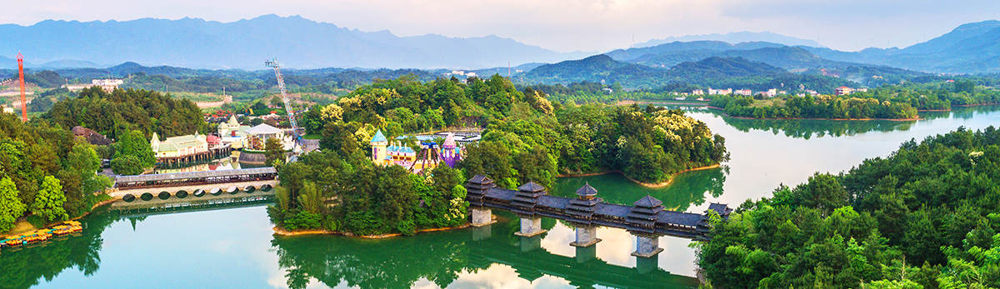
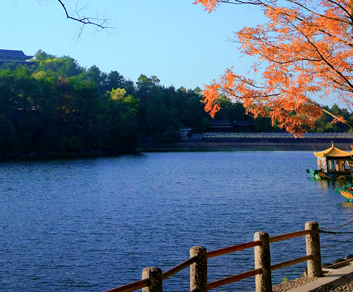
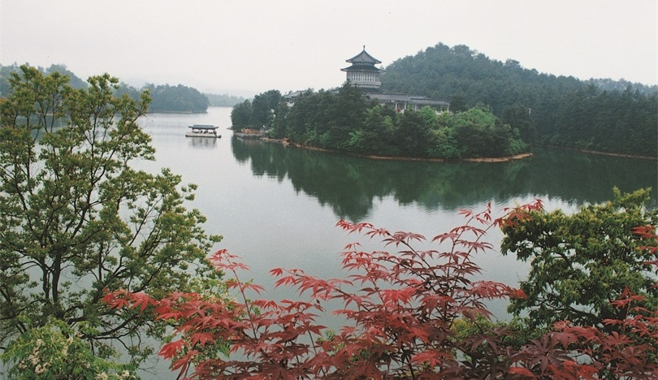
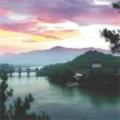
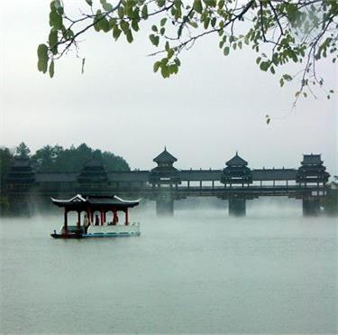

# 乐满地度假世界 ✨

## 🌅 开篇：在山水之间，建一座童话

"江作青罗带，山如碧玉簪。"

韩愈写给桂林的这两句诗，把桂林山水的清秀，写到了一千多年后的今天还没有人能超越。

但在桂林的兴安县，有一群人，做了一件很大胆的事--

他们在韩愈的诗里，塞进了一座迪士尼。

他们把桂林的山水当成背景，在灵渠边上、在丘陵起伏之间，盖起了一座占地397万平方米的"度假世界"。这里有中国西南最早的主题乐园，有桂林唯一的国际标准27洞高尔夫球场，有可以住宿的森林木屋，有可以泡温泉的度假酒店，还有一片可以发呆的灵湖。

这就是乐满地。

它的名字"Merryland"是英文"Merry-Land"的直译，意思是"欢乐之地"。

但在桂林方言里，老人们更喜欢叫它"灵湖边的乐园"--因为它的核心，是一片叫灵湖的湖泊，而灵湖的水，是从灵渠流过来的。

灵渠，是中国最古老的运河之一，比都江堰还早几十年。

所以你看，这座看起来很"洋气"的主题乐园，其实扎根在一片两千多年历史的土地上。

> ⚠️ **特别说明**：
> 乐满地曾是2007年评定的国家5A级旅游景区，2025年被取消5A资质。但其作为桂林经典度假目的地的价值仍在，本README仍按其历史地位进行介绍。

## 📜 一座乐园和一条运河

**公元前214年：灵渠诞生**

要讲乐满地的故事，必须先讲灵渠。

秦始皇统一六国后，要把岭南也拿下。但是秦军翻越南岭时遇到了大麻烦--山路崎岖，粮草运不上去。秦始皇下令：在湘江和漓江之间，挖一条运河。

这条运河就是灵渠。

灵渠全长34公里，把长江水系和珠江水系连在了一起。它是世界上第一条跨流域通航的运河，比苏伊士运河早了2000多年，比巴拿马运河早了2100多年。

有了灵渠，秦军才得以平定南越，把岭南正式纳入中国版图。

**1943年：灵湖的形成**

乐满地的核心--灵湖，其实是1943年才形成的。当时国民政府在这里修建了一座小水库，截断了灵渠的支流，形成了一个面积400亩的人工湖。湖水清澈，长年不涸，被当地人叫做"灵湖"。

**2000年：乐满地开业**

1998年，台湾剑湖山世界集团投资10亿元人民币，在灵湖周边397万平方米的土地上，开始建造一座大型度假世界。

2000年12月，乐满地度假世界正式开业。这是中国西南地区第一座大型主题乐园，也是当时全国最大的台商投资项目之一。

**2007年：晋升5A景区**

**今天**：乐满地是桂林旅游的"三驾马车"之一，与漓江、象鼻山齐名。每年接待游客超过150万人次。

## 🌟 核心景点详解

### 📍 主题乐园：西南第一座迪士尼

乐满地主题乐园占地约90万平方米，相当于125个足球场那么大。

乐园分六大主题区，每一个都有自己的故事：

**1. 欢乐中国城**
入口处就是这里。建筑风格模仿明清江南民居，红灯笼、青砖墙、雕花窗，让人一进来就有过年的感觉。这里有乐园最高的过山车--"飞天龙"，全长达700米，最快速度90公里/小时。

**2. 美国西部区**
模仿19世纪美国西部小镇。木板房、马车、酒吧、牛仔--你可以在"狂飙沙漠"过山车上体验西部狂野，也可以在"金矿小镇"里玩寻宝游戏。

**3. 梦幻世界区**
最适合带孩子的区域。这里的建筑像童话里的城堡，色彩鲜艳，造型夸张。最经典的项目是"旋转木马"和"海盗船"。

**4. 海盗村**
一座仿加勒比海盗村落的区域，到处是破船、酒桶、骷髅旗。必玩项目是"海盗船"和"鬼屋"。

**5. 南太平洋区**
热带岛屿风情，棕榈树、茅草屋、沙滩、海浪。最刺激的项目是"飞越夏威夷"--一座悬挂式过山车，脚悬空中，从30米高空俯冲下来。

**6. 欧洲区**
欧洲小镇风格，有喷泉、雕塑、花园。这里的"急流勇进"是夏天最受欢迎的项目，从18米高的地方冲下来，水花能溅起3米高。

**乐园里的"必刷"项目**：
- 飞天龙过山车（中国西部第一座木质过山车）
- 飞越夏威夷（悬挂式过山车，刺激指数5星）
- 急流勇进（夏天必玩）
- 海盗船（经典中的经典）
- 旋转木马（拍照圣地）

> 💡 **导游贴士**：
> 进园后第一时间拿一张园区地图，按照"逆时针"路线玩，可以避开大部分人流。旺季时过山车排队1小时以上，建议买"快速通道"票（80元），可以走VIP通道。雨天部分项目会暂停，但人少，可以趁雨歇去排最火的项目。

---

### 📍 灵湖：乐园心脏的那片水

如果说乐园是乐满地的"皮"，那么灵湖就是乐满地的"心"。

灵湖占地400亩，水深3-8米，水质达到国家一级标准。湖水来自灵渠支流，常年保持在18度左右--冬暖夏凉，是天然的恒温湖。

**灵湖上的玩法**：
- **画舫游湖**：坐传统的中式画舫，绕湖一周约30分钟，是欣赏湖光山色的最佳方式
- **脚踏船**：2-4人一船，自己蹬，慢悠悠地玩
- **水上步行球**：钻进一个透明的塑料球里，在水面上跑、滚、爬，特别受小朋友欢迎
- **垂钓**：灵湖里有草鱼、鲤鱼、鲢鱼，可以办临时的钓鱼证

**灵湖的小秘密**：
湖中央有一个小岛，叫"灵岛"。岛上有一棵大榕树，已经200多岁了。当地渔民说，这棵榕树是灵湖的"守护神"，树在湖在。

> 💡 **拍照贴士**：
> 灵湖最美的时刻是清晨和傍晚。清晨雾气弥漫，湖面如镜；傍晚夕阳西下，整个湖面被染成金色。最佳机位在湖东岸的木栈道上，可以拍到湖、岛、山、树的全景。

---

### 📍 高尔夫球场：山水之间的27洞

乐满地的国际标准27洞高尔夫球场，是桂林唯一的山水高尔夫。

球场由美国著名高尔夫球场设计师Bob Moore设计，27洞分为A、B、C三组各9洞，可以组合出18洞或27洞的不同玩法。

**球场特色**：
- 18洞沿灵湖而建，5个洞临湖，2个洞跨湖
- 球道总长7100码，标准杆72杆
- 球场内保留了原有的丘陵地形，起伏大，挑战性强
- 后9洞穿越原始松林，是中国少有的"森林高尔夫"

**一个有趣的小故事**：
球场开业时，老板邀请了一众名人来开球。一位日本高尔夫大师打完18洞后说："在桂林打高尔夫，最大的问题是容易分心--你挥杆的时候，眼睛会忍不住去看山。"后来这句话被刻在了球场会所的墙上。

> 💡 **打球贴士**：
> 球场对会员和住店客人开放。果岭费平日约800元，节假日1200元。需要提前预约。装备可以租赁。新手建议请球童指导。

---

### 📍 度假酒店：在森林里睡觉

乐满地度假酒店是一座森林主题的五星级酒店。

**酒店特色**：
- 350间客房，每一间都面朝灵湖或松林
- 大堂是无柱设计，全木质结构，模仿广西壮族传统民居
- 酒店后面有一片300亩的原始松林，是天然的"氧吧"
- 酒店后面有一个温泉区，水温38-42度，含硫磺和矿物质

**酒店的"明星房"**：
- **总统套房**：350平方米，含独立泳池、桑拿房、私人管家，住过的名人有成龙、张艺谋等
- **湖景房**：推开窗就是灵湖，早上能听到鸟叫
- **森林木屋**：独栋小木屋，建在松林里，特别适合情侣和家庭

**酒店里的"灵湖鱼宴"**：
酒店餐厅的招牌是灵湖鱼宴--用灵湖里的鲜鱼做一桌8道菜。最经典的是"灵湖鱼头汤"，奶白色的汤底，鲜到舌头发麻。

> 💡 **住宿贴士**：
> 住店客人可以免费进入主题乐园一次，并享受高尔夫球场折扣。节假日酒店价格会翻倍，建议提前1个月预订。

---

### 📍 森林公园：被松树包围的安静

很多游客不知道，乐满地有一片300亩的原始松林。

这片松林有60多年历史，是1958年种植的。松树高20-30米，树径40-60厘米，是桂林地区最大的人工松林之一。

**森林公园的玩法**：
- **森林浴**：在松林里散步，呼吸负氧离子。这里的负氧离子含量是市区的100倍
- **森林瑜伽**：清晨在松林里练瑜伽，是酒店免费提供的活动
- **骑行**：松林里有5公里长的自行车道，可以租车骑行
- **观鸟**：松林里有30多种鸟类，包括啄木鸟、喜鹊、画眉

> 💡 **导游贴士**：
> 如果你厌倦了乐园的喧闹，来这里躲一躲。松林里有一座小木亭，叫"听松亭"。坐在亭子里，闭上眼睛，听风穿过松针的声音--那是一种独特的"白噪音"，能让人在5分钟内平静下来。

---

### 📍 灵渠探秘：从乐园走到两千年前的运河

很多人来乐满地，玩完乐园就走了。其实，距离乐园不到3公里，就是著名的灵渠。

灵渠是中国古代三大水利工程之一（另两个是都江堰和京杭大运河），1988年被列为全国重点文物保护单位，2018年列入世界灌溉工程遗产名录。

**灵渠必看**：
- **铧嘴**：灵渠的分水坝，形状像铧犁的嘴，把湘江一分为二，三分入漓，七分入湘
- **大小天平**：用巨石砌成的溢洪坝，已经使用了2000多年
- **秦堤**：秦代修建的堤坝，至今还在使用
- **四贤祠**：纪念对灵渠有贡献的四位古人，包括史禄、马援、李渤、鱼孟威

> 💡 **导游贴士**：
> 从乐满地打车到灵渠约10分钟，门票80元。建议安排2小时游览。看完灵渠，你才会理解乐满地这片土地有多厚重--两千多年前，秦人就在这里改变了中国的版图。

## 🎯 游览实用指南

### 🚗 交通指南

**飞机**：先飞到桂林两江国际机场，再坐车1小时到兴安县城（约80公里）。

**高铁**：坐到兴安北站，再打车20分钟到乐满地（约15公里）。

**自驾**：从桂林市区出发，走G72泉南高速，兴安出口下，约1小时。

**直通车**：桂林市区每天都有发往乐满地的旅游专线车，早上8:00-9:00从桂林火车站发车，往返约80元。

### 🎫 门票信息（2025年参考）
- **主题乐园**：成人260元（旺季），180元（淡季）
- **儿童/老人票**：130元（1.1-1.4米儿童、65岁以上老人）
- **高尔夫**：果岭费平日800元，节假日1200元，含球车、球童
- **酒店住宿**：800-3000元/晚，总统套房1万+
- **套票**：乐园+酒店2天1晚，约1200-2000元
- **学生票**：凭学生证8折
- **免票**：1.1米以下儿童免票

### ⏰ 最佳游览时间

- **3月-5月**：桂林最美的季节，山花烂漫，温度适宜
- **9月-11月**：秋高气爽，是高尔夫的最佳季节
- **6月-8月**：暑假旺季，乐园人多，但水上项目最爽
- **12月-2月**：淡季，价格便宜，但乐园部分项目维护
- **建议游览时长**：2天1夜最舒服，1天太赶

### 🗺️ 推荐路线

**两天一夜亲子游（最推荐）**：
- **第一天**：中午到达 -> 酒店入住 -> 下午主题乐园（玩到闭园）-> 晚上酒店温泉
- **第二天**：早上灵湖游船 -> 灵渠半日游 -> 中午灵湖鱼宴 -> 下午返程

**三天两夜深度游**：
- **第一天**：主题乐园玩一天
- **第二天**：上午高尔夫或森林公园 -> 下午灵渠 -> 晚上温泉
- **第三天**：上午画舫游湖 -> 中午退房返程

> 💡 **最重要的建议**：
> 一定要住一晚！住一晚！住一晚！
> 不住一晚，你只能玩乐园，看不到灵湖的清晨，泡不到温泉，也吃不到灵湖鱼宴。
> 乐满地的精髓在于"度假"，不是"赶景点"。

### 🍜 桂林美食

- **桂林米粉**：必吃！干捞米粉加卤水，是桂林人的早餐灵魂
- **灵湖鱼头汤**：奶白色，鲜到舌头发麻
- **啤酒鱼**：用桂林啤酒炖的漓江鱼，阳朔名菜
- **荔浦芋扣肉**：荔浦芋头和五花肉层层叠叠，蒸出来的广西名菜
- **桂林腐乳**：可以买回去做伴手礼
- **桂花糕**：桂林的桂花很有名，桂花糕香甜软糯

### ⚠️ 注意事项

1. **乐园不要穿拖鞋**：很多过山车项目不允许穿拖鞋
2. **带泳衣**：温泉和水上项目需要
3. **防蚊**：灵湖边蚊子多，傍晚尤其厉害
4. **防晒**：桂林紫外线强，夏天乐园里没什么遮挡
5. **孩子身高注意**：很多刺激项目要求1.4米以上
6. **高尔夫需要预约**：旺季不一定有空，提前1周打电话
7. **雨季注意**：4-7月是雨季，乐园部分项目雨天不开

## 💫 结语：在山水之间，找回快乐的能力

乐满地是一个有点矛盾的地方。

它在桂林--中国最诗意的山水之间。
它却是个迪士尼--最现代、最热闹、最不诗意的乐园。

有人觉得这是对山水的亵渎。
有人觉得这是山水的新生。

我倒觉得，乐满地是在提醒我们一件事--

快乐，是可以和山水共存的。

我们中国人太习惯于把"山水"和"严肃"绑在一起了。我们要在山水中悟道，在山水中怀古，在山水中思考人生。我们对着一片湖，要写诗；对着一座山，要感慨；对着一条河，要流泪。

但山水真的只属于沉重吗？

乐满地说，不一定。

山水也可以属于过山车的尖叫，属于旋转木马的笑声，属于孩子在沙滩上奔跑的脚印，属于情侣在湖边牵手散步的剪影。

山水可以承载严肃，也可以承载快乐。

灵渠的水，两千年前在运送秦军的粮草；
灵渠的水，今天在运送游客的画舫。

水还是那道水，山还是那座山。
只是路过的人，换了一种心情。

希望你来乐满地的时候，也能换一种心情。
不要急着拍照打卡，不要急着刷完所有项目。
找一棵松树底下坐一坐，听一听风；
找一片湖水旁边站一站，看一看云。

让山水告诉你，快乐其实很简单。
就坐在那里，什么都不用做。

> 📌 **旅行感悟**：
> 在乐满地，你可以坐过山车尖叫，
> 也可以在灵湖边发呆。
> 你可以打18洞高尔夫，
> 也可以在松林里散步。
> 重要的不是你做了什么，
> 重要的是--
> 你来了，你放松了，你快乐了。
> 这就够了。

---

*本页内容基于实景图片分析与桂林兴安文化历史研究整理，由AI导游系统2025年7月生成*
