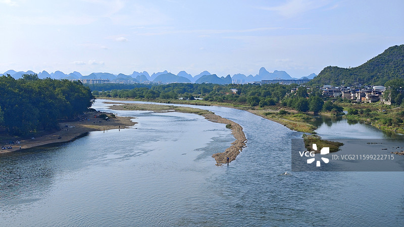
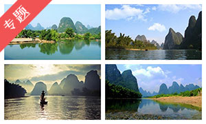

# 漓江景区 🛶

## 🌿 开篇：百里漓江，百里画廊

"桂林山水甲天下，阳朔堪称甲桂林。群峰倒影山浮水，无水无山不入神。"

当你乘坐竹筏，漂流在漓江上的时候，你就会明白这首诗写得一点都不夸张。漓江，这条发源于猫儿山的河流，从桂林到阳朔的83公里水路，是中国最美的山水画廊。没有之一。

漓江的美，是那种刻在中国人骨子里的审美。一座座喀斯特山峰拔地而起，圆润秀美，像玉笋，像翠屏，像美人；一江碧水蜿蜒流淌，清澈见底，倒映着两岸的山峰。晴天，蓝天白云映在水里，像一幅色彩明快的油画；雨天，云雾缭绕在山间，像一幅淡雅的水墨画。

漓江不是那种让你尖叫的震撼之美，它是那种让你安静下来的美。坐在竹筏上，没有噪音，没有喧嚣，只有竹筏划水的声音，只有风吹过竹林的声音，只有偶尔传来的渔歌声。你会觉得时间变慢了，心变静了，所有的烦恼都被这一江碧水洗掉了。

这就是漓江。它是中国山水的代表，是中国人审美的终极范本。

## 📜 历史与文化：千年漓江，千年诗

**南朝 颜延之的赞叹**
最早写下桂林山水之美的，是南朝著名诗人颜延之。他被贬到桂林当太守，写下了"未若独秀者，峨峨郛邑间"的诗句。这是已知最早赞美桂林山水的文字。从此，漓江就与中国诗歌结下了不解之缘。

**唐代 韩愈的名句**
"江作青罗带，山如碧玉簪。"唐代大诗人韩愈的这两句诗，写尽了漓江的美。一千多年过去了，还没有谁能把漓江写得比这更好。青罗带一样的江水，碧玉簪一样的山峰——这个比喻，成为了漓江永恒的标签。

**宋代 王正功的题壁**
"桂林山水甲天下，玉碧罗青意可参。"南宋嘉泰元年（1201年），王正功在桂林府学的一次宴会上写下了这句诗。从此，"桂林山水甲天下"成为了流传最广的广告语，也成为了中国人对桂林山水的共同记忆。

**近现代 徐悲鸿的画**
抗日战争时期，很多文化名人来到桂林避难。画家徐悲鸿在这里画了很多漓江山水，他说："阳朔山水在世界上可谓第一，看到了阳朔山水，就看到了中国最美的风景。"除了徐悲鸿，还有齐白石、黄宾虹、李可染……几乎所有的中国山水画大师都画过漓江。

**1960年 陈毅的题词**
"愿做桂林人，不愿做神仙。"陈毅元帅游览漓江后写下的这句话，说出了很多人的心声。能住在这么美的地方，神仙也不羡慕。

**1999年 第五套人民币**
第五套人民币20元纸币的背面图案，选用了漓江兴坪段的风景。从此，漓江山水走进了每一个中国人的钱包，成为了最广为人知的中国风景。

## 🌟 核心景点详解

### 📍 兴坪佳境：人民币上的风景

这就是第五套人民币20元纸币的背面图案——兴坪佳境。照片中这几座标志性的山峰，每天都出现在数以亿计的人民币上。可以说，这是中国知名度最高的风景。

**风景细节**：
- **元宝山**：正面那座圆圆的山峰，像一个元宝，这是20元人民币最标志性的元素
- **黄布倒影**：江底有一块黄色的岩石，像一块黄布铺在水底，故名"黄布滩"
- **七仙女**：元宝山旁边有七座小山峰，传说它们是七仙女的化身
- **渔船**：江面上常有渔翁划着竹筏，带着鸬鹚捕鱼，这是漓江上最经典的画面

**最佳拍照时间**：
- **清晨**：江面平静如镜，倒影最清晰，是拍照的黄金时间
- **傍晚**：夕阳西下，金色的阳光洒在山峰上，非常美
- **雨天**：云雾缭绕，像一幅水墨画，别有韵味

**你不知道的冷知识**：
很多人拿着20元人民币来这里拍照，却发现对不上。那是因为20元人民币的图案是在船上画的，而现在最佳的拍摄点在岸上。你需要走到江边，找一个稍微低一点的角度，才能对上。

> 💡 **拍照贴士**：
> 一定要带一张崭新的20元人民币！拍照的时候，半举着人民币，让画面和实景重合。这个动作几乎是每个游客都会做的。另外，清晨7点之前到，人最少，水面最平静，倒影最清晰。

---

### 📍 九马画山：数山峰的乐趣

这是漓江上最著名的山峰——九马画山。照片中这座巨大的石壁，黑白相间，像一幅天然的壁画，传说上面有九匹马，能看出来的人会有好运。

**九马画山的传说**：
相传天宫的九匹神马偷偷下凡，来到漓江游玩，被这里的风景迷住了，不想回去。玉帝派雷公电母来抓它们，它们就躲进了这座山峰的石壁里，变成了九匹马的形状。所以，能看出几匹马，就代表你有多聪明。

**顺口溜**：
"看马郎，看马郎，问你神马有几双？看出七匹中榜眼，看出九匹状元郎。"

**周恩来的故事**：
据说周恩来总理当年游漓江的时候，一眼就看出了九匹马。陈毅元帅看了半天，只看出了七匹。周总理笑着说："因为我是总理嘛，眼光比你远一点。"

**最佳观赏角度**：
九马画山要在漓江上远观，离近了反而看不出来。坐竹筏的时候，船工会提醒你，还会告诉你每匹马在哪里。

> 💡 **导游贴士**：
> 不要太纠结自己能看出几匹马！很多人一匹都看不出来，这不代表你笨，只是想象力不够而已。其实，九马画山的乐趣不在于看出多少匹马，而在于那种寻找和发现的过程。重要的是享受这个过程，而不是结果。

---

### 📍 杨堤风光：漓江精华的起点

这是杨堤到兴坪段的漓江风光，也是整个漓江最精华的部分。照片中这种"舟行碧波上，人在画中游"的感觉，只有在漓江上才能体会到。

**杨堤-兴坪段的特点**：
- **距离**：18公里水路，是漓江风景最集中的一段
- **山峰**：两岸山峰密集，造型各异，每一个转弯都是一幅新的画
- **水面**：这段江面比较宽阔，水流平缓，非常适合漂流
- **人烟稀少**：两岸没有什么村庄和建筑，保持了比较原始的风貌

**漂流的三种方式**：
- **竹筏**：最推荐，4人一筏，速度慢，可以随时停下来拍照
- **大船**：从桂林到阳朔的大游船，3个小时，比较舒适，但是人多
- **徒步**：有一条漓江徒步路线，从杨堤走到兴坪，大约需要5-6小时

**最佳季节**：
春天和秋天是漓江最美的季节。春天油菜花开，两岸一片金黄；秋天秋高气爽，能见度最好。夏天是雨季，江水比较浑浊，但是雨水过后的云雾非常美。冬天是枯水期，有些地方可能会搁浅。

> 💡 **漂流建议**：
> 一定要选竹筏！不要选那种马达声音很大的竹筏，选人工划的。虽然贵一点，但是那种安静的感觉是多少钱都买不来的。另外，给船工一点小费，他会划得慢一点，还会给你讲解沿途的风景，告诉你哪个地方拍照最好。

---

### 📍 漓江渔火：最经典的画面

这是漓江上最经典的画面——渔翁、竹筏、鸬鹚、渔火。这个传承了上千年的捕鱼方式，现在已经成为了漓江的标志性景观。

**鸬鹚捕鱼的原理**：
鸬鹚是一种水鸟，善于捕鱼。渔民在它们的脖子上套一个绳圈，让它们不能把大鱼吞下去，只能吞小鱼。鸬鹚捕到大鱼后，就会回到竹筏上，渔民把鱼从它的嘴里挤出来，然后再把它放进水里继续捕鱼。

**渔火的由来**：
以前渔民都是晚上捕鱼，在竹筏上点一盏马灯，利用鱼的趋光性吸引鱼过来。现在，虽然晚上捕鱼的越来越少了，但是渔火作为一个景观被保留了下来。

**摆拍的渔翁**：
现在漓江上的渔翁很多都是职业模特。你给他20块钱，他会划着竹筏，带着鸬鹚，在江面上给你摆各种姿势让你拍照。日出日落的时候，很多摄影爱好者都会来这里拍渔火。

**你不知道的争议**：
有人说现在的渔翁都是摆拍的，不真实。但是反过来想，如果没有这些摆拍的渔翁，这个传承了上千年的捕鱼方式可能就彻底消失了。用这种方式让它保留下来，何尝不是一件好事呢？

> 💡 **摄影贴士**：
> 拍渔火最好的时间是日落前半小时到日落后半小时。也就是所谓的"蓝调时刻"。天空是深蓝色的，渔火是暖黄色的，冷暖对比非常强烈。一定要带三脚架，因为光线很暗，需要长曝光。

---

## 🎯 游览实用指南

### 🚗 交通指南
- **桂林出发**：桂林汽车站有直达杨堤和兴坪的大巴，车程约1.5小时
- **阳朔出发**：阳朔汽车站有到兴坪的班车，车程约40分钟
- **高铁**：贵广高铁有阳朔站，出站后打车到兴坪约20分钟

### 🎫 门票信息（2025年参考）
- **漓江大游船（桂林-阳朔）**：215元起，不同舱位价格不同
- **竹筏漂流（杨堤-兴坪）**：180元/人，一筏4人
- **竹筏漂流（兴坪-九马画山往返）**：95元/人
- **兴坪古镇**：免费

### ⏰ 最佳旅游时间
- **3-5月**：春天，油菜花开，雨水少，江水清
- **9-11月**：秋天，秋高气爽，能见度最高
- **避开**：五一、十一黄金周，人非常多，体验很差

### 🗺️ 经典游览路线

**一日精华游（最推荐）**：
早上桂林出发 → 杨堤竹筏漂流 → 九马画山 → 兴坪古镇 → 20元人民币背景 → 傍晚到阳朔西街

**两日深度游**：
Day1：桂林 → 漓江大游船到阳朔 → 逛西街 → 住阳朔
Day2：阳朔 → 兴坪竹筏 → 老寨山看日落 → 返程

**摄影发烧友路线**：
Day1：下午到兴坪 → 漓江渔火拍日落
Day2：早起相公山看日出 → 九马画山 → 返程

### 🍜 美食推荐
- **漓江啤酒鱼**：阳朔招牌菜，用漓江里的活鱼，加上啤酒和西红柿炖的，非常好吃
- **田螺酿**：阳朔特色，把肉馅塞到田螺里，味道鲜美
- **桂林米粉**：这个不用说了，来桂林一定要吃
- **荔浦芋扣肉**：广西特色，荔浦芋头和五花肉一起蒸的，香而不腻

## 💫 结语：中国山水画的活范本

漓江的美，是中国人最熟悉的美。

每一个中国人，不管有没有来过漓江，在看到漓江山水的那一刻，都会有一种似曾相识的感觉。因为这种美，我们在山水画里见过，在古诗词里读过，在人民币上看过。它已经融入了我们的文化基因，成为了我们审美的一部分。

漓江不是那种让你觉得"哇"的美。它是那种让你觉得"对，就是这个感觉"的美。它安静、温和、不张扬，但是越看越有味道，越看越离不开。

很多人来过漓江之后说，漓江没有想象中那么震撼。但是离开之后，他们又会常常想起漓江的美。想起那些山，那些水，那种安静，那种缓慢。

这就是漓江的魔力。它不会在一瞬间抓住你，但是它会在你心里慢慢扎根，让你在离开之后，还会不断地想起它。

"愿做桂林人，不愿做神仙。"

> 📌 **旅行感悟**：
> 人生就像漓江漂流。你不知道下一个转弯会看到什么风景，但是你知道，不管看到什么，都是美的。重要的不是终点，而是沿途的风景，以及陪你看风景的人。

---

*本页内容基于实景图片分析与历史资料整理，由AI导游系统2025年7月生成*
