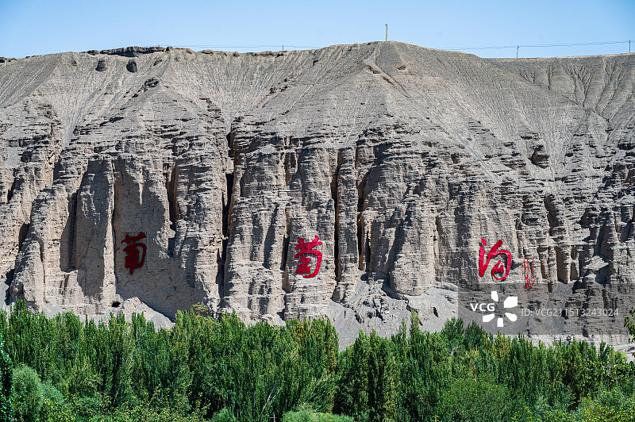
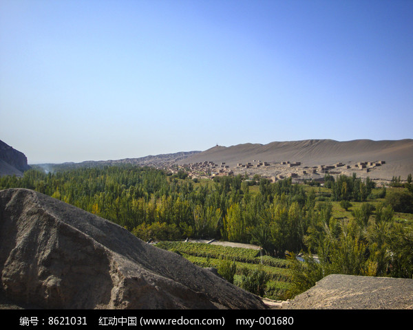
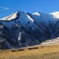
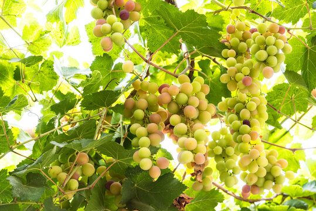

# 葡萄沟风景区 🍇

## 🌿 开篇：火洲中的绿色天堂

"吐鲁番的葡萄熟了，阿娜尔罕的心儿醉了。"

这首脍炙人口的歌，唱的就是葡萄沟。在火焰山那片寸草不生的红色戈壁中间，竟然藏着这样一条绿色的峡谷——布依鲁克河从中间流过，两岸是连绵不绝的葡萄园，几公里长的葡萄长廊，遮天蔽日，空气中都弥漫着葡萄的甜香。

葡萄沟不是那种壮观的风景，它的美是生活化的，是亲切的。走在葡萄架下，伸手就能摸到一串串挂在藤上的葡萄，旁边是维吾尔族人家的院子，孩子们在门口玩耍，老人坐在凉棚下喝茶，姑娘们穿着鲜艳的裙子在摘葡萄。那种感觉，就像走进了一个童话世界。

更重要的是，这里的人特别热情。随便走进一户人家，主人都会拿出最好的葡萄、西瓜、哈密瓜来招待你，不要钱，就是单纯的好客。你可以坐在他家的凉棚下，吃着葡萄，听着维吾尔族的音乐，看着远处的火焰山，那种感觉，你在别的地方是找不到的。

来葡萄沟吧。不为别的，就为了那一口最甜的葡萄，为了那种最纯粹的民族风情，为了那种在40度的高温下，坐在葡萄架下喝着冰水的惬意。

## 📜 历史与文化：两千年的葡萄绿洲

**两千多年前 张骞带来的种子**
葡萄最早是西域的产物，不是中原的。汉武帝时期，张骞出使西域，从大宛（也就是今天的乌兹别克斯坦）带回了葡萄的种子，还有苜蓿、石榴、核桃这些作物。从那以后，葡萄就在吐鲁番这片土地上扎下了根，一长就是两千多年。

**唐代 西州葡萄名扬天下**
唐代的时候，吐鲁番叫西州，是丝绸之路上最重要的驿站之一。那时候，西州的葡萄就已经名扬天下了，尤其是葡萄干，是进贡给皇宫的贡品。王翰的《凉州词》里写"葡萄美酒夜光杯，欲饮琵琶马上催"，那个葡萄美酒，就是用吐鲁番的葡萄酿的。

**清代 伊犁将军的葡萄园**
清代的时候，葡萄沟就是新疆有名的葡萄产地。伊犁将军专门在这里开辟了葡萄园，每年把最好的葡萄送到北京，给皇帝和王公大臣们品尝。那时候，能吃到吐鲁番的葡萄，是身份的象征。

**1980年代 对外开放**
改革开放以后，葡萄沟慢慢成了旅游景点。1981年，吐鲁番的葡萄开始大规模出口到内地和国外。很多人都是因为知道了吐鲁番的葡萄，才知道新疆这个地方的。

**现在的葡萄沟**
现在的葡萄沟，不只是一个葡萄产地，更是新疆民族风情的代表。每年有几百万游客来到这里，品尝葡萄，体验维吾尔族的生活。2007年，葡萄沟被评为国家5A级旅游景区，成了新疆旅游的一张名片。

## 🌟 核心景点详解

### 📍 千米葡萄长廊：葡萄架下的甜蜜

这是葡萄沟最经典的景观——千米葡萄长廊。照片中这条几公里长的葡萄架路，是整个葡萄沟的精华。头顶上是密密麻麻的葡萄藤和葡萄，阳光透过树叶洒下来，在地上形成斑驳的光影，特别美。

**走在葡萄长廊下的感觉**：
夏天的时候，外面是40多度的高温，但是一走进步行街，立刻就凉快了，温度至少低5度。葡萄藤像一个天然的大空调，把所有的热气都挡在了外面。空气里都是葡萄的甜香味，深呼吸一口，整个人都觉得甜丝丝的。

**你可以随时摘葡萄吃吗？**
很多人都问这个问题。答案是：可以，但是要经过主人的同意。葡萄架旁边的葡萄，都是当地村民家的。只要你跟他们说一声，他们都会很热情地让你摘，还会给你挑最甜的。如果你不好意思，也可以在路边的小摊上买，5块钱一公斤，特别便宜，而且特别甜。

**最适合拍照的地方**：
葡萄长廊的中间段，有一个地方的葡萄架特别高，特别密，阳光透下来的光影特别好看。很多人都在这里拍人像，拍出来的照片特别有感觉。还有一个地方有葡萄做的拱门，是网红打卡点。

> 💡 **游览贴士**：
> 最好傍晚的时候去逛葡萄长廊，那时候温度降下来了，不热，而且夕阳的光线照在葡萄上，颜色特别好看。另外，一定要穿浅色的衣服，拍出来的照片会特别清新。

---

### 📍 维吾尔族民俗村：走进当地人的生活

这是葡萄沟里的维吾尔族民俗村，照片中这些有着彩色门窗和葡萄架的院子，就是当地维吾尔族人的家。在这里，你可以真正走进维吾尔族人的生活，体验他们的日常。

**你可以体验的事情**：
- **吃农家饭**：在村民家里吃一顿正宗的维吾尔族饭菜，手抓饭、大盘鸡、烤包子、拉条子，都是女主人亲手做的，特别好吃
- **学跳麦西来甫**：维吾尔族是一个能歌善舞的民族，饭后，他们会邀请你一起跳麦西来甫，不管你跳得好不好，开心最重要
- **看如何做葡萄干**：村民会带你去看他们的晾房，告诉你葡萄干是怎么晾出来的
- **买最正宗的葡萄干**：直接从村民家里买葡萄干，比外面便宜，而且质量更好

**最让人感动的是那份淳朴**：
这里的村民真的特别热情。你走进他们家，不管你买不买东西，他们都会先给你端上一盘葡萄、一盘西瓜、一壶茶，让你先坐下来吃。那种热情，不是为了赚钱的那种商业化的热情，是发自内心的，是新疆人特有的淳朴和善良。

**你不知道的冷知识**：
很多人以为葡萄干是晒出来的，其实不是。吐鲁番的葡萄干，是在晾房里阴干的。晾房都是用土坯砌的，四面都是通风的孔，葡萄挂在里面，靠干热的风吹干，这样晾出来的葡萄干，颜色是绿的，而且营养不会流失。如果是太阳晒的，就会变成黑色，口感也不好。

> 💡 **体验建议**：
> 不要只在路边的小摊买东西，一定要往村子里面走，找一个看起来朴实的人家，进去坐一坐。跟他们聊聊天，喝喝茶，你会有完全不一样的体验。很多游客来葡萄沟，只在大门口逛了逛就走了，错过了最精华的部分，特别可惜。

---

### 📍 王洛宾音乐艺术馆：西部歌王的故事

在葡萄沟的尽头，有一座王洛宾音乐艺术馆。很多人不知道，王洛宾和吐鲁番有着很深的渊源。他最有名的那首《在那遥远的地方》，还有《达坂城的姑娘》、《半个月亮爬上来》，都是在新疆写的。

**王洛宾和吐鲁番的故事**：
1938年，25岁的王洛宾跟随抗日宣传队来到新疆。在吐鲁番，他被这里的音乐和姑娘迷住了。他收集了大量的维吾尔族民歌，整理改编，然后传播到了全国。可以说，没有王洛宾，就没有那些我们耳熟能详的西部民歌。

**展馆里最值得看的**：
- **王洛宾的手稿**：他当年收集和整理民歌的手稿，很多都是用铅笔写的，改了又改
- **老照片**：他当年在新疆拍的照片，还有和当地维吾尔族艺人的合影
- **音乐欣赏**：你可以坐在那里，静静地听王洛宾的歌，看着窗外的葡萄架，特别有感觉
- **达坂城的姑娘雕塑**：展馆门口有一个雕塑，就是达坂城的姑娘，长长的辫子，特别美

**最让人唏嘘的故事**：
王洛宾的一生，特别坎坷。他曾经在新疆的监狱里坐了十几年牢，但是即使在监狱里，他也没有停止写歌。他说："即使我坐在监狱里，我也能听到外面的歌声。"现在，王洛宾已经不在了，但是他的歌，还在这片土地上流传，还在被千千万万的人传唱。

> 💡 **游览贴士**：
> 这个展馆不大，但是非常值得一看，尤其是如果你喜欢王洛宾的歌的话。门票也不贵，30块钱。建议留一个小时，慢慢看，慢慢听。看完之后，你再听《在那遥远的地方》，会有完全不一样的感受。

---

### 📍 火焰山：火洲的温度

从葡萄沟的任何一个地方，抬头就能看到远处的火焰山。照片中这座红色的山，就是《西游记》里的火焰山，整个山体都是红色的，在太阳的照射下，像一团燃烧的火焰。

**火焰山到底有多热？**
夏天的时候，火焰山的地表温度能达到80度以上，把鸡蛋埋在沙子里，半个小时就能熟。山顶上有一个巨大的温度计，实时显示着当时的温度，最高的时候能到89度。所以，很多人来火焰山，就是为了体验一下什么叫"热"。

**为什么叫火焰山？**
因为这座山的山体是红色的砂岩，而且山上寸草不生，夏天的时候，太阳一照，整个山都在发烫，空气中都能看到热浪在翻滚，就像着火了一样。所以叫火焰山。

**《西游记》的故事**：
孙悟空大闹天宫，打翻了太上老君的炼丹炉，几块火砖掉在了人间，就变成了火焰山。后来唐僧师徒西天取经，路过这里，被大火挡住了去路，孙悟空三借芭蕉扇，才扇灭了大火，通过了这里。虽然这只是一个传说，但是当你站在火焰山脚下，看着那座红色的山，你会觉得这个传说特别真实。

> 💡 **拍照建议**：
> 拍火焰山最好的时间是傍晚，夕阳把整个山都染成了红色，特别壮观。可以站在葡萄沟的高处，以葡萄架为前景，以火焰山为背景拍一张照片，特别有感觉。另外，不要真的去爬火焰山，太热了，容易中暑。

---

## 🎯 游览实用指南

### 🚗 交通指南
- **从吐鲁番市区出发**：可以坐旅游专线大巴，车程约20分钟，车票5元
- **打车**：从市区打车到葡萄沟，大约30元
- **自驾**：从乌鲁木齐出发，走京新高速转吐和高速，全程约180公里，2小时就能到

### 🎫 门票信息（2025年参考）
- **门票**：75元/人，包含观光车
- **区间车**：25元/人，景区内通用，每个景点都可以上下
- **民俗村体验**：一般30-50元/人，可以吃葡萄、西瓜，看表演
- **王洛宾艺术馆**：30元/人

### ⏰ 最佳旅游时间
- **7-9月**：葡萄成熟的季节，这个时候来最好，葡萄最多最甜
- **6月和10月**：温度相对低一点，没有那么热，也有葡萄
- **避开**：5月之前和10月之后，葡萄还没熟或者已经下市了，体验会差很多

### 🗺️ 经典游览路线

**半日精华游**：
景区入口 → 坐区间车到葡萄长廊 → 逛民俗村 → 王洛宾艺术馆 → 返程

**一日深度游**：
上午：葡萄沟景区（3小时） → 中午在村民家吃饭
下午：火焰山（1小时） → 坎儿井民俗园（1.5小时） → 返程

**吐鲁番两日游**：
Day1：交河故城 → 火焰山 → 葡萄沟 → 住吐鲁番
Day2：坎儿井 → 苏公塔 → 柏孜克里克千佛洞 → 返程

### 🍜 美食推荐
- **手抓饭**：维吾尔族特色，用羊肉、胡萝卜、洋葱做的，特别香
- **大盘鸡**：新疆招牌，鸡肉配土豆和宽粉，分量大，味道好
- **烤包子**：羊肉洋葱馅的，刚烤出来的，外酥里嫩，非常好吃
- **拌面**：拉条子，配上各种炒菜，新疆人的日常主食
- **各种水果**：葡萄、西瓜、哈密瓜、蟠桃，都特别甜，而且便宜

## 💫 结语：最甜的葡萄，最可爱的人

我一直觉得，葡萄沟最珍贵的不是葡萄，而是这里的人。

他们没有多少钱，也没有多么好的物质条件，但是他们特别快乐，特别满足，特别热情。他们会把最好的东西拿出来招待你，不管你是谁，不管你买不买东西。他们会笑着跟你打招呼，会邀请你到家里做客，会给你摘最甜的葡萄。那种快乐，是发自内心的，是装不出来的。

我们生活在一个快节奏的时代，每个人都在赶路，每个人都在焦虑，每个人都在想着怎么赚更多的钱，怎么获得更大的成功。但是在葡萄沟，你会发现，原来快乐可以这么简单——一架子葡萄，一杯热茶，一家人在一起，唱唱歌，跳跳舞，就够了。

原来，幸福不是你拥有多少东西，而是你的心有没有感受到幸福。原来，最珍贵的不是那些昂贵的奢侈品，而是人与人之间那种最朴素、最真诚的善意。

所以，来葡萄沟吧。不只是为了吃最甜的葡萄，更是为了见见那些最可爱的人，感受一下那种最朴素的快乐。

相信我，你会爱上这里的。

> 📌 **旅行感悟**：
> 旅行最美的风景，永远不是你看到的那些山水，而是你遇到的那些人，那些温暖的瞬间，那些发自内心的微笑。很多年之后，你可能会忘记葡萄沟的葡萄是什么味道，但是你永远会记得，那个下午，在葡萄架下，那个维吾尔族大娘塞给你一串葡萄时，脸上那个灿烂的笑容。

---

*本页内容基于实景图片分析与历史资料整理，由AI导游系统2025年7月生成*
