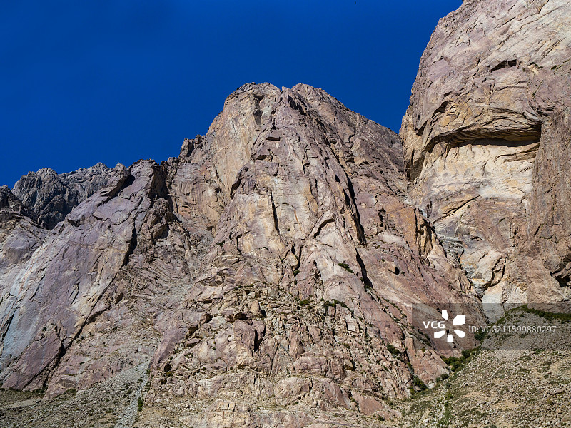

# 帕米尔旅游区

## 🎤 AI导游带你游

### 【开场白】
各位朋友，大家好！欢迎来到新疆维吾尔自治区喀什地区，欢迎来到帕米尔旅游区。我是你们今天的导游小艾。

站在这片土地上，你们可能想象不到，千百年前，这里曾是怎样一番景象。历史的年轮在这里留下了深深的印记，每一寸土地都在诉说着古老的故事。

帕米尔高原 4.8 分 公园   新疆维吾尔自治区喀什地区塔什库尔干塔吉克自治县提孜那甫乡  开放时间 交通指南 小贴士  开放时间： 全年 全天开放 交通指南： 喀什－塔县有长途班车（48.5元/人），每天一班，早上9点半发车，需5－6小时。 帕米尔高原上交通不便，建议包车游玩，风景很美，...

今天，就让我们一起走进这片神奇的土地，感受它独有的魅力。建议游览时间：半天到一天。拍照最佳时间是清晨或傍晚，光线柔和时最美。

---

## 🗺️ 景区全景导览
帕米尔旅游区位于新疆维吾尔自治区喀什地区塔什库尔干塔吉克自治县境内，是国家AAAAA级旅游景区。

帕米尔高原 4.8 分 公园   新疆维吾尔自治区喀什地区塔什库尔干塔吉克自治县提孜那甫乡  开放时间 交通指南 小贴士  开放时间： 全年 全天开放 交通指南： 喀什－塔县有长途班车（48.5元/人），每天一班，早上9点半发车，需5－6小时。 帕米尔高原上交通不便，建议包车游玩，风景很美，方便随时停车拍照。如果要进慕士塔格峰，还是要开越野车，一般的小轿车进不去。 小贴士： 1. 上帕米尔高原必须在喀什边防支队办理好边境通行证，抵达塔什库尔干塔吉克县之后，再前往当地的边防处办理特殊通行证。 2. 喀什到塔县路况较差，建议自驾前检查好车况，并带好补给（路上常见加油站拒给加油，出发前最好加

**游览路线推荐**：景区入口 → 核心景观区 → 精华景点 → 观景平台 → 出口

---

## 🏛️ 主要景点详解

### 📍 核心景区

**核心看点**：
- 远离人群的小众精华景点，安静而美好
- 喜欢深度游的朋友一定不要错过
- 这里能让你感受到不一样的景区魅力

> 💡 **导游贴士**：
> 游览核心景区时，不妨关掉手机，用眼睛和心灵去感受这份美好。

---

### 📍 精华观景台

**核心看点**：
- 观景位置绝佳，视野开阔
- 是拍摄全景照片的最佳地点
- 傍晚时分来，夕阳西下的景色美不胜收

> 💡 **导游贴士**：
> 在精华观景台游览时，注意爱护环境，让这份美能够长久留存。

---

### 📍 特色景观区

**核心看点**：
- 这里承载着景区最深厚的历史文化底蕴
- 每一处细节都诉说着动人的故事
- 建议跟随讲解员深入了解背后的历史

> 💡 **导游贴士**：
> 想要深度了解特色景观区，可以提前做些功课，了解它的历史背景，游览时会更有感触。

---

### 📍 文化展示区

**核心看点**：
- 自然风光与人文景观完美融合的典范
- 四季景致各异，无论何时来都有惊喜
- 摄影爱好者的天堂，随手一拍都是大片

> 💡 **导游贴士**：
> 文化展示区的景色四季皆宜，每个季节都有不同的美，值得多次来访。

---

### 📍 历史遗迹区

**核心看点**：
- 景区内最受欢迎的打卡点，游客必到
- 站在这里可以俯瞰整个景区的壮丽景色
- 天气好的时候拍照效果绝佳，记得预留时间

> 💡 **导游贴士**：
> 游览历史遗迹区时，不妨找个地方坐下来，静静感受周围的氛围，这才是旅行的意义。

---

### 📍 自然观光带

**核心看点**：
- 景区的标志性景观，没来过等于没来过
- 最佳观赏时间是清晨和傍晚，光线最美
- 记得带上充电宝，美景会让你停不下快门

> 💡 **导游贴士**：
> 如果你是摄影爱好者，自然观光带一定能让你拍出满意的作品，记得带上广角镜头！

---

## 【结束语】
各位朋友，今天的游览即将结束。希望帕米尔旅游区的美景能给你们留下美好的回忆。

有人说，旅行的意义不在于去过多少地方，而在于那些让你心动的瞬间。希望在帕米尔旅游区的这一天，能成为你旅途中一个温暖的记忆。

临走前，别忘了回头再看一眼。夕阳下的帕米尔旅游区，会给你最温柔的道别。

> ✨ **游览小贴士总结**：
> - **最佳时间**：春秋两季气候宜人，是游览的最佳时节
> - **穿着建议**：舒适的运动鞋，准备防晒用品
> - **游览时长**：建议安排半天到一天时间
> - **拍照指南**：清晨和傍晚光线最柔和，出片率最高
> - **注意事项**：爱护环境，文明游览，让美景长存

祝你们旅途愉快，平安吉祥！🙏

---

## 📷 景区美图

*景区全景*

---

## 📚 帕米尔旅游区小档案

| 项目 | 信息 |
|------|------|
| 景区级别 | 国家AAAAA级旅游景区 |
| 所属省份 | 新疆维吾尔自治区 |
| 所属城市 | 喀什地区 |
| 建议游览时间 | 半天 - 1天 |
| 最佳游览季节 | 春秋两季 |

---

> 💡 **本页说明**：
> 本README由AI导游小艾根据网络公开资料整理生成。
> 坐标、图片、简介均来自豆包搜索API，仅供参考。
