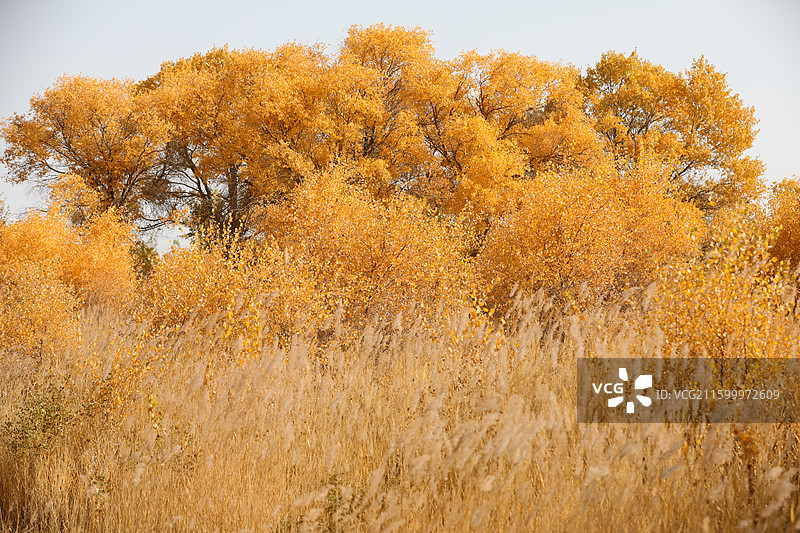
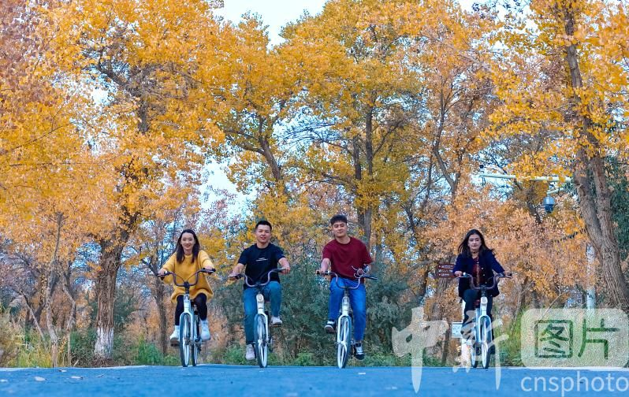
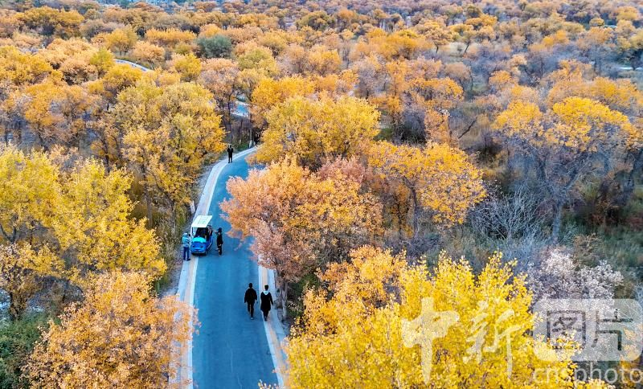
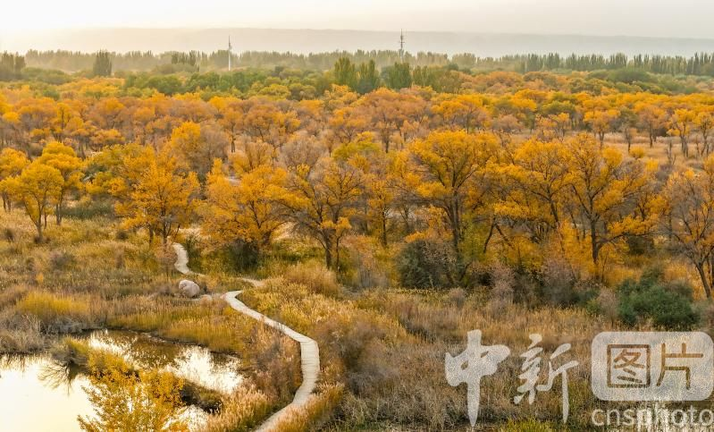

# 泽普金湖杨景区

## 🎤 AI导游带你游

### 【开场白】
各位朋友，大家好！欢迎来到新疆维吾尔自治区喀什地区，欢迎来到泽普金湖杨景区。我是你们今天的导游小艾。

站在这片土地上，你们可能想象不到，千百年前，这里曾是怎样一番景象。历史的年轮在这里留下了深深的印记，每一寸土地都在诉说着古老的故事。

金湖杨国家森林公园位于中国新疆维吾尔自治区喀什地区泽普县城西南40千米的亚斯敦林场，坐落在叶尔羌河冲积扇上缘，临近昆仑山。景区是拥有“胡杨、水、绿洲、戈壁”四位一体独特景观的国家森林公园，占地面积26.66平方千米，其中天然胡杨林面积达13.33平方千米。该地属暖温带大陆性干旱气候，气候温和，但干旱...

今天，就让我们一起走进这片神奇的土地，感受它独有的魅力。建议游览时间：半天到一天。拍照最佳时间是清晨或傍晚，光线柔和时最美。

---

## 🗺️ 景区全景导览
泽普金湖杨景区位于新疆维吾尔自治区喀什地区泽普县境内，是国家AAAAA级旅游景区。

金湖杨国家森林公园位于中国新疆维吾尔自治区喀什地区泽普县城西南40千米的亚斯敦林场，坐落在叶尔羌河冲积扇上缘，临近昆仑山。景区是拥有“胡杨、水、绿洲、戈壁”四位一体独特景观的国家森林公园，占地面积26.66平方千米，其中天然胡杨林面积达13.33平方千米。该地属暖温带大陆性干旱气候，气候温和，但干旱少雨。 金湖杨国家森林公园主要景点有胡杨林、二桥映雪、湖心舟岛、沙枣人家、长寿民俗文化村等。景区还拥有“十二木卡姆”和达瓦孜高空走钢丝艺术传承地的自然村落，以及非物质文化遗产器乐演奏和达瓦孜表演等活动。 2003年，金湖杨景区入选国家森林公园。2013年，金湖杨国家森林公园被批准为AAAAA级旅游景

**游览路线推荐**：景区入口 → 核心景观区 → 精华景点 → 观景平台 → 出口

---

## 🏛️ 主要景点详解

### 📍 核心景区

**核心看点**：
- 远离人群的小众精华景点，安静而美好
- 喜欢深度游的朋友一定不要错过
- 这里能让你感受到不一样的景区魅力

> 💡 **导游贴士**：
> 来核心景区游览，建议穿舒适的鞋子，这里需要多走走才能发现它的美。

---

### 📍 精华观景台

**核心看点**：
- 这里曾是历史上重要的场所，意义非凡
- 建筑/景观的设计独具匠心，体现了古人智慧
- 站在这里，仿佛能与历史对话

> 💡 **导游贴士**：
> 在精华观景台游览时，注意爱护环境，让这份美能够长久留存。

---

### 📍 特色景观区

**核心看点**：
- 景区内最受欢迎的打卡点，游客必到
- 站在这里可以俯瞰整个景区的壮丽景色
- 天气好的时候拍照效果绝佳，记得预留时间

> 💡 **导游贴士**：
> 特色景观区最适合拍照的时间是清晨和傍晚，光线柔和，人也相对较少。

---

### 📍 文化展示区

**核心看点**：
- 这里是景区最具代表性的景观，绝对不可错过
- 独特的自然/人文风貌，是拍照打卡的首选之地
- 建议停留15-20分钟，细细品味它的独特魅力

> 💡 **导游贴士**：
> 游览文化展示区时，不妨找个地方坐下来，静静感受周围的氛围，这才是旅行的意义。

---

### 📍 历史遗迹区

**核心看点**：
- 观景位置绝佳，视野开阔
- 是拍摄全景照片的最佳地点
- 傍晚时分来，夕阳西下的景色美不胜收

> 💡 **导游贴士**：
> 游览历史遗迹区时，不妨关掉手机，用眼睛和心灵去感受这份美好。

---

### 📍 自然观光带

**核心看点**：
- 自然风光与人文景观完美融合的典范
- 四季景致各异，无论何时来都有惊喜
- 摄影爱好者的天堂，随手一拍都是大片

> 💡 **导游贴士**：
> 如果你是摄影爱好者，自然观光带一定能让你拍出满意的作品，记得带上广角镜头！

---

## 【结束语】
各位朋友，今天的游览即将结束。希望泽普金湖杨景区的美景能给你们留下美好的回忆。

有人说，旅行的意义不在于去过多少地方，而在于那些让你心动的瞬间。希望在泽普金湖杨景区的这一天，能成为你旅途中一个温暖的记忆。

临走前，别忘了回头再看一眼。夕阳下的泽普金湖杨景区，会给你最温柔的道别。

> ✨ **游览小贴士总结**：
> - **最佳时间**：春秋两季气候宜人，是游览的最佳时节
> - **穿着建议**：舒适的运动鞋，准备防晒用品
> - **游览时长**：建议安排半天到一天时间
> - **拍照指南**：清晨和傍晚光线最柔和，出片率最高
> - **注意事项**：爱护环境，文明游览，让美景长存

祝你们旅途愉快，平安吉祥！🙏

---

## 📷 景区美图

*景区全景*

*核心景观*

*特色风光*

*细节之美*

---

## 📚 泽普金湖杨景区小档案

| 项目 | 信息 |
|------|------|
| 景区级别 | 国家AAAAA级旅游景区 |
| 所属省份 | 新疆维吾尔自治区 |
| 所属城市 | 喀什地区 |
| 建议游览时间 | 半天 - 1天 |
| 最佳游览季节 | 春秋两季 |

---

> 💡 **本页说明**：
> 本README由AI导游小艾根据网络公开资料整理生成。
> 坐标、图片、简介均来自豆包搜索API，仅供参考。
