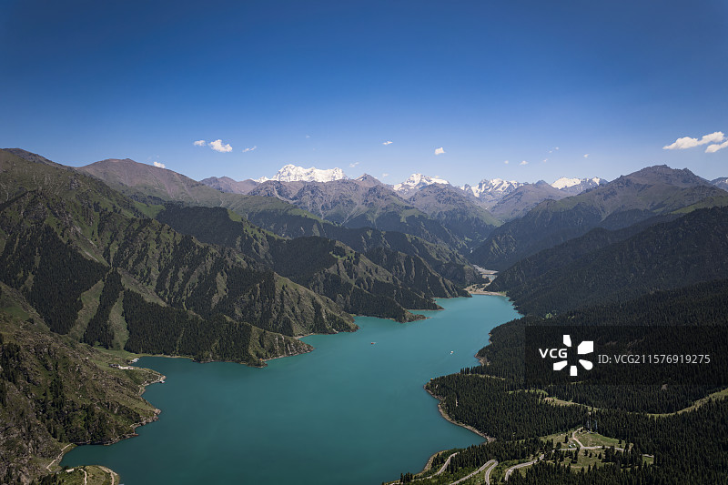
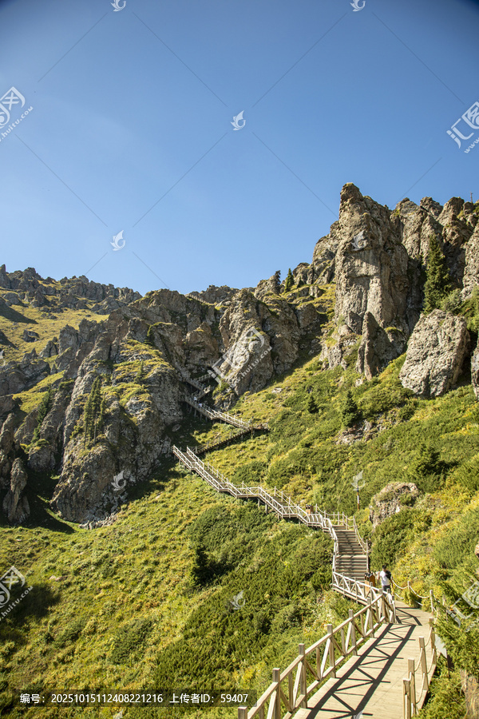
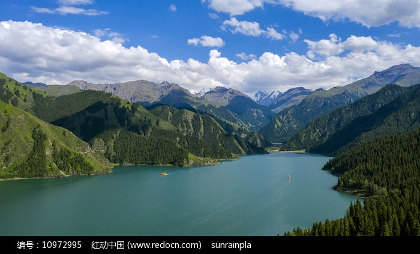
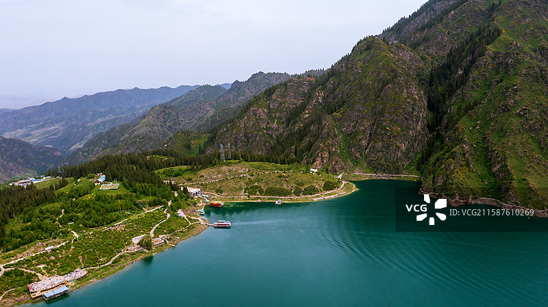

# 新疆天山天池风景名胜区

## 🎤 AI导游带你游

### 【开场白】
各位朋友，大家好！欢迎来到新疆维吾尔自治区昌吉回族自治州，欢迎来到新疆天山天池风景名胜区。我是你们今天的导游小艾。

站在这片土地上，你们可能想象不到，千百年前，这里曾是怎样一番景象。历史的年轮在这里留下了深深的印记，每一寸土地都在诉说着古老的故事。

新疆天山天池风景名胜区位于中国新疆维吾尔自治区昌吉回族自治州阜康市境内博格达峰下的半山腰，景区规划总面积为548平方公里，距乌鲁木齐市97千米(部分资料显示为乌鲁木齐以东86公里)，距阜康市区37千米，天山天池湖面海拔为1910米，天池所在的博格达峰主峰海拔5445米，是首批国家级风景名胜区，国家A...

今天，就让我们一起走进这片神奇的土地，感受它独有的魅力。建议游览时间：半天到一天。拍照最佳时间是清晨或傍晚，光线柔和时最美。

---

## 🗺️ 景区全景导览
新疆天山天池风景名胜区位于新疆维吾尔自治区昌吉回族自治州阜康市境内，是国家AAAAA级旅游景区。

新疆天山天池风景名胜区位于中国新疆维吾尔自治区昌吉回族自治州阜康市境内博格达峰下的半山腰，景区规划总面积为548平方公里，距乌鲁木齐市97千米(部分资料显示为乌鲁木齐以东86公里)，距阜康市区37千米，天山天池湖面海拔为1910米，天池所在的博格达峰主峰海拔5445米，是首批国家级风景名胜区，国家AAAAA级旅游景区。 景区气候属典型的温带大陆性干旱气候，冬季寒冷漫长，夏季温和短促，地势由北向南逐渐抬高，海拔800-5445米，最大相对高差4645米。景区内生物多样性丰富，有牦牛、金丝猴、雪豹等动物，有新疆方枝柏、天山云杉、天山雪莲等植物。冰川是景区水文资源的主要构成要素，其中博格达峰有现代冰

**游览路线推荐**：景区入口 → 核心景观区 → 精华景点 → 观景平台 → 出口

---

## 🏛️ 主要景点详解

### 📍 核心景区

**核心看点**：
- 景区内最受欢迎的打卡点，游客必到
- 站在这里可以俯瞰整个景区的壮丽景色
- 天气好的时候拍照效果绝佳，记得预留时间

> 💡 **导游贴士**：
> 核心景区是整个景区的精华所在，建议至少预留20-30分钟在这里慢慢欣赏。

---

### 📍 精华观景台

**核心看点**：
- 这里是景区最具代表性的景观，绝对不可错过
- 独特的自然/人文风貌，是拍照打卡的首选之地
- 建议停留15-20分钟，细细品味它的独特魅力

> 💡 **导游贴士**：
> 游览精华观景台时，不妨找个地方坐下来，静静感受周围的氛围，这才是旅行的意义。

---

### 📍 特色景观区

**核心看点**：
- 远离人群的小众精华景点，安静而美好
- 喜欢深度游的朋友一定不要错过
- 这里能让你感受到不一样的景区魅力

> 💡 **导游贴士**：
> 如果你是摄影爱好者，特色景观区一定能让你拍出满意的作品，记得带上广角镜头！

---

### 📍 文化展示区

**核心看点**：
- 这里曾是历史上重要的场所，意义非凡
- 建筑/景观的设计独具匠心，体现了古人智慧
- 站在这里，仿佛能与历史对话

> 💡 **导游贴士**：
> 来文化展示区游览，建议穿舒适的鞋子，这里需要多走走才能发现它的美。

---

### 📍 历史遗迹区

**核心看点**：
- 自然风光与人文景观完美融合的典范
- 四季景致各异，无论何时来都有惊喜
- 摄影爱好者的天堂，随手一拍都是大片

> 💡 **导游贴士**：
> 历史遗迹区最适合拍照的时间是清晨和傍晚，光线柔和，人也相对较少。

---

### 📍 自然观光带

**核心看点**：
- 景区的标志性景观，没来过等于没来过
- 最佳观赏时间是清晨和傍晚，光线最美
- 记得带上充电宝，美景会让你停不下快门

> 💡 **导游贴士**：
> 自然观光带的景色四季皆宜，每个季节都有不同的美，值得多次来访。

---

## 【结束语】
各位朋友，今天的游览即将结束。希望新疆天山天池风景名胜区的美景能给你们留下美好的回忆。

有人说，旅行的意义不在于去过多少地方，而在于那些让你心动的瞬间。希望在新疆天山天池风景名胜区的这一天，能成为你旅途中一个温暖的记忆。

临走前，别忘了回头再看一眼。夕阳下的新疆天山天池风景名胜区，会给你最温柔的道别。

> ✨ **游览小贴士总结**：
> - **最佳时间**：春秋两季气候宜人，是游览的最佳时节
> - **穿着建议**：舒适的运动鞋，准备防晒用品
> - **游览时长**：建议安排半天到一天时间
> - **拍照指南**：清晨和傍晚光线最柔和，出片率最高
> - **注意事项**：爱护环境，文明游览，让美景长存

祝你们旅途愉快，平安吉祥！🙏

---

## 📷 景区美图

*景区全景*

*核心景观*

*特色风光*

*细节之美*

*四季风光*

*人文景观*

---

## 📚 新疆天山天池风景名胜区小档案

| 项目 | 信息 |
|------|------|
| 景区级别 | 国家AAAAA级旅游景区 |
| 所属省份 | 新疆维吾尔自治区 |
| 所属城市 | 昌吉回族自治州 |
| 建议游览时间 | 半天 - 1天 |
| 最佳游览季节 | 春秋两季 |

---

> 💡 **本页说明**：
> 本README由AI导游小艾根据网络公开资料整理生成。
> 坐标、图片、简介均来自豆包搜索API，仅供参考。
