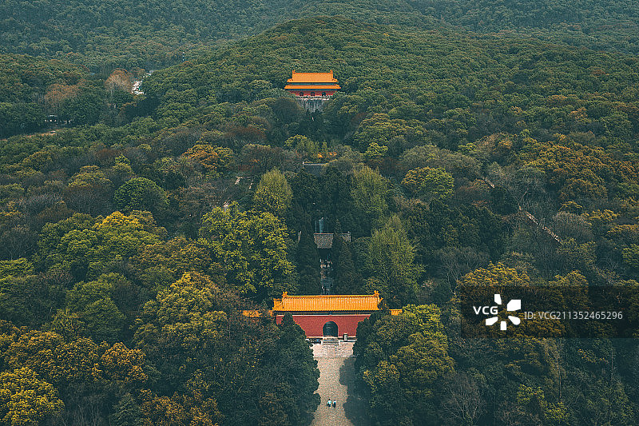
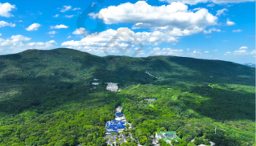
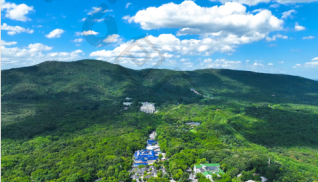

# 中山陵园风景区 🇨🇳

## 🏛️ 开篇：一座陵，一个人，一种理想

当你站在中山陵的广场上，仰望那392级石阶和石阶尽头的祭堂，你会感到一种深深的震撼。这不是一座普通的陵墓，这是中国近代民主革命的象征，是孙中山先生精神的物化，是一个民族对理想的纪念。

钟山，这座海拔只有448米的小山，因为孙中山而变得不平凡。"吾死之后，可葬于南京紫金山麓，因南京为临时政府成立之地，所以不可忘辛亥革命也。"孙中山先生的这句遗言，让钟山成为了全体中国人心中的圣地。

中山陵的设计本身就是一种象征。从空中俯瞰，整个陵园像一口"自由钟"，象征着"警钟长鸣，唤起民众"。392级石阶，代表着当时中国的三亿九千二百万同胞。8个平台，象征着三民主义五权宪法。从博爱坊到祭堂，700米的距离，70米的高差，每走一步，你都会感到一种向上的力量。

来中山陵吧。不是来参观一个旅游景点，而是来拜谒一个人，一种精神，一种理想。那种"天下为公"的理想，虽然还没有完全实现，但是它像一盏明灯，永远指引着我们前进的方向。

## 📜 历史与文化：从遗嘱到丰碑

**1925年3月12日 总理逝世**
孙中山先生在北京逝世。临终前，他留下了三份遗嘱：《国事遗嘱》、《家事遗嘱》和《致苏联遗书》。"革命尚未成功，同志仍需努力"——这句后来被无数人引用的名言，就出自《国事遗嘱》。

**1925年4月 选址钟山**
根据孙中山先生生前遗愿，国民政府决定在南京紫金山为他修建陵墓。宋庆龄亲自登上紫金山，选定了现在的墓址。这个位置，前临平川，后拥青嶂，视野开阔，气势雄伟，是一块绝佳的风水宝地。

**1925年5月 设计竞赛**
国民政府向全世界公开征集陵墓设计方案。最终，年轻建筑师吕彦直的设计方案获得了第一名。吕彦直的设计，既继承了中国传统陵墓的特点，又融入了西方建筑的元素，简洁、庄重、大气，完美地体现了孙中山先生的精神。

**1926年3月12日 奠基开工**
在孙中山先生逝世一周年的日子，中山陵正式开工。工程历时三年，每天都有上千名工人在工地上劳动。遗憾的是，设计师吕彦直没有等到工程完工——1929年3月，他因为积劳成疾去世，年仅36岁。

**1929年6月1日 奉安大典**
这是中国近代史上最隆重的葬礼。孙中山先生的灵柩从北京运到南京，沿途几十万民众迎灵。6月1日，奉安大典在中山陵举行，蒋介石、宋庆龄等各界人士共十万人参加了仪式。从此，孙中山先生就长眠在了钟山南麓。

**1937-1945年 抗战时期**
南京沦陷后，中山陵成为了一个特别的存在。汪精卫伪政权不敢破坏中山陵，日军也对中山陵保持了"尊重"。虽然经历了八年战乱，但是中山陵的建筑基本完好。这不能不说是一个奇迹。

**1949年至今 人民的陵园**
新中国成立后，中山陵得到了很好的保护。1961年，中山陵被列为全国重点文物保护单位。2007年，中山陵所在的钟山风景区被评为国家5A级旅游景区。2010年，中山陵正式免费对外开放。

## 🌟 核心景点详解

### 📍 392级石阶：向上的力量

这是中山陵最震撼人的画面——392级石阶，从博爱坊一直延伸到山顶的祭堂。照片中，这条笔直的石阶路，像一条通往天国的阶梯，充满了向上的力量。

**石阶的数字秘密**：
- **392级**：代表当时中国的三亿九千二百万同胞
- **8个平台**：象征三民主义（民族、民权、民生）和五权宪法（立法、司法、行政、考试、监察）
- **从下往上看**：只看到台阶，看不到平台，象征着革命道路的艰难
- **从上往下看**：只看到平台，看不到台阶，象征着革命胜利后的坦途

**爬石阶的感受**：
很多人第一次爬中山陵的石阶都会觉得很累。但是越往上爬，视野越开阔，心情也会越来越开阔。等你爬到顶端，回头往下看的时候，你会有一种豁然开朗的感觉。这就是中山陵设计的巧妙之处——它让你在攀登的过程中，体验革命的艰辛，感受理想的崇高。

**你不知道的冷知识**：
这392级石阶，不是一次性设计的。刚开始设计的时候，石阶数量是364级。后来施工的时候发现高差不对，又调整成了392级。正好对应了当时中国的人口数，这是一个美丽的巧合。

> 💡 **游览贴士**：
> 爬石阶的时候不要着急，慢慢走，边走边看。每一个平台都有不同的风景，每一个平台都可以回头拍一张照片。建议穿舒适的运动鞋，因为石阶还是比较陡的。另外，最好是清晨或者傍晚来，人少，光线好。

---

### 📍 祭堂：天下为公的理想

这就是中山陵的核心建筑——祭堂。照片中这座蓝色琉璃瓦、白色花岗岩的建筑，庄严、肃穆、大气，完美地体现了孙中山先生的品格和精神。

**祭堂的建筑细节**：
- **风格**：中西合璧，既有中国传统宫殿的庄重，又有西方古典建筑的典雅
- **三扇拱门**：分别写着"民族"、"民权"、"民生"，代表三民主义
- **孙中山坐像**：祭堂中央是孙中山先生的白色大理石坐像，高4.6米，非常逼真
- **四周浮雕**：坐像四周有六块浮雕，讲述了孙中山先生革命的一生

**墓室**：
祭堂后面是墓室，平时是关闭的，只有在特殊的日子才会开放。墓室中央是孙中山先生的汉白玉卧像，下面就是埋葬孙中山先生遗体的地方。

**"天下为公"匾**：
祭堂正门上方的"天下为公"四个字，是孙中山先生亲笔所书。这四个字，是孙中山先生一生的追求，也是他留给后人最宝贵的精神财富。

**你不知道的故事**：
抗战时期，汪精卫想把孙中山先生的遗体移到重庆，但是因为墓地太坚固，没有成功。新中国成立后，有人提出要打开棺木看看孙中山先生的遗容，被周恩来总理否决了。周总理说，孙中山先生是伟大的革命先行者，我们应该尊重他，让他安息。

> 💡 **参观建议**：
> 进入祭堂的时候，保持安静。这是一个庄严的地方，不是用来嬉闹的。很多人来到这里，都会在孙中山先生的坐像前鞠一躬。这不是什么迷信，这是对一个伟大人物的尊重。如果你了解他的生平，你也会不由自主地想给他鞠个躬。

---

### 📍 博爱坊：进入历史的大门

这是中山陵的入口——博爱坊。照片中这座三间四柱冲天式的石牌坊，上面刻着孙中山先生亲笔书写的"博爱"两个大字。这是孙中山先生最喜欢的两个字，也是他一生的信条。

**博爱坊的故事**：
- **材质**：全部用福建花岗岩建造，非常坚固
- **"博爱"二字**：孙中山先生亲笔所书，他说"博爱"是"人类之爱"，是最高尚的爱
- **高度**：牌坊高11米，宽17.3米，非常有气势
- **两旁的狮子**：牌坊下面有两对石狮子，威武庄严

**为什么叫"坊"不叫"牌坊"**：
很多人把这个地方叫"博爱牌坊"，但其实正确的名字是"博爱坊"。因为传统的牌坊是有楼的，而这个建筑没有楼，是冲天式的，所以叫"坊"更准确。

**你不知道的冷知识**：
文革期间，博爱坊差点被红卫兵拆掉。因为他们认为孙中山是资产阶级革命家。幸好当时的中山陵管理处的工作人员机智，他们在牌坊上贴满了毛主席语录和"革命无罪，造反有理"的标语，红卫兵才没法下手。就这样，这座珍贵的建筑被保护了下来。

> 💡 **拍照贴士**：
> 博爱坊是中山陵最适合拍照的地方之一。最佳的拍照角度是站在广场上，让博爱坊和后面的石阶、祭堂同框。清晨的时候，阳光从东面照过来，"博爱"两个字会被照亮，非常好看。

---

### 📍 音乐台：建筑与自然的完美融合

在中山陵的东南侧，有这座美丽的建筑——音乐台。这是中山陵的配套建筑，当年是用来举行纪念仪式和音乐会的。现在，它是南京最美丽的露天剧场。

**音乐台的设计**：
- **设计者**：同样是吕彦直设计的，和中山陵的风格保持一致
- **形状**：半圆形，像一把张开的折扇
- **舞台**：舞台在圆心，背景是一面巨大的照壁，用来反射声音
- **看台**：沿着半圆形的山坡，有3000个座位
- **鸽子**：音乐台有很多鸽子，是这里的一大特色

**建筑声学的奇迹**：
音乐台的设计非常巧妙，利用了建筑声学的原理。即使坐在最后一排，也能清晰地听到舞台上的声音，不需要扩音设备。在那个没有音响的年代，能做到这一点非常了不起。

**现在的音乐台**：
现在的音乐台，已经很少用来举行严肃的纪念活动了。更多的时候，它是一个市民休闲的地方。很多人来这里喂鸽子，晒太阳，听音乐会。春天，音乐台周围的紫藤花开了，非常美。

> 💡 **游览贴士**：
> 很多游客逛完中山陵就走了，错过了音乐台，非常可惜。一定要去看看！音乐台离中山陵很近，步行十分钟就到。门票也很便宜，只要10块钱。建议下午去，阳光斜照在音乐台上，非常美。买一包鸽子食，让鸽子落在你的手上拍照，是很多游客必做的事情。

---

## 🎯 游览实用指南

### 🚇 交通指南
- **地铁**：2号线到下马坊站，从1号口出来就是钟山风景区入口
- **公交**：34路、201路、202路到中山陵停车场站
- **景区交通**：景区内有观光车，10元/人，可以在各个景点之间乘坐

### 🎫 门票信息（2025年参考）
- **中山陵陵寝**：免费（需要提前预约）
- **明孝陵**：70元
- **音乐台**：10元
- **灵谷寺**：35元
- **美龄宫**：30元
- **钟山风景区联票**：100元（包含以上四个景点，两天有效）

### ⏰ 开放时间
- **中山陵陵寝**：8:30-17:00，每周一闭馆（法定节假日和纪念日除外）
- **音乐台**：6:30-18:00
- **建议游览时长**：半天（只逛中山陵）到一天（逛整个钟山风景区）

### 🗺️ 经典游览路线

**中山陵半日游**：
下马坊 → 博爱坊 → 392级石阶 → 祭堂 → 音乐台 → 返程

**钟山一日游**：
上午：中山陵 → 音乐台
中午：景区内吃饭
下午：明孝陵 → 美龄宫 → 灵谷寺 → 返程

**深度两日游**：
Day1：中山陵 → 音乐台 → 美龄宫 → 住南京
Day2：明孝陵 → 灵谷寺 → 紫金山天文台 → 返程

### 🍜 美食推荐
- **南京盐水鸭**：南京招牌菜，肥而不腻，香鲜味美
- **鸭血粉丝汤**：南京最有名的小吃，一定要尝
- **小笼包**：南京的小笼包也很好吃，皮薄馅大汤汁多
- **美龄粥**：用豆浆、山药、大米熬的粥，据说宋美龄很喜欢喝，因此得名

## 💫 结语：一个人和一个民族的理想

每年，有超过一千万人来到中山陵。他们来自全国各地，来自世界各地。他们中有白发苍苍的老人，有朝气蓬勃的青年，有天真烂漫的孩子。

他们来这里，不是为了看什么奇山异水，不是为了拍什么网红照片。他们来这里，是为了拜谒一个人，一个改变了中国历史进程的人。

孙中山先生不是一个完美的人。他领导的革命没有完全成功，他的很多理想都没有实现。但是他的伟大之处在于，他一辈子都在为了"天下为公"的理想而奋斗，从来没有放弃过。

"革命尚未成功，同志仍需努力。"这句话，今天读来，依然振聋发聩。因为我们的革命还没有成功，因为我们的理想还没有实现，因为我们依然需要努力。

站在中山陵的最高处，俯瞰南京城。你会看到孙中山先生当年憧憬的那个"富强、民主、文明"的中国，正在一点点变成现实。这，就是对他最好的告慰。

中山陵不是一座陵墓。它是一座丰碑，一座理想的丰碑，一座精神的丰碑。它告诉我们：人应该有理想，应该为了理想而奋斗。即使理想暂时没有实现，只要努力过，奋斗过，就没有遗憾。

> 📌 **旅行感悟**：
> 有的人死了，他还活着。孙中山先生就是这样的人。他虽然已经离开我们将近一百年了，但是他的精神，他的理想，他的追求，依然在影响着我们每一个人。这就是一个人的伟大之处——他死了，但他永远活着。

---

*本页内容基于实景图片分析与历史资料整理，由AI导游系统2025年7月生成*
