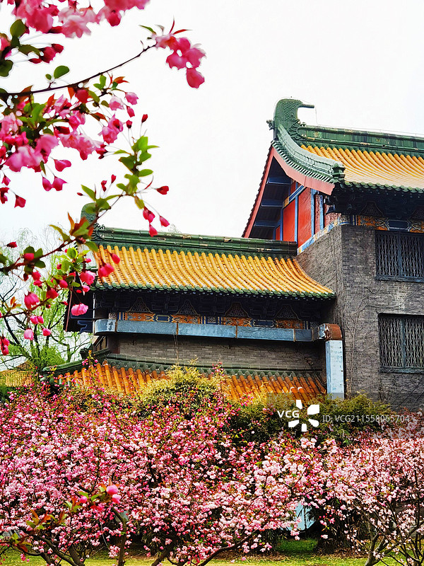
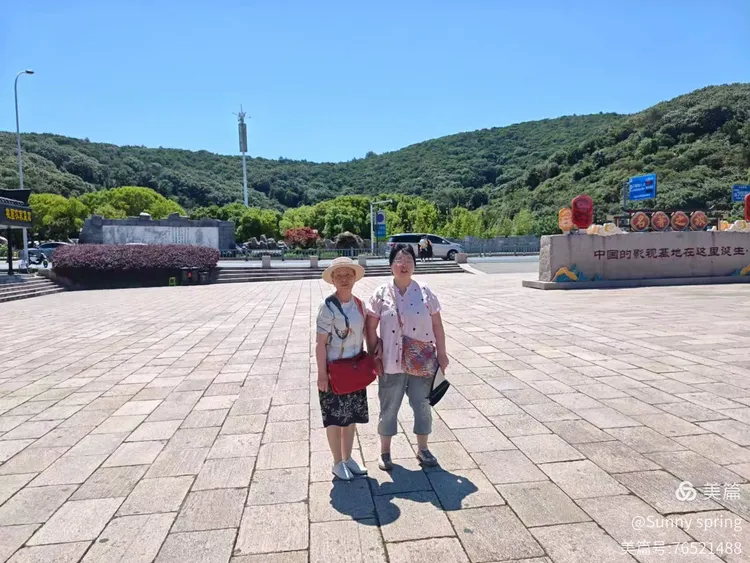
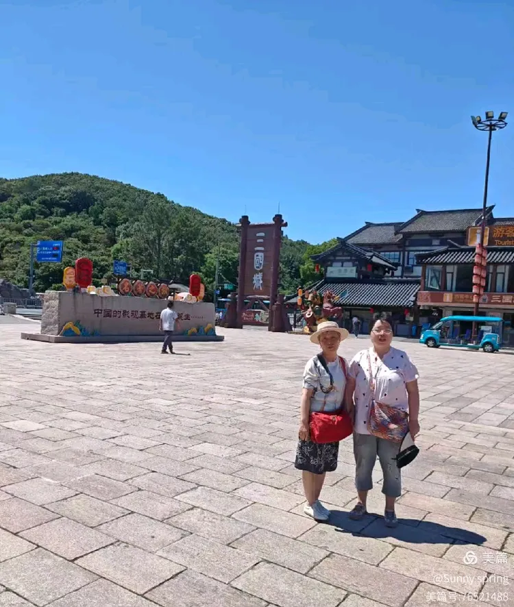
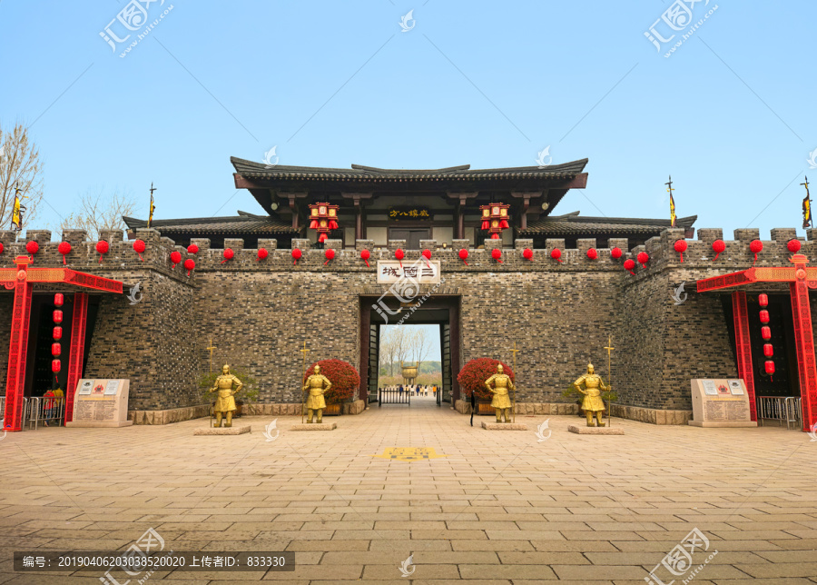

# 三国水浒景区 ✨

## 🎬 开篇：一出戏，一座城

"滚滚长江东逝水，浪花淘尽英雄。"

1994年的秋天，全中国的电视屏幕前，几亿人同时守在电视机前。片头曲一响，杨洪基浑厚的嗓音唱出来，长江水在屏幕上奔涌，关羽提着青龙偃月刀从雾里走出来。

那一年，84集电视剧《三国演义》开播。它成了几代中国人共同的记忆。

但很少有人知道，那些金戈铁马、那些火烧赤壁、那些刘备招亲--大半不是在长江边拍的，而是在太湖边。

1987年，中央电视台决定拍《三国演义》。为了拍这部戏，他们在无锡太湖边，盖了一座城。

整整35公顷。城墙、宫殿、寺庙、水寨、点将台，全是按汉代的样式一砖一瓦建起来的。建完之后没拆，留了下来，就成了今天的"三国城"。

后来拍《水浒传》，又在旁边盖了一座"水浒城"，80公顷。

两座城连在一起，靠着太湖，就成了中国第一个大规模影视旅游基地。

它不是古迹。它是一座为了"重现古迹"而建的城。但当你走进去，站在吴王宫的台阶上，望着远处的太湖，你会恍惚--分不清自己是来旅游的，还是走进了那一出已经演了一千八百年的戏。

## 📜 从一本书到一座城

**公元14世纪 罗贯中写了一本书**

元末明初，一个叫罗贯中的人，把民间流传的三国故事整理成书，取名《三国演义》。

他写刘备的仁，写关羽的义，写曹操的奸，写诸葛亮的智。他写的是英雄，也是乱世里人对"道义"的渴望。

这本书一写出来，就火了。火了六百年。火到全中国的人，都能背出"桃园三结义""三顾茅庐""草船借箭"。

后来施耐庵又写了《水浒传》。写一百零八个好汉被逼上梁山，替天行道。

两本书，写尽了中国人心里两种最深的执念：一种是"宁教我负天下人"的权谋，一种是"路见不平一声吼"的义气。

**1987年 央视决定把书拍成戏**

上世纪八十年代，中央电视台做了一个大胆的决定：把《三国演义》拍成电视剧，84集，要拍成"经典"。

要拍经典，就不能将就。剧组找到无锡太湖边的一片地，决定按汉代规制，原样建一座城。

城门高三丈，宫阙飞檐，战船能在水寨里真的开动。光是"火烧赤壁"那一场戏，就动用了72条船、1500名群众演员、40多吨汽油。

1994年，剧开播。万人空巷。

后来《水浒传》也在这里拍，1998年播出，又是一部经典。

**戏拍完了，城留下了**

按理说，戏拍完，布景就拆了。但央视做了一个英明的决定：城不拆，改成景区，让普通人也能走进来。

于是就有了今天的三国水浒景区。

这里是中国影视旅游的开山鼻祖。后来的横店、象山，都学着它的样子。

**你不知道的冷知识：**
- 三国城建了两年多，耗资过亿，1994年才正式开放
- 《三国演义》里"刘备招亲"的甘露寺、"草船借箭"的江面、"借东风"的七星坛，全在三国城里，至今原样保留
- 水浒城里那条紫石街，是武大郎卖烧饼的地方，潘金莲的窗户至今还开着
- 太湖边的"赤壁"是假的，但当年火烧赤壁那场戏，火是真的烧了

---

## 🌟 三国城核心景点详解

### 📍 吴王宫：孙权的家，刘备的岳家

吴王宫是三国城里最宏伟的建筑。

它是按史书里孙权宫殿的样子复原的。高台重檐，朱柱玄瓦，宫门前一条长长的御道，两边立着石像生。

《三国演义》里有一段重头戏叫"刘备招亲"。刘备借了荆州不还，孙权想用妹妹孙尚香做诱饵，骗刘备来京口成亲，趁机扣下他换荆州。结果诸葛亮将计就计，让刘备真的娶了孙夫人，孙权"赔了夫人又折兵"。

这段戏，就是在这座吴王宫里拍的。

你走进宫门，穿过正殿，能看到当年拍戏留下的陈设。龙椅、屏风、宫灯，全是真家伙。坐一坐龙椅，你会发现自己也想象得出那种"借荆州不还"的尴尬。

宫后面是后宫，孙夫人的闺房就在这里。窗棂雕花，绣帘低垂。你站一会儿，仿佛能听见一千八百年前，那个嫁了刘备、又被哥哥当作棋子的女人，在这里叹了一口气。

> 💡 **导游贴士**：
> 吴王宫正殿是拍"皇帝登基"戏的地方，拍照很出片，但人多要排队。
> 想拍没人的空镜，趁中午去，旅行团吃饭时人最少。
> 宫后的御道别错过，笔直一条道通向宫门，两边石像生很有汉代味道。
> 龙椅可以坐，但拍照请排队，不要长时间占着。

---

### 📍 甘露寺：刘备相亲的地方

吴王宫后面山上，有一座甘露寺。

这就是《三国演义》里"刘备招亲"那场戏的核心场景。

戏里，孙权的母亲吴国太，要在这里亲自相看刘备。孙权本想埋伏刀斧手，被赵云识破。结果刘备凭着一把眼泪、一通好话，让吴国太真把女儿嫁给了他。

甘露寺不大，依山而建，几进院落。寺里有刘备、孙夫人、吴国太的塑像，重现当年"相看"的那一幕。刘备满脸赔笑，孙夫人低眉，吴国太端坐--一组塑像把那场相亲戏演活了。

站在甘露寺的山门前，能望见太湖。湖光山色，烟波浩渺。当年刘备在这里，心里大概也是五味杂陈：一边是新婚的欢喜，一边是荆州的算计，一边是五十多岁的自己，终于又成了别人家的女婿。

> 💡 **导游贴士**：
> 甘露寺在山上，要爬一段台阶，不算太陡，老人慢点走没问题。
> 寺前的平台是俯瞰太湖的好地方，拍全景必到。
> 这里游客比吴王宫少，适合慢慢逛。
> 殿内的塑像可以拍照，但请不要用闪光灯，会惊扰其他游客。

---

### 📍 演兵场与三英战吕布：每天演一场的痛快

三国城每天最火的表演，是演兵场上的《三英战吕布》。

这是一场马战实景演出。几十匹真马，几十个真演员，穿着盔甲，拿着真家伙（当然是钝的），在沙场上冲锋陷阵。

《三国演义》第五回，虎牢关前，吕布一人一马，连挑联军数将，无人能挡。张飞冲上去，打了五十回合不分胜负；关羽上去，三人战吕布，还是打不过；刘备拔双股剑也上去了，三兄弟围住吕布，这才把吕布逼退。

这就是"三英战吕布"。

演出把这场景搬到了沙场上。战鼓一响，尘土飞扬，三匹马围着吕布转，刀光剑影，喊声震天。吕布的方天画戟在阳光下闪着寒光，张飞的丈八蛇矛戳过去，被吕布一格，火星直冒。

孩子们看得直拍手。大人也看得热血沸腾。

演完之后，演员会骑着马绕场一圈，你可以上前合影。那个演关羽的，红脸长须，手持青龙偃月刀，往那儿一立，活脱脱从书里走出来的。

> 💡 **导游贴士**：
> 演出一天两到三场，上午10:30、下午2:00各一场，节假日加场，具体看当天公告。
> 想占好位置，提前半小时进场，坐前排沙地边缘，最近、最真、最刺激。
> 演出有尘土，戴隐形眼镜的注意，建议戴眼镜或备湿巾。
> 演完合影排队很长，但值得。和"关羽"合影时，记得让他横刀--这个姿势最帅。

---

### 📍 曹营水寨与赤壁：火烧起来的地方

三国城伸进太湖的那一片水域，是"曹营水寨"。

曹操的船连成一片，桅杆林立，旌旗蔽日。这是当年赤壁之战前，曹操八十万水军的模样。

《三国演义》里赤壁之战是全书的最高潮。曹操把战船用铁索连起来，结果被周瑜一把火烧个精光。"火烧赤壁"四个字，从此成了以弱胜强的代名词。

三国城里的"赤壁"，是一段仿造的红色石壁，立在水边。当年拍戏时，水面上真的烧起了大火，72条船一起着火，烟柱直冲太湖上空，几公里外都看得见。

今天的水寨不再烧火了，但船还在。你可以登上曹操的旗舰"连环船"，站在船头，学着曹操横槊赋诗："对酒当歌，人生几何……"

风从太湖上吹过来，你的衣袂会被吹起来。那一刻你会理解，为什么曹操在这个年纪，还要写"老骥伏枥，志在千里"。

> 💡 **导游贴士**：
> 水寨的船可以登，但甲板晃，老人小孩注意。
> 站在船头往太湖看，能看到远处的三山岛，水天一色，最适合拍"曹操横槊"的剪影。
- 赤壁那段红石壁是打卡点，背靠石壁、面朝湖水，是经典构图。
> 傍晚时分，夕阳把水寨染成金色，比白天还出片。

---

### 📍 七星坛：诸葛亮借东风的地方

赤壁之战前，周瑜万事俱备，只欠东风。是冬天，刮西北风，火攻会烧自己。

诸葛亮说：我来借。

他在南屏山筑七星坛，登坛作法。到了约定的那天，东南风真的起来了。周瑜一把火，烧了曹操的船。

三国城里复建了这座七星坛。坛分三层，八角，每层插着不同颜色的旗。坛顶有一个亭子，是诸葛亮"作法"的地方。

当然，诸葛亮借不来风。他是懂气象的--他知道冬至前后，长江中下游会有一段短暂的东南风天气。他赌的就是这个。

但《三国演义》把它写成了"借"，写得神乎其神。所以千百年来，诸葛亮就成了"智"的化身。

站在七星坛上，四周旗子猎猎。你往太湖方向看，水面平阔，远山如黛。如果赶上起风，你会觉得，这风，或许真是诸葛亮借来的。

> 💡 **导游贴士**：
> 七星坛不高，但台阶陡，扶着栏杆上。
> 坛顶是三国城制高点之一，360度看太湖，不要错过。
> 拍照可以拍坛上的旗，风一吹，旗子飘起来，很有"借东风"的感觉。
> 这里人少，适合静一静，想想诸葛亮那个"知天命"的人。

---

## 🌟 水浒城核心景点详解

### 📍 水泊梁山与忠义堂：一百零八将的家

三国城往南，过一座桥，就是水浒城。

水浒城的核心是"水泊梁山"。一座人工堆起的山，山上就是忠义堂。

忠义堂原来叫聚义厅。晁盖在的时候叫聚义厅，宋江当了一把手，改名"忠义堂"，挂起一面"替天行道"的大旗。

《水浒传》里，一百零八个好汉被逼上梁山，在这里排了座次。宋江坐第一把交椅，卢俊义第二，吴用第三……一直排到地煞星七十二员。

今天水浒城的忠义堂里，还摆着一百零八把交椅。每一把椅子上贴着一个名字。你走进去，能找到你最熟悉的那个--武松、林冲、鲁智深、李逵……

站在这厅里，你会想起书里的那些人。

林冲，八十万禁军教头，被高俅陷害，家破人亡，风雪山神庙一怒杀人，逼上梁山。他是被"逼"上去的。

武松，景阳冈打虎，杀潘金莲、西门庆为兄报仇，血溅鸳鸯楼，最后也上了梁山。他是被"冤"上去的。

鲁智深，为救金翠莲三拳打死镇关西，弃官出走，落发为僧，最后也上了梁山。他是被"义"上去的。

每个人都有每个人的"上梁山"。每个人都有一段被世道逼到绝路的故事。

忠义堂的牌匾下，那面"替天行道"的大旗在风里猎猎作响。这四个字，是一百零八个人的理想，也是他们最后的悲剧--他们替的"天"，最终还是把他们一个个葬送了。

> 💡 **导游贴士**：
> 忠义堂是水浒城必到。进去前先在堂前广场仰拍一张，把"替天行道"大旗和忠义堂牌匾一起收进去。
> 堂内的椅子可以找自己的"本命好汉"合影。武松迷找武松椅，林冲迷找林冲椅。
> 梁山上有"断金亭"，是林冲火并王伦的地方，别错过。
> 山下有演武场，定时表演武术，时间充裕可以看。

---

### 📍 紫石街：武大郎卖烧饼的那条街

下了梁山，走进水浒城的市井区，第一条街就是紫石街。

紫石街是水浒城里最有"烟火气"的地方。两边是宋代的民居、酒楼、当铺、药铺，街面铺着青石板。走在街上，像走进了一幅活的《清明上河图》。

这条街最出名的，是武大郎的家。

《水浒传》里，武大郎个子矮、长得丑，靠卖烧饼为生。他娶了潘金莲，潘金莲看不起他，和西门庆勾搭成奸，合谋毒死了武大郎。武松回来，杀了潘金莲和西门庆，为兄报仇。

紫石街上，武大郎的家门口，至今还摆着烧饼挑子。一个扮成武大郎模样的演员，挑着担子，吆喝着卖烧饼。你花几块钱，能买一个，热乎乎的，咬一口，是芝麻和葱花的香。

二楼的窗户，是潘金莲当年支窗子掉落叉竿、砸到西门庆头上的那扇窗。窗子至今还支着。

你站在街上抬头看那扇窗，会觉得这条街活过来了。一千年前施耐庵写下的那一幕，仿佛刚刚发生。

街上还有：
- **王婆茶坊**：王婆撮合西门庆和潘金莲的地方，现在卖茶
- **阳谷县衙**：武松杀嫂后被审的地方
- **狮子楼**：武松斗杀西门庆的地方，楼上还原了那场戏

> 💡 **导游贴士**：
> 紫石街是水浒城最适合拍照的街。建议租一身汉服（景区有租赁点），走在街上就是剧照。
> 武大郎的烧饼一定要尝，不贵，是景区最有"沉浸感"的小吃。
> 街上的"王婆茶坊"可以喝茶歇脚，临窗位置最好。
> 二楼潘金莲的窗户是网红打卡点，仰拍一张，配文"那根叉竿"。

---

## 🎯 游览实用指南

### 🚗 交通指南

**高铁**：
- **无锡站**：全国主要城市都有高铁直达
- 出站后坐公交或打车到三国城，约40分钟
- 无锡地铁4号线可到"蠡湖大桥"站，再转公交

**自驾**：
- 上海->无锡：约2小时，130公里
- 南京->无锡：约2小时，150公里
- 苏州->无锡：约1小时，50公里
- 景区有大型停车场，10-20元/次

**市内交通**：
- 无锡公交82路、212路直达三国城
- 打车从市区约40元

### 🎫 门票信息（2025年参考）
- **三国城单票**：90元
- **水浒城单票**：85元
- **三国+水浒联票**：150元（最推荐，比单买便宜）
- **唐城单独**：60元（另一个影视景区，可一起买）
- **半价**：学生、60-64岁老人
- **免票**：65岁以上、1.4米以下儿童、军人、残疾人
- **表演免费**：所有实景演出都含在门票里，不再收费

### ⏰ 最佳游览时间
- **春季（3-5月）**：太湖最美，樱花、桃花开，温度宜人
- **秋季（9-11月）**：天高气爽，太湖鱼肥，最适合拍照
- **夏季（6-8月）**：避暑，但太湖边闷热，注意防晒
- **冬季（12-2月）**：人最少，但表演场次会减少
- **建议游览时长**：1整天（两座城都逛）

### 🗺️ 推荐路线

**经典一日游**：
- 上午：三国城 -> 吴王宫 -> 甘露寺 -> 看10:30的《三英战吕布》 -> 曹营水寨 -> 七星坛
- 下午：过桥到水浒城 -> 紫石街吃午饭 -> 水泊梁山 -> 忠义堂 -> 阳谷县衙 -> 狮子楼
- 傍晚：太湖边看日落

> 💡 **最重要的建议**：
> 一定要看一场《三英战吕布》。
> 这是全国最好的马战实景演出之一，没有之一。
> 错过了等于白来。早上进园先查好当天演出时间，倒推安排行程。

### 🍜 景区美食
- **武大郎烧饼**：紫石街必吃，芝麻葱花，5元一个
- **太湖三白**：白鱼、白虾、银鱼，景区餐馆都有
- **无锡小笼包**：无锡名物，皮薄汁多，甜口
- **酱排骨**：无锡老味道，咸甜适口
- **太湖莼菜汤**：清淡鲜美，配太湖鱼最搭

### ⚠️ 注意事项
1. **穿舒服的鞋**：两座城加起来一百多公顷，全靠走
2. **看演出查时间**：演出有固定场次，错过就没有了，进园先拍下当天时刻表
3. **防晒**：太湖边没什么遮阴，夏天帽子墨镜必备
4. **带现金**：紫石街小摊和表演合影可能要零钱
5. **汉服体验**：景区有租赁，几十到几百不等，穿着逛紫石街超有感觉
6. **联票划算**：三国+水浒联票比单买省25元，时间够一定要买

## 💫 结语：戏里戏外，都是人间

三国水浒景区有一个特别的地方：它不是古迹，它是为了"重现古迹"而建的城。

但它比很多古迹，更让人动容。

为什么？

因为古迹只剩下了墙。墙不会说话。你站在残垣断壁前，看到的只是一堆石头，你不知道这里发生过什么。

但这里不一样。这里的每一座宫殿、每一条街、每一面旗，都是为了一出戏而建。戏里的人，刘备、关羽、曹操、宋江、武松、林冲--他们活在这些书里、这些戏里、这些城里。

你走进吴王宫，会想起刘备赔笑相亲的尴尬。你走进忠义堂，会想起一百零八人排座次的热血与悲凉。你站在紫石街上，会想起那根砸到西门庆头上的叉竿。

罗贯中和施耐庵写下的那些字，在这里变成了砖瓦、变成了旗帜、变成了马蹄扬起的尘土。

《三国演义》开篇唱："是非成败转头空，青山依旧在，几度夕阳红。"

《水浒传》开篇唱："路见不平一声吼，该出手时就出手。"

两本书，两种态度。一种是看透，一种是热血。

中国人心里，一直住着这两个人。

一个坐在江边，看着浪花淘尽英雄，叹一口气。
一个站在路边，看见不平事，撸起袖子就上。

你来三国水浒景区，走进的不是一个景区。你走进的是中国人心里那个最熟悉的世界--那个有忠义、有算计、有英雄、有无奈、有"替天行道"也有"赔了夫人又折兵"的世界。

戏演完了，城留下了。
城留下了，故事就还在讲。

> 📌 **旅行感悟**：
> 走出水浒城的时候，回头看一眼忠义堂那面"替天行道"的大旗。
> 风吹着它，猎猎作响。
> 你忽然明白--
> 一百零八个人，最终没有替到天。
> 但他们举过这面旗。
> 举过，就够了。
> 有些事，重要的不是结果。
> 重要的是，你曾经举起过它。

---

*本页内容基于实景图片分析与三国水浒影视文化研究整理，由AI导游系统2025年7月生成*
