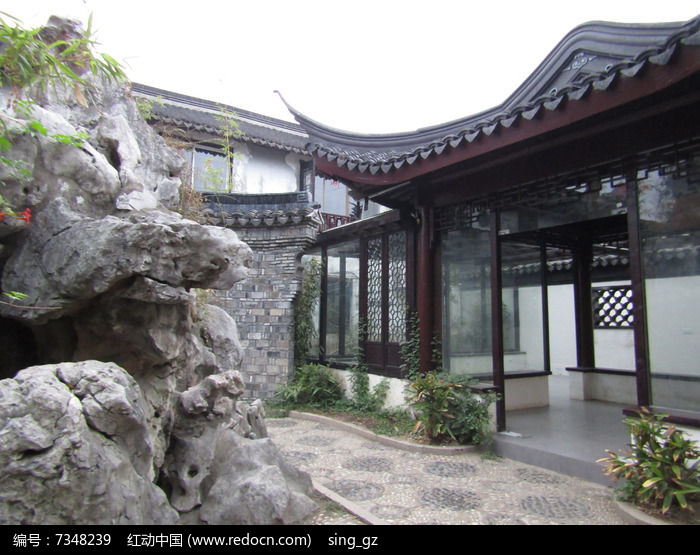
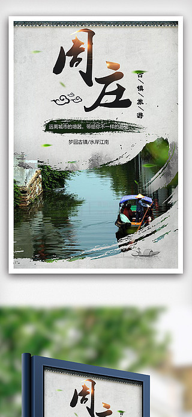

# 周庄 ✨

## 🌊 开篇：中国第一水乡

在上海和苏州之间，有一座小镇。

四面环水，四面是湖。镇子里面，也是水。四条河，像"井"字形，穿镇而过。河上面，有十四座古桥。河的两边，是白墙黑瓦的老房子。

这就是周庄。

1984年，画家陈逸飞在这里画了一幅画，叫《故乡的回忆》。那幅画画的是周庄的双桥。后来，这幅画被美国石油大王哈默买走，送给了邓小平。

从此，全世界都知道了这座小镇。

"黄山集中国山川之美，周庄集中国水乡之美。"

这是吴冠中说的。

## 📜 一座小镇的九百年

**公元1086年 周迪功郎舍宅为寺**
北宋元祐元年，一个姓周的人，把自己的宅子捐出来，建了一座寺庙。从此，这座小镇就叫"周庄"。那时候，它还只是一个默默无闻的小渔村。

**公元1368年 沈万三**
明朝初年，周庄出了一个人，叫沈万三。他是那个时代的中国首富。据说他有一个"聚宝盆"，金银财宝取之不尽，用之不竭。

沈万三帮朱元璋修了南京城墙的三分之一，还想帮皇帝犒赏军队。结果朱元璋生气了："匹夫敢犒劳天子的军队？乱民！该杀！"

最后，沈万三被抄了家，发配到云南。但他的故事，永远留在了周庄。

**公元1984年 陈逸飞的画**
陈逸飞来到周庄，画了那幅著名的《故乡的回忆》。画里的双桥，一夜之间，成了全中国最有名的一座桥。

从此，周庄火了。

每天有成千上万的人，从全国各地来，看这座小镇。

九百年了，这座小镇，终于被全世界看见了。

---

## 🌟 周庄的必看

### 📍 双桥：钥匙桥

这就是周庄最有名的双桥。

两座桥，一座是石拱桥，一座是石梁桥，连在一起，像一把古代的钥匙。所以也叫"钥匙桥"。

陈逸飞画的就是这座桥。

现在，几乎每个来周庄的人，都会在这座桥前面拍一张照。

但你知道吗？1984年以前，这座桥就是当地老百姓每天来来往往的普通的桥。没有游客，没有相机，只有船桨划过水面的声音。

今天，你站在同样的位置。
看着眼前的双桥，看着桥上来来往往的游客。
你会突然明白，什么叫"物是人非"。

但桥还在。
水还在。
九百年了。

---

### 📍 沈厅：沈万三的家

这是沈万三的后人建的房子。

七进院落，一百多间房子。从河边的码头开始，一直延伸到镇子的深处。

"轿从前门进，船从家中过。"
说的就是沈厅。

最有意思的是那个"聚宝盆"。就在沈厅的院子里。每个游客来了，都会把手放在上面摸一摸。据说摸了能发财。

每天都有几千个人摸。
摸了几十年了。
那个盆，被摸得锃亮锃亮的。

不知道沈万三看到了，会怎么想。

---

### 📍 张厅：轿从门前进，船从家中过

张厅比沈厅还要老。是明朝的建筑。

最有意思的是它的格局。前面是门厅，中间是大厅，后面是花园，花园里面有一条河，船可以直接划到家里来。

这就是江南大户人家的样子。

你站在河边。
想象一下。
四百年前，一个小姐，坐在楼上的绣房里。
看着楼下的河。
船从眼前划过。
船夫唱着歌。
那时候的周庄，
是什么样子？

---

### 📍 坐船：摇啊摇，摇到外婆桥

来周庄，一定要坐一次摇橹船。

一个船娘，穿着蓝印花布的衣服，站在船尾，摇着橹。船在窄窄的河道里慢慢划。两边是老房子，是石桥，是柳树。水在船边晃啊晃。船娘还会唱江南的小调。

那个时候，你会突然懂了。
什么叫"江南"。

不是白墙黑瓦，不是小桥流水。
是那种慢。
那种慢到骨子里的慢。

> 💡 **导游贴士**：
> 不要白天坐船。
> 傍晚的时候坐。
> 天快黑了，
> 灯亮起来了，
> 游客少了，
> 那个时候的周庄，
> 才是真的周庄。

---

### 📍 夜游周庄：夜周庄才是真周庄

很多人周庄玩半天就走了。他们不知道，周庄最美的时候，是晚上。

晚上七点钟，灯亮了。
红灯笼一盏一盏地亮起来，沿着河，沿着桥，沿着房子。
白天的喧嚣渐渐退去。
游客开始走了。
整个镇子安静下来。

你可以一个人，沿着河边慢慢走。
听着水流的声音，
听着远处隐约传来的歌声，
看着灯光倒映在水里，晃啊晃。

那个时候，你会突然明白。
为什么那么多人，爱着周庄。

---

## 🏠 周庄的争议

很多人说，周庄太商业化了。
到处都是卖东西的，到处都是人，到处都是游客。
根本就不是那个"中国第一水乡"了。

是啊。
现在的周庄，
街上全是卖万三蹄的，
全是卖袜底酥的，
全是卖银饰的，
全是民宿，
全是咖啡馆。

确实很商业化。

但是。
你有没有想过。
如果没有商业化。
这座九百年的小镇，
会不会早就变成一座空城了？
会不会早就没有人住了？
会不会早就塌了？

商业化，让周庄活了下来。
虽然它不再是以前那个安静的小渔村了。
但至少，它还在。
桥还在，水还在，房子还在。

这就够了。

---

## 🎯 游览实用指南

### 🚗 交通指南

周庄在苏州昆山，离上海、苏州都很近。

**从苏州出发**：
- 苏州汽车北站有直达周庄的大巴，约1小时，15元
- 地铁4号线到同里站，再打车到周庄，约20分钟

**从上海出发**：
- 上海虹桥火车站坐高铁到昆山南，然后坐大巴到周庄，全程约1.5小时
- 上海汽车站有直达周庄的大巴，约2小时

**自驾**：
- 上海→周庄：约1小时
- 苏州→周庄：约1小时
- 停车场很大，10元/天

### 🎫 门票信息（2025年参考）
- **大门票**：100元，3天有效，可以多次进出
- **夜票**：晚上7点以后入园，50元（部分景点不开放）
- 《四季周庄》演出：150元
- **半价票**：学生、60-69岁老人
- **免票**：70岁以上、军人、残疾人、记者
- **预约**：关注"周庄旅游"公众号预约
- **省钱技巧**：晚上7点以后进去，第二天还可以继续玩

### ⏰ 最佳游览时间
- **春秋季（3-5月、9-11月）**：天气最好，不冷不热
- **冬季（12-2月）**：人最少，体验感最好
- **下午+晚上**：最好的安排是下午3点左右到，玩到晚上，住一晚，第二天上午再玩半天
- **建议游览时长**：半天到一天，一定要住一晚！

### 🗺️ 推荐路线

**经典1天1夜游**：
- 下午3点：入园 → 双桥 → 张厅 → 沈厅
- 傍晚6点：坐摇橹船
- 晚上7点：看夜景，逛酒吧街
- 住周庄
- 第二天早上7点：逛没有人的清晨周庄 → 返程

**半日游（赶时间版）**：
- 双桥 → 张厅 → 沈厅 → 坐船 → 返程（不推荐，太赶了）

> 💡 **最重要的建议**：
> 一定要住一晚！一定要住一晚！一定要住一晚！
> 不住一晚，
> 你永远看不到清晨的周庄，
> 永远看不到夜晚的周庄，
> 永远看不到真正的周庄。

### 🏨 住宿建议

**住在古镇里面**：
- 很多老房子改成的民宿，很有感觉，200-500元/晚
- 优点是可以多次进出，早上可以逛没有人的周庄
- 缺点是条件一般，隔音不好，有的没有停车场

**住在古镇外面**：
- 各种酒店都有，150-300元/晚
- 优点是条件好，便宜，有停车场
- 缺点是看不到清晨和深夜的周庄

### 🍜 周庄美食
- **万三蹄**：周庄第一名菜，沈万三家的招牌，肥而不腻，一定要试
- **阿婆茶**：当地老奶奶泡的茶，有各种小吃，很有意思
- **袜底酥**：周庄特产的小点心，酥酥脆脆的，可以当伴手礼
- **奥灶面**：昆山的面，汤特别鲜
- **青团**：春天来一定要吃，糯糯的，有艾草的香气

### ⚠️ 避坑指南
1. ❌ **不要在门口买"10块钱带你进去"**：都是假的，进去了景点还是要查票
2. ❌ **不要在双桥旁边的饭店吃饭**：又贵又不好吃，往里走一点，便宜很多
3. ✅ **晚上7点以后入园门票半价**：最划算的选择
4. ✅ **不要周末和节假日去**：人会多到走不动路
5. ✅ **清晨7点起床逛**：那个时候的周庄，才是真正的周庄
6. ❌ **不要买"古镇特产"**：全国的古镇卖的东西都一样

## 💫 结语：每个人心里都有一个周庄

现在的周庄，确实很商业化。
确实很多人。
确实很吵。

但。
如果你能在清晨7点钟起床。
在游客还没来的时候。
一个人，走在空空的石板路上。
看着太阳一点点升起来。
看着河面上的雾一点点散去。
看着老房子的屋顶，一点点被阳光照亮。
听着远处传来的鸡叫声。
听着当地人家开门的声音。

那个时候。
你会看到。
那个九百年前的周庄。
那个陈逸飞画里的周庄。
那个你想象中的周庄。

它还在。
它一直都在。
只是你要等。
等游客都走了。
等喧嚣都退去。
它就会出来。

> 📌 **旅行感悟**：
> 有人说，
> 现在的周庄已经不是以前的周庄了。
>
> 其实不是周庄变了。
> 是我们变了。
>
> 九百年了。
> 桥还是那座桥。
> 水还是那道水。
> 房子还是那些房子。
>
> 变的，只是看风景的人而已。

---

*本页内容基于实景图片分析与周庄历史文化研究整理，由AI导游系统2025年6月生成*
