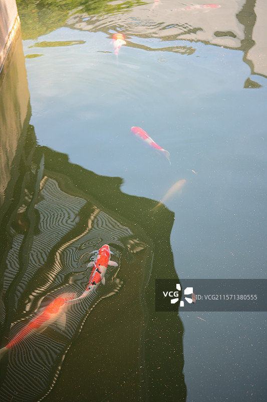
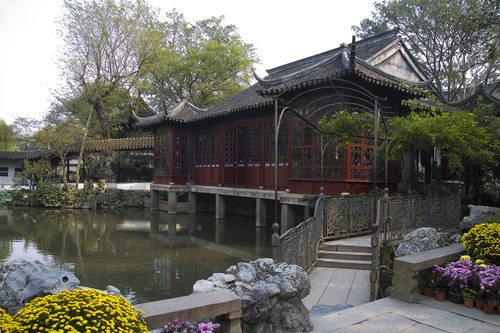
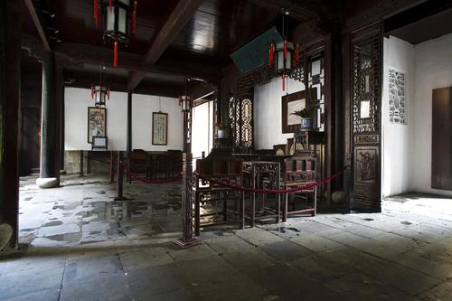
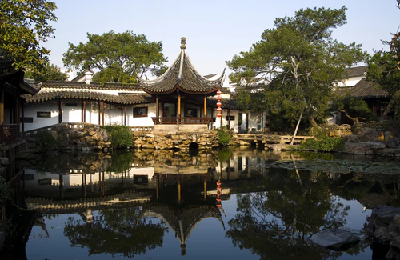

# 苏州园林 ✨

## 🏯 开篇：江南园林甲天下，苏州园林甲江南

有一句话说："不到园林，怎知春色如许？"

这句话说的就是苏州园林。

在苏州这座城市里，藏着几百座这样的园林。它们不是很大，有的甚至只有几亩地。但它们是中国人用了一千年的时间，一点点打磨出来的生活艺术品。

一扇窗，就是一幅画；
一堵墙，就是一首诗；
一座假山，就是一整片山林；
一潭池水，就是一整个江湖。

1997年，苏州园林被列入《世界文化遗产名录》。联合国教科文组织说："苏州园林是中国园林的最高典范，是人类文明的杰出成果。"

但苏州园林从来都不是什么"文物"。
它是一种生活方式。
是中国人最理想的生活状态——不出城郭，而获山林之趣；身居闹市，而得尘外之幽。

## 📜 一千年的造园史

**公元1044年 沧浪亭**
北宋诗人苏舜钦，在苏州买了一块地，建了一座亭子，叫"沧浪亭"。这是苏州园林里，现存最古老的一座。"清风明月本无价，近水远山皆有情。"说的就是这里。

**公元1509年 拙政园**
明朝御史王献臣，辞官回到苏州，建了这座园林。他说："灌园鬻蔬，以供朝夕之膳，是亦拙者之为政也。"意思是，种种菜，浇浇花，这就是我这个笨人的"政治"了。

从此，拙政园成为了中国园林的代名词。

**公元1593年 留园**
明朝太仆寺卿徐泰时，建了这座园林。几百年间，园主换了一个又一个，园林也一次次被改建、扩建。最后，它成了苏州园林里最"精致"的那一个。

**公元1642年 虎丘**
虎丘其实不是一座"园林"，它是一座山。但苏州人用了一千年的时间，把这座山，变成了一座最大的园林。"到苏州不游虎丘，乃憾事也。"苏东坡说的。

---

## 🌟 四大名园详解

### 📍 拙政园：中国园林之母

这是苏州最大的园林，也是中国最有名的园林。

整个园子以水为中心。三分之一的面积都是水。所有的建筑都围着水建。你随便站在哪个地方，眼前都是一幅完整的山水画。

**几个必看的地方：**

**远香堂**：拙政园的中心。夏天的时候，荷花的香气从窗外飘进来，所以叫"远香堂"。

**小飞虹**：苏州园林里最美的一座廊桥。朱红色的桥，倒映在水里，像一道彩虹。

**卅六鸳鸯馆**：以前园主看戏的地方。窗外的池子里，养着三十六对鸳鸯。

**北寺塔借景**：站在拙政园的西边，你能看到北寺塔。那座塔在园外一公里的地方。但四百多年前，造园的人故意在这里留了一个缺口，把园外的塔"借"到了园子里。

这就是造园最高的境界——"虽由人作，宛自天开"。

> 💡 **导游贴士**：
> 不要拿着地图按图索骥。
> 关掉地图，随便走。
> 走到哪里算哪里，
> 看到什么是什么。
> 苏州园林，
> 最妙的就是"迷路"的感觉。
> 峰回路转，柳暗花明。
> 你永远不知道下一个转角，
> 会看到什么。

---

### 📍 留园：一步一景，移步换景

很多人说，留园是苏州园林里最好玩的一座。

因为它太小了，太精致了。每一步，每一个角度，都是不一样的风景。

留园最有名的是它的"建筑空间"。你从一个门进去，穿过一个院子，再穿过一个门洞，再转过一个屏风——短短的几十米，你会经历至少六次"空间转换"。

**几个必看的地方：**

**冠云峰**：留园的镇园之宝。一块6.5米高的太湖石。据说宋朝的"花石纲"，本来要把这块石头运到开封去，结果运到苏州，金兵就打过来了。于是这块石头就留在了苏州。

**五峰仙馆**：苏州园林里最大的一个厅堂。楠木做的柱子，特别气派。

**又一村**："山重水复疑无路，柳暗花明又一村。"走到这里，你会突然明白这句诗是什么意思。

> 💡 **真心话**：
> 很多人逛园林，10分钟就逛完了。
> 但留园，你可以逛两个小时。
> 因为每一个角落，
> 每一扇窗户，
> 每一块石头，
> 都是故意放在那里的。
> 多看几眼，
> 你会突然懂了——
> 原来这就叫"匠心"。

---

### 📍 虎丘：吴中第一名胜

虎丘不是一座"园"，它是一座山。但它是苏州最有故事的一座山。

春秋时期，吴王夫差把他的父亲阖闾，葬在了这座山里。传说葬了三天之后，有一只白虎蹲在山上，所以叫"虎丘"。

一千多年来，所有来苏州的人，都要来虎丘。李白来过，苏东坡来过，唐伯虎来过，康熙来过，乾隆也来过。

**几个必看的地方：**

**云岩寺塔**：虎丘塔。苏州的标志。一千多年了，它一直在斜。现在已经斜了两米多，但就是不倒。比比萨斜塔还老，还斜。

**剑池**：据说阖闾的墓就在这池水下面。当年埋了三千把宝剑陪葬，所以叫"剑池"。池边的"剑池"两个字，是王羲之写的。

**千人石**：一块巨大的石头，能坐一千个人。据说生公在这里讲经，讲得天花乱坠，石头都点头。"生公说法，顽石点头"的典故，就是从这里来的。

---

### 📍 狮子林：假山迷宫

狮子林是苏州园林里最有意思的一座。

整个园子，几乎全是假山。大大小小的太湖石，堆成了一个巨大的迷宫。据说一共有九条路线，二十一个洞口。你在里面走，走着走着就迷路了——明明看到对方就在对面，但就是走不过去。

据说乾隆皇帝第一次来狮子林，在里面走了两个时辰才走出来。出来以后，写了四个字："真有趣"。

> 💡 **导游贴士**：
> 一定要在假山里走一圈。
> 迷路了也没关系。
> 反正园子不大，
> 走着走着总能出来。
> 这种"迷路"的乐趣，
> 在别的地方是找不到的。

---

## 🎋 苏州园林到底好在哪里

很多人逛苏州园林，会说："不就是一个大一点的院子吗？有什么好看的？"

是啊。
不就是几块石头，一潭水，几棵树，几个亭子吗？

但事情没有那么简单。

苏州园林的好，是"藏"的好。

它把一整个山林，藏在了几亩地的院子里；
它把一整个春天，藏在了一扇窗户里；
它把一整个世界，藏在了一堵墙的后面。

你站在院子里，看着眼前的假山，池水，树木，亭子——你看到的，不是这些东西本身。你看到的是造园的那个人，心里的那个世界。

四百多年前，王献臣建拙政园的时候，他心里想的是什么？
他想的是官场的失意，是人生的无奈，是对山水的向往。
他把这些，都藏在了这座园子里。

四百年后，你站在同一个地方。
你看到的，不仅仅是山水。
你看到的，是一个四百年前的人，留给你的一个梦。

这就是苏州园林。

---

## 🎯 游览实用指南

### 🚗 交通指南

苏州园林都在苏州市区，交通很方便。

**地铁**：
- 拙政园/狮子林：4号线北寺塔站，步行10分钟
- 留园：2号线石路站，步行15分钟
- 虎丘：坐公交游1路、游2路直达

**公交**：
- 游1路、游2路是苏州的旅游专线，串联了所有主要园林

**建议路线**：
- 拙政园和狮子林挨在一起，可以一起逛（步行5分钟）
- 留园和虎丘离得比较近，可以安排在同一天

### 🎫 门票信息（2025年参考）
- **拙政园**：旺季80元，淡季70元
- **留园**：旺季55元，淡季45元
- **虎丘**：旺季70元，淡季60元
- **狮子林**：旺季40元，淡季30元
- **联票**：有园林卡的话会便宜很多
- **半价票**：学生、60-69岁老人
- **免票**：70岁以上、军人、残疾人、记者
- **预约**：关注"苏州园林旅游"公众号预约，节假日一定要提前！

### ⏰ 最佳游览时间
- **春秋季（3-5月、9-11月）**：天气最好，不冷不热
- **下雨天**：强烈推荐！雨中的苏州园林才是最美的，人还少
- **清晨**：刚开园的时候去，人最少，最有感觉
- **建议游览时长**：拙政园2小时，留园1.5小时，虎丘2小时，狮子林1小时

### 🗺️ 推荐路线

**经典一日游**：
- 上午：拙政园 → 狮子林 → 苏州博物馆
- 下午：虎丘 → 山塘街
- 晚上：平江路

**深度两日游**：
- 第一天：拙政园 → 狮子林 → 平江路
- 第二天：留园 → 虎丘 → 山塘街

> 💡 **重要提醒**：
> 一定要请讲解！一定要请讲解！一定要请讲解！
> 没有讲解，你看到的就是一个院子。
> 有了讲解，你才能看懂每一块石头、每一扇窗、每一座亭子背后的故事。
> 不然等于白来。

### 🍜 苏州美食
- **松鼠桂鱼**：苏州第一名菜，外酥里嫩，酸甜可口
- **响油鳝糊**：上桌的时候还在滋滋响，特别香
- **生煎包**：苏州的生煎，皮薄馅大，底脆汤多
- **桂花糖粥**：甜甜的，有桂花的香气，女生最爱
- **碧螺春**：苏州的茶，春天来一定要喝一杯明前碧螺春

### ⚠️ 避坑指南
1. ❌ **不要在门口买"10块钱带进园"**：都是骗子
2. ❌ **不要相信门口的"野导游"**：不专业，还会带你去购物
3. ✅ **一定要请官方讲解**：或者租个电子讲解器，20块钱，值
4. ✅ **错峰出行**：节假日人特别多，最好工作日来
5. ✅ **穿舒服的鞋**：要走很多路
6. ✅ **下雨天来**：人少，而且真的特别美

## 💫 结语：每个人心里都有一座园林

中国人的理想，从来都不是住大房子。

是住一个有院子的房子。

院子里，要有假山，要有水，要有鱼，要有竹子，要有梅花，要有一个亭子，要有一扇窗。

春天的时候看花开，
夏天的时候听蝉鸣，
秋天的时候看落叶，
冬天的时候看雪落在石头上。

不用很大，不用很豪华。
只要能安放下一颗心就行。

这就是苏州园林。
它不是给别人看的。
它是给自己住的。

所以，来苏州园林吧。
不用拍很多照片。
就找一个亭子，坐一会儿。
看看鱼，看看云，看看树。

你会突然发现，
原来日子，可以过得这么慢。
原来生活，可以这么美。

> 📌 **旅行感悟**：
> 明代的造园家计成说：
> "三分匠，七分主人。"
>
> 一座园林好不好，
> 从来都不是看工匠的手艺有多好。
> 是看园主的心，有多静。
>
> 逛园林也是一样。
> 三分看，七分想。
> 你心静了，
> 才能看懂这座园林。

---

*本页内容基于实景图片分析与苏州园林文化研究整理，由AI导游系统2025年6月生成*
