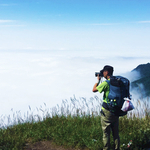
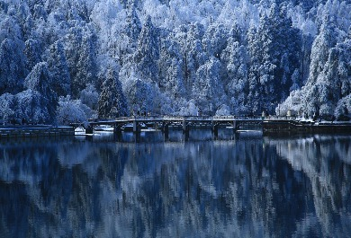
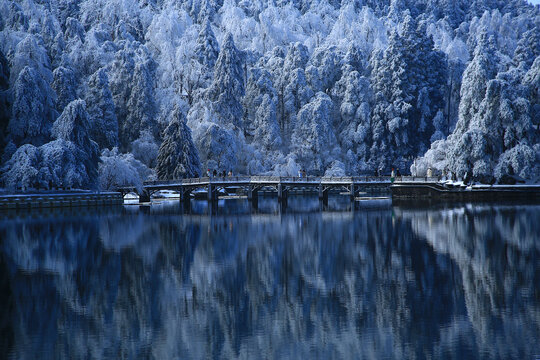
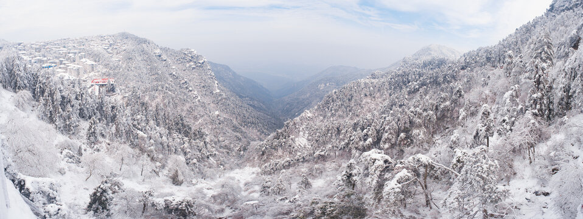
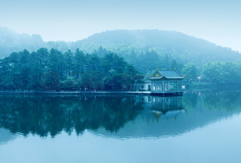

# 庐山 ✨

## 🌫️ 开篇：不识庐山真面目

苏东坡说："不识庐山真面目，只缘身在此山中。"

这句话写的就是庐山。

在江西北部，鄱阳湖西岸，有这样一座山——它不是最高的，不是最险的，也不是最有名的。但它是中国最"神秘"的一座山。一年365天，有200天是云雾缭绕。云来了，山就不见了；风一吹，山又出来了。

所以你永远看不清庐山的真面目。

它是世界文化遗产，是世界地质公园，是中国第一个国家公园。
但更重要的是，它是中国最有"故事"的一座山。

一千年前，陶渊明在这里采菊东篱下。
一千年前，李白在这里望庐山瀑布。
一千年前，白居易在这里的大林寺赏桃花。
一百年前，蒋介石在这里建了夏都。
一百年前，毛泽东在这里召开了三次庐山会议。

一座山，半部中国近代史。

这就是庐山。

## 📜 一座山，两千年

**公元387年 慧远建寺**
高僧慧远来到庐山，在东林寺建寺讲学，创立了净土宗。从此，庐山成为了中国南方的佛教中心。"虎溪三笑"的故事，就发生在这里。

**公元817年 白居易的桃花**
白居易被贬为江州司马。暮春时节，他登上庐山，在大林寺看到了刚刚盛开的桃花。他写下了那首著名的诗："人间四月芳菲尽，山寺桃花始盛开。长恨春归无觅处，不知转入此中来。"

**公元1595年 徐霞客来了**
徐霞客第一次登上庐山，用了整整六天，把庐山的每一座峰、每一条溪都走遍了。他写的《游庐山记》，至今还是最好的庐山攻略。

**公元1928年 牯岭的黄金时代**
英国传教士李德立在这里租下了这片山，把它变成了一个国际避暑地。20多个国家的人在这里建了1000多栋别墅——英国的、美国的、法国的、德国的、瑞典的……夏天的时候，这座山上住着全世界的人。

**1937年 夏都**
蒋介石把庐山变成了国民政府的"夏都"。每年夏天，整个国民政府搬到庐山办公。宋美龄的"美庐"别墅，就建在这里。

**1959年、1961年、1970年 三次庐山会议**
新中国成立后，毛泽东三次在庐山召开重要会议。这座山，见证了共和国历史上最重要的几个转折点。

---

## 🌟 核心景观详解

### 📍 牯岭云中路：云雾中的山城

这就是牯岭——全世界独一无二的"云中山城"。

海拔1167米，一座完整的城市建在山顶上。有邮局，有银行，有电影院，有菜市场，有一万多常住人口。夏天的时候，这里的气温只有22度，是天然的空调房。

你站在牯岭的街上，云就从你脚边飘过。有时候云浓了，对面的人你都看不见。风一吹，云散了，整个城市又出来了。

**牯岭的特别之处**：
- **云端小镇**：全世界唯一一个建在山顶上的完整城镇
- **万国建筑**：1000多栋各国风格的别墅，像一个露天的建筑博物馆
- **清凉世界**：夏天最热的时候也只有20多度，是中国四大避暑胜地之首
- **生活气息**：不是一个只有游客的景区，是一个有人在生活的地方

**最佳观景时间**：
- **清晨5-7点**：整个镇子都在云雾里，像仙境一样
- **傍晚6-8点**：夕阳照在红屋顶上，特别美
- **雨后初晴**：云雾在山谷里流动，是看"云海"的最佳时机

> 💡 **导游贴士**：
> 不要只去景点。就在牯岭街上随便走走。
> 看看老别墅，看看在菜市场买菜的当地人，
> 看看坐在门口摇着扇子聊天的老太太。
> 你会发现，这不是一个"景区"，
> 这是一个生活在云里的地方。

---

### 📍 三叠泉：不到三叠泉，不算庐山客

"不到三叠泉，不算庐山客。"

这是庐山最壮观的瀑布。水从155米高的悬崖上分三级落下——第一级如飘雪拖练，第二级如碎玉摧冰，第三级如玉龙走潭。站在瀑布底下抬头看，水从天上落下来，溅得你满身都是水珠。

李白写的"飞流直下三千尺，疑是银河落九天"，据说写的就是这里。

**你不知道的三叠泉**：
- **两种走法**：可以从山上往下走（2000级台阶），也可以从山下往上走（3000级台阶），建议从山上往下走，省力气
- **坐轿子**：实在走不动可以坐轿子，价格是按体重算的
- **最佳观赏时间**：6-8月雨季，水量最大，最壮观

> 💡 **真心话**：
> 走2000级台阶真的很累。
> 但是当你站在瀑布底下，
> 看着水从天上落下来，
> 听着震耳欲聋的水声，
> 浑身都溅满了水珠的时候——
> 你会觉得，值。

---

### 📍 锦绣谷：无限风光在险峰

这是庐山最美的一条峡谷。

毛泽东写的"天生一个仙人洞，无限风光在险峰"，说的就是这里。

沿着悬崖上的栈道走，左边是山，右边是万丈深渊。脚下是云，远处是山。春天的时候，整个山谷开满了杜鹃花，红的、粉的、紫的，所以叫"锦绣谷"。

**谷里必看的几个点**：
- **天桥**：一块伸出悬崖的石头，像一座断桥，站在上面拍照特别惊险
- **仙人洞**：吕洞宾修仙的地方，"天生一个仙人洞"说的就是这里
- **险峰**："无限风光在险峰"的那个峰，一定要站上去看看
- **谈判台**：1946年马歇尔和蒋介石在这里谈判的地方

---

### 📍 含鄱口：含鄱吐日

含鄱口是庐山看日出最好的地方。

它像一张张开的大嘴，含着鄱阳湖，所以叫"含鄱口"。

凌晨四点钟起床，摸黑爬上山。等啊等，天一点点亮起来。突然，一个红色的太阳从鄱阳湖的水面上跳出来——那一瞬间，整个世界都亮了。

**你不知道的含鄱口**：
- **最佳时间**：夏天4-5点，冬天6-7点，一定要查好日出时间
- **人很多**：旺季的时候，凌晨三点就有人去占位置了
- **很冷**：即使是夏天，山顶凌晨也只有十几度，一定要带厚外套
- **看缘分**：如果是阴天或者有雾，就看不到日出了。这很庐山——你永远不知道下一秒你能看到什么

---

### 📍 老别墅的故事

庐山有1000多栋老别墅。每一栋房子，都有一个故事。

**美庐**：宋美龄的别墅。蒋介石和宋美龄夏天就住在这里。这是中国唯一一栋住过国共两党最高领导人的别墅——蒋介石住过，毛泽东也住过。

**老别墅的故事**：六栋百年老别墅改成的博物馆。你可以进去看看一百年前外国人在庐山是怎么生活的。

**庐山会议旧址**：三次庐山会议召开的地方。进去看看，你会看到很多历史课本里的场景。

---

## 🏠 住在云里是什么感觉

很多人来庐山，只玩一天就走了。他们不知道，庐山最美的时候，是清晨和深夜。

**清晨的庐山**：
游客还没来，整个镇子都安安静静的。只有扫大街的环卫工人，还有早起去菜市场买菜的当地人。云雾从山谷里升起来，漫过街道，漫过屋顶。你走在街上，像走在云里。

**深夜的庐山**：
游客都走了。街上的店都关门了。只有路灯亮着。你可以一个人在牯岭街上走走。听着虫鸣，吹着山风，看着山下九江的万家灯火。那个时候，整座山都是你的。

所以来庐山，一定要住一晚。

不住一晚，你永远不知道住在云里是什么感觉。

---

## 🎯 游览实用指南

### 🚗 交通指南

庐山的交通有点复杂，第一次来的人很容易晕。

**怎么上山**：
- **汽车**：九江汽车站有直达牯岭镇的大巴，20元/人，车程约1小时，盘山公路，容易晕车的人记得吃晕车药
- **索道**：庐山索道，从山下到牯岭镇只要7分钟，票价上行80元，下行70元，推荐！不晕车，风景好
- **自驾**：外地车不能开上山！只能停在山下的停车场，然后坐大巴或索道上山
- **观光车**：山上的景点之间离得很远，必须坐观光车，90元/人，7天有效

### 🎫 门票信息（2025年参考）
- **大门票**：160元，3天有效
- **观光车**：90元，7天有效（必买！）
- **索道**：上行80元，下行70元
- **老别墅的故事**：30元
- **庐山会议旧址**：50元
- **三叠泉**：64元（大门票不包含！）
- **半价票**：学生、60-64岁老人
- **免票**：65岁以上、军人、残疾人、记者
- **预约**：关注"庐山旅游"公众号预约

### ⏰ 最佳游览时间
- **夏季（6-8月）**：最佳！22度的天然空调房，避暑圣地
- **秋季（10-11月）**：秋高气爽，看日出云海的概率最高
- **冬季（12-2月）**：雪景特别美，人特别少，门票还便宜
- **春季（3-5月）**：漫山遍野的杜鹃花，很美
- **建议游览时长**：2天1晚是基础，3天2夜最佳，住一周才能真正感受庐山

### 🗺️ 推荐路线

**经典两日游**：
- **第一天**：牯岭镇 → 花径 → 如琴湖 → 锦绣谷 → 仙人洞 → 大天池 → 龙首崖 → 美庐 → 晚上看《庐山恋》电影
- **第二天**：含鄱口看日出 → 植物园 → 五老峰 → 三叠泉 → 返程

**深度三日游**：
在两日游基础上，加上：
- 第三天：庐山西线（石门涧、剪刀峡）或者东线（白鹿洞书院、秀峰）

> 💡 **重要提醒**：
> 不要试图一天玩完庐山！
> 不要一大早来，下午就走！
> 一定要住一晚。
> 庐山的精华，都在游客不在的时候。

### 🏨 住宿建议

**住在牯岭镇上**：
- **高端酒店**：庐山宾馆、庐山大厦，位置好，条件好，300-800元/晚
- **经济型酒店**：各种快捷酒店、民宿，150-300元/晚
- **民宿**：很多老别墅改成的民宿，很有味道，200-500元/晚

> 小贴士：旺季（7-8月）价格会涨2-3倍，而且很难订，一定要提前预订！

### 🍜 庐山美食
- **庐山石鸡**：其实是蛙，不是鸡，肉质特别嫩，庐山第一名菜
- **庐山石鱼**：庐山溪水里的小鱼，炒蛋吃特别鲜
- **庐山石耳**：长在岩石上的木耳，炖鸡特别香
- **小白菜**：庐山的小白菜特别甜，一定要点一份
- **云雾茶**：中国十大名茶之一，来了一定要喝一杯

### ⚠️ 注意事项
1. **带厚外套**：山上比山下低10度，即使是夏天，早晚也很凉
2. **带伞**：庐山说下雨就下雨，随身带把伞，遮阳又挡雨
3. **穿舒服的鞋**：要走很多路，很多台阶
4. **不要相信野导**：门口的"50块钱带你玩一天"不要信，都是坑
5. **晕车药**：盘山公路很容易晕车，记得提前吃药
6. **看日出查天气**：阴天就不用早起了，看不到的

## 💫 结语：庐山是一种感觉

很多人从庐山回来，会说："庐山也就那样啊。"

确实。庐山的山不如黄山奇，水不如九寨沟清，瀑布不如黄果树壮观。

但庐山最特别的，从来都不是风景。

是那种云里来雾里去的神秘感；
是那种走在街上像走在云里的不真实感；
是那种推开窗就能看到云海的奢侈感；
是那种住了几天就不想走的安逸感。

庐山是一种感觉。

你只有住下来，慢下来，才能感觉到。

就像苏东坡说的：
"不识庐山真面目，只缘身在此山中。"

> 📌 **旅行感悟**：
> 一千年前，李白站在这里看瀑布。
> 一千年后，你站在同一个地方，看着同一个瀑布。
> 瀑布还是那个瀑布，山还是那座山。
> 只是看风景的人，换了一代又一代。
>
> 这就是庐山的魔力。
> 它见证了两千年的历史，
> 然后，
> 它现在也在见证着你。

---

*本页内容基于实景图片分析与庐山历史文化研究整理，由AI导游系统2025年6月生成*
