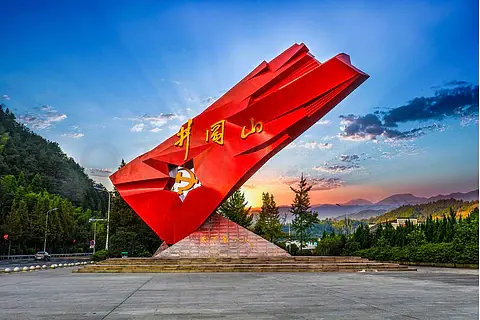
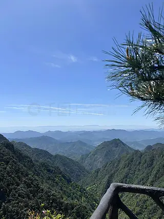
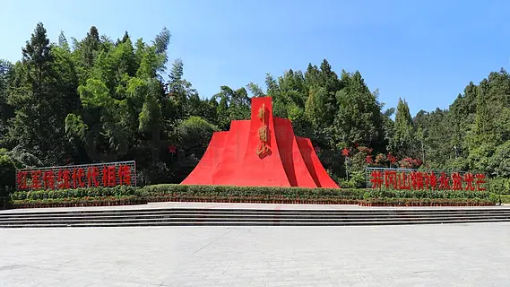
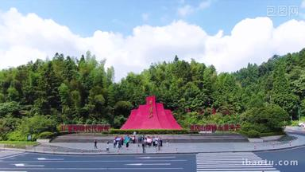
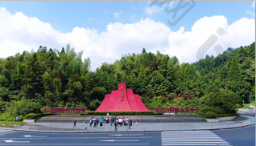
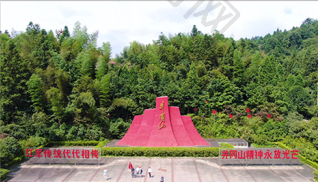

# 井冈山 ✨

## ⛰️ 开篇：千里罗霄，一座山的重量

1965年，毛泽东重上井冈山。

离他第一次来这里，已经过去了三十八年。他写下《水调歌头·重上井冈山》：

> "久有凌云志，重上井冈山。千里来寻故地，旧貌变新颜。到处莺歌燕舞，更有潺潺流水，高路入云端。过了黄洋界，险处不须看。"

最后两句写山，也是写人。过了黄洋界那样的险，别的险，就不算险了。

井冈山不是一座普通的山。

它是罗霄山脉中段的一座山。罗霄山脉从北到南绵延几百公里，挡在湖南和江西之间。井冈山就在它的肚子里，山高林密，云雾缭绕，自古是"郴衡湘赣之交，千里罗霄之腹"。

在过去几千年里，井冈山默默无闻。它太偏、太高、太难走，没人愿意来。山民在这里种竹子、采茶，世世代代与世隔绝。

直到1927年的秋天。

那一年，一个34岁的湖南人，带着一支打了败仗的队伍，走进了这座山。他叫毛泽东。他在这座山里，找到了中国革命的一条路。

从那以后，井冈山就有了一个名字--"中国革命的摇篮"。

## 📜 一座山和一群人的1927

**1927年9月 那个秋天**

1927年，是中国近代史上最黑暗的一年。

蒋介石"四一二"政变，屠杀了大批共产党人。汪精卫"七一五"分共。大革命失败。共产党人被追杀、被枪决、被抓进监狱。

那一年，共产党人明白了一件事：没有自己的枪，就没有命。

8月1日，南昌起义。
9月9日，毛泽东在湘赣边界发动秋收起义。

起义失败了。队伍被打散，从五千人剩下不到一千。怎么办？往哪里走？

9月29日，队伍走到江西永新县的三湾村。毛泽东做了一个决定--"三湾改编"。把剩下的部队缩编成一个团，把"支部建在连上"，确立党对军队的绝对领导。

然后，他带着这支队伍，往山里走。

往井冈山走。

**1927年10月 上山**

10月，毛泽东带着队伍到达井冈山。

那时候井冈山上有两支"绿林"队伍，头目叫袁文才、王佐。毛泽东没去打他们，而是送他们枪，和他们结拜。袁文才、王佐感动了，把山上的地盘让出来，还带着自己的队伍加入了红军。

这是毛泽东的本事。他知道，革命不是靠枪杆子打出来的，是靠人心换来的。

上山后，毛泽东在茅坪的八角楼住了下来。八角楼是一栋土房子，二楼有个八角形的天窗，光线从天窗漏下来，照在木桌上。毛泽东就借着这光，写文章、看地图、想问题。

那盏清油灯，他点了一夜又一夜。

就是在那盏灯下，毛泽东写出了《中国的红色政权为什么能够存在？》和《井冈山的斗争》。他回答了一个全党都在问的问题：革命还有没有希望？

他说：有。农村包围城市，武装夺取政权。

这是中国共产党第一次，找到了一条属于自己的路。

**1928年4月 朱毛会师**

1928年4月，朱德、陈毅带着南昌起义保留下来的部队，从湘南上了井冈山。

两支队伍在宁冈砻市会合。毛泽东和朱德，第一次见面。

那一年，毛泽东34岁，朱德42岁。两人握手的那一刻，中国工农红军第四军正式成立。朱德任军长，毛泽东任党代表。

"朱毛"这个名字，从这里开始。后来有人问朱德，"朱毛"是什么意思。朱德说："朱毛是一体的，没有朱，哪有毛。"

**1928年秋 朱德的扁担**

井冈山上人多粮少。粮食要从山下的宁冈挑上来，几十里山路，翻山越岭。

朱德42岁了，是军长，但他坚持和战士们一起下山挑粮。战士们心疼他，半夜把他的扁担藏起来，想让他歇一天。

第二天，朱德找不到扁担，没说话。他找来一根毛竹，连夜削了一根新扁担，在上面写了几个字："朱德的扁担，不准乱拿。"

从此再没人敢藏他的扁担。

那根扁担，现在还在井冈山革命博物馆里。一根普通的竹扁担，被一个军长的手磨得发亮。它说的不是"军长吃苦"，它说的是"这支队伍，人人平等"。

**1928年8月 黄洋界保卫战**

1928年8月30日，敌人趁红军主力下山，集中四个团进攻黄洋界。

黄洋界是井冈山五大哨口之一，海拔1300多米，一边是悬崖，一边是峭壁，是上山的必经之路。守黄洋界的红军，只有不到一个营。

仗打了一天。红军靠着一挺机关枪、几支步枪、几十个滚木礌石，硬是把四个团挡在山下。下午，红军把从南昌带出来的一门迫击炮扛上来，对着敌人指挥所开了三炮。前两炮是哑炮，第三炮响了，正中敌群。

敌人以为红军主力回来了，连夜撤退。

消息传到毛泽东耳朵里，他正在山下回井冈山的路上。他提笔写下了那首《西江月·井冈山》：

> "山下旌旗在望，山头鼓角相闻。敌军围困万千重，我自岿然不动。
> 早已森严壁垒，更加众志成城。黄洋界上炮声隆，报道敌军宵遁。"

"我自岿然不动"五个字，写尽了井冈山的精神。

**你不知道的冷知识：**
- 井冈山革命根据地只存在了两年零四个月（1927年10月-1930年2月），但牺牲了48000多人，留下姓名的只有15744人
- 井冈山时期，红军每天的伙食是"红米饭，南瓜汤"。这首歌现在还在唱："红米饭，南瓜汤，秋茄子，味道香，餐餐吃得精打光。"
- 朱德一生上过井冈山两次，1962年他重上井冈山，在八角楼那盏灯前站了很久，说："井冈山的斗争，奠定了中国革命胜利的基础。"
- 毛泽东1965年重上井冈山时，已经72岁。他在山上住了七天，临走时对身边的人说："我老了，还能再来一次井冈山，了却一桩心愿。"

---

## 🌟 井冈山核心景点详解

### 📍 黄洋界：过了这里，别的险都不算险

黄洋界是井冈山必到的景点。

它是井冈山五大哨口之一，海拔1343米，是通往宁冈、永新的要道。站在黄洋界上，一边是江西，一边是湖南，脚下是云海，远山像岛。

1928年8月30日那场保卫战，就发生在这里。

今天到黄洋界，你能看到：
- **黄洋界哨口工事**：当年的战壕、掩体，依然保留着
- **黄洋界纪念碑**：上面刻着毛泽东的《西江月·井冈山》全词
- **那门迫击炮**：复制品，立在最显眼的位置
- **炮声隆雕塑**：再现当年开炮的瞬间

站在哨口往下看，那条窄窄的山路蜿蜒而上。当年四个团的敌人，就是从这条路上来的。红军就一个营，守住这条路，靠的是地利，更靠的是人心。

纪念碑上毛泽东的词，最打动人的是那句"我自岿然不动"。一个营对四个团，是怎么"岿然不动"的？靠的是"早已森严壁垒，更加众志成城"。意思是：我们早就准备好了，我们一条心，所以我们不动如山。

黄洋界最美的，是云海。海拔高，湿度大，清晨云从山谷涌上来，把整个哨口淹没，只剩下碑顶露在云上。那一刻，你会理解毛泽东说的"过了黄洋界，险处不须看"。

> 💡 **导游贴士**：
> 黄洋界看云海，清晨7点前到最佳。云海不是每天有，雨后第二天概率最大。
> 纪念碑前拍照，要把碑、词、远山一起收进去，是经典构图。
> 站在哨口工事旁，往下看那条山路，想象一下：1928年的那个下午，几百个红军战士，就守在这里，挡住了四个团。
> 黄洋界温度比山下低8-10度，即使夏天也要带件外套。

---

### 📍 茨坪：井冈山的心脏

茨坪是井冈山的中心，也是当年红军的指挥中心。

1927年到1930年，毛泽东、朱德、彭德怀、陈毅，就住在这里。这里是指挥所、是后方、是井冈山革命根据地的"首都"。

今天的茨坪，是一个山间小镇，四周是山，中间是一片盆地。镇上有：
- **毛泽东旧居**：一栋土坯房，毛泽东和贺子珍住过的房间还在
- **朱德旧居**：和毛泽东旧居紧挨着
- **红四军军部旧址**
- **井冈山革命博物馆**：必去，馆藏革命文物两万多件
- **井冈山革命烈士陵园**：在镇北的北岩峰上

走进毛泽东旧居，你能看到那间不大的屋子。一张木床，一张木桌，一盏清油灯。墙上挂着地图。贺子珍当年就是在这里，帮毛泽东抄稿子、整理文件。

1928年冬天，井冈山下大雪。毛泽东穿着单衣，在屋里写文章。贺子珍把自己的棉袄披在他身上。那盏清油灯，照着一对年轻的夫妻，照着一个正在改变中国的男人。

**井冈山革命烈士陵园**是茨坪最庄重的地方。陵园依山而建，长长的台阶一路向上。最高处是纪念堂，里面陈列着15744位烈士的名单。还有一面墙，刻着"无名烈士"--那三万多名连名字都没留下的牺牲者。

你站在那面墙前，会沉默很久。

> 💡 **导游贴士**：
> 茨坪是井冈山的大本营，住宿、吃饭、交通都以这里为中心，建议住茨坪。
> 革命博物馆一定要请讲解员，自己看很多背景不了解。
> 烈士陵园上山台阶多，慢慢走，每走一步都想想那些没能走下山的人。
> 旧居参观请肃静，不要大声喧哗，这是对先辈最基本的尊重。

---

### 📍 茅坪八角楼：那盏灯，照亮的不是一个房间

茅坪八角楼，离茨坪17公里，在宁冈县（今井冈山市）茅坪村。

这是一栋两层土楼。二楼有一间屋子，屋顶有一个八角形的天窗。光线从天窗照下来，所以叫"八角楼"。

1927年10月到1928年，毛泽东在这里住过。他在这里，写了两篇改变中国历史的文章：
- 《中国的红色政权为什么能够存在？》
- 《井冈山的斗争》

那时候革命正处于低谷。南昌起义失败，秋收起义失败，队伍被打散，党员被追杀。全党都在问：革命还有没有希望？

毛泽东在八角楼里，借着清油灯的光，写了一整夜。

他在文章里说：中国不是一个统一的帝国主义国家，是帝国主义间接统治的半殖民地。各派军阀割据，互相打仗。在这样的国家，革命可以在敌人力量薄弱的农村，先建立红色政权，然后农村包围城市，最后武装夺取政权。

这个结论，在当时是石破天惊的。因为它和苏联"城市中心"的经验完全不同。毛泽东用中国的实际，回答了中国革命的问题。

那盏清油灯，照亮的不是一个房间，是中国革命的路。

今天到八角楼，那盏灯还在。桌子、椅子、毛笔、砚台，都是当年的样子。天窗的光照下来，照在那张旧木桌上。你站在那里，会想象1927年的那个夜晚，毛泽东坐在这里，灯芯一点一点地烧，他一页一页地写，写出一个新中国的可能。

> 💡 **导游贴士**：
> 八角楼离茨坪有一段路，建议包车或跟团，单独坐公交不方便。
> 楼上空间不大，一次只能上几个人，要排队。
> 天窗的光，中午最亮，最适合拍照。
> 楼下有毛泽东写文章的实景还原，请讲解员讲一下那两篇文章的背景，你会对"八角楼"有完全不同的感受。

---

### 📍 五龙潭：井冈山的另一面

井冈山不只有红色记忆，它还有一片极美的山水。

五龙潭就是井冈山自然风光的代表。

它位于茨坪西北面，是一条峡谷，谷里有五段瀑布、五个深潭，从上到下依次是：青龙潭、黑龙潭、黄龙潭、白龙潭、赤龙潭。再加上沿途十几个小瀑布，合称"五潭十八瀑"。

最高的青龙瀑，落差70多米，从悬崖上直泻下来，像一条白练。水砸在潭里，水雾弥漫，夏天站在潭边，凉爽得像开了空调。

谷底最深的赤龙潭，水色发蓝，深不见底。阳光透过谷口照进来，水面泛着光，像一块嵌在石头里的玉。

从谷顶到谷底，要走两千多级台阶。一路走，一路听水声。水声忽大忽小，转过一道弯，又是一挂新的瀑布。每一挂瀑布，都有自己的样子。

走到底，再坐索道回来。索道从谷底往上升，整个峡谷在脚下展开，五潭十八瀑像一串珍珠，串在绿色的山谷里。

> 💡 **导游贴士**：
> 五龙潭全程步行往返约3小时，加上拍照要半天。体力不好的，可以从上往下走，到谷底坐索道回来，省力。
> 索道单程60元，往返80元，强烈建议买。
> 谷底潮湿，台阶有青苔，穿防滑鞋。
> 夏天潭边可以踩水，但不要下水游泳，水深危险。
> 拍瀑布用慢门（1/4秒以下），能把水拍成丝绸一样，很美。

---

### 📍 杜鹃山（笔架山）：春天最红的那片山

井冈山还有一座山，叫笔架山，因为山顶像笔架。后来满山种了杜鹃，又叫杜鹃山。

每年4月到5月，满山的杜鹃花开了。整座山被染成红色，从山脚红到山顶，一望无际。

井冈山的杜鹃，有几十个品种。最高的"井冈山杜鹃"，能长到三米高，花大如碗，颜色从粉到红到紫，开得铺天盖地。

杜鹃山有一条悬空栈道，修在悬崖边上，全长4公里。走在栈道上，一边是峭壁，一边是花海。脚下是云雾，头顶是蓝天，前后是一望无际的杜鹃。

最美的瞬间，是清晨。云海还没散，杜鹃从云里冒出来，红得像火。你站在栈道上，会觉得这不是人间，这是画里。

杜鹃山还有一处叫"十里杜鹃长廊"，是华东最大的杜鹃群落。每年"井冈山杜鹃花节"都在这里办，4月中旬到5月中旬是花期。

> 💡 **导游贴士**：
> 杜鹃花期是4月中到5月中，错过就要等一年。去之前查好花期。
> 上山有索道（往返约100元），索道全长5公里，是国内单线最长的客运索道之一，坐上去就是一场空中观景。
> 悬空栈道恐高者慎入，但风景一流，咬咬牙也要走一段。
> 拍杜鹃，逆光拍，花瓣会透亮，像一盏盏小灯笼。

---

### 📍 井冈山革命博物馆：两万多件文物，一段不能忘的历史

茨坪镇上的井冈山革命博物馆，是井冈山必去的地方。

博物馆1959年建馆，2007年新馆开放，建筑面积两万多平方米。馆藏文物两万多件，其中国家一级文物近千件。

博物馆按时间顺序，分为六个展厅：
1. 中国革命道路的艰难探索
2. 井冈山革命根据地的创立
3. 井冈山革命根据地的发展
4. 井冈山革命根据地的新局面
5. 走向全国胜利
6. 千里来寻故地

走进博物馆，你会看到：
- **朱德的扁担**：那根写着"朱德的扁担，不准乱拿"的竹扁担，是真的
- **八角楼的清油灯**：毛泽东写文章用的那盏灯，原件
- **黄洋界保卫战用过的迫击炮**：那门炮，是真的
- **红军的军服、草鞋、文件**：每一件都带着当年的体温
- **烈士名录墙**：15744个名字，密密麻麻

最让人动容的，是那面"无名烈士墙"。井冈山两年零四个月，牺牲了48000多人，留下名字的只有15744人。剩下三万多人，连名字都没有。

他们是谁的父亲？谁的儿子？谁的丈夫？没人知道。他们只是倒在了这片山里，被战友草草掩埋，连一块写着名字的木板都没有。

但他们用命，换来了今天的中国。

博物馆最后有一个展厅，叫"千里来寻故地"。讲的是1965年毛泽东重上井冈山的故事。墙上挂着毛泽东在山上和群众合影的照片。照片里，72岁的毛泽东笑得像个孩子。

> 💡 **导游贴士**：
> 博物馆免费，但要预约。节假日人多，建议提前在公众号预约。
> 一定要请讲解员或租讲解器，自己看很多背景看不懂。
> 至少留2-3小时，不要走马观花。
> 馆内可以拍照，但不要用闪光灯和自拍杆。
> 出馆前，回头再看一眼那面烈士名录墙。你会走得很慢。

---

## 🎯 游览实用指南

### 🚗 交通指南

**高铁**：
- **井冈山站**：从南昌、长沙方向有动车可达
- 出站后坐公交或打车到茨坪镇，约40分钟，30元
- 也可坐景区直通车

**飞机**：
- **井冈山机场**：在泰和县，离茨坪约80公里
- 机场大巴到茨坪约1.5小时
- 直接打车约200元

**自驾**：
- 南昌->井冈山：约4小时，350公里
- 长沙->井冈山：约4小时，300公里
- 吉安->井冈山：约2小时，130公里
- 山路弯多，谨慎驾驶，景区有停车场

### 🎫 门票信息（2025年参考）
- **井冈山景区大门票**：225元（含黄洋界、茨坪旧居、博物馆、五龙潭、杜鹃山等核心景点，有效期5天）
- **观光车**：80元（必须买，景点分散，自己走不动）
- **杜鹃山索道**：单程60元，往返100元
- **五龙潭索道**：单程60元，往返80元
- **半价**：学生、60-64岁老人
- **免票**：65岁以上、军人、残疾人、记者
- **预约**：节假日建议提前在"井冈山旅游"公众号预约

### ⏰ 最佳游览时间
- **春季（4-5月）**：杜鹃花开，是井冈山最美的季节
- **秋季（9-11月）**：天高气爽，云海多，温度舒适
- **夏季（6-8月）**：避暑胜地，山区比山下低8-10度
- **冬季（12-2月）**：可能下雪，雪景极美，但部分景点封闭
- **建议游览时长**：2-3天。1天太赶，看不全
- **红色教育**：建议跟团或请讲解员，自由行很多历史背景看不懂

### 🗺️ 推荐路线

**经典两日游（最推荐）**：
- **第一天**：茨坪 -> 井冈山革命博物馆 -> 毛泽东旧居 -> 朱德旧居 -> 革命烈士陵园
- **第二天**：黄洋界（看云海）-> 茅坪八角楼 -> 五龙潭

**三日深度游**：
- 第一天：茨坪各旧居 + 博物馆 + 烈士陵园
- 第二天：黄洋界 + 八角楼 + 会师广场
- 第三天：五龙潭 + 杜鹃山（花期才值得）

> 💡 **最重要的建议**：
> 来井冈山，不要只看风景。
> 风景哪里都有，井冈山的风景不算最绝。
> 但井冈山的故事，全中国只有这一个。
> 一定要请讲解员，一定要看博物馆，一定要在黄洋界站一站。
> 否则你看到的只是一座山，你错过的，是一段历史。

### 🍜 井冈山美食
- **红米饭**：当年红军的主食，红米粗粮，配南瓜汤最有"味道"
- **南瓜汤**："红米饭，南瓜汤"，革命年代的标配，现在是招牌
- **井冈豆皮**：山里黄豆做的豆皮，炖肉特别香
- **井冈翠绿茶**：井冈山的高山茶，清香回甘，是伴手礼好选择
- **烟笋烧肉**：井冈山的烟笋（熏过的竹笋），配红烧肉，是当地名菜
- **客家酿豆腐**：井冈山是客家人聚居地，客家菜地道

### ⚠️ 注意事项
1. **山路弯多**：晕车的备好晕车药，自驾谨慎
2. **温差大**：山区早晚凉，即使夏天也要带外套
3. **带雨具**：山区天气多变，说下雨就下雨
4. **穿运动鞋**：五龙潭、黄洋界都要爬台阶
5. **尊重历史**：旧居、博物馆、烈士陵园请肃静，不要嬉笑打闹
6. **杜鹃花期**：要看杜鹃一定4-5月来，其他时间杜鹃山不值得专程去
7. **红色教育**：建议提前看一下《井冈山》纪录片，来了感受更深

## 💫 结语：一座山的重量，是一群人的命

井冈山，是中国最特殊的一座山。

它不是最高的山--黄洋界才1343米。
它不是最美的山--它没有黄山的奇，没有华山的险。
它不是最古的山--它没有什么上千年的名胜古迹。

但它是最重的山。

因为它承载的，是一座山的重量，加一群人的命。

两年零四个月。四万八千多人牺牲。留下名字的，一万五千多。没留下名字的，三万多。

三万多个无名的人。

他们是谁？他们从哪里来？他们有没有父母妻儿？

没有人知道。他们倒在这片山里，被草草掩埋，连一块写着名字的木板都没有。他们的血渗进泥土，被竹子的根吸走，被杜鹃花吸收。

每年春天，井冈山的杜鹃开得那么红。那红色里，有他们的血。

我们来井冈山，看的是什么？

看风景？风景哪里都有。
看历史？历史书也能看。

我们来看的，是一种"信仰"。

那群人，不知道革命会不会成功。他们看不到1949年的开国大典，看不到天安门广场升起的旗。他们中的大多数，连1930年都没活过。

但他们还是上了山。

他们吃红米饭，喝南瓜汤，穿单衣，盖稻草。他们在黄洋界挡住四个团，在八角楼借着一盏灯写文章，在山路上挑粮，在战场上去死。

为什么？

因为他们相信，他们做的事，是对的。即使他们看不到那一天，他们也要做。

这就是井冈山的精神。

不是"我自岿然不动"的豪情，是"我不知道能不能赢，但我还是要做"的执拗。

这种执拗，叫信仰。

你走出井冈山的时候，会在山脚下看到一块大石头，上面刻着六个字：

**"井冈山，井冈山。"**

为什么要说两遍？

第一遍，是一座山的名字。
第二遍，是一群人的名字。

那三万多个无名的人，他们的名字，就是"井冈山"。

> 📌 **旅行感悟**：
> 走出烈士陵园的时候，回头看一眼那面"无名烈士墙"。
> 三万多个名字，没有名字。
> 你忽然明白--
> 我们今天走的每一条路，
> 住的每一间房，
> 吃的每一顿饭，
> 都是他们用命换来的。
> 他们没看到今天。
> 但今天，是他们的。
> 记住他们，是我们能做的，唯一的事。

---

*本页内容基于实景图片分析与井冈山革命历史研究整理，由AI导游系统2025年7月生成*
