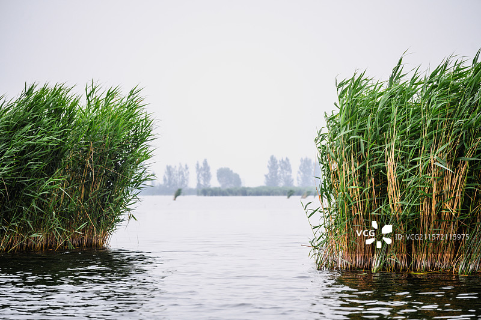
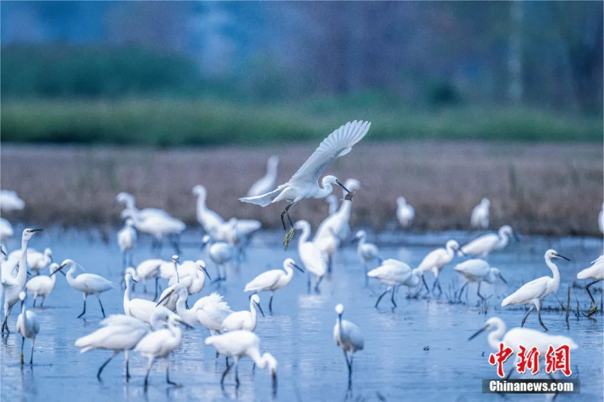
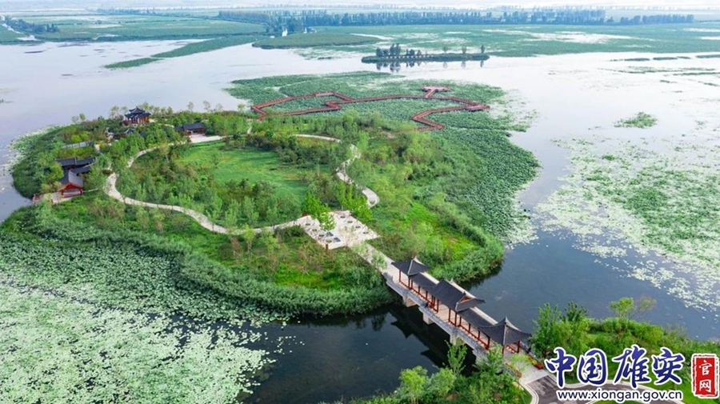
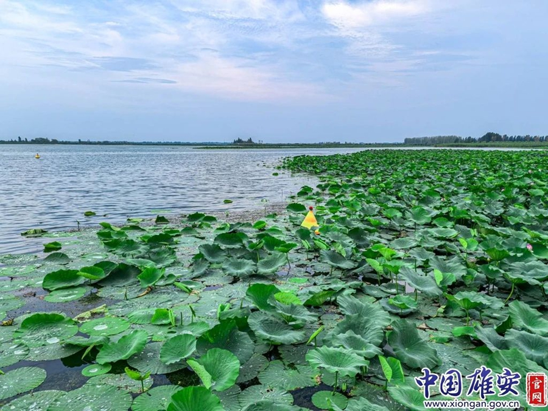

# 安新白洋淀景区 🪷

## 🌊 开篇：华北平原上的水乡梦境

当你坐着木船驶入白洋淀的那一刻，世界突然安静了。只有船桨划水的声音，和芦苇丛中水鸟的鸣叫。这片总面积366平方公里的水域，是华北平原上最大的淡水湖，也是北国大地上一个真正的江南梦境。

"北国江南"、"华北明珠"——人们给白洋淀太多的美誉，但都不足以形容它的美。143个淀泊星罗棋布，3700多条沟壕纵横交错，12万亩芦苇随风摇曳，10万亩荷花竞相绽放。在这里，水路就是公路，船就是车，每一个渔村都是一座水上孤岛。

白洋淀不只是一片风景。孙犁的《荷花淀》让它成为中国文学的地标，雁翎队的故事让它成为红色记忆的符号，而雄安新区的设立，又让这片古老的水域站在了新时代的最前沿。

来白洋淀吧，让木船载着你，驶入那片芦苇深处的乡愁。

## 📜 历史与文化：从千年水淀到雄安明珠

**新石器时代 文明的曙光**
早在五千年前，白洋淀地区就有人类繁衍生息。考古发现证明，这里是华北平原最早被开发的区域之一。淀区周边的容城、安新等地，出土了大量仰韶文化和龙山文化的文物。

**宋代 军事防线**
北宋时期，白洋淀是宋辽边界的"水长城"。宋朝军队在这里挖河道、种芦苇，利用复杂的水网地形阻挡契丹骑兵的南下。可以说，白洋淀今天的水网格局，早在一千年前就已经奠定了。

**1939-1945年 雁翎队的传奇**
抗日战争时期，白洋淀诞生了一支传奇的抗日武装——雁翎队。这些淀区的渔民，驾着小木船，利用熟悉的地形，神出鬼没地打击日本侵略者。他们的故事被写成小说、拍成电影，成为了一代人的集体记忆。

**2017年 雄安新区设立**
白洋淀一夜之间成为了全世界关注的焦点。这座"未来之城"选择了白洋淀作为它的核心水系。白洋淀，这片承载了千年历史的水域，正在书写着属于它的新篇章。

## 🌟 核心景点详解

### 📍 荷花大观园：十万亩荷花的盛宴

这是白洋淀最震撼的景观——十万亩荷花竞相绽放的壮观场面。照片中这片一望无际的荷塘，就是白洋淀荷花大观园，中国面积最大、品种最多的荷花园。

**荷花大观园的数字**：
- **面积**：2000亩，是中国最大的荷花主题公园
- **品种**：699种荷花，从世界各地引种
- **花期**：6月下旬到9月上旬，整整两个半月
- **观荷栈道**：5公里长的水上栈道，穿行在荷花之间

**最佳观赏时间**：
- **清晨6-8点**：荷花刚刚绽放，带着露珠，是摄影的黄金时间
- **傍晚5-7点**：夕阳西下，荷塘被染成金色，美不胜收
- **雨后**：雨后的荷花更加娇艳欲滴

**你不知道的荷花知识**：
白洋淀的荷花有一个神奇的特性——它们的种子莲子可以存活上千年。考古学家曾经在白洋淀出土了宋代的莲子，种下去竟然还能发芽开花。

> 💡 **导游贴士**：
> 不要只在栈道上拍照！花20块钱租一条小木船，让船老大划进荷花深处。伸手就能摸到荷花，低头就能看到鱼儿在水中游。记住，清晨的光线最柔和，那时候拍出来的荷花最有仙气。

---

### 📍 芦苇荡：穿行在绿色的迷宫

这张照片完美展现了白洋淀的灵魂——芦苇荡。12万亩芦苇，像一片绿色的海洋。船行其中，两岸的芦苇比人还高，你不知道下一个拐弯会遇到什么，这就是白洋淀最迷人的地方。

**芦苇的故事**：
- **高度**：成熟的芦苇高达3-4米，能完全遮挡视线
- **用途**：芦苇是白洋淀人的宝，可以编席、造纸、做建材
- **四季不同**：春天嫩绿，夏天深绿，秋天金黄，冬天银白
- **天然屏障**：抗战时期，雁翎队就是利用芦苇荡掩护打击敌人

**穿行芦苇荡的正确方式**：
一定要坐那种手划的木船，不要坐快艇。木船慢慢划，你才能听到芦苇摩擦的沙沙声，听到水鸟的叫声，闻到水草的清香。

> 💡 **船老大的秘密**：
> 每个船老大都有自己的"私家路线"。上船后给船老大递根烟，跟他聊聊天，他会带你去游客很少的野淀。那里的芦苇更密，荷花更野，运气好还能看到水鸟筑巢。那才是真正的白洋淀。

---

### 📍 大观园观景塔：俯瞰华北明珠

站在荷花大观园的观景塔上俯瞰，白洋淀的全貌尽收眼底。照片中这一望无际的水网，芦苇与荷塘交错，村庄与淀泊相连，这就是白洋淀最真实的模样。

**从这里你能看到**：
- **淀泊**：大大小小的淀泊像碎银一样散落在大地上
- **村庄**：一个个被水环绕的渔村，白墙红瓦
- **渔船**：水面上星星点点的渔船，是淀区人日常生活的写照
- **地平线**：白洋淀的地平线特别远，让人心胸开阔

**最佳登塔时间**：
傍晚日落时分。夕阳把整个白洋淀染成金色，水面波光粼粼，渔船归航，那画面会让你终身难忘。

> 💡 **摄影技巧**：
> 登塔一定要带长焦镜头！用200mm以上的焦段，可以拍到远处渔船的细节，拍出芦苇荡一层一层纵深感。当然，手机的变焦功能也能拍出不错的效果。

---

### 📍 渔村风情：水上人家的日常

这是白洋淀最生活化的一面——渔村。照片中这些被水环绕的房子，就是淀区渔民的家。在这里，出门就是水，回家就是船，渔歌唱晚，炊烟袅袅。

**渔村里你能体验**：
- **吃渔家饭**：刚从淀里捞出来的鱼、虾、蟹，用大铁锅一炖，那叫一个鲜
- **看渔民捕鱼**：看渔民下丝网、撒渔网，体验真正的水上生活
- **住民宿**：很多渔村开了民宿，晚上听着蛙声入眠，清晨被鸟鸣叫醒
- **采莲蓬**：夏天可以自己划船去采莲蓬，现采现吃

**必吃的白洋淀美食**：
- **铁锅炖鱼**：湖里刚捞的鲤鱼，用大铁锅慢炖
- **杂鱼锅贴饼子**：各种小杂鱼一锅炖，锅边贴满玉米饼子
- **荷叶炒蛋**：新鲜荷叶炒鸡蛋，清香扑鼻
- **莲蓬**：现采的莲蓬，莲子清甜可口

> 💡 **美食贴士**：
> 不要在景区门口的大饭店吃！往里走，找那些看起来不起眼的渔家小院。老板就是渔民，他老婆做饭，那种味道才是最正宗的。记得一定要点"荷叶尖炒鸡蛋"，这道菜只有春天才有，过了季就吃不到了。

---

## 🎯 游览实用指南

### 🚗 交通指南
- **自驾**：从北京出发，走京港澳高速转荣乌高速，全程约1.5小时
- **高铁**：北京西站到白洋淀站，车程40分钟，出站后打车20分钟到景区
- **公交**：雄安新区有直达景区的旅游专线

### 🎫 门票信息（2025年参考）
- **景区门票**：免费（入淀需坐船）
- **荷花大观园**：50元
- **白洋淀文化苑**：50元
- **鸳鸯岛**：40元
- **船票**：木船100元/条（限4人），快艇260元/条（限7人）

### ⏰ 开放时间
- **最佳旅游季节**：6月下旬-9月上旬（荷花盛开期）
- **每日开放**：8:00-18:00
- **建议游览时长**：1天（深度游建议住一晚）

### 🗺️ 经典游览路线

**一日精华游**：
上午：乘船入淀 → 荷花大观园（2小时） → 芦苇荡穿行
中午：渔家小院吃午饭
下午：白洋淀文化苑 → 雁翎队纪念馆 → 渔村体验

**两日深度游**：
Day1：入淀 → 荷花大观园 → 住渔家民宿
Day2：看日出 → 文化苑 → 采莲蓬 → 返程

### ⚠️ 注意事项
- **防晒**：淀区阳光强烈，务必做好防晒
- **防蚊**：水边蚊子多，带好驱蚊水
- **坐船**：上下船注意安全，不要在船上站立
- **环保**：不要往淀里扔垃圾，保护白洋淀的水环境

## 💫 结语：一淀水，千年情

白洋淀的美，从来都不是那种震撼人心的壮丽。它的美，是平淡的、日常的、充满生活气息的。

它是清晨渔民收网时脸上的笑容，是午后船桨划水的声音，是傍晚渔家小院里飘出的鱼香，是夏夜里蛙声一片的宁静。

孙犁在这里写下了"荷花淀"，雁翎队在这里战斗过，而今天，一座未来之城正在它的身边崛起。但白洋淀本身，依然保持着它千百年来的模样。水还是那片水，芦苇还是那片芦苇，荷花还是那片荷花。

时代在变，但总有一些东西是永恒的。就像白洋淀的水，静静地流淌了千年，还将继续流淌下去。

来白洋淀吧，找寻那片芦苇深处的乡愁。

> 📌 **旅行感悟**：
> 我们总是去远方寻找风景，却忘了最美的风景往往就在身边。白洋淀告诉我们：不必去江南，北国也有水乡；不必忆往昔，当下就是最好的时光。

---

*本页内容基于实景图片分析与历史资料整理，由AI导游系统2025年7月生成*
