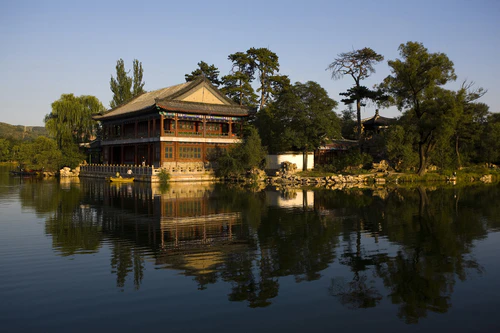
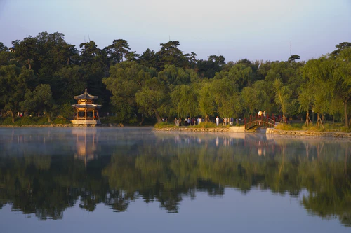
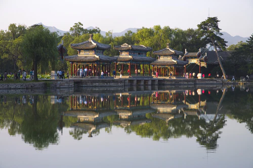

# 承德避暑山庄 ✨

## 🏔️ 开篇：一座山庄，半部清史

在河北东北部的燕山脚下，有一座城市。
这座城市因一座园林而诞生，也因这座园林而闻名于世。

这就是承德。
这就是避暑山庄。

公元1703年，康熙皇帝在这片草原与森林交界的地方，建起了一座宫殿。他叫它"热河行宫"。后来雍正给它改了个名字，叫"避暑山庄"。

此后的一百多年里，清朝的皇帝们，每年有半年的时间，都在这里度过。
康熙来了，乾隆来了，嘉庆在这里驾崩，咸丰在这里病逝。
接见外国使节，处理边疆事务，接见蒙古王公，指挥平定叛乱。
这座小小的山庄，实际上成了清朝的第二个政治中心。

"一座避暑山庄，半部清朝历史。"
这句话，一点都不夸张。

1994年，避暑山庄及周围寺庙被列入《世界文化遗产名录》。联合国教科文组织说："避暑山庄是中国古典园林的最高典范，是人类文明的杰出代表。"

## 📜 一座皇家园林的三百年

**公元1703年 康熙始建**
康熙皇帝在木兰秋狝的路上，发现了这块地方。
这里群山环抱，气候凉爽，水草丰美。
他决定在这里建一座行宫。
他亲自设计，亲自选址，亲自给每一个景点命名。
"三十六景"，每一景的名字，都是康熙亲自起的。

**公元1755年 乾隆扩建**
乾隆皇帝在位六十年，把避暑山庄扩建了一倍。
他也学着爷爷，又起了"三十六景"。
于是避暑山庄就有了"康乾七十二景"。
乾隆还在山庄的周围，建起了八座藏传佛教寺庙——外八庙。
蒙古王公，西藏活佛，新疆的伯克，都来这里朝觐。
避暑山庄，成了整个清帝国的"民族熔炉"。

**公元1860年 咸丰的避难所**
第二次鸦片战争，英法联军打进了北京。
咸丰皇帝带着慈禧，逃到了避暑山庄。
在这里，他签订了《北京条约》，割让了九龙。
然后，他就再也没有回到北京。
他死在了避暑山庄的烟波致爽殿。
从此，避暑山庄的黄金时代，结束了。

---

## 🌟 山庄的必看

### 📍 宫殿区：紫禁城外的紫禁城

这是避暑山庄的心脏。
皇帝处理朝政，生活起居的地方。

你走进来，第一感觉会是——怎么这么朴素？
没有紫禁城的金碧辉煌，没有雕梁画栋，没有琉璃瓦。
只有灰色的砖墙，灰色的瓦片，木头的柱子。
就像一个大户人家的院子。

这正是康熙的用意。
"以示不忘本也。"
他要告诉子孙，满清是从草原上来的，不能忘记朴素的本色。

**几个重要的地方：**

**澹泊敬诚殿**：避暑山庄的正殿。
全部用金丝楠木建成。下雨的时候，整个殿里都会散发出楠木的香气。
乾隆在这里接见了六世班禅，接见了马戛尔尼使团。

**烟波致爽殿**：皇帝的寝宫。
康熙说这里"四围秀岭，十里平湖，致有爽气"，所以叫"烟波致爽"。
嘉庆和咸丰，两个皇帝都死在了这座殿里。

**四知书屋**：皇帝换衣服，休息的地方。
"四知"——知微，知彰，知柔，知刚。
乾隆说，这是做皇帝的四个境界。

---

### 📍 湖区：江南搬到了塞外

避暑山庄有八分之一的面积，都是水。
七个湖，被岛和堤连在一起。
夏天的时候，荷花全开了，荷叶接天，你会觉得自己不是在塞外，是在江南。

康熙特别喜欢江南。
他把苏州的狮子林，嘉兴的烟雨楼，杭州的苏堤，都搬来了承德。
你在避暑山庄里走，走着走着，就走到了江南。

**烟雨楼**：
仿嘉兴南湖的烟雨楼建的。
下雨的时候，雨雾濛濛，整个楼都在烟雨中。
你站在楼上，看着湖面，看着远处的山。
你会突然忘记，你现在是在离北京两百多公里的塞外。

**金山亭**：
仿镇江的金山寺。
一个小岛，从水里突出来，上面有座亭子。
康熙说，这里"不殊西湖"。

> 💡 **导游贴士**：
> 一定要在清晨或者傍晚去湖区。
> 晨雾或者夕阳照在水面上，
> 那个时候的避暑山庄，才是最美的。

---

### 📍 山区：山占了八成

很多人不知道，避暑山庄80%的面积，都是山。
皇帝在山里面建了很多亭子，很多道观，很多寺庙。
现在大部分都塌了，只剩下遗址了。

但是你还是应该爬上去。
站在山顶的亭子上，往南看，是整个山庄的湖区，是承德市区。
往北看，是外八庙的金顶，在阳光下闪闪发光。
再往北，是连绵不断的燕山山脉。

那个时候，你会突然明白，
为什么康熙要把行宫建在这里。
站在这里，你能同时看到——
草原，森林，山脉，还有中原的宫殿。
这就是清帝国的缩影。

---

### 📍 外八庙：一座寺庙，胜过十万雄兵

在避暑山庄的北面和东面，有八座藏传佛教寺庙。
它们像星星一样，拱卫着山庄。
这就是外八庙。

很多人逛避暑山庄，只逛山庄，不逛外八庙。
他们错过了避暑山庄最精彩的部分。

外八庙不是八座普通的寺庙。
它们是清帝国的"民族政策纪念碑"。

**普宁寺**：
为了纪念平定准噶尔叛乱而建。
仿西藏桑耶寺的样式。
里面有世界上最高的木雕佛像——千手千眼观音，高27米，用松、柏、榆、椴、杉五种木材雕成。

**普陀宗乘之庙**：
仿拉萨布达拉宫建的。
所以也叫"小布达拉宫"。
建这座庙，是为了给乾隆过六十大寿。
六世班禅，从西藏出发，走了整整一年，来到这里，给乾隆祝寿。
那是清帝国最鼎盛的时刻。

**须弥福寿之庙**：
仿西藏扎什伦布寺建的。
专门给六世班禅建的行宫。
班禅在这里住了一年，讲经说法。
这座庙的金顶，用了一万五千两黄金。
今天你站在山下，还能看到金色的屋顶，在太阳下闪闪发光。

> 💡 **真心话**：
> 很多人说，外八庙就是清朝统治者搞的"统战工具"。
> 某种意义上是的。
> 但是你想一想。
> 不用打仗，不用死人，
> 就用几座寺庙，
> 就搞定了蒙古、西藏、新疆这么大的疆土。
> 这不是一种智慧吗？
> "一座寺庙，胜过十万雄兵。"
> 这句话说的，就是外八庙。

---

## 🏛️ 避暑山庄到底好在哪里

很多人逛避暑山庄，会觉得失望。
"不就是一个大公园吗？有什么特别的？"

是啊。
有山，有水，有树，有亭子。
看起来就是一个大一点的公园而已。

但是你要知道。
这座园林，不是一个退休的宰相建的，不是一个有钱的盐商建的。
它是一个帝国建的。
它是整个中国园林史上，唯一一个由皇帝亲自设计、亲自参与建造的园林。

康熙在这里，把他能想到的，所有最美的东西，都放了进来。
有北方的山，有江南的水，有蒙古的草原，有西藏的寺庙。

这不是一座园林。
这是一个微缩的帝国。
这是康熙心中那个理想世界的样子。

三百年过去了。
王朝不在了，皇帝不在了。
但是这座园子，还在。
山还在，水还在，亭子还在，树还在。

这就是避暑山庄最动人的地方。

---

## 🎯 游览实用指南

### 🚗 交通指南

承德离北京很近，交通很方便。

**从北京出发**：
- **高铁**：北京朝阳站→承德南站，约1小时，二等座64元
- **大巴**：六里桥客运站→承德，约2.5小时，80元
- **自驾**：京承高速，约2小时，过路费约100元

**景区内交通**：
- 山庄很大，逛一圈要走十几公里
- 景区里有观光车，50元/人，山上的景点都能到
- 湖区有游船，60元/人，也可以自己划船

### 🎫 门票信息（2025年参考）
- **避暑山庄门票**：旺季130元（4-10月），淡季90元（11-3月）
- **普陀宗乘之庙+须弥福寿之庙联票**：80元
- **普宁寺**：60元
- **联票**：避暑山庄+外八庙，260元，三天有效
- **半价票**：学生、60-69岁老人
- **免票**：70岁以上、军人、残疾人、记者
- **预约**：关注"承德避暑山庄"公众号预约

### ⏰ 最佳游览时间
- **夏季（6-8月）**：最佳！比北京低5度，名副其实的避暑胜地
- **秋季（9-10月）**：层林尽染，特别美
- **冬季（12-2月）**：人特别少，雪景特别有感觉
- **建议游览时长**：至少一整天！山庄+外八庙，最好安排两天

### 🗺️ 推荐路线

**经典一日游（比较赶）**：
- 上午：避暑山庄宫殿区 → 湖区
- 下午：山区观光车 → 普陀宗乘之庙（小布达拉宫）

**深度两日游（强烈推荐）**：
- 第一天：避暑山庄宫殿区 → 湖区 → 平原区 → 山区（整个下午都在山里慢慢逛）
- 第二天：普陀宗乘之庙 → 须弥福寿之庙 → 普宁寺

> 💡 **重要提醒**：
> 一定要留足够的时间！
> 避暑山庄真的很大很大。
> 很多人只逛了宫殿区和湖区就走了，
> 其实只逛了五分之一。
> 一定要坐观光车上山！一定要去外八庙！
> 那才是避暑山庄的精华。

### 🍜 承德美食
- **承德凉粉**：承德第一名吃，滑滑的，辣辣的，特别解暑
- **杏仁茶**：承德盛产杏仁，杏仁茶特别香，早餐来一碗
- **驴打滚**：北京的驴打滚就是从承德传过去的
- **改刀肉**：承德特色菜，把肉丝切得特别细，味道特别好
- **羊汤**：承德的羊汤，配烧饼，绝了

### ⚠️ 避坑指南
1. ❌ **不要在景区门口买"10块钱带你进去"**：都是假的
2. ❌ **不要相信门口的野导游**：不专业，还会带你去购物
3. ✅ **一定要坐景区观光车**：山区太大了，走路会累死
4. ✅ **一定要去外八庙**：90%的游客都错过了，那才是精华
5. ✅ **穿舒服的鞋**：要走很多很多路
6. ❌ **不要在景区门口的饭店吃饭**：又贵又不好吃，往市区走几步就好

## 💫 结语：帝国的夏天

站在避暑山庄的山顶，看着下面的宫殿、湖泊、寺庙。
你会突然觉得，三百年的时间，好像就在眼前。

康熙在这里，望着远方的蒙古草原，想着怎么平定准噶尔。
乾隆在这里，接见万里而来的英国使节，想着天朝上国的荣光。
咸丰在这里，听着北京传来的枪炮声，签下一个又一个不平等条约。

三百年了。
那些轰轰烈烈的大事，那些叱咤风云的人物，都过去了。
只剩下这座园子。
山还是那座山，水还是那汪水，树还是那棵树。

皇帝走了，帝国没了。
但是夏天，每年还会来。
风还会吹过湖面，雨还会落在楠木殿上。
阳光还会照在外八庙的金顶上，闪闪发光。

就像三百年前一样。

> 📌 **旅行感悟**：
> 康熙给避暑山庄起的名字，叫"避暑山庄"。
> 可是，他真的是来"避暑"的吗？
>
> 我觉得不是。
> 他是来这里，离北京远一点。
> 离紫禁城的勾心斗角远一点。
> 离奏折、大臣、朝政远一点。
>
> 他只是想找一个地方，
> 吹吹风，看看山，看看水。
> 做一天普普通通的人。
>
> 原来，
> 就算是皇帝，
> 也想逃。

---

*本页内容基于实景图片分析与承德历史文化研究整理，由AI导游系统2025年6月生成*
