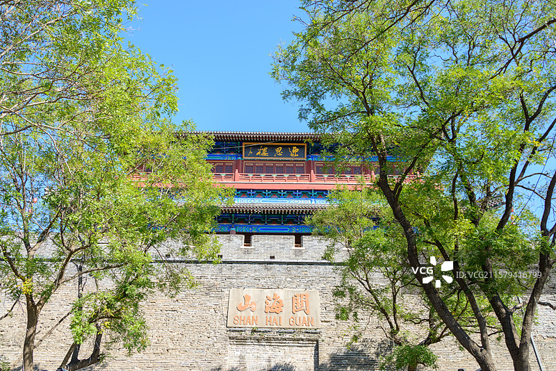
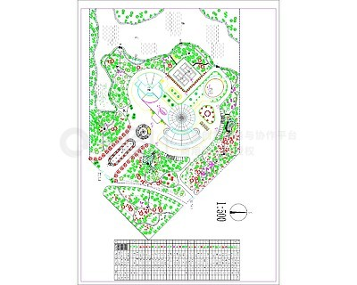
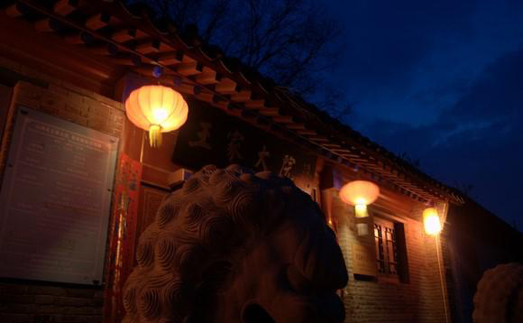
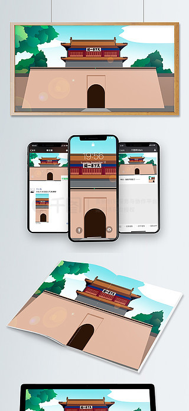

# 山海关景区 🏯

## 🌊 开篇：天下第一关

"两京锁钥无双地，万里长城第一关。"

当你站在山海关城楼下，仰望那块"天下第一关"的巨匾，你会感到一股历史的厚重感扑面而来。这座关城，北倚燕山，南临渤海，是万里长城的东起点，是连接东北与华北的咽喉要道，也是中国古代军事防御体系的巅峰之作。

山海关不是一座简单的城门。它是一个完整的防御系统：关城、翼城、罗城、瓮城，层层设防；敌楼、烽火台、炮台，星罗棋布。六百多年前，明朝开国大将徐达在这里建关设卫，从此这座城就与整个民族的命运紧紧绑在了一起。

在这里，戚继光镇守十六年，修建了闻名天下的老龙头入海石城；在这里，吴三桂引清兵入关，改变了中国历史的走向；在这里，八国联军的炮火轰开了帝国的大门；在这里，抗战的烽火最早点燃。

山海关的每一块砖，都浸透着历史的风霜。登上城楼，北望是连绵的燕山，南望是浩瀚的渤海，长城像一条巨龙从山上下来，一头扎进海里。那一刻，你会真正理解什么叫"山海关"——山的雄壮，海的辽阔，关的险要。

这就是天下第一关。

## 📜 历史与文化：六百年的关与城

**明洪武十四年（1381年） 徐达建关**
明朝建立后，为了防御北元残余势力的南下，开国大将徐达奉命在燕山与渤海之间修建关隘。他选中了这块最狭窄的地方，建关设卫，因为"山之海，海之山"，故名山海关。从此，这里成为了明长城东部最重要的关口。

**明万历年间 戚继光镇守**
抗倭名将戚继光调任蓟镇总兵后，对山海关进行了大规模的扩建和改造。他修建了入海石城——老龙头，修建了28里长的滨海长城，还修建了众多的敌台和烽火台。戚继光在山海关镇守16年，打造了当时世界上最坚固的防御体系。

**明崇祯十七年（1644年） 甲申之变**
这一年，李自成攻破北京，崇祯皇帝自缢煤山。山海关总兵吴三桂在降闯与降清之间徘徊，最终选择了后者。山海关城门打开，清兵入关，中国历史从此改写。"恸哭六军俱缟素，冲冠一怒为红颜"——山海关，见证了这个天翻地覆的历史时刻。

**清光绪二十六年（1900年） 八国联军入侵**
义和团运动爆发后，八国联军从天津登陆，一路打到山海关。老龙头的澄海楼被烧毁，长城上留下了侵略者的弹痕。这是山海关历史上最屈辱的一页。

**1933年 山海关抗战**
九一八事变后，日军进攻山海关。中国守军何柱国部奋起抵抗，打响了长城抗战的第一枪。虽然最终失守，但山海关抗战的意义重大——它告诉世界，中国人民不会屈服。

**2015年 摘牌与重生**
因为管理混乱，山海关景区被国家旅游局取消了5A级资质。这成为了一个转折点。经过三年的彻底整改，2018年，山海关重新夺回了5A牌子。这次经历，让这座古老的关城获得了新生。

## 🌟 核心景点详解

### 📍 天下第一关城楼：历史的见证

这就是山海关最标志性的建筑——天下第一关城楼。照片中这座高耸的箭楼，矗立在12米高的城台上，威武雄壮，气吞山河。

**建筑细节**：
- **高度**：城楼高13.7米，城台高12米，总高25.7米
- **形制**：两层砖木结构，重檐歇山顶，顶覆灰色筒瓦
- **箭窗**：上下两层共有68个箭窗，平时关闭，战时打开射箭
- **"天下第一关"匾**：长5.8米，宽1.55米，相传是明代书法家萧显所书

**匾额的故事**：
关于这块匾，有很多传说。最有名的是萧显写匾的故事：据说萧显写完"天下第一关"五个字后，发现"下"字少了一点。大家都很着急，萧显不慌不忙，拿起一块抹布蘸上墨，往上一扔，正好落在那个位置，天衣无缝。

**登楼的感受**：
站在城楼上，北面是燕山山脉连绵起伏，南面是渤海湾波光粼粼，东面是关外的广阔大地，西面是关内的繁华城镇。你会明白，为什么这里是"天下第一关"——它的位置太重要了。

> 💡 **导游贴士**：
> 不要只在正面拍照！绕到城楼的北面，那里人少，可以拍到城楼和远处燕山的合影，非常有气势。另外，城楼里面有一个历史展览，详细介绍了山海关的历史，一定要看看。

---

### 📍 老龙头：长城入海处

这是万里长城唯一的入海处——老龙头。照片中这些深入海中的巨石，就是著名的"入海石城"。长城像一条巨龙，从山上下来，到这里把头伸进海里喝水，故名"老龙头"。

**老龙头的故事**：
- **建造者**：戚继光，明万历七年（1579年）修建
- **入海石城**：长22.4米，宽8.3米，高9米，全部用巨大的花岗岩条石砌成
- **建造方法**：传说戚继光为了让石城坚固，在海底倒扣了无数铁锅来减少海浪的冲击
- **澄海楼**：老龙头的制高点，"长城连海水连天，人上飞楼百尺巅"

**最让人痛心的历史**：
1900年，八国联军入侵山海关，一把火烧毁了澄海楼。现在的澄海楼是1985年重建的。但是在老龙头的城墙上，至今还留着当年侵略者的弹痕。

**看海的最佳地点**：
老龙头是整个山海关看海最好的地方。站在澄海楼上，面朝大海，长城从脚下一直延伸到海里，那种震撼是无法用语言形容的。

> 💡 **游览贴士**：
> 老龙头最好是清晨或者傍晚去。清晨人少，海面平静，可以拍出非常干净的照片。傍晚夕阳西下，金色的阳光洒在海面上，老龙头的剪影非常美。夏天来的话，还可以下海游泳。

---

### 📍 角山长城：万里长城第一山

这是山海关北部的角山长城。照片中这段长城沿着陡峭的山脊爬升，非常壮观。角山是万里长城从老龙头起，向北跨越的第一座山峰，所以被称为"万里长城第一山"。

**角山长城的特点**：
- **海拔**：519米，虽然不高，但非常陡峭
- **原始风貌**：大部分是原汁原味的明长城，没有过度修复
- **敌楼**：山上有一座敌楼叫"镇虏台"，保存非常完好
- **风景**：站在角山上，可以俯瞰整个山海关城和远处的渤海

**爬角山的感受**：
角山长城非常难爬，很多地方坡度超过45度，台阶很高，需要手脚并用。但是当你爬到山顶，俯瞰整个山海关的时候，你会觉得一切都是值得的。

**你不知道的冷知识**：
角山上有一个"栖贤寺"，是明代山海关著名的书院。萧显在这里读过书，很多文人墨客都在这里留下过足迹。一座军事关隘，居然有这么一个书院，可见山海关不仅是武人的天下，也有文气。

> 💡 **登山建议**：
> 穿防滑的运动鞋，带足够的水。角山长城有些路段没有扶手，一定要注意安全。体力不好的游客可以坐缆车上山，然后步行下山。来回大约需要2-3小时。

---

### 📍 孟姜女庙：千古爱情的传说

在山海关城东的望夫石村，有这座小小的孟姜女庙。它虽然不大，却是中国四大爱情传说之一"孟姜女哭长城"的发生地。

**孟姜女的故事**：
相传秦始皇修长城的时候，抓了很多民夫。有一个叫万喜良的书生，被抓到山海关修长城。他的妻子孟姜女千里寻夫，来到山海关，却听说丈夫已经累死，埋在了长城下面。孟姜女悲痛欲绝，在长城脚下哭了三天三夜，哭倒了长城八百里，露出了万喜良的尸骨。然后孟姜女投海而死。

**庙里的奇联**：
孟姜女庙前殿有一副非常有名的对联：
海水朝朝朝朝朝朝朝落
浮云长长长长长长长消

这副对联利用中文一字多音的特点，可以有好几种读法。最常见的读法是：
海水潮，朝朝潮，朝潮朝落
浮云涨，长长涨，长涨长消

**望夫石**：
庙后面有一块大石头，上面有很多小坑，据说是孟姜女站在那里望夫的时候踩出来的脚印。

> 💡 **导游贴士**：
> 孟姜女庙离山海关主景区有一点距离，很多游客不去。但是非常推荐去看看。这个庙不大，但是非常有故事。尤其是那副奇联，值得细细品味。而且站在望夫石上，可以看到远处的山海关城全景，视野非常好。

---

## 🎯 游览实用指南

### 🚗 交通指南
- **高铁**：到山海关站，出站后打车10分钟到天下第一关
- **自驾**：从北京出发，走京哈高速，全程约3小时
- **公交**：秦皇岛市区有25路、33路公交直达山海关

### 🎫 门票信息（2025年参考）
- **天下第一关**：40元
- **老龙头**：50元
- **孟姜女庙**：25元
- **角山长城**：40元
- **联票**：120元（包含以上四个景点，两天有效）

### ⏰ 开放时间
- **旺季（4-10月）**：7:30-17:30
- **淡季（11-3月）**：8:00-17:00
- **建议游览时长**：全天（四个景点都去的话需要一整天）

### 🗺️ 经典游览路线

**一日精华游**：
上午：天下第一关城楼 → 古城步行街 → 吃午饭
下午：老龙头 → 孟姜女庙 → 返程

**两日深度游**：
Day1：天下第一关 → 古城 → 晚上住山海关古城民宿
Day2：老龙头看日出 → 角山长城 → 孟姜女庙 → 返程

### 🍜 美食推荐
- **四条包子**：山海关老字号，包子皮薄馅大，非常好吃
- **桲椤叶饼**：山海关特色，用桲椤叶子包的饼，有独特的清香
- **清河浑锅子**：山海关特色火锅，类似满族火锅
- **海鲜**：靠海吃海，各种海鲜都很新鲜，价格不贵

## 💫 结语：一座关，一部中国史

山海关是一座特殊的城。

它见证了明朝的强盛，见证了改朝换代的风云，见证了帝国的衰落，也见证了民族的抗争。六百年的历史，都浓缩在这座关城里。

今天的山海关，不再是那个军事要塞，不再是那个厮杀的战场。它变成了一个公园，一个博物馆，一个让人们凭吊历史的地方。每天都有成千上万的游客来到这里，登上城楼，远眺山海，感受那六百年的历史沧桑。

但是当你抚摸着城墙上那些斑驳的砖石，当你看到那些残留的弹痕，你会明白：这座关城从来就不是一个摆设。它是我们这个民族历史的见证者——有过辉煌，有过屈辱，有过抗争，有过重生。

来山海关吧。来看看这座"天下第一关"，来听听那些发生在这里的故事，来感受那种历史就在你身边的震撼。

站在天下第一关的城楼上，风从关外吹来，带着渤海的咸味。那风，吹了六百年，还将继续吹下去。

> 📌 **旅行感悟**：
> 历史就像一面镜子，照见过去，也照见未来。站在山海关的城楼上，你会明白：再坚固的城墙，也抵挡不住人心的向背。真正的天下第一关，从来都不在地理上，而在每一个人的心里。

---

*本页内容基于实景图片分析与历史资料整理，由AI导游系统2025年7月生成*
