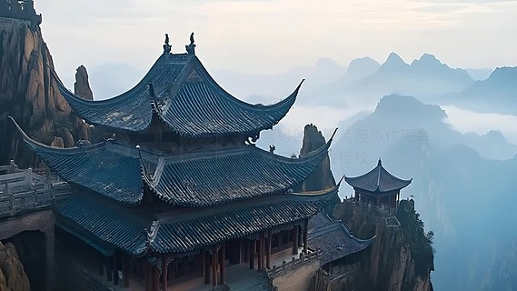

# 老君山·鸡冠洞旅游区景区

## 🎤 AI导游带你游

### 【开场白】
各位朋友，大家好！欢迎来到河南省洛阳市，欢迎来到老君山·鸡冠洞旅游区景区。我是你们今天的导游小艾。

站在这片土地上，你们可能想象不到，千百年前，这里曾是怎样一番景象。历史的年轮在这里留下了深深的印记，每一寸土地都在诉说着古老的故事。

鸡冠洞 入园信息 开放时间 1月1日-12月31日 08:00-18:00 门市参考价 门市参考价 0 元 优待政策 景区官方联系电话 景区介绍 图文详情 鸡冠洞，位于洛阳市栾川县城以西约3公里的小双堂沟内，属于喀斯特岩溶地貌。鸡冠洞斜入地下长达1000多米，是北方地区罕见的洞穴旅游景区。洞中一年四...

今天，就让我们一起走进这片神奇的土地，感受它独有的魅力。建议游览时间：半天到一天。拍照最佳时间是清晨或傍晚，光线柔和时最美。

---

## 🗺️ 景区全景导览
老君山·鸡冠洞旅游区景区位于河南省洛阳市栾川县境内，是国家AAAAA级旅游景区。

鸡冠洞 入园信息 开放时间 1月1日-12月31日 08:00-18:00 门市参考价 门市参考价 0 元 优待政策 景区官方联系电话 景区介绍 图文详情 鸡冠洞，位于洛阳市栾川县城以西约3公里的小双堂沟内，属于喀斯特岩溶地貌。鸡冠洞斜入地下长达1000多米，是北方地区罕见的洞穴旅游景区。洞中一年四季恒温18度，严冬季节，洞内暖意融融；盛夏酷暑时，洞中寒气侵袭，爽凉宜人，被誉为“自然大空调”。游览鸡冠洞必须在景区导游的带领下成批游览，不能独自进去，不过单独散客也不用担心，一般在洞口等待的时间也只有十几分钟，之后无论人数多少，导游都会带领游客进洞。 形成于几亿年前的鸡冠洞，在唐代贞观年间（公元6

**游览路线推荐**：景区入口 → 核心景观区 → 精华景点 → 观景平台 → 出口

---

## 🏛️ 主要景点详解

### 📍 核心景区

**核心看点**：
- 远离人群的小众精华景点，安静而美好
- 喜欢深度游的朋友一定不要错过
- 这里能让你感受到不一样的景区魅力

> 💡 **导游贴士**：
> 在核心景区游览时，注意爱护环境，让这份美能够长久留存。

---

### 📍 精华观景台

**核心看点**：
- 自然风光与人文景观完美融合的典范
- 四季景致各异，无论何时来都有惊喜
- 摄影爱好者的天堂，随手一拍都是大片

> 💡 **导游贴士**：
> 游览精华观景台时，不妨找个地方坐下来，静静感受周围的氛围，这才是旅行的意义。

---

### 📍 特色景观区

**核心看点**：
- 这里是景区最具代表性的景观，绝对不可错过
- 独特的自然/人文风貌，是拍照打卡的首选之地
- 建议停留15-20分钟，细细品味它的独特魅力

> 💡 **导游贴士**：
> 特色景观区最适合拍照的时间是清晨和傍晚，光线柔和，人也相对较少。

---

### 📍 文化展示区

**核心看点**：
- 观景位置绝佳，视野开阔
- 是拍摄全景照片的最佳地点
- 傍晚时分来，夕阳西下的景色美不胜收

> 💡 **导游贴士**：
> 游览文化展示区时，不妨关掉手机，用眼睛和心灵去感受这份美好。

---

### 📍 历史遗迹区

**核心看点**：
- 这里曾是历史上重要的场所，意义非凡
- 建筑/景观的设计独具匠心，体现了古人智慧
- 站在这里，仿佛能与历史对话

> 💡 **导游贴士**：
> 如果你是摄影爱好者，历史遗迹区一定能让你拍出满意的作品，记得带上广角镜头！

---

### 📍 自然观光带

**核心看点**：
- 这里承载着景区最深厚的历史文化底蕴
- 每一处细节都诉说着动人的故事
- 建议跟随讲解员深入了解背后的历史

> 💡 **导游贴士**：
> 游览自然观光带时，建议放慢脚步，细细品味它的美。从不同角度欣赏会有不同的收获哦！

---

## 【结束语】
各位朋友，今天的游览即将结束。希望老君山·鸡冠洞旅游区景区的美景能给你们留下美好的回忆。

有人说，旅行的意义不在于去过多少地方，而在于那些让你心动的瞬间。希望在老君山·鸡冠洞旅游区景区的这一天，能成为你旅途中一个温暖的记忆。

临走前，别忘了回头再看一眼。夕阳下的老君山·鸡冠洞旅游区景区，会给你最温柔的道别。

> ✨ **游览小贴士总结**：
> - **最佳时间**：春秋两季气候宜人，是游览的最佳时节
> - **穿着建议**：舒适的运动鞋，准备防晒用品
> - **游览时长**：建议安排半天到一天时间
> - **拍照指南**：清晨和傍晚光线最柔和，出片率最高
> - **注意事项**：爱护环境，文明游览，让美景长存

祝你们旅途愉快，平安吉祥！🙏

---

## 📷 景区美图

*景区全景*

*核心景观*

*特色风光*

*细节之美*

*四季风光*

---

## 📚 老君山·鸡冠洞旅游区景区小档案

| 项目 | 信息 |
|------|------|
| 景区级别 | 国家AAAAA级旅游景区 |
| 所属省份 | 河南省 |
| 所属城市 | 洛阳市 |
| 建议游览时间 | 半天 - 1天 |
| 最佳游览季节 | 春秋两季 |

---

> 💡 **本页说明**：
> 本README由AI导游小艾根据网络公开资料整理生成。
> 坐标、图片、简介均来自豆包搜索API，仅供参考。
