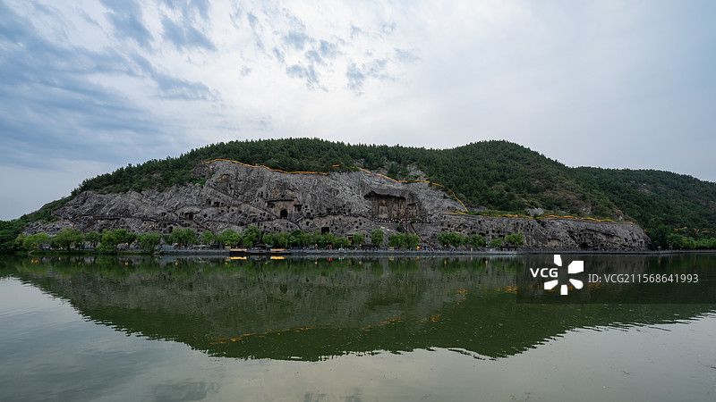
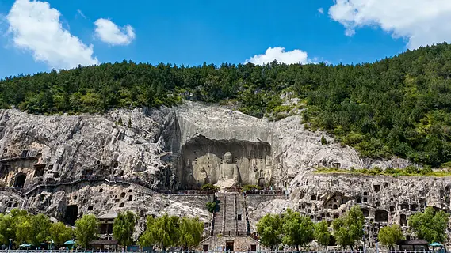

# 龙门石窟 ✨

## 🪨 开篇：刻在石头上的四百年

在洛阳城南的伊河两岸，有两座山。
东边的叫香山，西边的叫龙门山。
两山之间，伊河水静静地流着。
两岸的崖壁上，密密麻麻地布满了洞窟——就像一个巨大的蜂巢。

这就是龙门石窟。

从公元493年北魏孝文帝迁都洛阳开始，到公元907年唐朝灭亡结束，
整整四百年，无数的工匠、僧人、皇帝、百姓，在这一片崖壁上，一锤一凿，
刻下了十万多尊佛像，两千多个窟龛。

四百年。
从北魏的清秀，到盛唐的丰满。
朝代更迭了，工匠老去了，皇帝换了一个又一个。
但这些石头上的佛像，还在笑着。
一笑，就是一千五百年。

2000年，龙门石窟被列入《世界文化遗产名录》。
联合国教科文组织说：
"龙门石窟的艺术造诣，代表了中国石刻艺术的最高峰。"

## 📜 四百年的开凿史

**公元493年 北魏的开始**
孝文帝拓跋宏把都城从平城（大同）迁到了洛阳。
云冈石窟的工匠们跟着皇帝来了，在龙门山开始了新一轮的开凿。
这一时期的佛像，还带着云冈的影子——瘦骨清像，秀骨清肌。

**公元675年 卢舍那的诞生**
唐高宗咸亨四年，卢舍那大佛完工。
据说，武则天为这座大佛捐了两万贯脂粉钱。
工匠按照武则天的容貌雕刻了这尊大佛。
从此，龙门有了灵魂。

**公元705年 盛唐的顶峰**
武则天时期是龙门石窟的黄金时代。
百分之六十的洞窟都是在这一时期开凿的。
此时的佛像，面容丰满，体态雍容，带着盛唐的自信与从容。

**公元907年 最后的凿声**
唐朝灭亡了，龙门的大规模开凿也停止了。
四百年的凿石声，终于沉寂下来。
只剩下伊河水，还在静静地流着。

---

## 🌟 核心洞窟详解

### 📍 西山全景：一整座山都是佛

这是从东山望向西山的全景。
你看，整个龙门山的崖壁上，密密麻麻的全是洞窟。
从北到南，一公里长的崖壁上，有两千多个窟龛，十万多尊佛像。
大的十几米高，小的只有几厘米。

这哪里是山啊。
这是一整座刻在石头上的博物馆。

**四个主要区域，四个时代的审美**：
- **北魏洞窟**（宾阳三洞、古阳洞）：瘦骨清像，秀骨清肌
- **隋代洞窟**（宾阳南洞）：承前启后，从瘦到肥的过渡
- **初唐洞窟**（潜溪寺、敬善寺）：开始丰满，但还带着清秀
- **盛唐洞窟**（奉先寺、万佛洞）：雍容华贵，大国气象

**最佳游览时间**：
- **上午8-10点**：太阳从东边照过来，西山被照亮，是拍照的黄金时间
- **下午4-6点**：夕阳西下，卢舍那大佛被染上金色，是最美的时候
- **夜游龙门**：晚上灯光亮起，又是另一种感觉，强烈推荐

> 💡 **导游贴士**：
> 不要一进景区就往卢舍那大佛跑！
> 从北门进去，沿着伊河慢慢走，一个窟一个窟看过去。
> 从北魏看到盛唐，你会看到佛像的脸是怎么一点点变胖的。
> 这四百年的审美变迁，都刻在了这些石头上。

---

### 📍 卢舍那大佛：中国最美的微笑

这是龙门石窟的灵魂，也是全中国最美的一尊佛像。
高17.14米，光耳朵就有1.9米长。
站在它的脚下向上看，你会有一种被注视的感觉。
无论你站在哪个角度，它的眼睛都在看着你。
温柔，慈悲，又带着一种俯瞰众生的超然。

这就是卢舍那。
梵语里，"卢舍那"是"光明遍照"的意思。

**你不知道的卢舍那**：
- **武则天的脸**：传说这尊佛像是按照武则天的容貌雕刻的。武则天25岁时捐了两万贯脂粉钱，工匠们按照她的样子塑造了这尊佛像。所以你现在看到的，是一千三百年前一位女皇的容貌。
- **开凿时间**：公元672年开工，公元675年完工，只用了三年时间
- **工程规模**：当时用工几十万，是整个龙门最大的工程
- **缺失的手**：佛的手在民国年间被盗，现在能看到的痕迹是当年盗凿留下的

**最佳拍照角度**：
不要在台阶下面拍！
继续往上走，走到卢舍那的基座旁边。
那个位置仰拍，能拍出大佛的气势。
早上9点的阳光正好照在大佛的脸上，那个时候的微笑，是最美的。

> 💡 **站在卢舍那面前**：
> 多站一会儿。
> 不要急着拍照。
> 就站在那里，看着佛的眼睛。
> 一千三百年了，
> 这双眼睛见过了开元盛世，见过了安史之乱，
> 见过了宋朝的文人，见过了明朝的太监，
> 见过了八国联军，见过了军阀混战，
> 见过了新中国成立，见过了改革开放。
> 它见过了所有的历史。
> 而现在，它在看着你。

---

### 📍 其他必看洞窟

**宾阳三洞**：
北魏宣武帝为他的父母做的功德，本来计划做三个洞，结果用了24年才做完一个。那幅著名的《帝后礼佛图》就在这里，可惜后来被盗到了美国。

**万佛洞**：
洞里有一万五千多尊小佛，最小的只有两厘米高。一千五百年了，一万五千个佛，还在那里安安静静地坐着。

**古阳洞**：
龙门最早的洞窟，"龙门二十品"有十九品在这里。书法爱好者一定要来，这里是魏碑的圣地。

**奉先寺群雕**：
卢舍那大佛两边，还有阿难、迦叶、菩萨、天王、力士。一共九尊造像，组成了一个完美的佛国世界。尤其是那个力士，肌肉的线条，愤怒的表情，一千三百年过去了，还是栩栩如生。

---

## 🎨 北魏到盛唐：一张脸的变化

逛龙门石窟最有意思的事，就是看佛像的脸是怎么一点点变胖的。

**北魏的佛**：
脸是方的，脖子很长，肩膀很窄，衣服层层叠叠，很瘦，很清秀，带着一种禁欲的美感。
那是一个乱世的佛，带着一种对来生的向往。

**唐代的佛**：
脸是圆的，脖子上有三道肉，肩膀很宽，体态丰满，雍容华贵。
那是一个盛世的佛，对现世充满了自信。

从瘦到胖，从清秀到丰满。
这四百年佛像的变化，
其实是整个中国精神气质的变化。

从战乱的魏晋南北朝，到统一的盛唐。
从对来生的渴望，到对现世的自信。
所有的时代精神，都刻在了这一张张佛的脸上。

这才是逛石窟最有意思的地方。
你看的不是佛，
是一整个时代。

---

## 🎯 游览实用指南

### 🚗 交通指南
洛阳的交通非常方便。

**高铁**：
- 洛阳龙门站，全国的高铁基本都到
- 从龙门站打车到景区，只要10分钟，约15元
- 也可以坐公交，67路、71路直达景区

**飞机**：
- 洛阳北郊机场，到景区打车约30分钟
- 没有直飞的话，飞郑州也可以，郑州到洛阳高铁40分钟

**自驾**：
- 景区停车场很大，10元/天
- 建议停西北服务区，离景区入口最近

**景区内交通**：
- 主要靠走，全程约3公里
- 西山看完可以坐电瓶车到东山，10元/人

### 🎫 门票信息（2025年参考）
- **全价票**：90元，包含西山石窟、东山石窟、香山寺、白园
- **半价票**：45元，学生、60-69岁老人
- **免票**：70岁以上、军人、残疾人、记者
- **夜游龙门**：120元，强烈推荐！灯光下的卢舍那完全不一样
- **预约**：关注"龙门石窟"公众号预约，节假日建议提前约
- **门票有效期**：1天，建议上午早点去，可以玩一整天

### ⏰ 最佳游览时间
- **春秋季（3-5月、9-11月）**：天气最好，不冷不热
- **夏季**：比较热，建议早上8点前入园
- **冬季**：人少，体验感最好，但要注意保暖
- **建议游览时长**：4-5小时（西山3小时，东山+香山寺+白园1-2小时）

### 🗺️ 推荐路线
**经典一日游**：
西北服务区入口 → 西山石窟（从北到南慢慢看，重点看宾阳三洞、万佛洞、奉先寺）→ 过桥到东山 → 东山石窟 → 香山寺（蒋介石别墅也在里面）→ 白园（白居易的墓）→ 出口

**精华半日游**：
只看西山石窟，重点看奉先寺卢舍那大佛，其他走马观花。

> 建议：如果时间充裕，一定要看夜游！
> 晚上的卢舍那大佛，被灯光照亮，那种震撼的感觉，是白天没有的。

### ⚠️ 游览贴士
1. ✅ **请讲解！请讲解！请讲解！**：没有讲解你看到的就是一堆石头。官方讲解100元/次，或者租电子讲解器20元，一定要请！
2. ✅ **穿舒服的鞋**：要走很多路，还要爬很多台阶
3. ❌ **不要摸佛像**：手上的油脂会对石刻造成伤害
4. ✅ **带水带防晒**：景区很大，夏天特别晒
5. ❌ **洞窟内不要拍照**：闪光灯会加速风化，而且有工作人员盯着
6. ✅ **无人机可以飞**：景区不限飞，想拍全景的可以带无人机

### 🍜 洛阳美食
逛完龙门一定要吃洛阳水席！
- **水席**：洛阳第一名菜，24道菜，道道带汤
- **牛肉汤**：洛阳人的早餐，早上起来喝一碗，通体舒畅
- **羊肉汤**：不膻，特别鲜
- **浆面条**：洛阳特色，酸酸的，很开胃
- **牡丹燕菜**：水席第一道菜，一定要试

## 💫 结语：石头是不朽的

很多人问我：
"逛石窟有什么意思？不就是一堆石头吗？"

是啊。
就是一堆石头。
石头又不会说话，又不会动。
还残缺不全，很多佛头都被盗了，很多造像都风化了。

但就是这些残缺的石头，
记录了一整个时代。
记录了四百年里，人们的信仰，人们的审美，人们的希望。

一千五百年过去了。
改朝换代了，皇帝死了，工匠死了，
那些捐钱造像的善男信女也死了。
甚至连他们信仰的那个佛教，
在中国也几经沉浮，几经兴废。

但是，
石头还在。
佛还在笑。
就那样，安安静静地，
笑了一千五百年。

所以来一次龙门吧。
不是为了看佛，
是为了看一看——
什么是永恒。

> 📌 **旅行感悟**：
> 余秋雨写龙门石窟：
> "这里没有什么声音，只有伊河水在流。
> 而这沉默的石头，
> 却比所有的史书加起来，
> 都更有力量。"

---

*本页内容基于实景图片分析与龙门石窟艺术史研究整理，由AI导游系统2025年6月生成*
