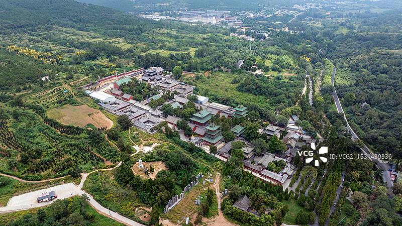
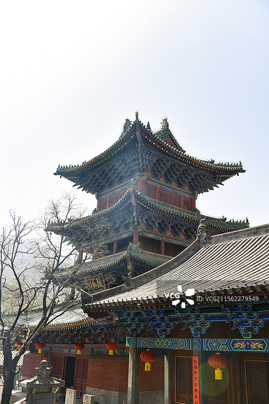

# 少林寺 ✨

## ⚔️ 开篇：天下功夫出少林

有一句话，全中国没有人不知道：
"天下功夫出少林。"

在河南登封的嵩山脚下，有一座寺庙。
它不是中国最大的寺庙，不是中国最古老的寺庙，也不是中国最漂亮的寺庙。
但它一定是全世界最有名的寺庙。

这就是少林寺。

一千五百年前，一个叫跋陀的印度僧人来到这里，建立了这座寺庙。
一千五百年里，这座寺庙见证了王朝的更迭，见证了佛教的兴衰，见证了功夫的诞生和传播。

今天，全世界有几十亿人知道"少林功夫"。
他们可能不知道河南，不知道郑州，不知道登封。
但他们一定知道，少林寺。

2010年，包括少林寺在内的"天地之中"历史建筑群，被列入《世界文化遗产名录》。联合国教科文组织说："少林寺是中国武术的象征，是东方文化的杰出代表。"

但对于中国人来说，少林寺从来都不仅仅是一个寺庙。
它是一个梦。
一个关于侠客、关于功夫、关于江湖的梦。

## 📜 一千五百年的少林传奇

**公元495年 建寺**
北魏孝文帝时期，印度僧人跋陀来到中国，孝文帝在嵩山脚下为他建了一座寺庙。因为这座寺庙建在少室山的密林之中，所以叫"少林寺"。

**公元527年 达摩来了**
菩提达摩一苇渡江，来到了少林寺。在少林寺后面的山洞里，他面壁九年，创立了禅宗。从此，少林寺成为了禅宗祖庭。

**公元621年 十三棍僧救唐王**
唐朝初年，王世充占据洛阳，李世民带兵攻打。少林寺的十三个僧人，拿着棍子，深夜劫营，救了李世民。后来李世民当了皇帝，封赏少林寺，赐地四十顷，允许少林寺养僧兵。

从此，少林寺有了"僧兵"，少林功夫开始名扬天下。

**公元1553年 抗倭**
明朝嘉靖年间，倭寇在东南沿海作乱。少林寺派出了30个武僧，开赴前线。他们拿着棍子，和倭寇血战，最后全部战死。

这是少林寺历史上最悲壮的一页。

**公元1982年 《少林寺》电影**
李连杰主演的电影《少林寺》上映。一毛钱一张的电影票，卖了一个亿的票房。全中国的年轻人，看完电影都跑到少林寺来学功夫。

少林寺，又火了。

---

## 🌟 少林寺的必看

### 📍 常住院：少林寺的心脏

这就是少林寺的主体——常住院。

七进院落，从山门一直到藏经阁。
你在电影里看到的少林寺，就是这里。

**一进一进走：

**山门**：少林寺的大门。门口那三个"少林寺"大字，是康熙皇帝写的。

**天王殿**：四大天王站在两边，守护着这座寺庙。

**大雄宝殿**：少林寺的主殿。中间是释迦牟尼佛，两边是十八罗汉。每天早上四点钟，和尚们就在这里上早课。

**藏经阁**：少林寺藏书的地方。但你知道吗？少林寺的武功秘籍，根本就不在藏经阁里。真正的少林功夫，都是师父手把手教徒弟，口传心授的。

**立雪亭**：禅宗二祖慧可，在这里站了三天三夜，雪没过了膝盖，最后断臂求法。这个亭子，就是为了纪念他。

**方丈室**：少林寺方丈住的地方。很小，很简单。

**千佛殿**：少林寺最后一进大殿。地上有48个坑，那是历代武僧练拳踩出来的脚窝。一千多年了，一代又一代的和尚，在这个地方练拳，把石头都踩凹了。

> 💡 **导游贴士**：
> 不要急着走。在千佛殿多站一会儿。
> 看着地上那些脚窝，
> 想象一下一千年来，
> 一个又一个和尚，
> 在同一个地方，
> 一拳一拳地练。
> 那就是少林功夫。

---

### 📍 塔林：和尚的墓地

这是少林寺最震撼的地方——塔林。

少林寺历代高僧圆寂以后，弟子们会为他们建一座塔，把他们的骨灰放在里面。塔的高度，代表这位僧人的功德和地位。

一千多年来，这里一共建了248座塔。从唐代到清代，一座挨着一座，像一片树林一样，所以叫"塔林"。

最高的塔有七层，最低的只有一层。
最老的塔已经一千多岁了，最新的塔是近几年才建的。

站在塔林里，你会突然觉得时间过得好快。
一千多年，248个和尚，248座塔。
他们活着的时候，有的是高僧，有的是武僧，有的是方丈，有的是普通和尚。
现在，他们都在这里，安安静静地躺着。

什么功夫，什么名气，什么地位，最后都变成了一座塔。

---

### 📍 功夫表演：少林功夫秀

来少林寺，一定要看功夫表演。

每天上午和下午，少林寺的武僧学校里，都会有少林功夫表演。
你能看到：
- 少林拳
- 少林棍
- 铁头功
- 铁砂掌
- 二指禅
- 还有，童子功

很多人看完会说："太假了，都是演的。"

但你知道吗？那些表演的小和尚，都是五六岁就进了武僧学校，每天早上五点钟起床练功，练到晚上。练十几年，才能上台表演。

你看到的那一分钟的二指禅，是他们用十几年的汗水换来的。

所以，不管真假，给他们鼓个掌吧。

---

### 📍 初祖庵：达摩面壁的地方

初祖庵在少林寺后面的山上，是为了纪念达摩祖师建的。

里面有一个山洞，叫"达摩洞"。当年达摩就是在这个山洞里面壁九年。

站在那个山洞里，你会想：
一个人，在一个山洞里，坐了九年。
不说话，不动，就那样坐着。
他到底在想什么？

九年啊。
人的一生，能有几个九年？

---

### 📍 三皇寨：嵩山的精华

很多人来少林寺，只看寺庙，不去三皇寨。他们不知道，三皇寨才是嵩山最美的地方。

从少林寺坐索道上去，然后走三公里的悬空栈道。脚下是万丈深渊，两边是刀削一样的悬崖。走在栈道上，你会腿软，你会头晕，你会害怕。

但你也会觉得，太壮观了。

嵩山的石头，是三十六亿年前的。是整个地球上最古老的石头之一。
三十六亿年。
站在这些石头面前，你会突然觉得，人类真的太渺小了。
什么功夫，什么王朝，什么爱恨情仇，在三十六亿年的石头面前，都算不了什么。

---

## 🥋 少林功夫到底是什么

很多人问：少林功夫真的能打吗？

答案是：能。
但那不是少林功夫的全部。

少林功夫最厉害的，从来都不是能打。
是"熬"。

一个五六岁的孩子，进了少林寺。
每天早上五点钟起床，练到晚上。
踢腿，踢一万次。
出拳，出一万次。
站桩，站三个小时。
就那样，一天一天，一年一年，练十年，练二十年，练一辈子。

把最简单的动作，练上千万次。
这才是少林功夫。

不是飞檐走壁，不是隔山打牛，不是葵花宝典。
是坚持。
是重复。
是把一件最简单的事，做到极致。

这才是真正的少林精神。

---

## 🎯 游览实用指南

### 🚗 交通指南

**怎么到少林寺**：
- **高铁**：郑州东站/洛阳龙门站，然后坐大巴到登封，再坐公交8路到少林寺
- **飞机**：郑州新郑机场，然后坐机场大巴到登封
- **自驾**：郑州→少林寺，约1.5小时；洛阳→少林寺，约1小时
- **景区观光车**：15元/人，从景区门口到少林寺门口，建议坐，走路得20分钟

### 🎫 门票信息（2025年参考）
- **大门票**：80元，包含少林寺常住院、塔林、三皇寨
- **功夫表演**：免费！就在景区内，凭大门票就能看
- **三皇寨索道**：上行70元，下行60元
- **半价票**：学生、60-69岁老人
- **免票**：70岁以上、军人、残疾人、记者、出家人
- **预约**：关注"嵩山少林景区"公众号预约

### ⏰ 最佳游览时间
- **春秋季（3-5月、9-11月）**：天气最好，不冷不热
- **夏季**：比较热，建议早上去
- **冬季**：人特别少，能看到雪后的少林寺，特别有感觉
- **建议游览时长**：半天到一天，建议留一整天

### 🗺️ 推荐路线

**经典一日游**：
- 上午：景区大门 → 功夫表演 → 少林寺常住院 → 塔林
- 下午：坐索道上三皇寨 → 走悬空栈道 → 索道下山 → 返程

**半日游（赶时间版）**：
- 功夫表演 → 少林寺常住院 → 塔林 → 返程

> 💡 **重要提醒**：
> 一定要去三皇寨！一定要去三皇寨！一定要去三皇寨！
> 很多人只看了少林寺就走了，
> 错过了嵩山最美的地方。

### 🍜 登封美食
- **烩面**：河南第一名菜，少林寺门口的就很好吃
- **登封烧饼**：焦焦的，夹上咸菜，特别香
- **少林素斋**：少林寺里面有素斋，味道一般，但来都来了，吃一顿
- **羊肉汤**：登封的羊肉汤，早上来一碗，通体舒畅

### ⚠️ 避坑指南
1. ❌ **不要相信门口的"10块钱带你进寺"**：都是假的，带你去别的小寺庙
2. ❌ **不要在门口买香**：特别贵，寺庙里有请香的地方，很便宜
3. ❌ **不要和"武僧"合影收费**：真正的武僧不会随便和人合影要钱的
4. ✅ **功夫表演提前占位置**：人特别多，提前20分钟去
5. ✅ **穿舒服的鞋**：三皇寨要走很多路，很多台阶

## 💫 结语：每个人心里都有一座少林寺

每个人小时候，都有一个武侠梦。

你可能梦想自己是一个大侠，
行走江湖，劫富济贫，
路见不平，拔刀相助。

而这个梦的起点，往往就是少林寺。

你可能练过"少林拳"，
你可能拿着一根棍子当"少林棍"，
你可能和小伙伴比划"铁砂掌"，
你可能梦想着有一天能去少林寺，
拜个师父，学一身真功夫。

长大了，你知道了。
这个世界上没有飞檐走壁，
没有葵花宝典，
没有武林盟主。
这个世界很现实，很无聊，很不江湖。

但没关系。

至少你还有少林寺。

至少你还可以来这里，
看着那些小和尚练功，
看着那些一千年前的塔，
看着那些三十六亿年的石头。

你会突然发现，
那个小时候的武侠梦，
还在。

只是你把它藏起来了而已。

> 📌 **旅行感悟**：
> 有人问：
> 少林功夫的最高境界是什么？
> 是能打十个？还是能打一百个？
>
> 都不是。
> 少林功夫的最高境界，
> 是不打。
>
> 练了一辈子功夫，
> 最后知道了，
> 功夫不是用来打架的，
> 是用来修心的。
>
> 这才是真正的少林。

---

*本页内容基于实景图片分析与少林寺历史文化研究整理，由AI导游系统2025年6月生成*
