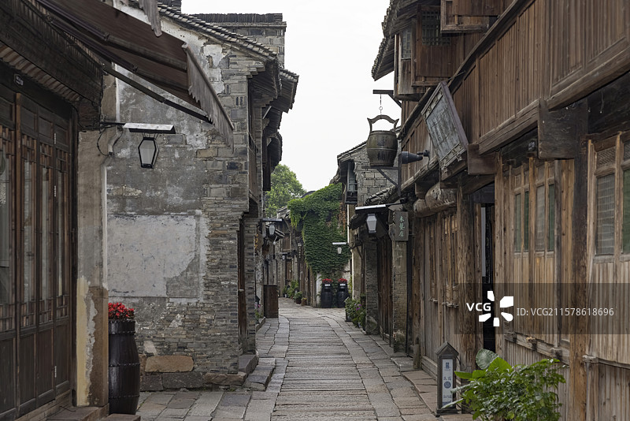
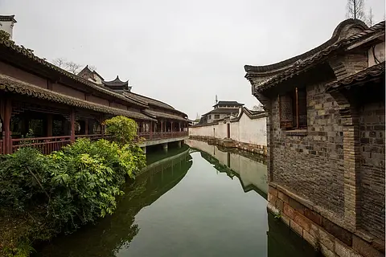

# 乌镇 ✨

## 🌧️ 开篇：中国最像江南的地方

每个人的心里，都有一个江南。
这个江南，是白墙黑瓦，是小桥流水，是烟雨蒙蒙，是撑着油纸伞的姑娘。

而乌镇，就是这个江南最标准的模样。

京杭大运河在这里拐了一个弯，
河水静静地流了一千年，
流过十多条小街，流过七十二座小桥，
流过茅盾的童年，流过木心的晚年。

在这里，时间好像慢了下来。
在这里，你可以什么都不做，
只是坐在河边，发一下午的呆，
就觉得很美好。

2014年，第一届世界互联网大会在这里召开。
从此，这座一千年的古镇，
又多了一个名字——
"中国互联网的会客厅"。

古老的江南，遇见了最新的科技。
这就是乌镇——
最传统，也最现代；
最中国，也最世界。

## 📜 一座小镇的一千年

**公元872年 唐代建镇**
乌镇的历史，从唐代开始。
那时候它叫"乌墩"，是大运河边上一个普通的水乡小镇。

**公元1078年 宋代定名**
宋神宗年间，正式定名为"乌镇"。
从此，这个名字，一用就是一千年。

**明清时期 乌镇的黄金时代**
因为大运河的便利，乌镇成为了江浙一带的商贸重镇。
码头上停满了船，街上挤满了商人。
镇上的人要么养蚕缫丝，要么开店做生意。
日子过得富裕而安静。

**1896年 茅盾出生**
这一年，乌镇东栅的沈家出生了一个男孩。
谁也没有想到，这个男孩后来会成为中国最有名的作家之一。
他写的《林家铺子》，写的就是乌镇的故事。

**2003年 陈向宏来了**
一个叫陈向宏的设计师，用了十几年的时间，
把一个破破烂烂的老镇，
变成了全中国最棒的古镇。
很多人说，乌镇是"假古董"。
但它是假吗？
它只是用现代的技术，
把中国人心中那个关于江南的梦，
变成了现实。

---

## 🌟 东栅与西栅

### 📍 东栅老街：乌镇原来的样子

这就是东栅。
青石板的路，木质的门板，斑驳的白墙。
没有太多的商铺，没有太多的游客，
只有安静的巷子，和住在巷子里的老人。

这是乌镇最原汁原味的地方。
很多乌镇的原住民，还住在这里。
早上起来，能听到他们用吴语聊天，
能听到他们在河边洗衣服的棒槌声。
能闻到邻居家飘来的饭菜香。

**东栅必看**：
- **茅盾故居**：茅盾出生和长大的地方，一个典型的江南大宅门
- **林家铺子**：茅盾小说里的那家店，现在还在卖着酱菜和点心
- **皮影戏馆**：每天都有皮影戏表演，老艺人唱了一辈子
- **染坊**：蓝印花布从高高的架子上垂下来，拍照特别好看

> 💡 **东栅和西栅的区别**：
> 东栅是"活着的古镇"，还有人住在里面，有生活气息。
> 西栅是"梦里的古镇"，是精心设计过的，更漂亮，更适合度假。
> 如果只有半天时间，只去西栅就够了。
> 如果有一整天，上午东栅，下午和晚上西栅，是最完美的安排。

---

### 📍 西栅水巷：梦里的江南

这是西栅最经典的画面。
河水静静地流，两岸是白墙黑瓦的房子，
远处是廊棚，再远处是桥。

很多人第一次来西栅，都会愣住。
"原来中国的山水画，不是画出来的。"
"原来真的有这样的地方。"

西栅是陈向宏的作品。
他把整个镇子拆了重建，
用最传统的工艺，最地道的材料，
还原了中国人心里那个最完美的江南。

有人说它太新，太干净，太像一个主题公园。
但谁又能说，
一千年前最鼎盛时期的乌镇，
不就是这个样子吗？

**西栅必做的几件事**：
1. **坐一次摇橹船**：尤其是傍晚的时候，灯笼一盏盏亮起来，船在水里慢慢摇，那个感觉，一辈子都忘不掉
2. **走一遍西栅大街**：从东走到西，大概一个小时，慢慢逛，慢慢看
3. **看一场露天老电影**：在大戏院前面的广场，晚上放黑白老电影，很有感觉
4. **吃一碗书生羊肉面**：半夜饿了，去桥头的书生羊肉面，来一碗热腾腾的面
5. **住一晚**：乌镇最美的时候，是游客都走了之后的清晨和深夜。不住一晚，等于没来过乌镇

---

### 📍 木心美术馆：那个叫木心的人

西栅的尽头，有一座美术馆。
是专门为一个叫木心的诗人建的。

木心是乌镇人。
年轻的时候去了上海，后来去了纽约，
一辈子颠沛流离。
晚年的时候，陈丹青把他接回了乌镇。
他说：
"乌镇，再也不是我的那个乌镇了。
但是，他们把乌镇建得这么好，
我也就认了。"

木心说：
"从前的日色变得慢，
车，马，邮件都慢，
一生只够爱一个人。"

这首诗，写的不是别的地方。
就是乌镇。

---

## 💧 乌镇的日与夜

**清晨的乌镇**
是属于住店客人的。
游客还没来，整个镇子安安静静的。
只有扫地的环卫工人，
和开铺子准备早点的老板。
这个时候的乌镇，是最真实的。

**白天的乌镇**
是属于游客的。
人来人往，熙熙攘攘。
拍照的，坐船的，逛店的。
很热闹，但也少了点味道。

**傍晚的乌镇**
是乌镇最美的时候。
夕阳的光洒在水面上，
灯笼一盏一盏地亮起来。
摇橹船从桥洞下划过，
船老大的歌声在水面上飘着。
这个时候，你会觉得，
这就是你梦里的那个江南。

**深夜的乌镇**
游客都走了。
整个镇子又安静下来。
只剩下路灯，和偶尔走过的打更人。
你可以一个人在河边走，
能听到自己的脚步声。
那个时候，你会觉得，
整个乌镇，都是你的。

---

## 🎯 游览实用指南

### 🚗 交通指南
乌镇在桐乡，交通非常方便。

**高铁**：
- 桐乡站，距离乌镇约30公里
- 上海虹桥 → 桐乡：约40分钟
- 杭州东 → 桐乡：约20分钟
- 出站后坐公交K282直达乌镇，约50分钟，5元
- 打车约80元，30分钟

**大巴**：
- 上海、杭州、苏州都有直达乌镇的大巴，约1.5小时
- 九堡客运中心 → 乌镇，班次最多

**自驾**：
- 上海→乌镇：约1.5小时
- 杭州→乌镇：约1小时
- 苏州→乌镇：约1小时
- 西栅停车场很大，20元/天

**景区内交通**：
- 西栅里面只能走路或者坐船
- 摇橹船：180元/船，最多坐6个人，可以拼船
- 景区内有电瓶车，免费，来往于入口和各个景点

### 🎫 门票信息（2025年参考）
- **东栅**：110元
- **西栅**：150元
- **东西栅联票**：190元（推荐！）
- **半价票**：学生、60-69岁老人
- **免票**：70岁以上、军人、残疾人、记者
- **住宿客人优惠**：住在西栅里面的话，门票可以多次进出
- **预约**：关注"乌镇旅游"公众号预约，节假日建议提前约

> 注意：门票当天有效！如果住在西栅里面，可以办理多次进出。

### ⏰ 最佳游览时间
- **3-5月、9-11月**：春秋季，天气最好，不冷不热
- **6-8月**：夏天，人多，比较热，但是荷花很好看
- **12-2月**：冬天，人最少，也最便宜，下雪的乌镇特别美
- **建议游览时长**：1天1夜是标配，2天1夜最舒服

### 🗺️ 推荐行程
**经典1天1夜**：
- **第一天下午**：到达，办理入住，逛西栅，看夜景，坐摇橹船
- **第二天上午**：早起看无人的乌镇，退房，去东栅，逛完返程

**深度2天1夜**：
- **第一天**：上午东栅，下午西栅，晚上看夜景
- **第二天**：木心美术馆，乌镇大剧院，慢慢逛，下午返程

> 💡 最正确的打开方式：
> 下午两三点入住，先休息一下，四点钟再出来逛。
> 逛到傍晚看日落，看夜景，晚上吃个晚饭，喝个小酒。
> 第二天早起，在游客来之前，逛一个没有人的乌镇。
> 这才是乌镇最棒的体验。

### 🏨 住宿建议
来乌镇，一定要住在西栅里面！
虽然贵，但是绝对值。

**住在西栅的好处**：
1. 可以看没有人的清晨和深夜
2. 门票可以多次进出
3. 有免费的电瓶车接送
4. 体验感和住在外面完全不一样

**推荐选择**：
- **经济型**：通安客栈、枕水度假酒店的标间，500-800元/晚
- **舒适型**：枕水度假酒店的临水房，1000-1500元/晚
- **奢华型**：乌镇会馆、益大丝业会馆，2000元以上/晚

> 小贴士：节假日会涨价，而且很难订，一定要提前订！

### 🍜 乌镇美食
- **书生羊肉面**：西栅桥头那家，半夜也开门，一定要吃
- **乌镇酱鸭**：乌镇特产，酱香味，很好吃
- **定胜糕**：粉红色的小糕点，甜而不腻
- **乌米饭**：用乌树叶染的糯米饭，很香
- **红烧羊肉**：乌镇的羊肉特别有名，冬天吃最好
- **臭豆干**：炸的臭豆干，蘸辣椒酱吃，本地人最爱

### ⚠️ 避坑指南
1. ❌ 不要在景区门口买什么"乌镇特产"，都是义乌产的
2. ❌ 不要相信门口拉客的"50块钱带你进景区"，都是骗人的
3. ✅ 不用请导游，西栅的路线设计得很好，跟着走就行
4. ✅ 不要周末和节假日去，人会多到走不动路
5. ✅ 住西栅！住西栅！住西栅！重要的事说三遍

## 💫 结语：愿你心中也有一个乌镇

很多人说乌镇太商业化了。
确实。
现在的乌镇，
没有了原住民的生活气息，
没有了破破烂烂的真实感。
它太干净，太完美，太像一个梦。

但我们为什么还是爱它？
因为它把那个我们只在古诗词里见过的江南，
真真切切地，
呈现在了我们面前。

我们爱乌镇，
不是因为它真实。
是因为它美好。
是因为它满足了我们对江南的全部想象。
是因为在这个快得不像话的时代里，
还有这样一个地方，
能让我们慢下来，
能让我们觉得，
原来日子，可以过得这么慢，这么美。

所以来一次乌镇吧。
住一晚。
看一看清晨的雾，
看一看傍晚的霞，
看一看深夜的灯笼，
看一看摇橹船划过水面的痕迹。

你会明白的。
为什么那么多人，
来了一次又一次。

> 📌 **旅行感悟**：
> 木心说：
> "所谓无底深渊，下去，也是前程万里。"
>
> 在乌镇，你会突然明白这句话。
> 原来慢，也是一种力量。
> 原来美，也可以让人充满勇气。

---

*本页内容基于实景图片分析与乌镇文化研究整理，由AI导游系统2025年6月生成*
